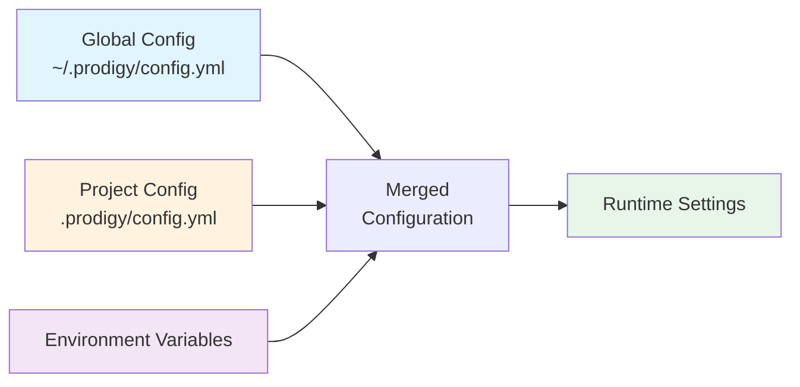

## Global Configuration Structure

Global configuration is stored in `~/.prodigy/config.yml` in your home directory. These settings apply to all Prodigy projects unless overridden by project-specific configuration.

### Location

- **File**: `~/.prodigy/config.yml`
- **Created**: Automatically on first run with defaults
- **Format**: YAML

### Fields

#### `prodigy_home`

**Type**: Path
**Default**: `~/.prodigy` (or platform-specific data directory)

Base directory for global Prodigy data including events, DLQ, state, and worktrees.

```yaml
prodigy_home: /Users/username/.prodigy
```

#### `default_editor`

**Type**: String (optional)
**Default**: None

Default text editor for interactive operations. Falls back to `EDITOR` environment variable if not set.

```yaml
default_editor: vim
```

#### `log_level`

**Type**: String (optional)
**Default**: `info`
**Valid values**: `trace`, `debug`, `info`, `warn`, `error`

Controls logging verbosity for Prodigy operations.

```yaml
log_level: debug
```

!!! tip "Debugging Tip"
    Use `debug` or `trace` log levels temporarily when troubleshooting issues. Switch back to `info` for normal operation to reduce log noise.

#### `claude_api_key`

**Type**: String (optional)
**Default**: None

Claude API key for AI-powered commands. Can be overridden by project config or `PRODIGY_CLAUDE_API_KEY` environment variable.

```yaml
claude_api_key: "sk-ant-api03-..."
```

!!! warning "Security Note"
    Store API keys in environment variables or project config (not committed to version control) rather than global config.

#### `max_concurrent_specs`

**Type**: Integer (optional)
**Default**: `4`
**Valid range**: `1` to `100`

Maximum number of concurrent spec implementations to run in parallel.

```yaml
# Source: src/config/prodigy_config.rs:192-194
max_concurrent_specs: 4
```

#### `auto_commit`

**Type**: Boolean (optional)
**Default**: `true`

Whether to automatically commit changes after successful command execution.

```yaml
auto_commit: false
```

#### `storage`

**Type**: Object (optional)
**Default**: Filesystem storage in `~/.prodigy`

Storage backend configuration for events, DLQ, state, and worktrees. See [Storage Configuration](storage-configuration.md) for details.

```yaml
# Source: src/config/prodigy_config.rs:126-139
storage:
  backend: filesystem
  base_path: ~/.prodigy
  compression_level: 0
```

**Storage Fields**:

| Field | Type | Default | Description |
|-------|------|---------|-------------|
| `backend` | String | `filesystem` | Storage type (`filesystem` or `memory`) |
| `base_path` | Path | `~/.prodigy` | Base directory for file storage |
| `compression_level` | Integer | `0` | Compression level for checkpoints (0-9, where 0 = none) |

!!! note "Backend Types"
    - `filesystem` - File-based storage (default, recommended for production)
    - `memory` - In-memory storage (primarily for testing)

See [Storage Configuration](storage-configuration.md) for complete documentation.

#### `plugins`

**Type**: Object (optional)
**Default**: None

Plugin system configuration. See [Plugin Configuration](#plugin-configuration) below.

### Complete Example

=== "Minimal Configuration"

    ```yaml
    # ~/.prodigy/config.yml - Minimal setup
    log_level: info
    auto_commit: true
    ```

=== "Comprehensive Configuration"

    ```yaml
    # ~/.prodigy/config.yml - All options
    prodigy_home: /Users/username/.prodigy  # (1)!
    default_editor: code  # (2)!
    log_level: info  # (3)!
    claude_api_key: "sk-ant-api03-..."  # (4)!
    max_concurrent_specs: 4  # (5)!
    auto_commit: true  # (6)!

    storage:
      backend: filesystem  # (7)!
      base_path: /Users/username/.prodigy
      compression_level: 0  # (8)!

    plugins:
      enabled: true
      directory: /Users/username/.prodigy/plugins
      auto_load:  # (9)!
        - github-integration
        - slack-notifications
    ```

    1. Base directory for all Prodigy data (events, DLQ, state, worktrees)
    2. Opens files in VS Code; falls back to `$EDITOR` if not set
    3. Controls log verbosity: `trace` → `debug` → `info` → `warn` → `error`
    4. For AI-powered commands; prefer environment variables for security
    5. Limits parallel spec implementations (1-100)
    6. Automatically commits changes after successful commands
    7. Use `filesystem` for production, `memory` for testing only
    8. Checkpoint compression: 0=none, 9=maximum (slower but smaller)
    9. Plugins load automatically at startup

### Plugin Configuration

The `plugins` field controls the plugin system:

#### `enabled`

**Type**: Boolean
**Default**: `false`

Enable or disable the plugin system.

```yaml
plugins:
  enabled: true
```

#### `directory`

**Type**: Path
**Default**: `~/.prodigy/plugins`

Directory to search for plugins.

```yaml
plugins:
  directory: /custom/plugin/path
```

#### `auto_load`

**Type**: Array of strings
**Default**: `[]`

List of plugin names to automatically load on startup.

```yaml
plugins:
  auto_load:
    - plugin-name-1
    - plugin-name-2
```

### Creating Global Config

If the file doesn't exist, create it manually:

```bash
mkdir -p ~/.prodigy
cat > ~/.prodigy/config.yml << 'EOF'
log_level: info
auto_commit: true
EOF
```

### Relationship to Project Config

Global and project configurations work together in a layered system:



**Figure**: Configuration layers with project config overriding global settings.

- Global config applies to **all projects**
- Project config (`.prodigy/config.yml`) **overrides** global config per field
- Settings not specified in project config are **inherited** from global config
- See [Configuration Precedence Rules](configuration-precedence-rules.md) for details
