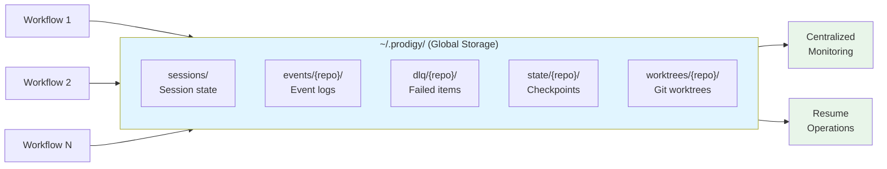
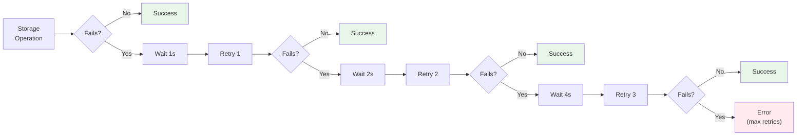

## Storage Configuration

Storage configuration controls where and how Prodigy stores data including events, state, DLQ (Dead Letter Queue), sessions, and worktrees. By default, Prodigy uses **global storage** (`~/.prodigy/`) to enable cross-worktree data sharing and centralized management.



**Figure**: Global storage architecture showing how multiple workflows share centralized storage for events, state, and worktrees.

!!! tip "Recommended Configuration"
    Global storage (`use_global: true`) is the default and strongly recommended. It enables cross-worktree event aggregation, persistent state across sessions, and centralized monitoring.

### Storage Backend Types

=== "File Storage (Default)"

    Stores data as files in the filesystem. This is the recommended backend for production use.

    ```yaml
    storage:
      backend: file
      backend_config:
        base_dir: /Users/username/.prodigy
        use_global: true  # Default: use global storage
        enable_file_locks: true
        max_file_size: 104857600  # 100MB
        enable_compression: false
    ```

=== "Memory Storage"

    Stores data in memory. Useful for testing but data is lost when the process exits.

    ```yaml
    storage:
      backend: memory
      backend_config:
        max_memory: 104857600  # 100MB (appropriate for testing)
        persist_to_disk: false
    ```

    !!! note "Testing Only"
        Memory storage is designed for testing scenarios. The 100MB default is appropriate for test suites but all data is lost when the process exits.

### File Storage Configuration

#### `base_dir`

**Type**: Path
**Default**: `~/.prodigy`

Base directory for all storage operations.

```yaml
storage:
  backend: file
  backend_config:
    base_dir: /custom/storage/path
```

#### `use_global`

**Type**: Boolean
**Default**: `true`

**IMPORTANT**: Global storage is the default and recommended setting. When `true`, Prodigy stores all data in `~/.prodigy/` organized by repository:

```
~/.prodigy/
├── events/{repo_name}/{job_id}/
├── dlq/{repo_name}/{job_id}/
├── state/{repo_name}/mapreduce/jobs/{job_id}/
└── worktrees/{repo_name}/{session_id}/
```

Benefits of global storage:
- **Cross-worktree event aggregation**: Multiple worktrees share event logs
- **Persistent state**: Job checkpoints survive worktree cleanup
- **Centralized monitoring**: All job data in one location
- **Efficient storage**: Deduplication across worktrees

When `false` (deprecated, local storage):
```
.prodigy/  # In project directory
├── events/
├── dlq/
└── state/
```

**Recommendation**: Always use `use_global: true` (the default).

#### `enable_file_locks`

**Type**: Boolean
**Default**: `true`

Enable file-based locking to prevent concurrent access conflicts.

```yaml
storage:
  backend: file
  backend_config:
    enable_file_locks: true
```

#### `max_file_size`

**Type**: Integer (bytes)
**Default**: `104857600` (100MB)

Maximum file size before rotation.

```yaml
storage:
  backend: file
  backend_config:
    max_file_size: 209715200  # 200MB
```

#### `enable_compression`

**Type**: Boolean
**Default**: `false`

Enable compression for archived files.

```yaml
storage:
  backend: file
  backend_config:
    enable_compression: true
```

### Connection and Performance

!!! tip "When to Tune These Settings"
    Most users can use the defaults. Consider adjusting these settings only when running high-concurrency MapReduce workflows with 50+ parallel agents, or when you observe storage-related bottlenecks in your logs.

#### `connection_pool_size`

**Type**: Integer
**Default**: `10`

Connection pool size for backend operations (future database backends).

```yaml
storage:
  connection_pool_size: 20
```

#### `timeout`

**Type**: Duration
**Default**: `30s`

Default timeout for storage operations.

```yaml
storage:
  timeout: 60s  # Format: 60s, 1m, 1h
```

#### `enable_locking`

**Type**: Boolean
**Default**: `true`

Enable distributed locking for concurrent access control.

```yaml
storage:
  enable_locking: true
```

### Retry Policy

Configure automatic retries for transient failures:



**Figure**: Exponential backoff retry flow with 2x multiplier (1s → 2s → 4s delays).

```yaml
storage:
  retry_policy:
    max_retries: 3
    initial_delay: 1s
    max_delay: 30s
    backoff_multiplier: 2.0
    jitter: true
```

#### `max_retries`

**Type**: Integer
**Default**: `3`

Maximum number of retry attempts.

#### `initial_delay`

**Type**: Duration
**Default**: `1s`

Initial delay before first retry.

#### `max_delay`

**Type**: Duration
**Default**: `30s`

Maximum delay between retries (with exponential backoff).

#### `backoff_multiplier`

**Type**: Float
**Default**: `2.0`

Multiplier for exponential backoff (delay doubles each retry).

#### `jitter`

**Type**: Boolean
**Default**: `true`

Add random jitter to retry delays to avoid thundering herd.

### Cache Configuration

Optional caching layer for improved performance:

```yaml
storage:
  enable_cache: true
  cache_config:
    max_entries: 1000
    ttl: 1h
    cache_type: memory
```

#### `enable_cache`

**Type**: Boolean
**Default**: `false`

Enable in-memory caching.

#### `max_entries`

**Type**: Integer
**Default**: `1000`

Maximum number of cached entries.

#### `ttl`

**Type**: Duration
**Default**: `1h`

Cache time-to-live.

#### `cache_type`

**Type**: String
**Default**: `memory`
**Valid values**: `memory`

Cache implementation type (currently only memory is supported).

### Complete Example

```yaml title="workflow.yml"
# Source: src/storage/config.rs - StorageConfig struct
storage:
  backend: file                   # (1)!
  connection_pool_size: 10        # (2)!
  timeout: 30s
  enable_locking: true
  enable_cache: false

  backend_config:
    base_dir: /Users/username/.prodigy
    use_global: true              # (3)!
    enable_file_locks: true
    max_file_size: 104857600      # 100MB
    enable_compression: false

  retry_policy:
    max_retries: 3
    initial_delay: 1s
    max_delay: 30s
    backoff_multiplier: 2.0       # (4)!
    jitter: true

  cache_config:
    max_entries: 1000
    ttl: 1h
    cache_type: memory
```

1. Backend type: `file` (default, recommended) or `memory` (testing only)
2. Connection pool for future database backend support
3. **Strongly recommended**: Enables cross-worktree data sharing
4. Each retry waits 2x longer than the previous (exponential backoff)

### Environment Variable Configuration

Storage can be configured via environment variables:

```bash
# Backend type (file or memory)
export PRODIGY_STORAGE_TYPE=file

# Base directory path
export PRODIGY_STORAGE_BASE_PATH=/custom/path
```

!!! warning "Deprecated Variables"
    The following variable names are deprecated and will be removed in a future version:

    ```bash
    # Use PRODIGY_STORAGE_BASE_PATH instead
    export PRODIGY_STORAGE_DIR=/custom/path    # deprecated
    export PRODIGY_STORAGE_PATH=/custom/path   # deprecated
    ```

!!! note "Override Behavior"
    Environment variables override file-based configuration. See [Environment Variables](environment-variables.md) for the complete list of available variables.

### Storage Directory Structure

With global storage enabled (default):

```
~/.prodigy/
├── sessions/                              # Unified session storage
│   └── {session_id}.json                  # Session state and metadata
├── logs/                                  # Repository-specific logs
│   └── {repo_name}/
│       └── *.log
├── events/
│   └── {repo_name}/
│       └── {job_id}/
│           └── events-{timestamp}.jsonl
├── dlq/
│   └── {repo_name}/
│       └── {job_id}/
│           └── items.json
├── state/
│   └── {repo_name}/
│       └── mapreduce/
│           └── jobs/
│               └── {job_id}/
│                   ├── setup-checkpoint.json
│                   ├── map-checkpoint-{timestamp}.json
│                   └── reduce-checkpoint-v{version}-{timestamp}.json
├── worktrees/
│   └── {repo_name}/
│       └── session-{session_id}/
└── orphaned_worktrees/
    └── {repo_name}/
        └── {job_id}.json
```

!!! info "Checkpoint Versioning"
    Reduce checkpoint files include a version number (`v1`, `v2`, etc.) in the filename for forward compatibility. This allows Prodigy to evolve the checkpoint format while maintaining the ability to read older checkpoints during resume operations.

### Migration from Local Storage

If you have existing local storage (`.prodigy/` in project directory), migrate to global storage:

1. **Automatic**: Set `use_global: true` (default) - Prodigy creates new global storage
2. **Manual Migration**: Copy existing data to global storage structure
3. **Coexistence**: Old local storage is ignored once global storage is active

**Note**: Global storage is the default and recommended approach. Local storage is deprecated.

### Troubleshooting

??? question "Failed to acquire storage lock"
    **Cause**: Another Prodigy process is holding the lock, or a previous process crashed without releasing it.

    **Solutions**:

    1. Check for stuck Prodigy processes: `ps aux | grep prodigy`
    2. Wait for the lock to be released (locks have automatic timeout)
    3. Temporarily disable locking: `enable_locking: false`
    4. Remove stale lock files: `rm ~/.prodigy/resume_locks/*.lock`

??? question "Storage directory not writable"
    **Cause**: Insufficient permissions on the storage directory.

    **Solutions**:

    1. Check directory ownership: `ls -la ~/.prodigy`
    2. Fix permissions: `chmod 755 ~/.prodigy`
    3. Ensure parent directories exist: `mkdir -p ~/.prodigy`

??? question "Disk space full"
    **Cause**: Events, DLQ data, or checkpoints have accumulated.

    **Solutions**:

    1. Clean up old events: `rm -rf ~/.prodigy/events/{repo_name}/old_job_id`
    2. Purge processed DLQ items: `prodigy dlq purge <job_id>`
    3. Increase file rotation size: `max_file_size: 209715200`
    4. Enable compression: `enable_compression: true`
