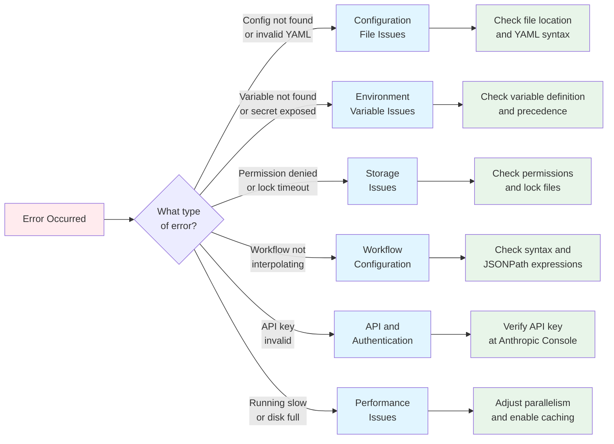
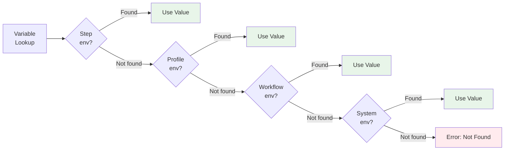

## Troubleshooting

This page covers common configuration issues and their solutions, organized by category.

### Quick Diagnostic Flow

Use this flowchart to identify which section to consult based on your symptoms:



---

### Configuration File Issues

#### "Configuration file not found"

!!! failure "Error Message"
    ```
    Error: Configuration file not found at ~/.prodigy/config.yml
    ```

**Causes:**

- Config file doesn't exist
- Wrong file extension (`.yaml` instead of `.yml`, or `.toml` instead of `.yml`)
- File is in the wrong location

**Solutions:**

=== "Create the file"
    ```bash
    mkdir -p ~/.prodigy
    cat > ~/.prodigy/config.yml << 'EOF'
    log_level: info
    auto_commit: true
    EOF
    ```

=== "Check file extension"
    ```bash
    ls -la ~/.prodigy/config.*
    # Should show config.yml, not config.yaml or config.toml
    ```

=== "Verify location"
    ```bash
    # Global config
    ls ~/.prodigy/config.yml

    # Project config
    ls .prodigy/config.yml
    ```

#### "Invalid YAML syntax"

!!! failure "Error Message"
    ```
    Error: Failed to parse configuration: invalid YAML syntax at line 10
    ```

**Causes:**

- Incorrect indentation (must use 2 spaces, no tabs)
- Missing space after colon (`key:value` instead of `key: value`)
- Unquoted strings with special characters
- Mixing TOML and YAML syntax

**Solutions:**

=== "Fix indentation"
    ```yaml
    # Wrong (tabs or 4 spaces)
    storage:
        backend: file

    # Correct (2 spaces)
    storage:
      backend: file
    ```

=== "Fix colon spacing"
    ```yaml
    # Wrong
    log_level:debug

    # Correct
    log_level: debug
    ```

=== "Quote special characters"
    ```yaml
    # Wrong
    message: Error: something failed

    # Correct
    message: "Error: something failed"
    ```

=== "Validate with yamllint"
    ```bash
    yamllint ~/.prodigy/config.yml
    ```

!!! tip "YAML Best Practice"
    Always use 2-space indentation consistently. Many editors can be configured to insert spaces instead of tabs automatically.

#### "Unknown field in configuration"

!!! warning "Warning Message"
    ```
    Warning: Unknown field 'unknown_setting' in configuration
    ```

**Causes:**

- Typo in field name
- Using deprecated field name
- Field from old TOML format

**Solutions:**

1. Check spelling against [Global Configuration Structure](global-configuration-structure.md) or [Project Configuration Structure](project-configuration-structure.md)

2. Remove deprecated fields:
   ```yaml
   # Deprecated TOML-style
   [storage]
   backend = "file"

   # Correct YAML
   storage:
     backend: file
   ```

3. Update field names from old versions

---

### Environment Variable Issues

#### "Environment variable not resolving"

!!! failure "Error Message"
    ```
    Error: Variable 'API_KEY' not found
    ```

**Causes:**

- Variable not defined in any configuration source
- Incorrect variable syntax in workflow
- Profile not activated

**Solutions:**

=== "Check variable is defined"
    ```bash
    # System env
    echo $PRODIGY_API_KEY

    # Workflow env (check workflow.yml)
    grep API_KEY workflow.yml
    ```

=== "Use correct syntax"
    ```yaml
    # Wrong
    command: "curl $API_KEY"

    # Correct
    command: "curl ${API_KEY}"
    ```

=== "Activate profile"
    ```bash
    prodigy run workflow.yml --profile prod
    ```

!!! info "Variable Precedence"
    Variables are resolved in this order (highest to lowest priority):

    1. Step environment
    2. Profile environment
    3. Workflow environment
    4. System environment



#### "Secret not being masked in logs"

!!! danger "Security Issue"
    ```
    Output: curl -H 'Authorization: Bearer sk-abc123...'
    ```

**Causes:**

- Secret not marked with `secret: true` in workflow env block
- Using system env vars (not masked automatically)

**Solution:**

```yaml title="workflow.yml"
# Mark as secret in workflow
env:
  API_KEY:
    secret: true
    value: "${PROD_API_KEY}"  # From system env
```

!!! warning "Important"
    Only workflow env vars marked as `secret: true` are masked. System environment variables are **not** automatically masked.

---

### Storage Issues

#### "Storage directory not writable"

!!! failure "Error Message"
    ```
    Error: Failed to write to storage: Permission denied
    ```

**Causes:**

- Insufficient permissions on `~/.prodigy` directory
- Directory owned by different user
- Disk full

**Solutions:**

=== "Check permissions"
    ```bash
    ls -ld ~/.prodigy
    # Should show: drwxr-xr-x username username
    ```

=== "Fix ownership"
    ```bash
    sudo chown -R $USER:$USER ~/.prodigy
    chmod -R u+rwX ~/.prodigy
    ```

=== "Check disk space"
    ```bash
    df -h ~/.prodigy
    ```

#### "Failed to acquire storage lock"

!!! failure "Error Message"
    ```
    Error: Failed to acquire storage lock after 30s
    ```

**Causes:**

- Another Prodigy process holding the lock
- Stale lock from crashed process
- File locking disabled but concurrent access occurring

**Solutions:**

=== "Check for running processes"
    ```bash
    ps aux | grep prodigy
    ```

=== "Remove stale lock"
    Only if no processes are running:
    ```bash
    rm ~/.prodigy/storage.lock
    ```

=== "Wait for lock release"
    If a process is running, wait for it to complete.

=== "Disable locking (temporary)"
    ```yaml title="config.yml"
    storage:
      enable_locking: false
    ```

    !!! danger "Not Recommended"
        Disabling locking can cause data corruption with concurrent access. Only use for debugging.

---

### Workflow Configuration Issues

#### "Workflow variables not interpolating"

!!! failure "Symptom"
    ```
    Output: Deploying ${PROJECT_NAME} to ${ENVIRONMENT}
    ```

**Causes:**

- Incorrect variable syntax
- Variable not defined in workflow or config
- Using project config variables instead of workflow env

**Solutions:**

=== "Use correct syntax"
    ```yaml title="workflow.yml"
    # Workflow env vars
    env:
      PROJECT_NAME: myapp
    commands:
      - shell: "echo ${PROJECT_NAME}"
    ```

    !!! warning "Project Config Variables"
        Variables in `.prodigy/config.yml` are **not** available in workflows:
        ```yaml title=".prodigy/config.yml"
        variables:
          PROJECT_NAME: myapp  # Not available in workflows
        ```

=== "Check variable exists"
    ```bash
    prodigy run workflow.yml -vv  # Verbose mode shows variable resolution
    ```

#### "MapReduce items not found"

!!! failure "Error Message"
    ```
    Error: No items found at JSONPath: $.items[*]
    ```

**Causes:**

- Incorrect JSONPath expression
- Input file not generated in setup phase
- JSON structure doesn't match path

**Solutions:**

=== "Validate JSONPath"
    ```bash
    cat items.json | jq '.items[0]'
    ```

=== "Check setup phase output"
    ```yaml title="workflow.yml"
    setup:
      - shell: "generate-items.sh > items.json"
      - shell: "cat items.json"  # Verify file exists and has content
    ```

=== "Test JSONPath expression"
    ```bash
    # Use jq to test
    cat items.json | jq '.[*]'      # Root array
    cat items.json | jq '.items[*]' # Nested array
    ```

#### "Validation always fails"

!!! failure "Error Message"
    ```
    Error: Validation failed: completion_percentage 85 below threshold 100
    ```

**Causes:**

- Threshold set too high (default: 100)
- Validation command not returning expected format
- Expected schema mismatch

**Solutions:**

=== "Adjust threshold"
    ```yaml title="workflow.yml"
    validate:
      threshold: 80  # Accept 80% instead of 100%
    ```

=== "Check validation output format"
    Validation must output JSON in this format:
    ```json
    {
      "completion_percentage": 85,
      "status": "incomplete",
      "gaps": ["Missing feature X", "Incomplete test Y"]
    }
    ```

=== "Test validation manually"
    ```bash
    # Run validation command outside workflow
    ./validate-script.sh
    ```

---

### API and Authentication Issues

#### "Claude API key not recognized"

!!! failure "Error Message"
    ```
    Error: Invalid Claude API key
    ```

**Causes:**

- API key not set
- Key set in wrong location
- Key expired or revoked

**Solutions:**

=== "Check key is set"
    Keys are checked in this precedence order:
    ```bash
    # Highest precedence: Environment variable
    echo $PRODIGY_CLAUDE_API_KEY

    # Project config
    grep claude_api_key .prodigy/config.yml

    # Global config
    grep claude_api_key ~/.prodigy/config.yml
    ```

=== "Use environment variable"
    Setting via environment variable is recommended:
    ```bash
    export PRODIGY_CLAUDE_API_KEY="your-api-key-here"
    ```

=== "Verify key is valid"
    Check your key at the [Anthropic Console](https://console.anthropic.com/)

!!! tip "API Key Precedence"
    Environment variable > Project config > Global config

---

### Performance Issues

#### "Workflow running slowly"

**Causes:**

- Excessive parallelism exhausting resources
- Large work items in MapReduce
- Slow validation commands

**Solutions:**

=== "Reduce parallelism"
    ```yaml title="workflow.yml"
    map:
      max_parallel: 3  # Reduce from 10
    ```

=== "Add timeout limits"
    ```yaml title="workflow.yml"
    commands:
      - shell: "long-running-command"
        timeout: 300  # 5 minutes
    ```

=== "Enable caching"
    ```yaml title="config.yml"
    storage:
      enable_cache: true
    ```

#### "Storage growing too large"

**Causes:**

- Old events and DLQ data accumulating
- Large checkpoint files
- No compression enabled

**Solutions:**

=== "Clean up old data"
    ```bash
    # Remove old events (older than 30 days)
    find ~/.prodigy/events -type f -mtime +30 -delete

    # Clear processed DLQ items for a workflow
    # Source: src/cli/args.rs:622-630
    prodigy dlq clear <workflow_id>

    # Purge old DLQ items
    prodigy dlq purge --older-than-days 30
    ```

=== "Enable compression"
    ```yaml title="config.yml"
    storage:
      backend_config:
        enable_compression: true
    ```

=== "Reduce file retention"
    ```yaml title="config.yml"
    storage:
      backend_config:
        max_file_size: 52428800  # 50MB instead of 100MB
    ```

---

### Debugging Tools

#### Check Effective Configuration

View the merged configuration from all sources:

```bash
prodigy config show
```

#### Verbose Logging

Enable detailed logging with verbosity flags:

| Flag | Level | Shows |
|------|-------|-------|
| `-v` | Verbose | Claude streaming output |
| `-vv` | Debug | Variable resolution |
| `-vvv` | Trace | All internal operations |

```bash
prodigy run workflow.yml -vv
```

Or set log level in config:

```yaml title="config.yml"
log_level: debug  # trace, debug, info, warn, error
```

#### Validate Configuration Files

```bash
# Validate YAML syntax
yamllint ~/.prodigy/config.yml
yamllint .prodigy/config.yml

# Validate workflow syntax
prodigy validate workflow.yml
```

#### Check Claude Logs

View Claude execution logs for debugging:

```bash
# Latest log
prodigy logs --latest

# Tail live log
prodigy logs --latest --tail

# View specific log
cat ~/.local/state/claude/logs/session-abc123.json | jq
```

!!! tip "Claude Observability"
    Claude logs contain complete message history, tool invocations, and token usage. See the [Claude Observability](../advanced/observability.md) documentation for more details.

---

### Quick Reference

#### Common Error Messages

| Error Message | Likely Cause | Solution |
|--------------|-------------|----------|
| "Configuration file not found" | Missing config file | Create `~/.prodigy/config.yml` or `.prodigy/config.yml` |
| "Invalid YAML syntax" | Syntax error in YAML | Check indentation, colons, quotes |
| "Unknown field" | Typo or deprecated field | Check docs for correct field names |
| "Variable not found" | Undefined variable | Define in workflow `env:` or system env |
| "Storage lock timeout" | Concurrent access | Wait or remove stale lock |
| "Permission denied" | Insufficient permissions | Fix ownership/permissions on `~/.prodigy` |
| "JSONPath not found" | Wrong path or missing data | Verify JSON structure and path |
| "API key invalid" | Wrong or expired key | Verify key at Anthropic Console |

---

### Getting Help

If you can't resolve an issue:

!!! info "Debugging Checklist"
    1. **Check logs**: Use `-vvv` for maximum verbosity
    2. **Verify config**: Run `prodigy config show`
    3. **Check docs**: See [Configuration Structure](global-configuration-structure.md) and [Workflow Basics](../workflow-basics/index.md)

!!! question "Filing an Issue"
    If the issue persists, file an issue at [Prodigy GitHub Issues](https://github.com/anthropics/prodigy/issues) with:

    - Error message (redact secrets)
    - Relevant config snippets
    - Prodigy version (`prodigy --version`)
    - Operating system
