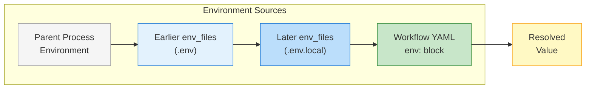

## Environment Files

Load environment variables from `.env` files:

```yaml
# Environment files to load
env_files:
  - .env
  - .env.local
  - config/.env.production

commands:
  - shell: "echo $DATABASE_URL"
```

### Environment File Format

Environment files use the standard `.env` format with `KEY=value` pairs:

```bash
# Source: Example .env file format
# .env file example
DATABASE_URL=postgresql://localhost:5432/mydb
REDIS_HOST=localhost
REDIS_PORT=6379

# Comments are supported (lines starting with #)
API_KEY=secret-key-here

# Empty lines are ignored

# Quotes are optional but stripped if present
QUOTED_VALUE="my value with spaces"
```

### Quote Handling

Prodigy automatically strips both single and double quotes from the start and end of values during parsing:

```bash
# These all produce the same value: myvalue
KEY1=myvalue
KEY2="myvalue"
KEY3='myvalue'

# Quotes are useful for values with leading/trailing spaces
PADDED="  value with spaces  "
# Resulting value: "  value with spaces  " (inner spaces preserved, outer quotes stripped)
```

**Source:** `src/cook/environment/manager.rs:200-207`

!!! warning "Multi-line Values Not Supported"
    The current implementation processes environment files line-by-line and does **not** support true multi-line values with embedded newlines. Each line is parsed independently.

    For multi-line content like certificates or keys, use one of these alternatives:

    - **Base64 encoding:** Encode the content and decode at runtime
    - **File reference:** Store in a separate file and reference the path
    - **Escaped newlines:** Use `\n` literals in a single-line value

### Parsing Rules

- Lines starting with `#` are treated as comments and skipped
- Empty lines are ignored
- Each line must contain an `=` character to be valid
- Key is everything before the first `=` (trimmed)
- Value is everything after the first `=` (trimmed)
- Surrounding quotes (`"` or `'`) are automatically removed from values

**Source:** `src/cook/environment/manager.rs:190-211`

### Loading Order and Precedence

!!! note "Missing Files Are Silently Skipped"
    Environment files are loaded in order (if they exist), with later files overriding earlier files. Missing files are silently skipped with debug logging. This enables layered configuration where optional files don't cause errors.

```yaml
env_files:
  - .env                # Base configuration
  - .env.local          # Local overrides (gitignored)
  - .env.production     # Environment-specific settings
```

=== ".env (base)"
    ```bash
    # Base configuration
    DATABASE_URL=postgresql://localhost:5432/dev
    API_TIMEOUT=30
    MAX_WORKERS=5
    ```

=== ".env.production (overrides)"
    ```bash
    # Production overrides
    DATABASE_URL=postgresql://prod-server:5432/app
    MAX_WORKERS=20
    # API_TIMEOUT remains 30 from base file
    ```

=== "Final Values"
    ```bash
    # Merged result
    DATABASE_URL=postgresql://prod-server:5432/app  # from .env.production
    API_TIMEOUT=30                                   # from .env
    MAX_WORKERS=20                                   # from .env.production
    ```

**Precedence order** (highest to lowest):

1. Global `env` field in workflow YAML
2. Later files in `env_files` list
3. Earlier files in `env_files` list
4. Parent process environment



**Figure**: Environment value resolution flow - later sources override earlier ones.

### File Paths and Resolution

Environment file paths can be:

- **Absolute paths:** `/etc/myapp/.env`
- **Relative paths:** Resolved relative to the workflow file location (e.g., `.env`, `config/.env.production`)

**Source:** `src/cook/environment/manager.rs:182-215`

### Error Handling

Prodigy handles environment files with the following behavior:

| Condition | Behavior |
|-----------|----------|
| Missing file | Silently skipped with debug logging |
| Permission denied | Halts workflow execution with error |
| Invalid syntax | Halts workflow execution with error |

!!! tip "Debugging File Loading"
    To verify which env files are being loaded, run Prodigy with verbose logging:

    ```bash
    RUST_LOG=debug prodigy run workflow.yml
    ```

    You'll see messages like:
    ```
    DEBUG prodigy::cook::environment - Environment file not found: .env.local
    INFO  prodigy::cook::environment - Loaded environment from: .env
    ```

**Source:** `src/cook/environment/manager.rs:184-186`

**Example with optional files:**

```yaml
env_files:
  - .env                    # Always exists (base config)
  - .env.local              # May not exist (personal overrides)
  - .env.${ENVIRONMENT}     # May not exist (environment-specific)
```

This pattern is useful for:

- Personal configuration files that are gitignored
- Environment-specific files (`.env.production`, `.env.staging`)
- Optional feature flags or overrides

### Common Syntax Errors

!!! warning "These Errors Halt Workflow Execution"
    Invalid syntax in environment files will cause workflow execution to fail immediately.

=== "Invalid Syntax"
    ```bash
    # INVALID - No = character
    INVALID_LINE

    # INVALID - Unbalanced quotes
    BAD_QUOTE="unclosed value

    # INVALID - Mixed quotes
    MIXED_QUOTES="value'
    ```

=== "Valid Syntax"
    ```bash
    # VALID - Value can be empty
    EMPTY_VALUE=

    # VALID - Quotes must match
    GOOD_QUOTE_1="value with spaces"
    GOOD_QUOTE_2='single quoted value'

    # VALID - Embedded quotes of opposite type
    EMBEDDED="value with 'single' quotes inside"
    ```

---

### Integration with Profiles and Secrets

Environment files work seamlessly with other environment features. For comprehensive coverage, see:

- [Environment Profiles](environment-profiles.md) - Profile-based configuration switching
- [Secrets Management](secrets-management.md) - Secure handling of sensitive values
- [Environment Precedence](environment-precedence.md) - Complete precedence rules

**Combining env_files with profiles:**

```yaml
# Base configuration in .env file
env_files:
  - .env

# Profile-specific overrides
profiles:
  dev:
    API_URL: http://localhost:3000
    DEBUG: "true"
  prod:
    API_URL: https://api.production.com
    DEBUG: "false"

commands:
  - shell: "echo $API_URL"  # Uses profile value if active, otherwise .env value
```

**Loading secrets from env_files:**

!!! note "Secrets Require Explicit Declaration"
    Variables loaded from env_files are **not** automatically masked. You must explicitly mark them as secrets in the `secrets` section for masking in logs.

```yaml
# .env.secrets file contains sensitive values
env_files:
  - .env.secrets

secrets:
  # Retrieve from environment variable (loaded from .env.secrets)
  API_KEY: "${env:API_KEY}"
  DATABASE_PASSWORD: "${env:DATABASE_PASSWORD}"
```

**Complete integration example:**

```yaml
# Source: Example layered configuration strategy
# Layered configuration strategy
env_files:
  - .env                # (1)!
  - .env.local          # (2)!
  - .env.${ENVIRONMENT} # (3)!

env:
  PROJECT_NAME: my-project
  VERSION: "1.0.0"

secrets:
  # Secrets loaded from env files, masked in logs
  API_KEY: "${env:API_KEY}"
  DATABASE_URL: "${env:DATABASE_URL}"

profiles:
  dev:
    MAX_WORKERS: "2"
    TIMEOUT: "60"
  prod:
    MAX_WORKERS: "20"
    TIMEOUT: "30"

commands:
  - shell: "echo 'Project: $PROJECT_NAME v$VERSION'"
  - shell: "echo 'Workers: $MAX_WORKERS, Timeout: $TIMEOUT'"
```

1. Base configuration - safe to commit (no secrets)
2. Local overrides - add to `.gitignore`
3. Environment-specific - e.g., `.env.production`

### Organizing Environment Files

| File | Purpose | Git Status |
|------|---------|------------|
| `.env` | Base configuration, safe defaults | Commit |
| `.env.local` | Personal overrides | `.gitignore` |
| `.env.production` / `.env.staging` | Environment-specific | May contain encrypted secrets |
| `.env.secrets` | Sensitive values only | **Never commit** |

---
