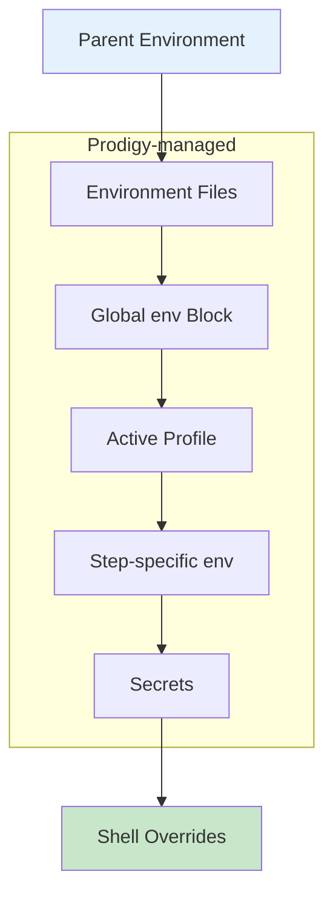
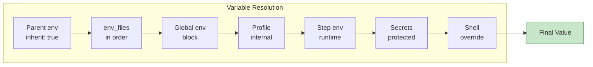

## Environment Precedence

Environment variables are resolved with a clear precedence order, ensuring predictable behavior when the same variable is defined in multiple locations.

!!! info "Source Reference"
    Implementation in `src/cook/environment/manager.rs:95-137`

## Precedence Order

Environment variables are applied in the following order (later sources override earlier ones):

| Priority | Source | Description |
|----------|--------|-------------|
| 1 (lowest) | Parent environment | Inherited from the parent process |
| 2 | Environment files | Loaded from `env_files` (later files override earlier) |
| 3 | Global `env` | Defined at workflow level in YAML |
| 4 | Active profile | Applied if a profile is set (internal infrastructure) |
| 5 | Step-specific `env` | Per-step environment variables |
| 6 | Secrets | Loaded from secrets configuration |
| 7 (highest) | Shell-level overrides | Using `ENV=value command` syntax |



## Implementation Details

### Parent Environment Inheritance

By default, workflows inherit all environment variables from the parent process. You can disable this with `inherit: false` in the environment configuration.

```yaml
# Source: src/cook/environment/manager.rs:98-102
# Disable parent environment inheritance
inherit: false

env:
  # Only these variables will be available
  NODE_ENV: production
```

!!! tip "When to disable inheritance"
    Disabling inheritance creates a clean environment, useful for reproducible builds or when parent variables might conflict with workflow configuration.

### Environment Files Precedence

When multiple environment files are specified, later files override earlier ones. This allows layering of configuration (base + environment-specific).

```yaml
# Source: src/cook/environment/manager.rs:107-109
env_files:
  - .env              # (1)!
  - .env.production   # (2)!
```

1. Base configuration loaded first
2. Production values override base values

### Global Environment

The global `env` block at the workflow level overrides both parent environment and environment files.

```yaml
# Source: src/cook/environment/manager.rs:112-115
env:
  NODE_ENV: production  # Overrides .env files and parent environment
  API_URL: https://api.example.com
```

### Profile Infrastructure

!!! info "Internal Feature"
    Prodigy includes internal profile infrastructure that can activate different environment configurations. However, this feature is not currently exposed via CLI flags.

```yaml
# Profile infrastructure exists but no --profile CLI flag available
# Source: src/cook/environment/manager.rs:118-120
profiles:
  development:
    NODE_ENV: development
    API_URL: http://localhost:3000
```

### Step-Specific Environment

!!! note "Runtime Capability"
    The YAML command syntax (`WorkflowStepCommand`) does not expose step-level environment configuration. However, the internal runtime (`StepEnvironment`) supports it for future extensibility.

**Source**:

- `StepEnvironment` struct at `src/cook/environment/config.rs:128-144`
- Step environment application at `src/cook/environment/manager.rs:123-127`

### Secrets Loading

Secrets are loaded AFTER step-specific environment variables, ensuring they cannot be accidentally overridden by step configuration.

```yaml
# Source: src/cook/environment/manager.rs:130-137
secrets:
  API_KEY: "${env:SECRET_API_KEY}"

# This takes precedence over global env, env_files, and step env
```

!!! warning "Security Note"
    Secrets always take precedence over other environment sources to prevent accidental exposure through configuration overrides.

### Shell-Level Overrides

Shell syntax provides the highest precedence override, applied at command execution time.

```yaml
- shell: "NODE_ENV=test echo $NODE_ENV"  # Prints: test
```

This override is handled by the shell itself and takes precedence over all Prodigy environment sources.

## Complete Example

??? example "Comprehensive Precedence Demonstration"
    Here's a complete example demonstrating all precedence levels:

    ```yaml
    # Source: workflows/environment-example.yml
    # Parent environment: NODE_ENV=local (inherited by default)

    env_files:
      - .env  # (1)!

    env:
      NODE_ENV: production      # (2)!
      API_URL: https://api.prod.example.com

    secrets:
      API_KEY: "${env:SECRET_API_KEY}"  # (3)!

    commands:
      - shell: "echo $NODE_ENV"          # Prints: production (from global env)
      - shell: "echo $API_URL"           # Prints: https://api.prod.example.com
      - shell: "echo $API_KEY"           # Prints: *** (masked, from secrets)

      # Override using shell syntax (highest precedence)
      - shell: "NODE_ENV=staging echo $NODE_ENV"  # (4)!
    ```

    1. Contains: `NODE_ENV=development`, `API_URL=http://localhost:3000`
    2. Overrides values from `.env` file and parent environment
    3. Loaded after global env - cannot be overridden by step env
    4. Shell override prints: `staging` (highest precedence)

## Precedence Resolution Flow



**Result**: The last value set wins, creating a predictable override chain.

## Debugging Precedence Issues

!!! tip "Debugging Commands"
    Use these commands to troubleshoot environment precedence:

    === "List All Variables"
        ```yaml
        - shell: "env | sort"
          capture_output: true
        ```

    === "Check Specific Variable"
        ```yaml
        - shell: "echo NODE_ENV=$NODE_ENV"
        ```

    === "Verify Secrets"
        ```yaml
        - shell: "echo API_KEY is set: ${API_KEY:+yes}"
        ```

**Common debugging scenarios:**

| Symptom | Likely Cause | Solution |
|---------|--------------|----------|
| Variable not set | Parent inheritance disabled | Check `inherit: true` (default) |
| Wrong value | Higher precedence source | Check which level last set the variable |
| Secrets not working | Secrets config error | Verify secrets are in correct format |
| Override not applying | Shell syntax issue | Ensure proper quoting and syntax |

## Related Topics

- [Environment Files](environment-files.md) - Loading configuration from files
- [Secrets Management](secrets-management.md) - Secure handling of sensitive values
- [Environment Profiles](environment-profiles.md) - Profile infrastructure details
- [Per-Command Overrides](per-command-environment-overrides.md) - Command-level environment control
