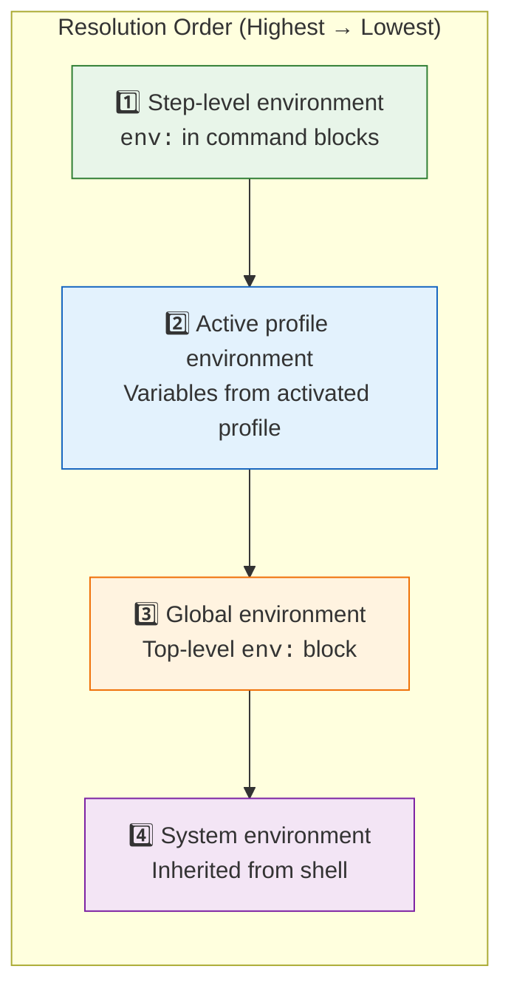

## Environment Profiles

Environment profiles allow you to define named sets of environment variables for different execution contexts (development, staging, production, etc.). Each profile contains environment variables that are applied when the profile is activated.

!!! abstract "Source Reference"
    Profile infrastructure implemented in `src/cook/environment/config.rs` (EnvironmentConfig struct) and `src/cook/environment/manager.rs` (profile application logic).

### Defining Profiles

Profiles use a flat structure where environment variables are defined directly at the profile level (not nested under an `env:` key):

```yaml title="workflow.yml - Profile Definition"
# Define multiple profiles for different environments
profiles:
  development:
    description: "Development environment with debug enabled"
    NODE_ENV: development
    DEBUG: "true"
    API_URL: http://localhost:3000
    LOG_LEVEL: debug

  staging:
    description: "Staging environment for QA"
    NODE_ENV: staging
    DEBUG: "true"
    API_URL: https://staging.api.example.com
    LOG_LEVEL: info

  production:
    description: "Production environment configuration"
    NODE_ENV: production
    DEBUG: "false"
    API_URL: https://api.example.com
    LOG_LEVEL: error

# Global environment variables (apply to all profiles)
env:
  APP_NAME: "my-app"
  VERSION: "1.0.0"

commands:
  - shell: "npm run build"
```

!!! tip "Profile Structure"
    - **description** (optional): Human-readable description of the profile's purpose
    - **Environment variables**: Direct key-value pairs at the profile level
    - All variable values must be strings in YAML

    Source: `src/cook/environment/config.rs` (EnvProfile type)

### Activating Profiles

!!! info "Implementation Status"
    The profile activation infrastructure is architecturally complete in the codebase. The `EnvironmentConfig` struct has an `active_profile` field (`src/cook/environment/config.rs:33-35`), and the `EnvironmentManager` applies active profiles during environment setup (`src/cook/environment/manager.rs:118-120`). Comprehensive integration tests demonstrate profile activation (`tests/environment_workflow_test.rs:63-132`).

    **Current Status**: As of this documentation, the CLI wiring for profile activation (`--profile` flag and `PRODIGY_PROFILE` environment variable) is not yet connected to the argument parser. The profile application infrastructure exists and is tested, but requires the active profile to be set programmatically rather than via command-line arguments.

=== "CLI Flag (Planned)"

    ```bash
    # Activate profile via command line flag
    prodigy run workflow.yml --profile production
    ```

=== "Environment Variable (Planned)"

    ```bash
    # Activate profile via environment variable
    export PRODIGY_PROFILE=staging
    prodigy run workflow.yml
    ```

=== "Programmatic (Current)"

    ```rust
    // Source: tests/environment_workflow_test.rs
    // Profiles can be activated programmatically by setting active_profile
    let config = EnvironmentConfig {
        active_profile: Some("production".to_string()),
        profiles: profiles_map,
        ..Default::default()
    };
    ```

### Common Use Cases

Profiles are ideal for managing environment-specific configuration:

=== "API Endpoints"

    ```yaml title="Different API endpoints per environment"
    profiles:
      development:
        API_URL: http://localhost:3000
        AUTH_URL: http://localhost:4000

      production:
        API_URL: https://api.example.com
        AUTH_URL: https://auth.example.com
    ```

=== "Database Credentials"

    ```yaml title="Environment-specific database configuration"
    profiles:
      development:
        DB_HOST: localhost
        DB_NAME: myapp_dev
        DB_USER: dev_user

      production:
        DB_HOST: prod-db.example.com
        DB_NAME: myapp_prod
        DB_USER: prod_user
    ```

=== "Cloud Deployment"

    ```yaml title="Deployment target configuration"
    profiles:
      aws:
        CLOUD_PROVIDER: aws
        REGION: us-east-1
        DEPLOY_COMMAND: "aws deploy"

      gcp:
        CLOUD_PROVIDER: gcp
        REGION: us-central1
        DEPLOY_COMMAND: "gcloud deploy"
    ```

### Environment Variable Precedence

When a profile is active, environment variables are resolved in this order (highest to lowest precedence):



!!! note "Source Reference"
    Precedence chain implemented in `src/cook/environment/manager.rs:88-156` and tested in `tests/environment_workflow_test.rs`.

For detailed information on precedence rules, see [Environment Precedence](environment-precedence.md).

### Profile Best Practices

!!! example "Define Sensible Defaults"

    ```yaml
    profiles:
      development:
        description: "Local development with debug enabled"
        DEBUG: "true"
        LOG_LEVEL: debug

      production:
        description: "Production environment with minimal logging"
        DEBUG: "false"
        LOG_LEVEL: error
    ```

!!! example "Combine with env_files for Secrets"

    ```yaml
    profiles:
      production:
        API_URL: https://api.example.com
        DEBUG: "false"

    env_files:
      - path: .env.production
        required: true  # Contains secrets like API_KEY
    ```

    See [Environment Files](environment-files.md) for more on combining profiles with environment files.

!!! example "Override Profile Values at Step Level"

    ```yaml
    profiles:
      production:
        LOG_LEVEL: error

    commands:
      - shell: "run-diagnostics.sh"
        env:
          LOG_LEVEL: debug  # Override for this step only
    ```

    See [Per-Command Environment Overrides](per-command-environment-overrides.md) for step-level overrides.

### Troubleshooting

!!! warning "Profile Not Applied"
    - Verify profile name matches exactly (case-sensitive)
    - Check that profile is defined in `profiles:` section
    - Confirm profile activation method is used correctly

!!! warning "Variables Not Resolved"
    - Ensure variable names are correct in profile definition
    - Check precedence - higher-precedence sources may override profile values
    - Verify string values are quoted in YAML if they contain special characters

---

**See Also**:

- [Environment Precedence](environment-precedence.md) - Understanding variable resolution order
- [Environment Files](environment-files.md) - Loading variables from external files
