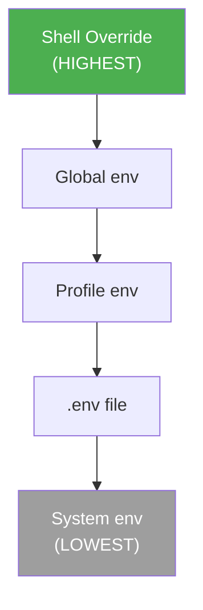

## Per-Command Environment Overrides

!!! warning "WorkflowStepCommand Limitation"
    WorkflowStepCommand does **NOT** have an `env` field. All per-command environment changes must use shell syntax.

!!! info "Legacy vs Modern Command Format"
    The legacy Command struct (structured format) has an `env` field via CommandMetadata, but the modern WorkflowStepCommand format does not. For workflows using the modern `claude:`/`shell:` syntax, use shell-level environment syntax (`ENV=value command`).

You can override environment variables for individual commands using shell environment syntax:

```yaml
env:
  RUST_LOG: info
  API_URL: "https://api.example.com"

# Steps go directly in the workflow
- shell: "cargo run"  # (1)!

# Override environment for this command only using shell syntax
- shell: "RUST_LOG=debug cargo run --verbose"  # (2)!

# Change directory and set environment in shell
- shell: "cd frontend && PATH=./node_modules/.bin:$PATH npm run build"  # (3)!
```

1. Uses `RUST_LOG=info` from global env
2. Overrides `RUST_LOG` to `debug` for this command only
3. Changes directory and extends `PATH` for npm binaries

## Shell-Based Environment Techniques

### Basic Overrides

| Pattern | Example | Description |
|---------|---------|-------------|
| Single variable | `ENV_VAR=value command` | Override one variable |
| Multiple variables | `VAR1=val1 VAR2=val2 command` | Override multiple variables |
| Change directory | `cd path && command` | Run in different directory |
| Combined | `cd path && ENV_VAR=value command` | Both directory and env override |

### Advanced Shell Patterns

You can combine shell environment overrides with redirection and other shell features:

```yaml
# Redirect output while overriding environment
- shell: "RUST_LOG=trace cargo test > test-output.txt 2>&1"  # (1)!

# Pipe commands with environment overrides
- shell: "COLUMNS=120 cargo fmt --check | tee fmt-report.txt"  # (2)!

# Multiple environment variables with complex shell operations
- shell: |
    RUST_BACKTRACE=1 RUST_LOG=debug cargo run \
      --release \
      --bin my-app > app.log 2>&1 || echo "Build failed"  # (3)!
```

1. Captures both stdout and stderr to file with trace-level logging
2. Sets terminal width and saves formatter output while displaying it
3. Multi-line command with multiple env vars, output capture, and error handling

<!-- Source: src/config/command.rs:320-397 -->

## Interaction with Environment Precedence

Shell-level environment overrides take **highest precedence** and apply only to the specific command where they're defined. These overrides shadow:



For detailed precedence rules, see [Environment Precedence](environment-precedence.md).

## Future Plans: StepEnvironment Struct

A `StepEnvironment` struct exists in the internal runtime with support for structured per-step configuration:

=== "Current: Shell Syntax"
    ```yaml
    # Must use shell syntax today
    - shell: "RUST_LOG=debug cd /app && cargo test"
    ```

=== "Future: StepEnvironment (Planned)"
    ```yaml
    # Potential future syntax (not yet available)
    - shell: "cargo test"
      env:
        RUST_LOG: debug
      working_dir: /app
      clear_env: false
      temporary: true
    ```

!!! note "StepEnvironment Struct Details"
    The internal struct at `src/cook/environment/config.rs:126-144` includes:

    - **`env`**: HashMap of environment variables
    - **`working_dir`**: Optional working directory override
    - **`clear_env`**: Clear parent environment before applying step env
    - **`temporary`**: Restore environment after step execution

    This struct may be exposed in future versions to provide more structured per-step environment control directly in YAML syntax.

## Troubleshooting

=== "Variable Not Taking Effect"
    **Problem**: Shell environment override doesn't apply to command

    **Cause**: Quote escaping or shell evaluation order issues

    **Solution**: Use proper quoting and verify variable expansion:
    ```yaml
    # ✓ Correct - single quotes around entire command
    - shell: 'API_URL="https://example.com" ./script.sh'

    # ✗ Incorrect - quotes broken by YAML parsing
    - shell: "API_URL="https://example.com" ./script.sh"
    ```

=== "Variable Expansion Issues"
    **Problem**: Variable contains shell special characters (`$`, `\`, etc.)

    **Solution**: Use single quotes to prevent shell expansion:
    ```yaml
    # If variable value is literal (no shell expansion needed)
    - shell: "PASSWORD='$ecr3t!' ./deploy.sh"
    ```

=== "Debugging Environment"
    To debug which environment values are active:

    ```yaml
    # Print all environment variables
    - shell: "env | sort"

    # Check specific variable resolution
    - shell: 'echo "RUST_LOG is: $RUST_LOG"'

    # Verify override works
    - shell: 'RUST_LOG=trace sh -c "echo RUST_LOG is: $RUST_LOG"'
    ```
