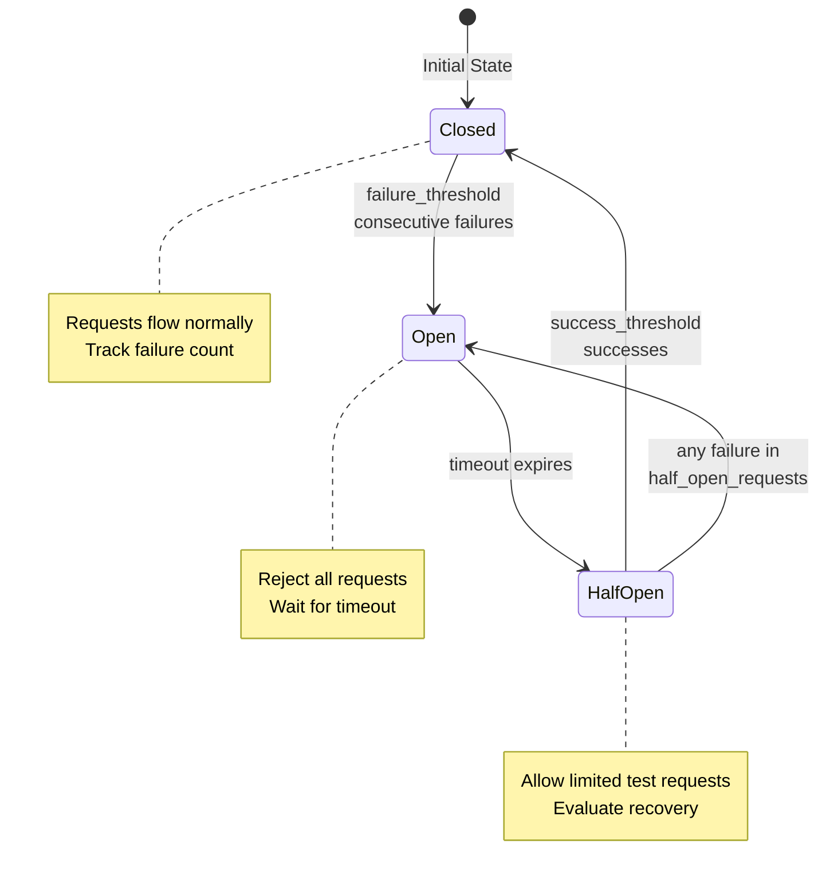

# Advanced Examples

This section covers advanced workflow features including nested error handling, git context variables, circuit breakers, and retry configuration with backoff strategies.

## Example 9: Advanced Features

```yaml
# Nested error handling with retry configuration
- shell: "cargo build --release"
  on_failure:
    shell: "cargo clean"
    on_success:
      shell: "cargo build --release"
      max_attempts: 2
  on_success:
    shell: "cargo test --release"

# Complex conditional execution with max_attempts
- shell: "cargo test"
  id: "test"
  capture_output: "test_output"

- claude: "/fix-tests"
  when: "${test_output} contains 'FAILED'"
  max_attempts: 3

# Conditional deployment based on test results
- shell: "cargo build --release"
  when: "${test.exit_code} == 0"

# Multi-condition logic
- shell: "./deploy.sh"
  when: "${test_output} contains 'passed' and ${build_output} contains 'Finished'"
```

**Note:** Advanced features currently supported:
- **Nested handlers**: Chain `on_failure` and `on_success` handlers for complex error recovery
- **Max attempts**: Combine with conditional execution for automatic retry logic
- **Conditional execution**: Use `when` clauses with captured output or variables
- **Complex conditionals**: Combine multiple conditions with `and`/`or` operators
- **Working directory**: Per-command directory control using `working_dir` field
- **Git context variables**: Automatic tracking of file changes during workflow execution

### Working Directory Usage

**Source**: Field definition from src/commands/handlers/shell.rs:40, examples from workflows/environment-example.yml:52-64

```yaml
# Run command in specific directory
- name: "Build frontend"
  shell: "npm run build"
  working_dir: ./frontend      # Execute in frontend/ directory

# Combine with environment variables
- name: "Run backend tests"
  shell: "pytest"
  env:
    PYTHONPATH: "./src:./tests"
  working_dir: ./backend

# Use variable interpolation for dynamic paths
- name: "Deploy to environment"
  shell: "echo 'Deploying...'"
  working_dir: "${env.DEPLOY_DIR}"  # Path from environment variable
```

**Note:** The `working_dir` field is fully implemented and production-ready:
- Accepts relative or absolute paths
- Supports variable interpolation (e.g., `"${env.PROJECT_DIR}"`)
- Falls back to current execution context if not specified
- Paths are resolved to absolute paths automatically
- Relative paths are resolved via the workflow execution context

### Git Context Variables (Spec 122)

Prodigy automatically tracks file changes during workflow execution and exposes them as variables:

```yaml
# Access files changed in current step
- shell: "echo 'Modified files: ${step.files_modified}'"
- shell: "echo 'Added files: ${step.files_added}'"
- shell: "echo 'Deleted files: ${step.files_deleted}'"

# Format as JSON array
- shell: "echo '${step.files_modified:json}'"

# Filter by glob pattern (only Rust files)
- shell: "echo 'Rust files changed: ${step.files_modified:*.rs}'"

# Access workflow-level aggregations
- shell: "echo 'Total commits: ${workflow.commit_count}'"
- shell: "echo 'All modified files: ${workflow.files_modified}'"

# Access uncommitted changes
- shell: "echo 'Staged files: ${git.staged_files}'"
- shell: "echo 'Unstaged files: ${git.unstaged_files}'"

# Pattern filtering for git context
- claude: "/review-changes ${git.modified_files|pattern:**/*.rs}"
- shell: "echo 'Changed Rust files: ${git.staged_files|pattern:**/*.rs}'"

# Basename-only output (no paths)
- shell: "echo 'File names: ${git.modified_files|basename}'"
```

**Available Git Context Variables:**
- `${step.files_added}` - Files added in current step
- `${step.files_modified}` - Files modified in current step
- `${step.files_deleted}` - Files deleted in current step
- `${step.commits}` - Commit SHAs created in this step
- `${step.insertions}` - Lines inserted in this step
- `${step.deletions}` - Lines deleted in this step
- `${workflow.commit_count}` - Total commits in workflow
- `${workflow.files_modified}` - All files modified across workflow
- `${git.staged_files}` - Currently staged files (uncommitted)
- `${git.unstaged_files}` - Modified but unstaged files
- `${git.modified_files}` - All uncommitted modifications

**Supported Formats and Filters:**
- `:json` - Format as JSON array
- `:*.rs` - Filter by glob pattern (e.g., `*.rs`, `src/**/*.py`)
- `|pattern:**/*.rs` - Alternative syntax for glob pattern filtering (equivalent to `:pattern`)
- `|basename` - Extract just file names without paths

**Note:** Both `:pattern` and `|pattern:` syntaxes are valid and equivalent. Use whichever is more readable in your context:
- `${git.modified_files:*.rs}` - Colon syntax (more concise)
- `${git.modified_files|pattern:**/*.rs}` - Pipe syntax (more explicit)

**Source**: Git context tracking from src/cook/workflow/git_context.rs:1-120, variable resolution from src/cook/workflow/git_context.rs:36-42

### Troubleshooting MapReduce Cleanup

If agent worktree cleanup fails (due to disk full, permission errors, etc.), use the orphaned worktree cleanup command:
```bash
# List and clean orphaned worktrees for a specific job
prodigy worktree clean-orphaned <job_id>

# Dry run to preview what would be cleaned
prodigy worktree clean-orphaned <job_id> --dry-run

# Force cleanup without confirmation
prodigy worktree clean-orphaned <job_id> --force
```
Note: Agent execution status is independent of cleanup status. If an agent completes successfully but cleanup fails, the agent is still marked as successful and results are preserved.

**Source**: Orphaned worktree cleanup from MapReduce cleanup failure handling (Spec 136)

---

## Example 10: Circuit Breaker for Resilient Error Handling

```yaml
name: api-processing-with-circuit-breaker
mode: mapreduce

setup:
  - shell: "curl https://api.example.com/items > items.json"

map:
  input: items.json
  json_path: "$[*]"
  max_parallel: 10

  agent_template:
    - shell: "curl -X POST https://api.example.com/process -d '${item}'"
      max_attempts: 3
    - claude: "/validate-processing ${item.id}"

  # Circuit breaker prevents cascading failures from external service issues
  error_policy:
    on_item_failure: dlq
    continue_on_failure: true
    circuit_breaker:
      failure_threshold: 5      # Open circuit after 5 consecutive failures
      success_threshold: 3      # Close circuit after 3 consecutive successes
      timeout: 30s             # Wait 30s before testing recovery (half-open state)
      half_open_requests: 3    # Allow 3 test requests in half-open state

reduce:
  - claude: "/summarize-results ${map.results}"
```

**Source**: CircuitBreakerConfig from src/cook/workflow/error_policy.rs:46-88, state machine from error_policy.rs:251-343

### Circuit Breaker State Transitions



**Figure**: Circuit breaker state machine showing transitions based on failure and success thresholds.

**When to Use Circuit Breakers:**
- External API calls that may become unavailable
- Database operations during maintenance windows
- Network-dependent operations with potential outages
- Any operation where cascading failures should be prevented

**Circuit Breaker Benefits:**
- **Fail Fast**: Stop wasting resources on doomed requests
- **Self-Healing**: Automatically test recovery after timeout
- **Prevent Overload**: Give external services time to recover
- **Clear Signals**: Circuit state indicates system health

**Default Values** (from error_policy.rs:63-76):
- `failure_threshold: 5` - Balance between sensitivity and stability
- `success_threshold: 3` - Require consistent success before full recovery
- `timeout: 30s` - Typical recovery time for transient issues
- `half_open_requests: 3` - Minimal testing before full recovery

**See Also**: [Error Handling Guide](../workflow-basics/error-handling.md) for comprehensive error handling patterns

---

## Example 11: Retry Configuration with Backoff Strategies

```yaml
name: resilient-deployment
mode: standard

# Global retry defaults for all commands
error_policy:
  retry_config:
    max_attempts: 3          # Maximum retry attempts
    backoff: exponential      # Backoff strategy (see variants below)

# Workflow steps
- shell: "curl https://api.example.com/deploy"
  # Inherits global retry_config

- shell: "docker push myapp:latest"
  # Override with custom retry config
  retry_config:
    max_attempts: 5
    backoff:
      exponential:
        initial: 2s          # Start with 2 second delay
        multiplier: 2.0      # Double delay each retry (2s, 4s, 8s, 16s, 32s)
```

**Source**: BackoffStrategy enum from src/cook/retry_v2.rs:70-98, RetryConfig from retry_v2.rs:14-52

### Backoff Strategy Variants

=== "Exponential (Default)"
    Delay doubles each retry - best for most scenarios:
    ```yaml
    backoff:
      exponential:
        initial: 1s         # First retry after 1s
        multiplier: 2.0     # Second after 2s, third after 4s, fourth after 8s
    ```
    **Use when**: Fast backoff needed, transient errors expected

=== "Linear"
    Delay increases by fixed increment - steady load reduction:
    ```yaml
    backoff:
      linear:
        initial: 1s         # First retry after 1s
        increment: 2s       # Second after 3s, third after 5s, fourth after 7s
    ```
    **Use when**: Gradual backoff preferred, predictable retry timing

=== "Fibonacci"
    Delay follows Fibonacci sequence - gradual then aggressive:
    ```yaml
    backoff:
      fibonacci:
        initial: 1s         # Delays: 1s, 1s, 2s, 3s, 5s, 8s, 13s...
    ```
    **Use when**: Balance between exponential and linear

=== "Fixed"
    Same delay for all retries - consistent timing:
    ```yaml
    backoff:
      fixed:
        delay: 5s           # All retries wait exactly 5s
    ```
    **Use when**: Rate limiting, polling operations

=== "Custom"
    Specify exact delays - full control:
    ```yaml
    backoff:
      custom:
        delays: [1s, 5s, 15s, 30s, 60s]
    ```
    **Use when**: Complex SLA requirements, specific retry patterns

### Advanced Retry Configuration

```yaml
- shell: "curl https://api.example.com/data"
  retry_config:
    max_attempts: 5                         # (1)!
    backoff:
      exponential:
        initial: 1s                         # (2)!
        multiplier: 2.0                     # (3)!
    initial_delay: 1s                       # (4)!
    max_delay: 60s                          # (5)!
    jitter: true                            # (6)!
    jitter_factor: 0.3                      # (7)!
    retry_budget: 300s                      # (8)!
    retry_on:                               # (9)!
      - network
      - timeout
      - server_error
      - rate_limit
    on_failure: continue                    # (10)!

1. Maximum number of retry attempts before giving up
2. Starting delay for exponential backoff (1s, 2s, 4s, 8s, ...)
3. Multiplier for exponential growth (2.0 = double each retry)
4. Base delay added before backoff calculation
5. Maximum delay cap to prevent excessive waiting
6. Add randomness to prevent thundering herd problem
7. Random variance range (0.3 = ±30% of calculated delay)
8. Total time budget for all retries (5 minutes)
9. Only retry on specific error types (fail fast on others)
10. Action after all retries exhausted (continue, fail, dlq)
```

**Source**: Test examples from src/cook/retry_v2.rs:582-659, backoff calculation from retry_v2.rs:283-305

### Backoff Strategy Comparison

| Strategy | Use Case | Delay Pattern | Example |
|----------|----------|---------------|---------|
| **Exponential** | Most scenarios, fast backoff | 2^n × initial | 1s, 2s, 4s, 8s |
| **Linear** | Steady load reduction | initial + (n × increment) | 1s, 3s, 5s, 7s |
| **Fibonacci** | Gradual backoff | Fibonacci(n) × initial | 1s, 1s, 2s, 3s, 5s |
| **Fixed** | Rate limiting, polling | constant | 5s, 5s, 5s, 5s |
| **Custom** | Complex SLA requirements | user-defined | 1s, 5s, 15s, 60s |

**Jitter Benefits** (from retry_v2.rs:644-659):
- Prevents thundering herd when multiple agents retry simultaneously
- Adds ±30% random variance by default (configurable via `jitter_factor`)
- Example: 10s delay becomes 7-13s with 0.3 jitter factor

**See Also**: [Retry State Tracking](../mapreduce/backoff-strategies.md) for persistence and recovery
