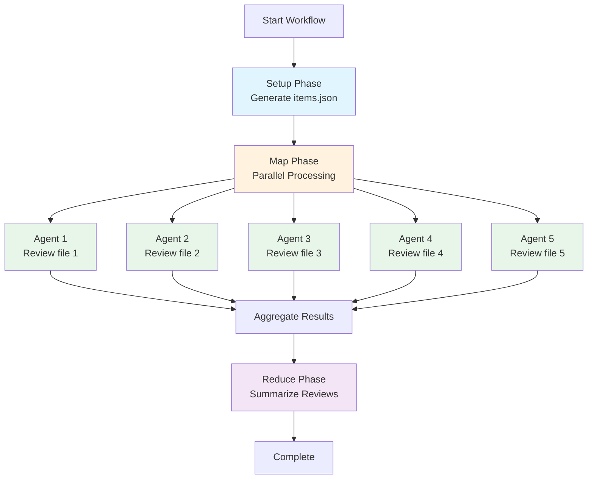

# Basic Workflows

This section covers fundamental workflow patterns for getting started with Prodigy. These examples demonstrate simple linear workflows, foreach iteration, and parallel code review.

## Example 1: Simple Build and Test

!!! example "Basic Workflow"
    This example shows a simple linear workflow with error handling. The `on_failure` handler automatically invokes Claude to fix failing tests.

```yaml
- shell: "cargo build"
- shell: "cargo test"
  on_failure:
    claude: "/fix-failing-tests"
- shell: "cargo clippy"
```

---

## Example 2: Foreach Iteration

```yaml
# Test multiple configurations in sequence
- foreach:
    - rust-version: "1.70"
      profile: debug
    - rust-version: "1.71"
      profile: release
    - rust-version: "stable"
      profile: release
  do:
    - shell: "rustup install ${foreach.item.rust-version}"
    - shell: "cargo +${foreach.item.rust-version} build --profile ${foreach.item.profile}"
    - shell: "cargo +${foreach.item.rust-version} test"

# Parallel foreach with error handling
- foreach:
    - "web-service"
    - "api-gateway"
    - "worker-service"
  parallel: 3  # Options: false (sequential), true (default parallelism), or number (specific count)
  continue_on_error: true
  max_items: 10  # (1)!
  do:
    - shell: "cd services/${foreach.item} && cargo build"
    - shell: "cd services/${foreach.item} && cargo test"
      on_failure:
        claude: "/fix-service-tests ${foreach.item}"

1. Limit processing to first N items - useful for testing or sampling large datasets
```

!!! tip "Workflow-Level Error Policy"
    For consistent error handling across all commands, use the `error_policy` field at the workflow level:
    ```yaml
    # Source: src/config/mapreduce.rs:55-77
    error_policy:
      on_item_failure: dlq  # dlq, retry, skip, or stop
      continue_on_failure: true
      max_failures: 10
      failure_threshold: 0.25  # Stop if >25% fail
    ```

---

## Example 3: Parallel Code Review

!!! example "MapReduce Pattern"
    This example demonstrates parallel processing using the MapReduce pattern: setup generates work items, map processes them in parallel agents, and reduce aggregates results.

```yaml
# Source: Based on examples/mapreduce-json-input.yml and examples/mapreduce-command-input.yml
name: parallel-code-review
mode: mapreduce

setup:
  - shell: "find src -name '*.rs' > files.txt"
  - shell: "jq -R -s -c 'split(\"\n\") | map(select(length > 0) | {path: .})' files.txt > items.json"

map:
  input: items.json            # (1)!
  json_path: "$[*]"            # (2)!
  agent_template:
    - claude: "/review-file ${item.path}"
      id: "review"
      capture_output: "review_result"
      capture_format: "json"
    - shell: "cargo check ${item.path}"
  max_parallel: 5              # (3)!

reduce:
  - claude: "/summarize-reviews ${map.results}"

1. JSON file produced by setup phase containing work items
2. JSONPath expression to extract items from the JSON structure
3. Number of concurrent agents processing work items in parallel
```



**Figure**: MapReduce execution flow showing setup, parallel map agents, and reduce aggregation.

**Note:** JSONPath `"$[*]"` matches all items in the root array. Since the setup phase creates an array of `{path: ...}` objects, each map agent receives an `item` object with `item.path` available for use in commands.

**Advanced JSONPath Patterns:**
- `$.items[*]` - Extract items from nested object
- `$.items[*].files[*]` - Extract from nested arrays (flattens results)
- `$.items[?(@.priority > 5)]` - Filter items by condition
- `$[?(@.severity == 'critical')]` - Filter array by field value

---

For more complex patterns including environment variables, checkpointing, and conditional execution, see [Advanced Examples](advanced-examples.md).
