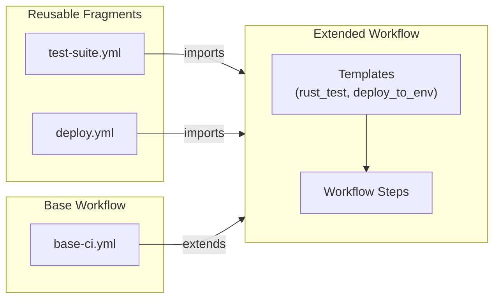
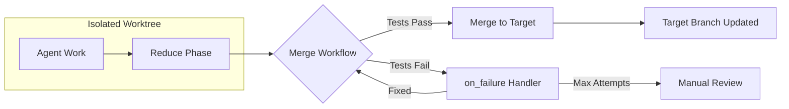

# Composition Examples

This section covers workflow composition (preview feature) and custom merge workflows.

!!! abstract "Related Documentation"
    - [Composition Guide](../composition/index.md) - Full composition documentation
    - [MapReduce Overview](../mapreduce/index.md) - MapReduce workflow concepts
    - [Git Integration](../advanced/git-integration.md) - Worktree and branch management

---

## Example 12: Workflow Composition (Preview Feature)

!!! warning "Preview Feature"
    Workflow composition features are partially implemented. Core composition logic exists but CLI integration is pending (Spec 131-133). This example shows the planned syntax.



**Figure**: Workflow composition showing imports, extends, and template usage.

```yaml title="extended-ci-workflow.yml"
# Source: Composition architecture from features.json:workflow_composition
# Import reusable workflow fragments
imports:
  - "./workflows/common/test-suite.yml"  # (1)!
  - "./workflows/common/deploy.yml"

# Extend base workflow
extends: "./workflows/base-ci.yml"  # (2)!

name: extended-ci-workflow
mode: standard

# Template for reusable command sets
templates:
  rust_test:  # (3)!
    - shell: "cargo build"
    - shell: "cargo test"
    - shell: "cargo clippy"

  deploy_to_env:
    parameters:  # (4)!
      - env_name
      - target_url
    commands:
      - shell: "echo 'Deploying to ${env_name}'"
      - shell: "curl -X POST ${target_url}/deploy"

# Use templates in workflow
steps:
  - template: rust_test
  - template: deploy_to_env
    with:
      env_name: "production"
      target_url: "${API_URL}"
```

1. **Imports** - Reuse workflow fragments from other files
2. **Extends** - Inherit from a base workflow with selective overrides
3. **Templates** - Define reusable command sets with a descriptive name
4. **Parameters** - Type-safe parameterization for template flexibility

### Planned Composition Features

| Feature | Description | Status |
|---------|-------------|--------|
| **Imports** | Reuse workflow fragments across projects | :material-check: Implemented |
| **Extends** | Inherit from base workflows with overrides | :material-check: Implemented |
| **Templates** | Parameterized command sets for DRY workflows | :material-clock-outline: Pending |
| **Parameters** | Type-safe template parameterization | :material-clock-outline: Pending |
| **CLI Integration** | Full CLI support for composition commands | :material-clock-outline: Pending (Spec 131-133) |

### Workaround Until CLI Integration

!!! tip "Use YAML Anchors"
    YAML anchors and aliases provide basic composition today without waiting for full CLI integration.

```yaml title="Current workaround using YAML anchors"
# Define reusable blocks with anchors
.rust_test: &rust_test
  - shell: "cargo build"
  - shell: "cargo test"

.deploy: &deploy
  - shell: "echo 'Deploying...'"

# Reference with aliases
workflow:
  - *rust_test
  - *deploy
```

---

## Example 13: Custom Merge Workflows

MapReduce workflows execute in isolated git worktrees. When the workflow completes, you can define a custom merge workflow to control how changes are merged back to your original branch.



```yaml title="code-review-with-merge.yml"
# Source: workflows/mapreduce-env-example.yml:83-94
name: code-review-with-merge
mode: mapreduce

# Environment variables available to merge commands
env:
  PROJECT_NAME: "my-project"
  NOTIFICATION_URL: "https://api.slack.com/webhooks/..."

setup:
  - shell: "find src -name '*.rs' > files.json"
  - shell: "jq -R -s -c 'split(\"\n\") | map(select(length > 0) | {path: .})' files.json > items.json"

map:
  input: "items.json"
  json_path: "$[*]"
  agent_template:
    - claude: "/review-code ${item.path}"
      commit_required: true
  max_parallel: 5

reduce:
  - claude: "/summarize-reviews ${map.results}"

# Custom merge workflow (executed when merging worktree back to original branch)
merge:
  commands:
    # Pre-merge validation
    - shell: "echo 'Preparing to merge ${merge.worktree}'"  # (1)!
    - shell: "echo 'Source: ${merge.source_branch} → Target: ${merge.target_branch}'"  # (2)!

    # Run tests before merging
    - shell: "cargo test --all"
      on_failure:  # (3)!
        claude: "/fix-failing-tests before merge"
        commit_required: true
        max_attempts: 2

    # Run linting
    - shell: "cargo clippy -- -D warnings"
      on_failure:
        claude: "/fix-clippy-warnings"
        commit_required: true

    # Optional: Custom validation via Claude
    - claude: "/validate-merge-readiness ${merge.source_branch} ${merge.target_branch}"

    # Actually perform the merge
    - claude: "/prodigy-merge-worktree ${merge.source_branch} ${merge.target_branch}"  # (4)!

    # Post-merge notifications (using env vars)
    - shell: "echo 'Successfully merged ${PROJECT_NAME} changes from ${merge.worktree}'"

  # Optional: Timeout for entire merge phase (seconds)
  timeout: 600  # 10 minutes
```

1. `${merge.worktree}` - Name of the worktree being merged (e.g., "session-abc123")
2. `${merge.source_branch}` and `${merge.target_branch}` - Branch names for the merge operation
3. **on_failure** handlers automatically attempt to fix issues before retrying
4. Always pass **both** source and target branches to ensure correct merge target

### Merge-Specific Variables

!!! info "Automatically Provided Variables"
    These variables are available in all merge commands without additional configuration.

| Variable | Description | Example |
|----------|-------------|---------|
| `${merge.worktree}` | Name of the worktree being merged | `session-abc123` |
| `${merge.source_branch}` | Branch in worktree | `prodigy-mapreduce-...` |
| `${merge.target_branch}` | Your original branch | `main`, `feature-xyz` |
| `${merge.session_id}` | Session ID for tracking | `abc123-def456` |

### Merge Workflow Features

=== "Pre-Merge Validation"

    Run tests, linting, or custom checks before merging:

    ```yaml
    merge:
      commands:
        - shell: "cargo test --all"
        - shell: "cargo clippy -- -D warnings"
        - claude: "/validate-merge-readiness"
    ```

=== "Environment Variables"

    Global `env` variables are available in merge commands:

    ```yaml
    env:
      PROJECT_NAME: "my-project"
      SLACK_WEBHOOK: "https://..."

    merge:
      commands:
        - shell: "echo 'Merging ${PROJECT_NAME}'"
    ```

    !!! note
        Secrets are automatically masked in merge command output.

=== "Timeout Control"

    Prevent merge workflows from hanging indefinitely:

    ```yaml
    merge:
      commands:
        - shell: "cargo test"
      timeout: 600  # 10 minutes
    ```

### Important Notes

!!! warning "Always Specify Both Branches"
    Always pass **both** `${merge.source_branch}` and `${merge.target_branch}` to `/prodigy-merge-worktree`. This ensures the merge targets your original branch, not a hardcoded `main` or `master`.

Without a custom merge workflow, you'll be prompted interactively to merge.

### Handling Merge Failures

If merge validation fails, the `on_failure` handlers attempt to fix issues automatically:

```yaml
# Source: Pattern from workflows/mapreduce-env-example.yml:83-94
- shell: "cargo test --all"
  on_failure:
    claude: "/fix-failing-tests before merge"
    commit_required: true
    max_attempts: 2
    # If tests still fail after 2 attempts, workflow stops
    # Changes remain in worktree at ~/.prodigy/worktrees/{repo_name}/{session_id}/
```

### Recovery from Failed Merge

!!! example "Manual Recovery Steps"
    If automatic recovery fails, follow these steps:

    1. Navigate to the worktree:
       ```bash
       cd ~/.prodigy/worktrees/{repo_name}/{session_id}/
       ```

    2. Fix issues manually and commit changes

    3. Resume the merge workflow:
       ```bash
       prodigy resume {session_id}
       ```

    4. Or manually merge:
       ```bash
       git checkout {target_branch} && git merge {source_branch}
       ```

### Simplified Format

If you don't need timeout configuration, use the simplified format:

```yaml title="Simplified merge configuration"
# Source: src/config/mapreduce.rs:96-124
merge:
  - shell: "cargo test"
  - claude: "/prodigy-merge-worktree ${merge.source_branch} ${merge.target_branch}"
```

This is equivalent to `merge.commands` but more concise.
