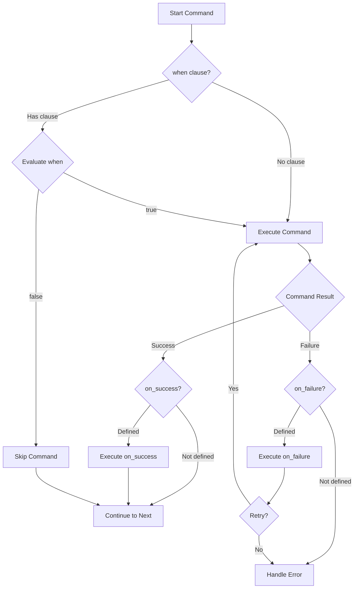
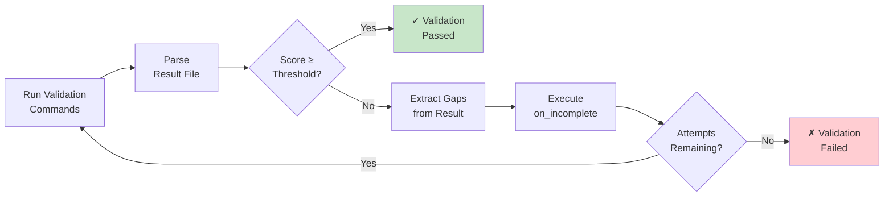
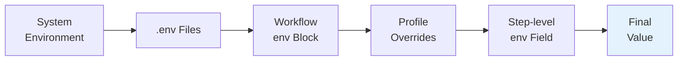

# Conditional Workflows

This section covers workflows with conditional logic, validation, and environment-aware configuration.

## Conditional Execution Flow

The diagram below shows how Prodigy evaluates conditions and handles success/failure branching:



## Example 4: Conditional Deployment

```yaml
- shell: "cargo test --quiet && echo true || echo false"
  id: "test"
  capture_output: "test_result"  # Canonical field name (alias: 'capture')
  capture_format: "boolean"  # Supported formats explained below
  timeout: 300  # Timeout in seconds (5 minutes)

- shell: "cargo build --release"
  when: "${test_result} == true"

- shell: "docker build -t myapp ."
  when: "${test_result} == true"
  on_success:
    shell: "docker push myapp:latest"
```

**Note:** `capture_format` options:
- `string` - Raw text output (default)
- `json` - Parse output as JSON object
- `lines` - Split output into array of lines
- `number` - Parse output as numeric value
- `boolean` - Parse as true/false based on exit code or output text

**Advanced capture options:**

!!! tip "Capture Streams Syntax"
    The `capture_streams` field accepts these values:

    - `"stdout"` - Capture only standard output
    - `"stderr"` - Capture only standard error
    - `"both"` - Capture both stdout and stderr (recommended)

    All options automatically include `exit_code`, `success`, and `duration` metadata.

```yaml
# Source: src/cook/orchestrator/normalization.rs - CaptureStreams handling
# Capture specific streams
- shell: "cargo build 2>&1"
  capture_output: "build_output"
  capture_streams: "both"  # Captures stdout + stderr + metadata

# Access captured values
- shell: "echo 'Exit code was ${build_output.exit_code}'"
- shell: "echo 'Duration: ${build_output.duration}ms'"
```

---

## Example 5: Multi-Step Validation

!!! note "Iterative Validation"
    Use `validate` for completion checks with targeted gap filling. The `threshold` setting and `on_incomplete` handlers provide iterative refinement.

```yaml
# Source: Validation pattern from features.json
- claude: "/implement-feature auth"
  commit_required: true
  validate:
    commands:
      - shell: "cargo test auth"
      - shell: "cargo clippy -- -D warnings"
      - claude: "/validate-implementation --output validation.json"
    result_file: "validation.json"
    threshold: 90
    on_incomplete:
      claude: "/complete-gaps ${validation.gaps}"
      commit_required: true
      max_attempts: 2
```

**Validation Lifecycle Explanation:**

The validation system follows this flow:



1. **Execute validation commands** - Run tests, linting, and custom validation scripts
2. **Parse result file** - Read `validation.json` to extract score and gaps
3. **Check threshold** - Compare score against threshold (90 in this example)
4. **Populate `validation.gaps`** - If score < threshold, extract gaps from result file
5. **Execute `on_incomplete`** - Pass gaps to Claude for targeted fixes

**Result File Format:**

!!! warning "Result File Path"
    The `result_file` path is relative to the working directory. Ensure validation commands write to the exact path specified.

The validation result file (`validation.json`) should contain:
```json
{
  "score": 75,
  "gaps": [
    "Missing tests for login endpoint",
    "No error handling for invalid tokens",
    "Documentation incomplete for auth module"
  ]
}
```

The `${validation.gaps}` variable is populated from the `gaps` array in the result file. If the result file doesn't contain a `gaps` field, validation will fail with an error.

**Alternative: Shell Script Validation**

You can also use shell scripts that output structured data:
```yaml
validate:
  commands:
    - shell: |
        # Run tests and extract missing coverage
        cargo tarpaulin --output-format json > coverage.json
        # Parse coverage and create validation result
        jq '{score: .coverage, gaps: .uncovered_files}' coverage.json > validation.json
  result_file: "validation.json"
  threshold: 80
```

**Note:** Validation provides iterative completion checking with gap filling. Use it when you want to verify completeness and have Claude fill specific gaps.

---

## Example 6: Environment-Aware Workflow

Environment variables are resolved through multiple layers, with later sources overriding earlier ones:



!!! tip "Resolution Order"
    Variables defined in later sources override earlier ones. Step-level `env` fields have the highest priority, allowing per-command customization.

```yaml
# Global environment variables (including secrets with masking)
env:
  # Regular variables
  NODE_ENV: production
  API_URL: https://api.production.com

  # Secrets (automatically masked in logs)
  # Use secret: true and value fields for sensitive data
  API_KEY:
    secret: true
    value: "${SECRET_API_KEY}"

  # Secret with external provider
  DB_PASSWORD:
    secret: true
    value: "${DB_PASSWORD}"
    # provider: "vault"  # Optional: external secret store (not yet implemented)

# Environment profiles for different contexts
profiles:
  production:
    env:
      API_URL: https://api.production.com
      LOG_LEVEL: error
    description: "Production environment with error-level logging"

  staging:
    env:
      API_URL: https://api.staging.com
      LOG_LEVEL: warn
    description: "Staging environment with warning-level logging"

# Load additional variables from .env files
# Note: Paths are relative to workflow file location
env_files:
  - .env
  - .env.production

# Workflow steps
- shell: "cargo build --release"

# Use environment variables in commands
- shell: "echo 'Deploying to ${NODE_ENV} at ${API_URL}'"

# Override environment for specific step using env field
- shell: "./deploy.sh"
  env:
    LOG_LEVEL: debug
```

**Source**: See `src/cook/environment/config.rs`: `EnvironmentConfig` struct (global config), `SecretValue` enum (secret handling)

**Note:** Profiles are activated using the `--profile <name>` CLI flag when running workflows. For example:
```bash
# Use production profile
prodigy run workflow.yml --profile production

# Use staging profile
prodigy run workflow.yml --profile staging
```

!!! warning "Never Hardcode Secrets"
    Always use `${ENV_VAR}` references for secret values. Never put actual credentials directly in workflow files, as these may be committed to version control.

**Secrets Masking**: Variables with `secret: true` are automatically masked in:
- Command output logs
- Error messages
- Event logs
- Checkpoint files

Example masked output:
```
$ echo 'API key is ***'
```

**Alternative Secrets Syntax (Legacy)**:

Both modern and legacy secret syntaxes are supported:

```yaml
# Modern approach (recommended)
env:
  API_KEY:
    secret: true
    value: "${SECRET_KEY}"

# Legacy approach (still supported)
secrets:
  API_KEY:
    provider: env
    key: "SECRET_KEY"
```

The modern `env`-based approach is recommended for consistency, but legacy workflows using the top-level `secrets:` field continue to work.

**Source**: See `src/cook/environment/config.rs`: `EnvironmentConfig`, `SecretValue`, `EnvProfile` types. Example workflow: `workflows/mapreduce-env-example.yml`
