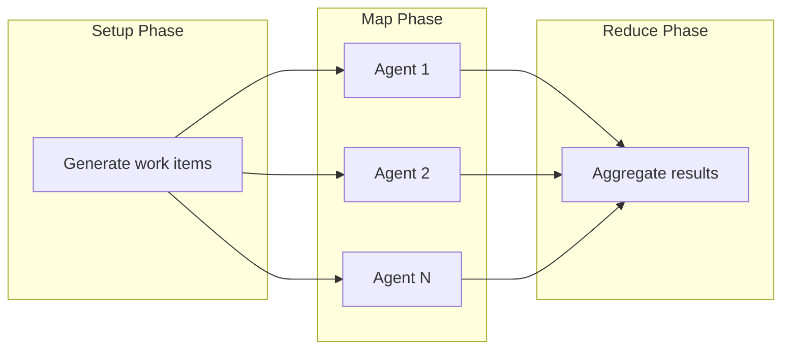
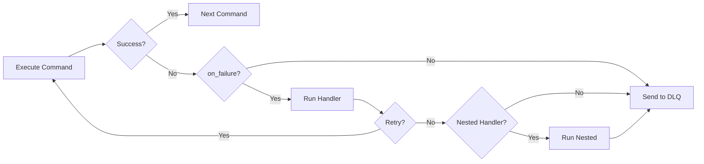

# MapReduce Examples

This section covers MapReduce workflows with error handling and configuration file generation.

## MapReduce Phase Flow



The MapReduce workflow executes in three phases:

1. **Setup**: Generates work items (typically a JSON file)
2. **Map**: Processes items in parallel using isolated agent worktrees
3. **Reduce**: Aggregates results and performs final operations

## Example 7: Complex MapReduce with Error Handling

!!! warning "Resource Management"
    Setting `max_parallel` too high can exhaust system resources (CPU, memory, file handles). Start with 5-10 concurrent agents and monitor resource usage before increasing.

```yaml
# Source: Combines patterns from src/config/mapreduce.rs and workflows/debtmap-reduce.yml
name: tech-debt-elimination
mode: mapreduce

setup:
  - shell: "debtmap analyze . --output debt.json"

map:
  input: debt.json                          # (1)!
  json_path: "$.items[*]"                   # (2)!
  filter: "item.severity == 'critical'"     # (3)!
  sort_by: "item.priority DESC"             # (4)!
  max_items: 20                             # (5)!
  max_parallel: 5                           # (6)!
  distinct: "item.id"                       # (7)!

  # Timeout configuration (optional - default is 600 seconds / 10 minutes)
  # See docs/advanced/timeout-configuration.md for full options
  timeout_config:
    agent_timeout_secs: 600                 # (8)!
    cleanup_grace_period_secs: 30           # (9)!
    timeout_policy: PerAgent                # Options: PerAgent, PerCommand, Hybrid
    timeout_action: Dlq                     # Options: Dlq, Skip, Fail, GracefulTerminate

  agent_template:
    - claude: "/fix-debt-item '${item.description}'"
      commit_required: true
    - shell: "cargo test"
      on_failure:
        claude: "/debug-and-fix"

reduce:
  - shell: "debtmap analyze . --output debt-after.json"
  - claude: "/compare-debt-reports --before debt.json --after debt-after.json"

error_policy:
  on_item_failure: dlq                      # (10)!
  continue_on_failure: true                 # (11)!
  max_failures: 5                           # (12)!
  failure_threshold: 0.3                    # (13)!
  error_collection: aggregate               # (14)!

1. JSON file containing work items from setup phase
2. JSONPath to extract work items from the JSON structure
3. Only process items matching this condition (severity == 'critical')
4. Process high-priority items first
5. Limit to first 20 items (after filtering and sorting)
6. Run up to 5 agents concurrently
7. Prevent duplicate processing based on item.id field
8. Maximum time per agent (10 minutes default)
9. Extra time allowed for cleanup operations after timeout
10. Send failed items to Dead Letter Queue for retry
11. Continue processing remaining items when one fails
12. Stop workflow after 5 total failures
13. Stop workflow if >30% of items fail
14. Aggregate errors and report at end
```

!!! tip "Advanced Timeout Configuration"
    For per-command timeouts and more granular control, see [Timeout Configuration](../advanced/timeout-configuration.md). You can configure `command_timeouts` for specific commands and choose different `timeout_action` behaviors.

### on_failure Syntax

The `on_failure` field accepts a **single command** (either `shell:` or `claude:`), not an array of commands.



=== "Simple Handler"
    ```yaml
    on_failure:
      claude: "/fix-command"
      # or
      shell: "echo 'Fixing...'"
      max_attempts: 3       # Optional: retry the on_failure handler
      commit_required: true # Optional: require commit after fixing
    ```

=== "Nested Handlers"
    For multiple failure recovery steps, nest handlers:
    ```yaml
    # Source: Pattern from workflows/implement-with-tests.yml:36-39
    - shell: "cargo test"
      on_failure:
        claude: "/fix-tests"
        commit_required: true
        on_failure:
          # Nested handler for second-level failure
          claude: "/fix-tests --deep-analysis"
          commit_required: true
    ```

### Error Policy Notes

The entire `error_policy` block is optional with sensible defaults. If not specified, failed items go to the Dead Letter Queue (`on_item_failure: dlq`), workflow continues despite failures (`continue_on_failure: true`), and errors are aggregated at the end (`error_collection: aggregate`). Use `max_failures` or `failure_threshold` to fail fast if too many items fail.

### Deduplication with `distinct`

The `distinct` field enables idempotent processing by preventing duplicate work items. When specified, Prodigy extracts the value of the given field (e.g., `item.id`) from each work item and ensures only unique values are processed. This is useful when:
- Input data may contain duplicates
- Resuming a workflow after adding new items
- Preventing wasted work on identical items
- Ensuring exactly-once processing semantics

Example: With `distinct: "item.id"`, if your input contains `[{id: "1", ...}, {id: "2", ...}, {id: "1", ...}]`, only items with IDs "1" and "2" will be processed (the duplicate "1" is skipped).

### Resuming MapReduce Workflows

MapReduce jobs can be resumed using either the session ID or job ID:
```bash
# Resume using session ID
prodigy resume session-mapreduce-1234567890

# Resume using job ID
prodigy resume-job mapreduce-1234567890

# Unified resume command (auto-detects ID type)
prodigy resume mapreduce-1234567890
```

**Session-Job ID Mapping**: The bidirectional mapping between session IDs and job IDs is stored in `~/.prodigy/state/{repo_name}/mappings/` and created automatically when the MapReduce workflow starts. This allows you to resume using either the session ID (e.g., `session-mapreduce-1234567890`) or the job ID (e.g., `mapreduce-1234567890`), and Prodigy will automatically find the correct checkpoint data.

**Source**: Session-job mapping implementation from MapReduce checkpoint and resume (Spec 134)

!!! tip "Dead Letter Queue (DLQ) for Failed Items"
    Failed work items are automatically sent to the DLQ for retry. Use `prodigy dlq retry <job_id>` to reprocess failed items with the same agent configuration, or `prodigy dlq show <job_id>` to inspect failure details.

### Debugging Failed Agents

When agents fail, DLQ entries include a `json_log_location` field pointing to the Claude JSON log file for debugging:

!!! example "Inspecting Failed Agent Logs"
    ```bash
    # View failed items and their log locations
    prodigy dlq show <job_id> | jq '.items[].failure_history[].json_log_location'

    # Inspect the Claude interaction for a failed agent
    cat <json_log_location> | jq
    ```

This allows you to see exactly what tools Claude invoked and why the agent failed.

---

## Example 8: Generating Configuration Files

!!! note "Content must be a string"
    The `content` field always expects a string value. For JSON/YAML formats, the content is validated and formatted according to the specified format. Use YAML block scalars (`|` or `>`) to write multi-line content.

=== "JSON"
    ```yaml
    # Source: src/config/command.rs:WriteFileConfig
    - write_file:
        path: "config/deployment.json"
        format: json
        create_dirs: true  # Create parent directories if needed
        content: |
          {
            "environment": "production",
            "api_url": "${API_URL}",
            "features": ["auth", "analytics", "notifications"],
            "timeout": 30
          }
    ```

=== "YAML"
    ```yaml
    - write_file:
        path: "config/services.yml"
        format: yaml
        content: |
          services:
            web:
              image: "myapp:latest"
              ports:
                - "8080:8080"
            database:
              image: "postgres:15"
              environment:
                POSTGRES_DB: "${DB_NAME}"
    ```

=== "Plain Text"
    ```yaml
    - write_file:
        path: "reports/summary.txt"
        format: text
        mode: "0644"  # File permissions (optional)
        content: |
          Deployment Summary
          ==================
          Environment: ${NODE_ENV}
          API URL: ${API_URL}
          Timestamp: $(date)
    ```
