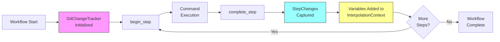

# Advanced Git Context

This chapter covers automatic git tracking and git context variables in Prodigy workflows. Learn how to access file changes, commits, and modification statistics, and how to filter and format this data using shell commands.

!!! warning "Current Implementation Status"

    Git context variables are currently provided as **space-separated strings only**. Advanced features like pattern filtering (`:*.rs`) and format modifiers (`:json`, `:lines`) are **not yet implemented** in the variable interpolation system, though the underlying infrastructure exists.

    **For filtering and formatting**, use shell post-processing commands like `grep`, `tr`, `jq`, and `xargs`. See [Shell-Based Filtering and Formatting](#shell-based-filtering-and-formatting) for practical examples.

## Overview

Prodigy automatically tracks git changes throughout workflow execution and exposes them through variables. No configuration is needed—git context variables are available out-of-the-box in any git repository. You can access file changes, commits, and modification statistics at both the step and workflow level.

**What you get:**
- Automatic tracking of all git changes during workflow execution
- Variables for step-level changes (current command) and workflow-level changes (cumulative)
- Simple space-separated format ready for shell commands
- Full integration with MapReduce workflows

## How Git Tracking Works



### Automatic Tracking

Git context is automatically tracked when you run workflows in a git repository:

- **GitChangeTracker** is initialized at workflow start (src/cook/workflow/git_context.rs)
- Each step's changes are tracked between `begin_step` and `complete_step` calls
- Variables are pre-formatted as space-separated strings and added to the interpolation context
- No YAML configuration needed—tracking happens transparently

**Technical Details** (src/cook/workflow/executor/context.rs:96-172):

When preparing the interpolation context for each command, git variables are added like this:

```rust
// Variables are pre-formatted as space-separated strings
context.set("step.files_added", Value::String(changes.files_added.join(" ")));
context.set("step.files_modified", Value::String(changes.files_modified.join(" ")));
// ... etc for all git context variables
```

This means custom formatting must be done using shell commands after variable interpolation.

### When Tracking is Active

Git tracking is active in:
- Regular workflows running in git repositories
- MapReduce setup, map, and reduce phases
- Child worktrees created for map agents

Git tracking is **not** active in:
- Non-git repositories
- Workflows without git integration

## Git Context Variables

### Step-Level Variables

Track changes made during the current step:

```yaml
# Access files changed in this step
- shell: "echo Changed: ${step.files_changed}"
- shell: "echo Added: ${step.files_added}"
- shell: "echo Modified: ${step.files_modified}"
- shell: "echo Deleted: ${step.files_deleted}"

# Access commit information
- shell: "echo Commits: ${step.commits}"
- shell: "echo Commit count: ${step.commit_count}"

# Access modification statistics
- shell: "echo Insertions: ${step.insertions}"
- shell: "echo Deletions: ${step.deletions}"
```

### Workflow-Level Variables

Track cumulative changes across all steps:

```yaml
# Access all files changed in workflow
- shell: "echo Changed: ${workflow.files_changed}"
- shell: "echo Added: ${workflow.files_added}"
- shell: "echo Modified: ${workflow.files_modified}"
- shell: "echo Deleted: ${workflow.files_deleted}"

# Access all commits
- shell: "echo Commits: ${workflow.commits}"
- shell: "echo Commit count: ${workflow.commit_count}"

# Access total modifications
- shell: "echo Insertions: ${workflow.insertions}"
- shell: "echo Deletions: ${workflow.deletions}"
```

### Variable Reference

| Variable | Scope | Description |
|----------|-------|-------------|
| `step.files_added` | Step | Files added in current step |
| `step.files_modified` | Step | Files modified in current step |
| `step.files_deleted` | Step | Files deleted in current step |
| `step.files_changed` | Step | All files changed (added + modified + deleted) |
| `step.commits` | Step | Commit SHAs from current step |
| `step.commit_count` | Step | Number of commits in current step |
| `step.insertions` | Step | Lines added in current step |
| `step.deletions` | Step | Lines deleted in current step |
| `workflow.files_added` | Workflow | All files added in workflow |
| `workflow.files_modified` | Workflow | All files modified in workflow |
| `workflow.files_deleted` | Workflow | All files deleted in workflow |
| `workflow.files_changed` | Workflow | All files changed in workflow |
| `workflow.commits` | Workflow | All commit SHAs in workflow |
| `workflow.commit_count` | Workflow | Total commits in workflow |
| `workflow.insertions` | Workflow | Total lines added in workflow |
| `workflow.deletions` | Workflow | Total lines deleted in workflow |

## Shell-Based Filtering and Formatting

Since git context variables are provided as space-separated strings, all filtering and formatting must be done using shell commands. This section shows practical patterns for common tasks.

!!! tip "Quick Reference"

    | Task | Command Pattern |
    |------|-----------------|
    | Filter by extension | `echo ${var} \| tr ' ' '\n' \| grep '\.rs$'` |
    | Convert to JSON | `echo ${var} \| tr ' ' '\n' \| jq -R \| jq -s` |
    | Convert to lines | `echo ${var} \| tr ' ' '\n'` |
    | Convert to CSV | `echo ${var} \| tr ' ' ','` |
    | Count files | `echo ${var} \| tr ' ' '\n' \| wc -l` |

### Default Format (Space-Separated)

Git context variables are always formatted as space-separated strings:

```yaml
- shell: "echo ${step.files_changed}"
# Output: src/main.rs src/lib.rs tests/test.rs
```

This format works well with most shell commands:

```yaml
# Pass directly to commands
- shell: "cargo fmt ${step.files_changed}"
- shell: "git add ${workflow.files_modified}"

# Use in loops
- shell: |
    for file in ${step.files_added}; do
      echo "Processing $file"
    done
```

### Filtering by File Extension

Use `grep` to filter files by extension or pattern:

```yaml
# Only Rust files
- shell: |
    rust_files=$(echo "${step.files_changed}" | tr ' ' '\n' | grep '\.rs$')
    echo "$rust_files"
# Output:
# src/main.rs
# src/lib.rs

# Only files in src/ directory
- shell: |
    src_files=$(echo "${step.files_changed}" | tr ' ' '\n' | grep '^src/')
    echo "$src_files"

# Multiple extensions (Rust or TOML)
- shell: |
    filtered=$(echo "${step.files_modified}" | tr ' ' '\n' | grep -E '\.(rs|toml)$')
    echo "$filtered"

# Pass filtered files to a command
- shell: |
    rust_files=$(echo "${step.files_changed}" | tr ' ' '\n' | grep '\.rs$' | tr '\n' ' ')
    if [ -n "$rust_files" ]; then
      cargo fmt $rust_files
    fi
```

### Converting to JSON Format

Use `jq` to convert space-separated files to JSON arrays:

```yaml
# Convert to JSON array
- shell: "echo ${step.files_added} | tr ' ' '\n' | jq -R | jq -s"
# Output: ["src/main.rs","src/lib.rs","tests/test.rs"]

# Filter AND convert to JSON
- shell: |
    echo "${step.files_changed}" | tr ' ' '\n' | grep '\.rs$' | jq -R | jq -s
# Output: ["src/main.rs","src/lib.rs"]

# Pretty-print JSON
- shell: |
    echo "${workflow.files_modified}" | tr ' ' '\n' | jq -R | jq -s '.'
```

### Converting to Newline-Separated Format

Use `tr` to convert space-separated to newline-separated:

```yaml
# One file per line
- shell: "echo ${step.files_changed} | tr ' ' '\n'"
# Output:
# src/main.rs
# src/lib.rs
# tests/test.rs

# Useful with xargs for parallel processing
- shell: |
    echo "${workflow.files_modified}" | tr ' ' '\n' | xargs -I {} cp {} backup/

# Count files
- shell: "echo ${step.files_added} | tr ' ' '\n' | wc -l"
```

### Converting to CSV Format

Use `tr` to convert to comma-separated values:

```yaml
# Comma-separated
- shell: "echo ${step.files_added} | tr ' ' ','"
# Output: src/main.rs,src/lib.rs,tests/test.rs

# CSV with filtering
- shell: |
    echo "${step.files_changed}" | tr ' ' '\n' | grep '\.md$' | tr '\n' ',' | sed 's/,$//'
# Output: README.md,CHANGELOG.md
```

### Combining Filtering and Formatting

Practical examples combining multiple operations:

```yaml
# Get Rust files as JSON
- shell: |
    echo "${step.files_changed}" | tr ' ' '\n' | grep '\.rs$' | jq -R | jq -s

# Get source files as comma-separated list
- shell: |
    echo "${workflow.files_modified}" | tr ' ' '\n' | grep '^src/' | tr '\n' ',' | sed 's/,$//'

# Count files by extension
- shell: |
    echo "${workflow.files_changed}" | tr ' ' '\n' | sed 's/.*\.//' | sort | uniq -c
# Output:
#    5 md
#    12 rs
#    3 toml
```

## Use Cases

### Code Review Workflows

Review only source code changes using shell filtering:

```yaml
# Filter to only Rust source files before review
- shell: |
    rust_files=$(echo "${step.files_changed}" | tr ' ' '\n' | grep '^src/.*\.rs$' | tr '\n' ' ')
    if [ -n "$rust_files" ]; then
      echo "Rust files changed: $rust_files"
    fi

# Pass filtered files to Claude for review
- shell: |
    src_changes=$(echo "${step.files_changed}" | tr ' ' '\n' | grep '^src/')
    if [ -n "$src_changes" ]; then
      echo "$src_changes" > /tmp/review-files.txt
      # Then use /tmp/review-files.txt in your review command
    fi

- shell: "echo Reviewing ${step.commit_count} commits"
```

### Documentation Updates

Work with documentation changes using filtering:

```yaml
# Find markdown files that changed
- shell: |
    md_files=$(echo "${workflow.files_changed}" | tr ' ' '\n' | grep '\.md$' | tr '\n' ' ')
    if [ -n "$md_files" ]; then
      echo "Documentation files changed: $md_files"
      markdownlint $md_files
    fi

# List changed docs in newline format
- shell: |
    echo "${workflow.files_modified}" | tr ' ' '\n' | grep '\.md$'

# Check if any docs were updated
- shell: |
    doc_count=$(echo "${workflow.files_changed}" | tr ' ' '\n' | grep '\.md$' | wc -l)
    if [ "$doc_count" -gt 0 ]; then
      echo "Documentation was updated ($doc_count files)"
    fi
```

### Test Verification

Focus on test-related changes:

```yaml
# Run tests for changed test files
- shell: |
    test_files=$(echo "${step.files_changed}" | tr ' ' '\n' | grep '_test\.rs$' | tr '\n' ' ')
    if [ -n "$test_files" ]; then
      cargo test $test_files
    fi

# Verify test coverage for new files in tests/
- shell: |
    new_tests=$(echo "${step.files_added}" | tr ' ' '\n' | grep '^tests/')
    if [ -n "$new_tests" ]; then
      echo "New test files added:"
      echo "$new_tests"
      # Run coverage analysis
    fi
```

### Conditional Execution

Use git context with shell conditions:

```yaml
# Only run clippy if Rust files changed
- shell: |
    has_rust=$(echo "${step.files_changed}" | tr ' ' '\n' | grep '\.rs$')
    if [ -n "$has_rust" ]; then
      cargo clippy
    fi

# Run different linters based on file types
- shell: |
    if echo "${workflow.files_changed}" | tr ' ' '\n' | grep -q '\.rs$'; then
      cargo fmt --check
    fi

    if echo "${workflow.files_changed}" | tr ' ' '\n' | grep -q '\.md$'; then
      markdownlint **/*.md
    fi

# Check commit count
- shell: |
    if [ "${step.commit_count}" -gt 1 ]; then
      echo "Multiple commits detected (${step.commit_count})"
    fi
```

### MapReduce Workflows

!!! example "Git Context Across Phases"

    In MapReduce workflows, git tracking operates at multiple levels:

    - **Setup phase**: Workflow-level tracking begins
    - **Map agents**: Each agent has independent step-level tracking in its worktree
    - **Reduce phase**: Workflow-level variables reflect cumulative changes from all agents

Git context works across MapReduce phases:

```yaml
name: review-changes
mode: mapreduce

setup:
  # Workflow-level tracking starts here
  - shell: "git diff main --name-only > changed-files.txt"
  - shell: "echo Setup modified: ${step.files_changed}"

map:
  input: "changed-files.txt"
  agent_template:
    # Each agent has its own step tracking
    - claude: "/review ${item}"
    - shell: "echo Agent changed: ${step.files_changed}"

reduce:
  # Access workflow-level changes from all agents
  - shell: "echo Total changes: ${workflow.files_changed}"
  - shell: "echo Total commits: ${workflow.commit_count}"
```

## Best Practices

- **Use Shell Filtering**: Filter variables to only relevant files using `grep`, `tr`, and other shell utilities
- **Choose Appropriate Format**: Convert to JSON with `jq`, newlines with `tr`, or CSV for different use cases
- **Scope Appropriately**: Use `step.*` for current changes, `workflow.*` for cumulative tracking
- **Handle Empty Results**: Always check if filtered results are non-empty before using them
- **Test Your Filters**: Debug with `echo` commands to verify filtering works as expected
- **Document Intent**: Add comments explaining complex shell filtering pipelines
- **Combine Operations**: Chain `tr`, `grep`, and `jq` for powerful filtering and formatting

## Performance Considerations

- Git operations are performed once per step and cached (src/cook/workflow/git_context.rs)
- Variables are pre-formatted when added to the interpolation context
- Shell filtering happens at runtime, so complex filters may add overhead
- Workflow-level tracking maintains cumulative state without re-scanning git history
- Variable resolution is fast since values are pre-computed strings

## Troubleshooting

### Filter Not Matching Any Files

**Issue**: Your grep filter doesn't match any files

```yaml
# Debug: Echo the unfiltered variable first
- shell: "echo All files: ${step.files_changed}"
- shell: |
    filtered=$(echo "${step.files_changed}" | tr ' ' '\n' | grep '\.rs$')
    echo "Filtered: $filtered"
```

**What happens**: When a filter matches no files, the variable is empty. This is expected behavior.

**Solution**: Always check if filtered results are non-empty:

```yaml
- shell: |
    rust_files=$(echo "${step.files_changed}" | tr ' ' '\n' | grep '\.rs$' | tr '\n' ' ')
    if [ -n "$rust_files" ]; then
      cargo fmt $rust_files
    else
      echo "No Rust files changed"
    fi
```

### Empty Git Context Variables

**Issue**: Git context variables are empty

**Possible causes:**
- Not running in a git repository
- No commits have been made in the current step
- Git tracking not initialized

**Solution**: Verify git tracking is active:

```yaml
# Check if variables are populated
- shell: |
    echo "Step files changed: ${step.files_changed}"
    echo "Workflow files changed: ${workflow.files_changed}"
    echo "Commit count: ${step.commit_count}"
```

If all are empty, check:
1. Are you in a git repository? (`git status`)
2. Has the step made any commits yet?
3. Is git tracking active for this workflow type?

### Pattern Syntax Not Working

!!! danger "Pattern Modifiers Are Not Implemented"

    Variable modifiers like `:*.rs`, `:json`, and `:lines` are **not supported** in workflow variable interpolation. Attempting to use them will produce literal strings or errors.

**Issue**: Trying to use `:*.rs` or `:json` modifiers produces errors or unexpected results

**Cause**: Pattern filtering and format modifiers are **not implemented** in variable interpolation. Git context variables are always space-separated strings.

**What you tried** (doesn't work):
```yaml
# These do NOT work - modifiers not implemented
- shell: "echo ${step.files_changed:*.rs}"
- shell: "echo ${step.files_added:json}"
- shell: "echo ${workflow.files_modified:lines}"
```

**Solution**: Use shell commands for all filtering and formatting:

=== "Filter by Extension"

    ```yaml
    # Filter with grep
    - shell: "echo ${step.files_changed} | tr ' ' '\n' | grep '\.rs$'"
    ```

=== "Format as JSON"

    ```yaml
    # Format as JSON array
    - shell: "echo ${step.files_added} | tr ' ' '\n' | jq -R | jq -s"
    ```

=== "Format as Lines"

    ```yaml
    # Convert to newline-separated
    - shell: "echo ${workflow.files_modified} | tr ' ' '\n'"
    ```

See [Shell-Based Filtering and Formatting](#shell-based-filtering-and-formatting) for complete examples.

### Variables Not Interpolating

**Issue**: Variables appear as literal strings like `${step.files_changed}`

**Possible causes:**
- Variable name misspelled
- Using unsupported variable
- YAML quoting issues

**Solution**: Verify the variable name and use proper quoting:

```yaml
# Correct syntax
- shell: "echo ${step.files_changed}"
- shell: |
    echo "${workflow.files_modified}"
```

### Shell Filtering Complexity

**Issue**: Shell filtering pipelines are getting too complex

**Solution**: Extract complex filtering to separate shell scripts:

```yaml
# Create a helper script
- shell: |
    cat > /tmp/filter-rust.sh <<'EOF'
    #!/bin/bash
    echo "$1" | tr ' ' '\n' | grep '\.rs$' | tr '\n' ' '
    EOF
    chmod +x /tmp/filter-rust.sh

# Use the helper
- shell: |
    rust_files=$(/tmp/filter-rust.sh "${step.files_changed}")
    if [ -n "$rust_files" ]; then
      cargo clippy $rust_files
    fi
```

## Future Enhancements

!!! note "Infrastructure Status"

    The git context implementation includes internal methods for pattern filtering and format modifiers. These capabilities exist in the codebase but are **not currently exposed** to workflow variable interpolation. There is no confirmed timeline for enabling these features.

The following sections document internal capabilities that may be exposed in future releases.

### Pattern Filtering

!!! info "Status: Internal Only"

    The `GitChangeTracker::resolve_variable()` method exists in the codebase but is not called during workflow execution.

The internal `resolve_variable` method (src/cook/workflow/git_context.rs:489-505) supports pattern filtering syntax. If exposed, it would enable:

```yaml title="Conceptual syntax (not implemented)"
# These patterns are recognized internally but NOT available in workflows
- shell: "echo ${step.files_changed:*.rs}"
- shell: "echo ${workflow.files_modified:src/**/*.rs}"
```

Currently, variables are pre-formatted as space-separated strings during interpolation context creation (src/cook/workflow/executor/context.rs:106-172), bypassing this method.

### Format Modifiers

!!! info "Status: Internal Only"

    The `GitChangeTracker::format_file_list()` method exists but is not used during variable resolution.

The internal `format_file_list` method (src/cook/workflow/git_context.rs:477-486) supports multiple output formats. If exposed, it would enable:

```yaml title="Conceptual syntax (not implemented)"
# These modifiers are recognized internally but NOT available in workflows
- shell: "echo ${step.files_added:json}"
- shell: "echo ${workflow.files_changed:lines}"
- shell: "echo ${step.files_modified:csv}"
```

### What This Means for Users

To enable these features in workflows, the interpolation engine would need modification to support custom resolvers that call `git_tracker.resolve_variable()` instead of using pre-formatted string values.

!!! tip "Recommended Approach"

    Use shell post-processing for all filtering and formatting needs. This approach is flexible, well-documented, and works reliably. See [Shell-Based Filtering and Formatting](#shell-based-filtering-and-formatting) for complete examples.
