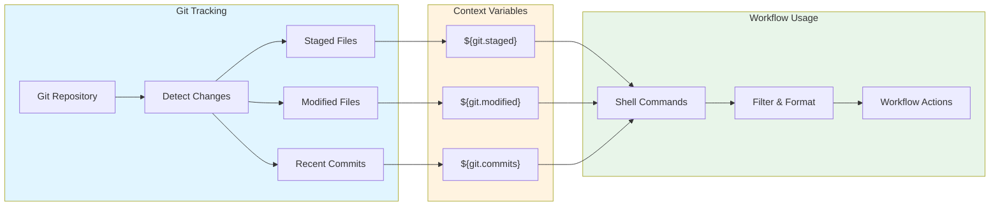

# Advanced Git Context

This chapter covers automatic git tracking and git context variables in Prodigy workflows. Learn how to access file changes, commits, and modification statistics, and how to filter and format this data using shell commands.

!!! warning "Current Implementation Status"

    Git context variables are currently provided as **space-separated strings only**. Advanced features like pattern filtering (`:*.rs`) and format modifiers (`:json`, `:lines`) are **not yet implemented** in the variable interpolation system, though the underlying infrastructure exists.

    **For filtering and formatting**, use shell post-processing commands like `grep`, `tr`, `jq`, and `xargs`. See [Shell-Based Filtering and Formatting](shell-filtering.md) for practical examples.

!!! tip "Quick Start"

    Start with the [Overview](overview.md) to understand available variables, then see [Shell-Based Filtering](shell-filtering.md) for practical usage patterns.

## How Git Context Works

**Figure**: Git context flow from repository tracking through variable interpolation to workflow usage.

## Contents

- :material-book-open-variant: [Overview](overview.md) - How git tracking works and available variables
- :material-console: [Shell-Based Filtering and Formatting](shell-filtering.md) - Filter and format git context using shell commands
- :material-lightbulb-on: [Use Cases](use-cases.md) - Practical workflow patterns for code review, documentation, and testing
- :material-check-circle: [Best Practices](best-practices.md) - Performance tips, troubleshooting, and future features
