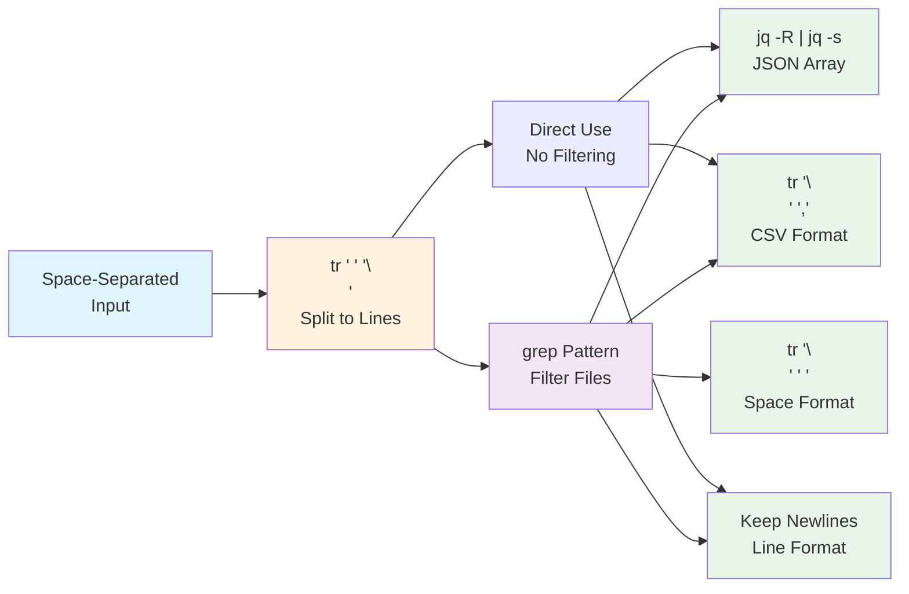

# Shell-Based Filtering and Formatting

Since git context variables are provided as space-separated strings, all filtering and formatting must be done using shell commands. This section shows practical patterns for common tasks.

For variable definitions, see the [Git Context Overview](index.md).

## Transformation Pipeline

The following diagram shows the common transformation paths for git context variables:



**Figure**: Transformation pipeline showing how to convert git context variables to different output formats.

## Default Format (Space-Separated)

Git context variables are always formatted as space-separated strings:

!!! warning "Handle Empty Variables"
    Always check if variables are non-empty before passing to commands. An empty
    variable can cause unexpected behavior or errors:

    ```bash
    if [ -n "${step.files_changed}" ]; then
      cargo fmt ${step.files_changed}
    fi
    ```

```yaml
- shell: "echo ${step.files_changed}"
# Output: src/main.rs src/lib.rs tests/test.rs
```

This format works well with most shell commands:

```yaml
# Pass directly to commands
- shell: "cargo fmt ${step.files_changed}"
- shell: "git add ${workflow.files_modified}"

# Use in loops
- shell: |
    for file in ${step.files_added}; do
      echo "Processing $file"
    done
```

## Filtering by File Extension

Use `grep` to filter files by extension or pattern:

!!! tip "Filtering Multiple Extensions"
    Use `grep -E` (extended regex) to match multiple file extensions in a single pattern.
    This is more efficient than chaining multiple `grep` commands.

```yaml
# Only Rust files
- shell: |
    rust_files=$(echo "${step.files_changed}" | tr ' ' '\n' | grep '\.rs$')
    echo "$rust_files"
# Output:
# src/main.rs
# src/lib.rs

# Only files in src/ directory
- shell: |
    src_files=$(echo "${step.files_changed}" | tr ' ' '\n' | grep '^src/')
    echo "$src_files"

# Multiple extensions (Rust or TOML)
- shell: |
    filtered=$(echo "${step.files_modified}" | tr ' ' '\n' | grep -E '\.(rs|toml)$')
    echo "$filtered"

# Pass filtered files to a command
- shell: |
    rust_files=$(echo "${step.files_changed}" | tr ' ' '\n' | grep '\.rs$' | tr '\n' ' ')
    if [ -n "$rust_files" ]; then
      cargo fmt $rust_files
    fi
```

## Converting to JSON Format

Use `jq` to convert space-separated files to JSON arrays:

!!! info "Understanding the jq Pipeline"
    The pattern `jq -R | jq -s` works in two stages:

    - `jq -R` reads each line as a raw string (not parsed as JSON)
    - `jq -s` collects all inputs into a single array

    Together, they convert newline-separated text into a JSON array of strings.

```yaml
# Convert to JSON array
- shell: "echo ${step.files_added} | tr ' ' '\n' | jq -R | jq -s"
# Output: ["src/main.rs","src/lib.rs","tests/test.rs"]

# Filter AND convert to JSON
- shell: |
    echo "${step.files_changed}" | tr ' ' '\n' | grep '\.rs$' | jq -R | jq -s
# Output: ["src/main.rs","src/lib.rs"]

# Pretty-print JSON
- shell: |
    echo "${workflow.files_modified}" | tr ' ' '\n' | jq -R | jq -s '.'
```

## Converting to Newline-Separated Format

Use `tr` to convert space-separated to newline-separated:

!!! note "Parallel Processing with xargs"
    When processing many files, `xargs -P` can run commands in parallel:

    ```bash
    echo "${files}" | tr ' ' '\n' | xargs -P 4 -I {} process {}
    ```

    The `-P 4` flag runs up to 4 processes concurrently. See
    [Best Practices](best-practices.md) for performance tips.

```yaml
# One file per line
- shell: "echo ${step.files_changed} | tr ' ' '\n'"
# Output:
# src/main.rs
# src/lib.rs
# tests/test.rs

# Useful with xargs for parallel processing
- shell: |
    echo "${workflow.files_modified}" | tr ' ' '\n' | xargs -I {} cp {} backup/

# Count files
- shell: "echo ${step.files_added} | tr ' ' '\n' | wc -l"
```

## Converting to CSV Format

Use `tr` to convert to comma-separated values:

```yaml
# Comma-separated
- shell: "echo ${step.files_added} | tr ' ' ','"
# Output: src/main.rs,src/lib.rs,tests/test.rs

# CSV with filtering
- shell: |
    echo "${step.files_changed}" | tr ' ' '\n' | grep '\.md$' | tr '\n' ',' | sed 's/,$//'
# Output: README.md,CHANGELOG.md
```

## Combining Filtering and Formatting

Practical examples combining multiple operations:

```yaml
# Get Rust files as JSON
- shell: |
    echo "${step.files_changed}" | tr ' ' '\n' | grep '\.rs$' | jq -R | jq -s

# Get source files as comma-separated list
- shell: |
    echo "${workflow.files_modified}" | tr ' ' '\n' | grep '^src/' | tr '\n' ',' | sed 's/,$//'

# Count files by extension
- shell: |
    echo "${workflow.files_changed}" | tr ' ' '\n' | sed 's/.*\.//' | sort | uniq -c
# Output:
#    5 md
#    12 rs
#    3 toml
```

For more patterns and optimization techniques, see [Use Cases](use-cases.md).
