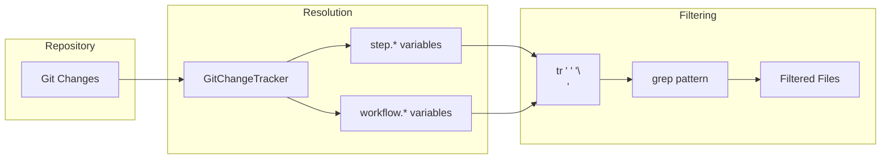
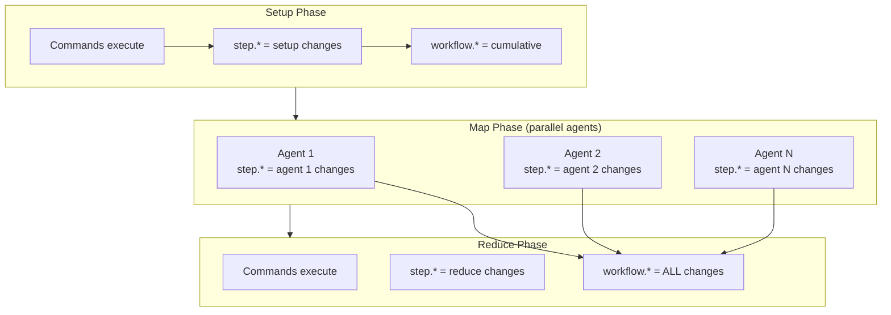

# Git Context Use Cases

This page covers practical workflow patterns using git context variables for code review, documentation, testing, and MapReduce workflows.

!!! tip "Shell Filtering for File Patterns"
    Git context variables return space-separated file lists. Use shell filtering with `tr` and `grep` to select specific file types. See [Shell Filtering](shell-filtering.md) for detailed patterns. For variable reference, see [Overview](overview.md).



## Code Review Workflows

Review only source code changes using shell filtering:

=== "Filter Rust Files"

    ```yaml
    # Filter to only Rust source files before review
    - shell: |
        rust_files=$(echo "${step.files_changed}" | tr ' ' '\n' | grep '^src/.*\.rs$' | tr '\n' ' ')
        if [ -n "$rust_files" ]; then
          echo "Rust files changed: $rust_files"
        fi
    ```

=== "Filter Source Directory"

    ```yaml
    # Pass filtered files to Claude for review
    - shell: |
        src_changes=$(echo "${step.files_changed}" | tr ' ' '\n' | grep '^src/')
        if [ -n "$src_changes" ]; then
          echo "$src_changes" > /tmp/review-files.txt
          # Then use /tmp/review-files.txt in your review command
        fi
    ```

=== "Show Commit Count"

    ```yaml
    - shell: "echo Reviewing ${step.commit_count} commits"
    ```

## Documentation Updates

Work with documentation changes using filtering:

```yaml
# Find markdown files that changed
- shell: |
    md_files=$(echo "${workflow.files_changed}" | tr ' ' '\n' | grep '\.md$' | tr '\n' ' ')
    if [ -n "$md_files" ]; then
      echo "Documentation files changed: $md_files"
      markdownlint $md_files
    fi

# List changed docs in newline format
- shell: |
    echo "${workflow.files_modified}" | tr ' ' '\n' | grep '\.md$'

# Check if any docs were updated
- shell: |
    doc_count=$(echo "${workflow.files_changed}" | tr ' ' '\n' | grep '\.md$' | wc -l)
    if [ "$doc_count" -gt 0 ]; then
      echo "Documentation was updated ($doc_count files)"
    fi
```

## Test Verification

Focus on test-related changes:

```yaml
# Run tests for changed test files
- shell: |
    test_files=$(echo "${step.files_changed}" | tr ' ' '\n' | grep '_test\.rs$' | tr '\n' ' ')
    if [ -n "$test_files" ]; then
      cargo test $test_files
    fi

# Verify test coverage for new files in tests/
- shell: |
    new_tests=$(echo "${step.files_added}" | tr ' ' '\n' | grep '^tests/')
    if [ -n "$new_tests" ]; then
      echo "New test files added:"
      echo "$new_tests"
      # Run coverage analysis
    fi
```

## Conditional Execution

Use git context with shell conditions:

```yaml
# Only run clippy if Rust files changed
- shell: |
    has_rust=$(echo "${step.files_changed}" | tr ' ' '\n' | grep '\.rs$')
    if [ -n "$has_rust" ]; then
      cargo clippy
    fi

# Run different linters based on file types
- shell: |
    if echo "${workflow.files_changed}" | tr ' ' '\n' | grep -q '\.rs$'; then
      cargo fmt --check
    fi

    if echo "${workflow.files_changed}" | tr ' ' '\n' | grep -q '\.md$'; then
      markdownlint **/*.md
    fi

# Check commit count
- shell: |
    if [ "${step.commit_count}" -gt 1 ]; then
      echo "Multiple commits detected (${step.commit_count})"
    fi
```

!!! note "Empty Result Handling"
    Always check for empty results before processing. The `[ -n "$var" ]` test prevents errors when no files match your filter pattern.

## MapReduce Workflows

Git context works across MapReduce phases with different scoping:



```yaml
name: review-changes
mode: mapreduce

setup:
  # Workflow-level tracking starts here
  - shell: "git diff main --name-only > changed-files.txt"
  - shell: "echo Setup modified: ${step.files_changed}"

map:
  input: "changed-files.txt"
  agent_template:
    # Each agent has its own step tracking
    - claude: "/review ${item}"
    - shell: "echo Agent changed: ${step.files_changed}"

reduce:
  # Access workflow-level changes from all agents
  - shell: "echo Total changes: ${workflow.files_changed}"
  - shell: "echo Total commits: ${workflow.commit_count}"
```

For more on MapReduce workflows, see the [MapReduce documentation](../mapreduce/index.md).

## Related Pages

- [Shell Filtering](shell-filtering.md) - Detailed filtering patterns
- [Best Practices](best-practices.md) - Performance and troubleshooting
- [Overview](overview.md) - Variable reference
