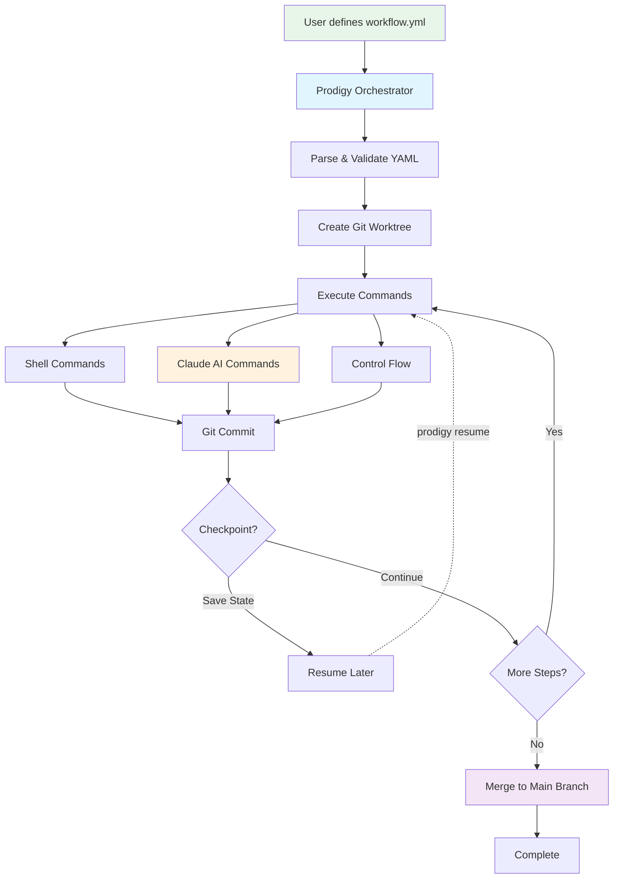

# Introduction

Prodigy is an AI-powered workflow orchestration tool that enables development teams to automate complex tasks using Claude AI through structured YAML workflows.

## What is Prodigy?

Prodigy combines the power of Claude AI with workflow orchestration to:

- **Automate repetitive development tasks** - Code reviews, refactoring, testing
- **Process work in parallel** - MapReduce-style parallel execution across git worktrees
- **Resume long-running operations** - Checkpoint and resume capabilities for workflows that span hours or days
- **Handle failures gracefully** - Dead Letter Queue (DLQ) for automated retry of failed items
- **Maintain quality** - Built-in validation, error handling, and retry mechanisms
- **Track changes** - Full git integration with automatic commits and merge workflows
- **Generate living documentation** - Keep docs synchronized with code automatically
- **Compose complex workflows** - Import, extend, and template reusable workflow components



**Figure**: Prodigy workflow execution showing orchestration, isolation, and checkpoint/resume capability.

!!! tip "Production-Ready Features"
    Prodigy includes enterprise features like checkpoints for resuming interrupted workflows, a Dead Letter Queue for automatic failure recovery, and git worktree isolation to keep your main repository clean during execution.

## Quick Start

!!! example "Your First Workflow"
    Start with a simple build-test cycle to see Prodigy in action. This example shows the simplified array syntax for straightforward workflows.

Create a simple workflow in `workflow.yml`:

```yaml
# Source: workflows/complex-build-pipeline.yml (simplified)
# Simplified array syntax - use this for straightforward workflows
- shell: "cargo build"                    # (1)!
- shell: "cargo test"                     # (2)!
  on_failure:
    claude: "/fix-failing-tests"          # (3)!
- shell: "cargo clippy"                   # (4)!

1. Build the project
2. Run tests
3. If tests fail, Claude automatically attempts fixes
4. Run linting checks
```

!!! note "Syntax Options"
    This example uses the simplified array syntax for simple workflows. For more complex workflows with parallel execution, MapReduce, or advanced features, use the [full workflow structure](workflow-basics/index.md) with `name`, `mode`, and other configuration fields.

Run it:

```bash
prodigy run workflow.yml
```

## Documentation Features

This book itself is maintained using Prodigy's automated documentation system! Learn how to set up automated, always-up-to-date documentation for your own project:

- [Automated Documentation Overview](automated-documentation/index.md) - How it works
- [Quick Start (15 minutes)](automated-documentation/quick-start.md) - Fast setup
- [Tutorial (30 minutes)](automated-documentation/tutorial.md) - Comprehensive guide

## Key Concepts

- **Workflows**: YAML files defining sequences of commands
- **Commands**: Shell commands, Claude AI invocations, or control flow
- **Variables**: Capture output from commands and use throughout workflow with `${VAR}` syntax. Supports nested fields, defaults, and environment variables. See [Environment Variables](environment/index.md) for details
- **Environment**: Configuration with secrets management and profile-based values
- **MapReduce**: Parallel processing across multiple git worktrees
- **Checkpoints**: Save and resume workflow state for long-running operations
- **Validation**: Workflow structure and syntax validation, implementation completeness checking with the validate command, and runtime validation. See [Command Types](commands.md) for details
- **Observability**: Event tracking, Claude execution logs, and comprehensive debugging tools

!!! tip "Start Simple, Scale Up"
    Begin with simple sequential workflows to learn the basics, then progress to MapReduce for parallel processing when you need to handle 10+ similar tasks concurrently.

## Next Steps

**Getting Started:**

- [Workflow Basics](workflow-basics/index.md) - Learn workflow fundamentals
- [Command Types](commands.md) - Explore available command types
- [Examples](examples.md) - See real-world workflows

**Advanced Features:**

- [MapReduce Workflows](mapreduce/index.md) - Parallel processing at scale
- [Environment Variables](environment/index.md) - Configuration and secrets management
- [Error Handling](workflow-basics/error-handling.md) - Graceful failure handling strategies

**Operations:**

- [Troubleshooting](troubleshooting/index.md) - Common issues and solutions
