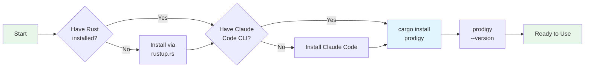

## Installation

This guide covers installing Prodigy and the prerequisite tools needed to run AI-powered workflow automation.



**Figure**: Installation decision flow - ensure prerequisites are met before installing Prodigy.

!!! success "Quick Install"
    ```bash
    cargo install prodigy && prodigy --version
    ```
    For detailed prerequisites and troubleshooting, continue reading below.

## Prerequisites

Before installing Prodigy, ensure you have the required dependencies.

!!! note "Required Dependencies"
    | Tool | Version | Install | Verify |
    |------|---------|---------|--------|
    | Claude Code CLI | Latest | [github.com/anthropics/claude-code](https://github.com/anthropics/claude-code) | `claude --version` |
    | Rust | 1.70+ | [rustup.rs](https://rustup.rs/) | `rustc --version` |

!!! warning "Required for MapReduce Workflows"
    | Tool | Version | Install | Verify |
    |------|---------|---------|--------|
    | Git | 2.25+ | [git-scm.com](https://git-scm.com/) | `git --version` |

    Git worktrees are used to isolate parallel work in MapReduce workflows.

!!! info "Optional Dependencies"
    | Tool | Purpose | Install | Verify |
    |------|---------|---------|--------|
    | mdBook | Documentation workflows | `cargo install mdbook` | `mdbook --version` |
    | jq | JSON inspection | [jqlang.github.io/jq](https://jqlang.github.io/jq/) | `jq --version` |

## Using Cargo (Recommended)

The simplest way to install Prodigy is via Cargo, Rust's package manager:

```bash
cargo install prodigy
```

This command:
1. Downloads the latest version from crates.io
2. Compiles the binary with optimizations
3. Installs to `~/.cargo/bin/prodigy` (ensure this is in your PATH)

**Verify installation:**
```bash
prodigy --version
# Expected output: prodigy 0.4.4
```

**Source**: README.md:51-55

## From Source

To install the latest development version or contribute to Prodigy, build from source:

!!! example "Build Commands"
    ```bash
    # Clone the repository
    git clone https://github.com/iepathos/prodigy
    cd prodigy

    # Build and install
    cargo build --release
    cargo install --path .
    ```

**Build process:**

1. `cargo build --release` compiles with optimizations
2. Binary is created at `target/release/prodigy`
3. `cargo install --path .` copies binary to `~/.cargo/bin/`

!!! info "Build Time Estimate"
    First-time builds typically take **3-5 minutes** depending on system performance. Subsequent rebuilds are faster due to incremental compilation.

**Verify installation:**
```bash
prodigy --version
```

**Source**: README.md:57-66

## Optional: Man Pages

Prodigy includes comprehensive man pages for CLI reference. Install them with:

```bash
./scripts/install-man-pages.sh
```

This installs man pages to `/usr/local/share/man/man1/` when run with sudo. When running without elevated permissions, man pages install to `~/.local/share/man/man1` instead.

!!! tip "User-local installation"
    If installing to `~/.local/share/man/man1`, add this to your shell configuration:
    ```bash
    export MANPATH="$HOME/.local/share/man:$MANPATH"
    ```

After installation:

```bash
# View main Prodigy documentation
man prodigy

# View specific command documentation
man prodigy-run
man prodigy-resume
man prodigy-dlq
```

**Source**: README.md:68-69, scripts/install-man-pages.sh

## Verification

After installation, verify Prodigy is working correctly:

**Check version:**
```bash
prodigy --version
```

**View available commands:**
```bash
prodigy --help
```

**Test basic functionality:**
```bash
# Initialize Claude commands
prodigy init

# Should create .claude/commands/ directory
ls -la .claude/commands/
```

!!! tip "Verify Claude Code Authentication"
    Before running workflows, ensure Claude Code is authenticated:
    ```bash
    claude --version  # Verify CLI is installed
    ```
    If you haven't authenticated yet, Claude Code will prompt you on first use.

## Troubleshooting

### Command not found: prodigy

**Cause**: `~/.cargo/bin` is not in your PATH

**Fix**: Add to your shell profile (~/.bashrc, ~/.zshrc, etc.):
```bash
export PATH="$HOME/.cargo/bin:$PATH"
```

Then reload: `source ~/.bashrc` (or restart terminal)

### cargo: command not found

**Cause**: Rust toolchain not installed

**Fix**: Install Rust via rustup:
```bash
curl --proto '=https' --tlsv1.2 -sSf https://sh.rustup.rs | sh
```

### Build fails with "linker not found"

**Cause**: Missing C compiler/linker (required by some Rust dependencies)

**Fix**:
- **macOS**: Install Xcode Command Line Tools: `xcode-select --install`
- **Linux**: Install build essentials: `sudo apt-get install build-essential` (Debian/Ubuntu)
- **Windows**: Install Visual Studio Build Tools

### Permission denied when installing man pages

**Cause**: `/usr/local/share/man/man1/` requires elevated permissions

**Fix**: Run with sudo:
```bash
sudo ./scripts/install-man-pages.sh
```

## Platform-Specific Notes

=== "macOS"
    - Xcode Command Line Tools recommended for best compatibility
    - Man pages install to `/usr/local/share/man/man1/` by default
    - Homebrew users: Cargo is included with `brew install rust`

    ```bash
    # Install Xcode Command Line Tools
    xcode-select --install
    ```

=== "Linux"
    - Build essentials package required for compilation
    - Man pages may require sudo for installation
    - Consider using system package manager if available

    ```bash
    # Debian/Ubuntu
    sudo apt-get install build-essential

    # Fedora/RHEL
    sudo dnf groupinstall "Development Tools"
    ```

=== "Windows"
    - Visual Studio Build Tools required for Rust compilation
    - Consider using WSL2 for better compatibility with git worktrees
    - Man pages not supported on Windows (use `prodigy --help` instead)

    !!! tip
        WSL2 provides the best experience for running Prodigy on Windows, especially for MapReduce workflows that use git worktrees.

## Next Steps

After installation, explore Prodigy's features:

**Getting Started:**
- [Introduction](index.md) - Overview of Prodigy's capabilities
- [Workflow Basics](workflow-basics/index.md) - Learn how to write workflows

**Popular Use Cases:**
- [Automated Documentation](automated-documentation/index.md) - Keep docs synchronized with code
- [MapReduce Workflows](mapreduce/index.md) - Parallel processing at scale
- [Examples](examples.md) - See real-world workflow examples
