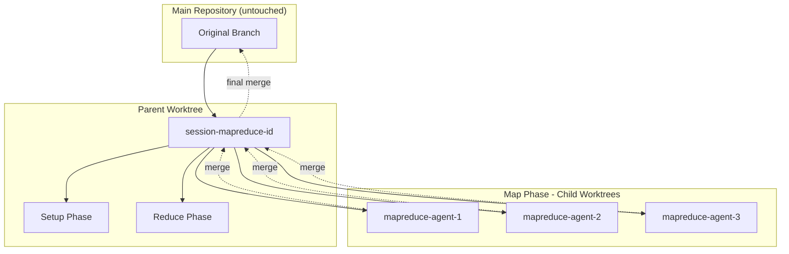
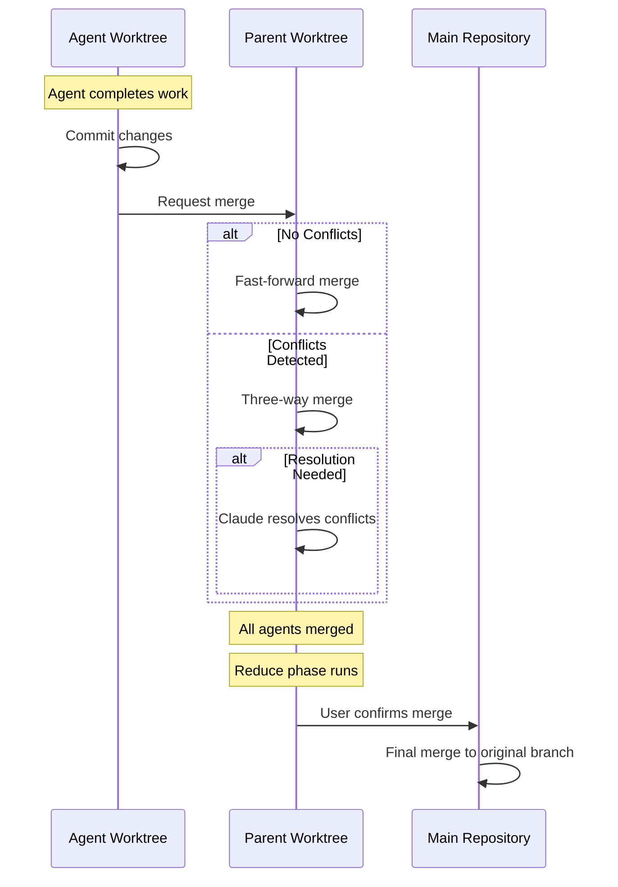

# MapReduce Worktree Architecture

MapReduce workflows in Prodigy use an isolated git worktree architecture that ensures the main repository remains untouched during workflow execution. This chapter explains the worktree hierarchy, branch naming conventions, merge flows, and debugging strategies.

## Overview

When you run a MapReduce workflow, Prodigy creates a hierarchical worktree structure:



!!! info "Isolation Guarantee"
    This architecture provides complete isolation, allowing parallel agents to work independently while preserving a clean main repository. Your original branch is never modified until you explicitly approve the final merge.

**Related Documentation:**

- [Checkpoint and Resume](mapreduce/checkpoint-and-resume.md) - Recovering interrupted workflows
- [Dead Letter Queue](workflow-basics/error-handling/dlq.md) - Handling failed agents
- [Event Tracking](mapreduce/event-tracking.md) - Monitoring workflow progress
- [Git Integration](advanced/git-integration.md) - Branch tracking and merge strategies

## Worktree Hierarchy

### Parent Worktree

Created at the start of MapReduce workflow execution:

**Location**: `~/.prodigy/worktrees/{project}/session-mapreduce-{timestamp}`

**Purpose**:

- Isolates all workflow execution from main repository
- Hosts setup phase execution
- Hosts reduce phase execution
- Serves as merge target for agent results

**Branch**: Follows `prodigy-{session-id}` pattern. The session ID includes a timestamp (e.g., `session-mapreduce-20250112_143052`), so the full branch name becomes `prodigy-session-mapreduce-20250112_143052`.

```rust
// Source: src/worktree/builder.rs:176-178
let branch = format!("prodigy-{name}");
```

### Worktree Allocation Strategies

All worktrees in Prodigy have names, paths, and git branches - the distinction is in how they're allocated:

=== "Pool Allocation (Preferred)"

    When agents request worktrees via `WorktreeRequest::Anonymous`, they receive pre-allocated worktrees from a shared pool:

    ```rust
    // Source: src/cook/execution/mapreduce/resources/worktree.rs:42
    .acquire(WorktreeRequest::Anonymous)
    ```

    **Characteristics:**

    - Pool-assigned names (not request-specific)
    - Efficient resource reuse across agents
    - Reduced creation overhead
    - Names follow pool's naming scheme

=== "Direct Creation (Fallback)"

    MapReduce coordinators create session worktrees with explicit, predictable names:

    ```
    session-mapreduce-20250112_143052
    ```

    **Characteristics:**

    - Deterministic, predictable paths
    - Easy to locate and inspect
    - Used when pool is exhausted
    - Request-specific naming

!!! note "Both Strategies Produce Full Identity"
    Both allocation strategies produce worktrees with full identity (name, path, branch). The difference is in naming predictability and resource management approach.

### Child Worktrees

Created for each map agent:

**Location**: `~/.prodigy/worktrees/{project}/mapreduce-agent-{agent_id}`

**Purpose**:

- Complete isolation per agent
- Independent failure handling
- Parallel execution safety

**Branch**: Follows `prodigy-{worktree-name}` pattern (branched from parent worktree)

**Resource Management**: Agent worktrees can be acquired through two strategies:

1. **Worktree Pool** (preferred): Agents first attempt to acquire pre-allocated worktrees from a `WorktreePool`. This reduces creation overhead and enables efficient resource reuse.

2. **Direct Creation** (fallback): If the pool is exhausted or unavailable, agents fall back to creating dedicated worktrees via `WorktreeManager`.

The `acquire_session` method implements this pool-first strategy, ensuring optimal resource utilization while maintaining isolation guarantees.

!!! tip "Agent ID Encoding"
    The `agent_id` in the location path encodes the work item information. Agent worktrees are created dynamically as map agents execute.

## Branch Naming Conventions

Prodigy uses consistent branch naming to track worktree relationships:

### Parent Worktree Branch

Format: `prodigy-{session-id}`

The branch name follows the universal worktree pattern where all worktrees use `prodigy-{name}`. For MapReduce workflows, the session ID itself includes the timestamp, so the full branch name looks like:

```
prodigy-session-mapreduce-20250112_143052
```

This is `prodigy-` + the session ID `session-mapreduce-20250112_143052`

### Agent Worktree Branch

Format: `prodigy-{worktree-name}`

All worktrees in Prodigy follow the universal `prodigy-{name}` branch naming pattern.

```rust
// Source: src/worktree/builder.rs:178
let branch = format!("prodigy-{name}");
```

The worktree name itself varies based on the allocation strategy:

=== "Pool-Allocated"

    When agents acquire worktrees from the pre-allocated pool, the worktree name is generated by the pool and may not follow a predictable pattern. These are still tracked by the consistent `prodigy-{name}` branch format.

=== "Directly-Created"

    When agents create dedicated worktrees (fallback when pool is exhausted), the name typically encodes job and agent information:

    ```
    prodigy-mapreduce-agent-mapreduce-20251109_193734_agent_22
    ```

    This is `prodigy-` + the worktree name `mapreduce-agent-mapreduce-20251109_193734_agent_22`

    **Components:**

    - `mapreduce-agent-`: Indicates this is a MapReduce agent worktree
    - `{job_id}`: The MapReduce job identifier (includes timestamp)
    - `_agent_{n}`: Sequential agent number within the job

!!! note "Consistent Branch Naming"
    The branch naming is always consistent (`prodigy-{name}`), but worktree naming varies based on allocation strategy.

## Merge Flow

MapReduce workflows involve multiple merge operations to aggregate results:



### 1. Agent Merge (Child → Parent)

When an agent completes successfully:

**Process**:

1. Agent completes all commands successfully
2. Agent commits changes to its branch
3. Merge coordinator adds agent to merge queue
4. Sequential merge into parent worktree branch
5. Child worktree cleanup

### 2. MapReduce to Parent Merge

After all map agents complete and reduce phase finishes:

**Process**:

1. All agents merged into parent worktree
2. Reduce phase executes in parent worktree
3. User confirms merge to main repository
4. Sequential merge with conflict detection
5. Parent worktree cleanup

### Merge Strategies

| Strategy | When Used | Description |
|----------|-----------|-------------|
| **Fast-Forward** | No divergence | Direct history advancement |
| **Three-Way Merge** | Branches diverged | Standard merge with common ancestor |
| **Conflict Handling** | Merge conflicts | Stop and report for resolution |

## Agent Merge Details

### Merge Queue

Agents are added to a merge queue as they complete:

```rust
// Source: src/cook/execution/mapreduce/merge_queue.rs:70
let (tx, mut rx) = mpsc::unbounded_channel::<MergeRequest>();
```

!!! info "Queue Architecture"
    Merge queue is managed in-memory by a background worker task using a tokio unbounded mpsc channel. Merge requests are processed sequentially via this channel, eliminating MERGE_HEAD race conditions. Queue state is not persisted - merge operations are atomic.

**Resume and Recovery**: The merge queue state is reconstructed on resume from checkpoint data. When a MapReduce workflow is interrupted and resumed, the queue is rebuilt based on:

| Agent State | Resume Behavior |
|-------------|-----------------|
| Completed | Already merged, skip re-merging |
| Failed | Tracked in DLQ, can be retried separately |
| In-progress | Moved back to pending, will be re-executed |
| Pending | Continue processing from where left off |

Any in-progress merges at the time of interruption are retried from the agent worktree state. This ensures no agent results are lost during resume.

**Queue Processing**: Queue processes `MergeRequest` objects containing:

- `agent_id`: Unique agent identifier
- `branch_name`: Agent's git branch to merge
- `item_id`: Work item identifier for correlation
- `env`: Execution environment context (variables, secrets)

Merge requests are processed FIFO with automatic conflict detection.

### Sequential Merge Processing

Merges are processed sequentially to prevent conflicts:

1. Lock merge queue
2. Take next agent from pending queue
3. Perform merge into parent worktree
4. Update queue (move to merged or failed)
5. Release lock

### Automatic Conflict Resolution

If a standard git merge fails with conflicts, the merge queue automatically invokes Claude using the `/prodigy-merge-worktree` command to resolve conflicts intelligently:

=== "Successful Resolution"

    ```mermaid
    graph LR
        A[Git Merge Attempted] --> B{Conflicts?}
        B -->|No| C[Merge Complete]
        B -->|Yes| D[Invoke Claude]
        D --> E{Claude Resolves?}
        E -->|Yes| C
    ```

    Claude analyzes the conflicts and resolves them automatically using code analysis and standard merge strategies.

=== "Failed Resolution"

    ```mermaid
    graph LR
        A[Git Merge Attempted] --> B{Conflicts?}
        B -->|Yes| D[Invoke Claude]
        D --> E{Claude Resolves?}
        E -->|No| F[Agent → DLQ]
        F --> G[Manual Review]
    ```

    Complex conflicts that Claude cannot resolve are sent to the Dead Letter Queue for manual review.

**PRODIGY_AUTOMATION Environment Variable**:

```rust
// Source: src/cook/execution/mapreduce/merge_queue.rs:98-99
env_vars.insert("PRODIGY_AUTOMATION".to_string(), "true".to_string());
```

!!! warning "Automation Mode"
    When `PRODIGY_AUTOMATION=true`, Claude Code operates in automated workflow mode and uses appropriate merge strategies without requiring user interaction. Claude will attempt to resolve conflicts autonomously.

**Benefits**:

- Reduces manual merge conflict resolution overhead
- Handles common conflict patterns automatically
- Preserves full context for debugging via Claude logs
- Falls back gracefully to DLQ for complex conflicts
- Automated execution mode ensures non-interactive conflict resolution

## Parent to Master Merge

### Merge Confirmation

After reduce phase completes, Prodigy prompts for merge confirmation:

```
✓ MapReduce workflow completed successfully

Merge session-mapreduce-20250112_143052 to master? [y/N]
```

### Custom Merge Workflows

Configure custom merge validation:

```yaml title="workflow.yml"
merge:
  - shell: "git fetch origin"  # (1)!
  - shell: "cargo test"  # (2)!
  - shell: "cargo clippy"  # (3)!
  - claude: "/prodigy-merge-worktree ${merge.source_branch} ${merge.target_branch}"  # (4)!
```

1. Fetch latest changes from remote
2. Run tests to validate merge result
3. Check for linting issues
4. Use Claude for intelligent merge handling

!!! important "Always Pass Both Branches"
    Always pass both `${merge.source_branch}` and `${merge.target_branch}` to the `/prodigy-merge-worktree` command. This ensures the merge targets the branch you were on when you started the workflow, not a hardcoded main/master branch.

### Merge Variables

Available during merge workflows:

| Variable | Description |
|----------|-------------|
| `${merge.worktree}` | Worktree name |
| `${merge.source_branch}` | Session branch name |
| `${merge.target_branch}` | Main repository branch (usually master/main) |
| `${merge.session_id}` | Session ID for correlation |

## Debugging MapReduce Worktrees

### Inspecting Worktree State

```bash
# List all worktrees
git worktree list

# View worktree details
cd ~/.prodigy/worktrees/{project}/session-mapreduce-*
git status
git log

# View agent worktree
cd ~/.prodigy/worktrees/{project}/agent-*
git log --oneline
```

### Finding Agent Worktree Paths

Agent worktrees may be **directly-created** (with predictable names) or **pool-allocated** (with pool-assigned names). To correlate agent IDs to worktree paths:

=== "Directly-Created"

    ```bash
    # Pattern: ~/.prodigy/worktrees/{project}/mapreduce-agent-{job_id}_agent_{n}
    cd ~/.prodigy/worktrees/{project}/mapreduce-agent-*
    ```

    Deterministic paths make these easy to locate.

=== "Pool-Allocated"

    ```bash
    # List all worktrees and correlate by branch name
    git worktree list

    # Look for branches matching agent pattern
    git branch -a | grep prodigy-mapreduce-agent
    ```

    Pool allocation assigns names from the pool's naming scheme.

!!! tip "WorktreeInfo Tracking"
    Both allocation strategies produce fully-identified worktrees with names, paths, and branches. Use `WorktreeInfo` tracking to correlate agent IDs to actual worktree locations.

**WorktreeInfo Tracking**: Prodigy captures worktree metadata in `WorktreeInfo` structs containing:

- `name`: Worktree identifier
- `path`: Full filesystem path
- `branch`: Git branch name

This information is logged in MapReduce events and can be inspected via `prodigy events {job_id}` to correlate agent IDs to worktree paths.

### Common Debugging Scenarios

=== "Agent Failed to Merge"

    1. Check DLQ for failure details: `prodigy dlq show {job_id}`
    2. Inspect failed agent worktree: `cd ~/.prodigy/worktrees/{project}/mapreduce-agent-*`
    3. Review agent changes: `git diff master`
    4. Check for conflicts: `git status`
    5. Review Claude merge logs if conflict resolution was attempted

=== "Parent Worktree Not Merging"

    1. Check parent worktree: `cd ~/.prodigy/worktrees/{project}/session-mapreduce-*`
    2. Verify all agents merged: `git log --oneline`
    3. Check for uncommitted changes: `git status`
    4. Review merge history: `git log --graph --oneline --all`

### Merge Conflict Resolution

If merge conflicts occur:

```bash
# Navigate to parent worktree
cd ~/.prodigy/worktrees/{project}/session-mapreduce-*

# View conflicts
git status

# Resolve manually
vim <conflicted-file>

# Complete merge
git add <conflicted-file>
git commit
```

## Verification Commands

### Verify Main Repository is Clean

```bash
# Main repository should have no changes from MapReduce execution
git status
# Expected: nothing to commit, working tree clean
```

### Verify Worktree Isolation

```bash
# Check that parent worktree has changes
cd ~/.prodigy/worktrees/{project}/session-mapreduce-*
git status
git log --oneline

# Main repository should still be clean
cd /path/to/main/repo
git status
```

### Verify Agent Merges

```bash
# Check for merge events
prodigy events {job_id}

# Verify merged agents in parent worktree
cd ~/.prodigy/worktrees/{project}/session-mapreduce-*
git log --oneline | grep "Merge"
```

## Best Practices

### Worktree Management

- **Cleanup**: Remove old worktrees after successful merge: `prodigy worktree clean`
- **Monitoring**: Check worktree disk usage periodically
- **Inspection**: Review worktrees before deleting to verify results

### Merge Workflows

- **Test Before Merge**: Run tests in merge workflow to catch issues
- **Sync Upstream**: Fetch and merge origin/main before merging to main
- **Conflict Prevention**: Keep MapReduce jobs focused to minimize conflicts

### Debugging

- **Preserve Worktrees**: Don't delete worktrees until debugging is complete
- **Event Logs**: Review event logs for merge failures: `prodigy events {job_id}`
- **DLQ Review**: Check failed items that might indicate merge issues

## Troubleshooting

### Worktree Creation Fails

!!! failure "Cannot create parent or child worktree"
    **Causes:** Disk space exhausted, invalid git repository, existing worktree with same name

    **Solutions:**

    - Check available disk space
    - Verify git repository is valid: `git status`
    - Remove conflicting worktrees: `git worktree prune`

### Agent Merge Fails

!!! failure "Agent results fail to merge into parent"
    **Causes:** Merge conflicts, uncommitted changes, branch divergence

    **Solutions:**

    - Check merge queue status
    - Inspect agent worktree for conflicts
    - Review agent changes with `git diff`

### Parent Merge Conflicts

!!! failure "Merging parent worktree to main causes conflicts"
    **Causes:** Main branch advanced during workflow execution

    **Solutions:**

    - Resolve conflicts manually in parent worktree
    - Consider rebasing parent worktree on latest main
    - Use custom merge workflow with conflict handling

### Orphaned Worktrees

!!! warning "Worktrees remain after workflow completion"
    This can happen if cleanup fails or workflow is interrupted.

    **Solutions:**

    - Use `prodigy worktree clean` to remove old worktrees
    - Manually remove with `git worktree remove {path}`
    - Prune stale worktree entries: `git worktree prune`

---

**See Also:**

- [Worktree Storage](advanced/storage/worktree-storage.md) - Storage locations and management
- [Git Integration](advanced/git-integration.md) - Branch tracking details
