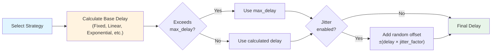
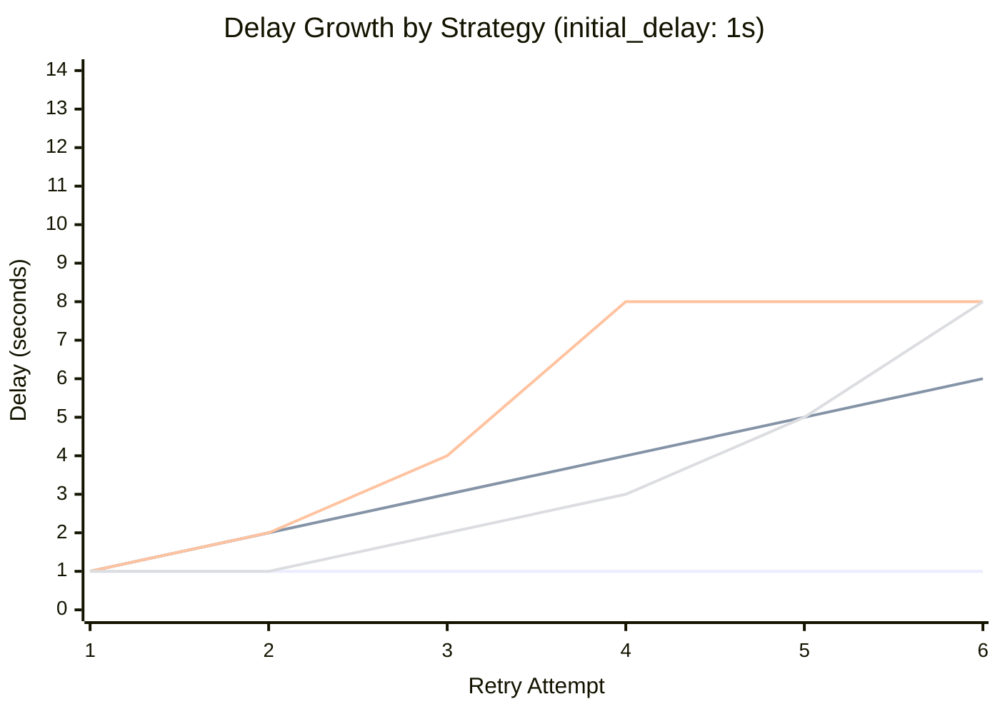

## Backoff Strategies

Backoff strategies control the delay between retry attempts when a MapReduce agent fails. Prodigy supports multiple backoff algorithms to handle different failure patterns and workload characteristics.

**Source**: `BackoffStrategy` enum in `src/cook/retry_v2.rs:70-90`

### Overview

The `retry_config.backoff` field configures which backoff algorithm to use. All strategies work with the following `RetryConfig` fields:

- **initial_delay**: Base delay for calculations (default: `1s`)
- **max_delay**: Maximum cap on any calculated delay (default: `30s`)
- **jitter**: Add randomness to prevent thundering herd (default: `false`)



**Figure**: Delay calculation flow showing how the backoff strategy, max_delay cap, and jitter combine.

!!! note "Default Strategy"
    If no backoff is specified, Prodigy uses **Exponential backoff with base 2.0**.

Source: `src/cook/retry_v2.rs:92-98`

### Available Strategies

The following diagram compares how delays grow across retry attempts for each strategy (assuming `initial_delay: 1s`):



**Figure**: Delay progression showing how each strategy scales. Exponential caps at max_delay (8s in this example).

#### Fixed Backoff

Uses a constant delay between all retry attempts.

**Simple form** (uses `initial_delay`):
```yaml
retry_config:
  backoff: fixed
  initial_delay: 2s
```

**Explicit form** (error_policy implementation):
```yaml
retry_config:
  backoff:
    fixed:
      delay: 5s
```

**Behavior**:
- Retry 1: 2s delay
- Retry 2: 2s delay
- Retry 3: 2s delay

**Use cases**:
- Fast retries for transient errors
- Quick recovery for flaky tests
- Network requests with predictable timeouts

**Source**: `src/cook/retry_v2.rs:75` (retry_v2), `src/cook/workflow/error_policy.rs:110` (error_policy)

**Test**: `src/cook/retry_v2.rs:582-594`

#### Linear Backoff

Increases delay linearly on each retry: `initial_delay + (attempt * increment)`.

**retry_v2 form**:
```yaml
retry_config:
  backoff:
    linear:
      increment: 2s
  initial_delay: 1s
```

**error_policy form**:
```yaml
retry_config:
  backoff:
    linear:
      initial: 1s
      increment: 2s
```

**Behavior** (retry_v2 example):
- Retry 1: 1s (initial_delay)
- Retry 2: 3s (1s + 2s)
- Retry 3: 5s (1s + 4s)

**Use cases**:
- Database connection retries
- Resource allocation failures
- Predictable backpressure

**Source**: `src/cook/retry_v2.rs:77-80` (retry_v2), `src/cook/workflow/error_policy.rs:112-115` (error_policy)

**Test**: `src/cook/retry_v2.rs:596-610`

#### Exponential Backoff (Default)

Increases delay exponentially: `initial_delay * (base ^ attempt)`.

**retry_v2 form** (uses `base`):
```yaml
retry_config:
  backoff:
    exponential:
      base: 2.0
  initial_delay: 1s
  max_delay: 100s
```

**error_policy form** (uses `multiplier`):
```yaml
retry_config:
  backoff:
    exponential:
      initial: 1s
      multiplier: 2.0
```

**Behavior** (base 2.0):
- Retry 1: 1s
- Retry 2: 2s (1s * 2^1)
- Retry 3: 4s (1s * 2^2)
- Retry 4: 8s (1s * 2^3)
- Retry 5: 16s (capped at max_delay if exceeded)

**Use cases**:
- API rate limiting
- Network failures
- Most general-purpose retry scenarios
- **Recommended for MapReduce workloads**

**Source**: `src/cook/retry_v2.rs:82-85` (retry_v2), `src/cook/workflow/error_policy.rs:117` (error_policy)

**Test**: `src/cook/retry_v2.rs:612-626`

#### Fibonacci Backoff

Uses the Fibonacci sequence (0, 1, 1, 2, 3, 5, 8, 13...) multiplied by `initial_delay`.

**retry_v2 form**:
```yaml
retry_config:
  backoff: fibonacci
  initial_delay: 1s
```

**error_policy form**:
```yaml
retry_config:
  backoff:
    fibonacci:
      initial: 1s
```

**Behavior**:
- Retry 1: 1s (fib(1) = 1)
- Retry 2: 1s (fib(2) = 1)
- Retry 3: 2s (fib(3) = 2)
- Retry 4: 3s (fib(4) = 3)
- Retry 5: 5s (fib(5) = 5)
- Retry 6: 8s (fib(6) = 8)

**Use cases**:
- **Distributed systems** (natural backpressure)
- **Parallel MapReduce jobs** (reduces retry storms)
- Gradual recovery from cascading failures

**Implementation**: The Fibonacci sequence is calculated using iterative approach to avoid stack overflow for large attempt numbers.

**Source**: `src/cook/retry_v2.rs:87`, `src/cook/retry_v2.rs:424-440` (fibonacci function)

**Test**: `src/cook/retry_v2.rs:628-642`

#### Custom Backoff (retry_v2 only)

Specify an explicit list of delays for each retry attempt.

**Note**: Only available in the retry_v2 implementation, not in error_policy.

```yaml
retry_config:
  backoff:
    custom:
      delays:
        - 500ms
        - 1s
        - 2s
        - 5s
        - 10s
```

**Behavior**:
- Retry 1: 500ms (delays[0])
- Retry 2: 1s (delays[1])
- Retry 3: 2s (delays[2])
- Retry 4: 5s (delays[3])
- Retry 5: 10s (delays[4])
- Retry 6+: max_delay (if attempt exceeds array length)

**Use cases**:
- Fine-tuned retry patterns
- Known failure recovery timelines
- Testing specific delay sequences

**Edge cases**:
- Empty `delays` array: Uses `max_delay` for all attempts (fallback behavior)
- Attempt exceeds array length: Uses `max_delay` (fallback behavior)

This ensures predictable behavior when custom delays are exhausted or misconfigured, preventing undefined delay calculations.

**Source**: `src/cook/retry_v2.rs:88-89`, `src/cook/retry_v2.rs:298-301` (calculation logic)

### MapReduce Integration

Backoff strategies are configured in the `retry_config` block, which can be part of:
1. **WorkflowErrorPolicy** at workflow level (applies to all items)
2. **TimeoutConfig** in map phase (more specific control)

!!! example "Complete MapReduce Example"

    ```yaml
    name: resilient-mapreduce-job
    mode: mapreduce

    map:
      input: "items.json"
      json_path: "$.items[*]"

      # Workflow-level error policy
      error_policy:
        retry_config:
          max_attempts: 5             # (1)!
          backoff:
            fibonacci:                # (2)!
              initial: 1s
          jitter: true                # (3)!
          jitter_factor: 0.3
        continue_on_failure: true     # (4)!

      agent_template:
        - claude: "/process-item '${item.id}'"
        - shell: "validate ${item.output}"
          on_failure:
            claude: "/fix-validation-error"

      max_parallel: 10
    ```

    1. Retry failed agents up to 5 times before giving up
    2. Fibonacci backoff reduces retry storms in parallel workloads
    3. Jitter prevents all agents from retrying at the same instant
    4. Continue processing other items even if some fail

**Source**: `src/cook/workflow/error_policy.rs:160` (retry_config field in WorkflowErrorPolicy)

### RetryConfig Fields

The `RetryConfig` structure controls all retry behavior:

```yaml
# Source: src/cook/retry_v2.rs:14-52
retry_config:
  attempts: 3              # Maximum retry attempts (default: 3)
  backoff: exponential     # Strategy (default: exponential with base 2.0)
  initial_delay: 1s        # Base delay (default: 1s)
  max_delay: 30s           # Delay cap (default: 30s)
  jitter: true             # Add randomness (default: false)
  jitter_factor: 0.3       # Jitter amount 0.0-1.0 (default: 0.3)
  retry_on:                # Error types to retry (default: all errors)
    - network
    - timeout
  retry_budget: 5m         # Maximum total time for retries (optional)
  on_failure: stop         # Action on final failure: stop, continue, or fallback
```

**How fields interact**:
1. Backoff strategy calculates base delay using `initial_delay`
2. Calculated delay is capped by `max_delay`
3. If `jitter: true`, random offset is added: `delay ± (delay * jitter_factor)`
4. Final delay is applied before next retry attempt

**Source**: `src/cook/retry_v2.rs:14-52`

**Defaults**: `src/cook/retry_v2.rs:442-461`

#### Selective Retry with Error Matchers

The `retry_on` field allows retrying only specific error types. If not specified, all errors trigger retries.

**Available matchers** (Source: `src/cook/retry_v2.rs:100-151`):

| Matcher | Matches | Example Errors |
|---------|---------|----------------|
| `network` | Network connectivity issues | "Connection refused", "Network unreachable" |
| `timeout` | Timeout errors | "Operation timeout", "Request timed out" |
| `server_error` | HTTP 5xx errors | "500", "502", "503", "504", "server error" |
| `rate_limit` | Rate limiting | "Rate limit exceeded", "429", "Too many requests" |
| `pattern: <regex>` | Custom regex pattern | Any error matching the regex |

**Example - Retry only network and timeout errors**:
```yaml
retry_config:
  attempts: 5
  retry_on:
    - network
    - timeout
  backoff:
    exponential:
      base: 2.0
```

**Example - Retry with custom pattern**:
```yaml
retry_config:
  attempts: 3
  retry_on:
    - pattern: "temporary.*failure"
    - rate_limit
```

!!! tip
    When `retry_on` is empty (default), all errors trigger retries. Specifying matchers limits retries to matching errors only.

#### Retry Budget

The `retry_budget` field sets a maximum total time for all retry attempts combined. If the budget is exhausted, no further retries are attempted.

```yaml
retry_config:
  attempts: 10
  retry_budget: 2m          # Stop retrying after 2 minutes total
  backoff:
    fibonacci:
      initial: 1s
```

**Behavior**:
- Before each retry, checks if `total_delay + next_delay > retry_budget`
- If exceeded, immediately fails with "Retry budget exhausted"
- Useful for preventing runaway retries in time-sensitive workflows

**Source**: `src/cook/retry_v2.rs:45-47`, `src/cook/retry_v2.rs:237-244`

#### Failure Actions

The `on_failure` field controls what happens after all retries are exhausted.

**Available actions** (Source: `src/cook/retry_v2.rs:153-165`):

| Action | Behavior |
|--------|----------|
| `stop` (default) | Stop workflow execution |
| `continue` | Continue with next step |
| `fallback` | Execute a fallback command |

**Example with fallback**:
```yaml
retry_config:
  attempts: 3
  on_failure:
    fallback:
      command: "/handle-failure '${item.id}'"
```

### Implementation Variants

Prodigy has **two BackoffStrategy implementations**:

=== "retry_v2.rs (Recommended)"

    - **Location**: `src/cook/retry_v2.rs:70-90`
    - **Features**: Includes `Custom` backoff strategy
    - **Exponential parameter**: `base` (default 2.0)
    - **Simple syntax**: Most strategies use `backoff: strategy_name` form
    - **Additional features**: `retry_on` error matchers, `retry_budget` timeout, `on_failure` actions, circuit breaker support

=== "error_policy.rs (Legacy)"

    - **Location**: `src/cook/workflow/error_policy.rs:108-120`
    - **Features**: No `Custom` strategy
    - **Exponential parameter**: `multiplier` instead of `base`
    - **Explicit syntax**: All strategies require nested configuration with `initial` delay
    - **Simpler**: Minimal RetryConfig with max_attempts and backoff only

**Which to use**: Both are valid, but retry_v2 provides more features and better defaults. In MapReduce workflows, the error_policy implementation is used at the workflow level.

### Best Practices

**Choosing a Strategy**:

| Scenario | Recommended Strategy | Reasoning |
|----------|---------------------|-----------|
| Parallel MapReduce jobs | Fibonacci | Reduces retry storms, natural backpressure |
| API rate limiting | Exponential | Quickly backs off from rate limits |
| Database retries | Linear | Predictable recovery for connection pools |
| Fast transient errors | Fixed | Quick recovery without overloading |
| Custom requirements | Custom (retry_v2) | Fine-grained control for known patterns |

**Jitter Usage**:
- **Enable jitter** for MapReduce workloads to prevent thundering herd
- **Disable jitter** for testing and debugging (predictable delays)

**Delay Configuration**:
- Set `initial_delay` based on typical failure recovery time
- Set `max_delay` to prevent excessively long waits
- For MapReduce: Consider agent timeout interaction (delays count toward timeout)

!!! warning "Timeout Interaction"
    Backoff delays count toward the agent's overall timeout. If you configure:

    - Agent timeout: 300s (5 minutes)
    - Max retries: 5
    - Fibonacci backoff with initial_delay: 10s

    Total delay could be: 10s + 10s + 20s + 30s + 50s = 120s of retries, leaving 180s for actual work.

### Troubleshooting

**Delays too long**:
- Reduce `initial_delay` or `base`/`multiplier`
- Lower `max_delay` cap
- Consider switching from Exponential to Linear or Fibonacci

**Delays too short**:
- Increase `initial_delay`
- Increase `base`/`multiplier` for Exponential
- Switch from Fixed to Linear or Exponential

**Max delay being ignored**:
- Verify `max_delay` is set correctly in RetryConfig
- Check that backoff calculation doesn't skip max_delay check
- All strategies respect max_delay cap (see source for verification)

**Custom delays edge cases**:
- Empty `delays` array: Defaults to `max_delay` for all retries
- Attempt > array length: Uses `max_delay` (not initial_delay)
- Invalid duration format: Fails YAML parsing (use humantime format: `1s`, `500ms`, etc.)

**Humantime format errors**:
Valid formats: `1s`, `500ms`, `2m`, `1h30m`, `100ms`
Invalid formats: `1 second`, `500`, `2 minutes`
