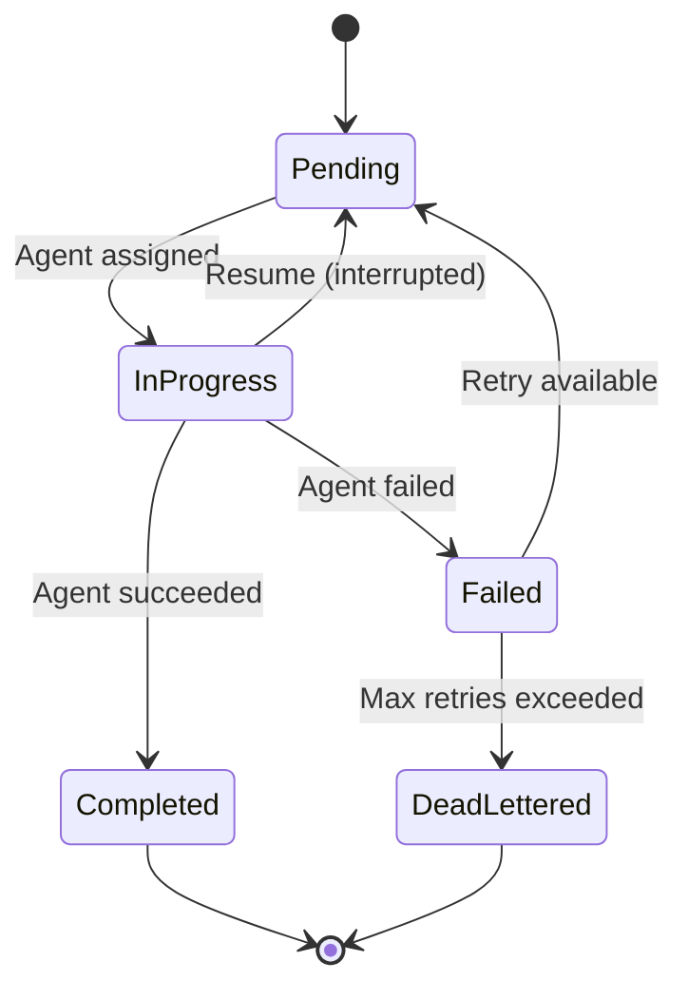

# Checkpoint and Resume

MapReduce workflows in Prodigy provide comprehensive checkpoint and resume capabilities, ensuring work can be recovered from any point of failure. This enables reliable execution of long-running parallel processing jobs.

## Overview

Prodigy automatically creates checkpoints during MapReduce execution, capturing complete workflow state at strategic points. If a workflow is interrupted—by system crash, manual cancellation, or error—you can resume from the last checkpoint without losing completed work.

**Key Features:**

- **Automatic checkpointing**: State saved during setup, map, and reduce phases
- **Bidirectional ID mapping**: Resume using session IDs or job IDs
- **Work preservation**: Completed items never reprocessed
- **Variable continuity**: Workflow variables and outputs preserved
- **Concurrent protection**: Lock mechanism prevents duplicate resume attempts
- **Phase-specific strategies**: Tailored resume behavior for each workflow phase

## Checkpoint Behavior

Checkpoints are created at different points depending on the workflow phase:

### Setup Phase Checkpointing

A checkpoint is created **after successful setup completion**, preserving:

- Setup command outputs
- Generated artifacts and files
- Environment state
- Setup phase variables

```bash
# Source: ~/.prodigy/state/{repo_name}/mapreduce/jobs/{job_id}/
setup-checkpoint.json
```

!!! note "Setup Phase Idempotency"
    Setup phase resumes restart from the beginning. Ensure setup commands are idempotent (safe to run multiple times) for reliable recovery.

### Map Phase Checkpointing

Checkpoints are created **after processing each configurable batch of work items**:

- Tracks completed, in-progress, and pending items
- Stores agent results with success/failure details
- Preserves work item correlation IDs
- Records retry counts for failed items

```bash
# Source: ~/.prodigy/state/{repo_name}/mapreduce/jobs/{job_id}/
map-checkpoint-{timestamp}.json
```

**Checkpoint Timing:**
- Default: After each agent completion
- Configurable: Batch multiple completions before checkpoint
- Asynchronous: <1s overhead per save

### Reduce Phase Checkpointing

Checkpoints are created **after each reduce command execution**:

- Tracks completed reduce steps
- Stores step results and outputs
- Preserves aggregated map results
- Maintains variable state

```bash
# Source: ~/.prodigy/state/{repo_name}/mapreduce/jobs/{job_id}/
reduce-checkpoint-v1-{timestamp}.json
```

## Resume Operations

### Basic Resume

Resume an interrupted workflow from your original working directory:

```bash
# Resume the most recent workflow
prodigy resume

# Resume a specific session
prodigy resume session-abc123

# Resume a specific job
prodigy resume-job mapreduce-1234567890
```

The resume command will:

1. Load the latest checkpoint
2. Restore completed agent results
3. Identify remaining work items
4. Continue processing from the last successful state

### Session-Job ID Mapping

Prodigy maintains bidirectional mapping between session IDs and job IDs, allowing you to resume with either identifier.

**Mapping Storage:**
```bash
# Source: ~/.prodigy/state/{repo_name}/mappings/
session-abc123.json  # Maps session → job
job-xyz789.json      # Maps job → session
```

**Usage Examples:**

```bash
# Resume with session ID (from original worktree)
prodigy resume session-mapreduce-1234567890

# Resume with job ID (from any location)
prodigy resume-job mapreduce-1234567890

# Unified resume (auto-detects ID type)
prodigy resume mapreduce-1234567890
```

!!! tip "When to Use Job IDs"
    Use job IDs when:

    - Original worktree has been cleaned up
    - Resuming from a different machine
    - Debugging using event logs or DLQ data
    - Multiple sessions worked on the same job

### In-Progress Item Handling

Items marked as "in-progress" during workflow interruption are automatically moved back to "pending" state on resume and will be re-executed.

**Rationale:** This prevents partial results from interrupted agents from corrupting the final output. Each work item is processed atomically—either fully completed or re-attempted from scratch.

```rust
// Source: src/cook/execution/mapreduce/checkpoint/types.rs:49-67
pub struct MapReduceCheckpoint {
    pub job_id: String,
    pub work_items: Vec<WorkItemState>,  // Tracks item status
    pub agent_results: Vec<AgentResult>,
    pub phase: ExecutionPhase,
    // ... other fields
}
```

## Concurrent Resume Protection

Prodigy uses an RAII-based lock mechanism to prevent multiple resume processes from running simultaneously on the same job.

### Lock Behavior

**Automatic Lock Acquisition:**

- Resume automatically acquires an exclusive lock before starting
- Lock creation is atomic—fails if another process holds the lock
- Lock automatically released when resume completes or fails (RAII pattern)
- Stale locks (from crashed processes) are automatically detected and cleaned

**Lock Metadata:**

```json
{
  "pid": 12345,
  "hostname": "workstation.local",
  "acquired_at": "2025-01-11T10:30:00Z",
  "job_id": "mapreduce-1234567890"
}
```

### Error Handling

If a resume is blocked by an active lock:

```bash
$ prodigy resume mapreduce-1234567890
Error: Resume already in progress for job mapreduce-1234567890
Lock held by: PID 12345 on workstation.local (acquired 2025-01-11 10:30:00 UTC)
Please wait for the other process to complete.
```

### Troubleshooting Stuck Locks

Stale locks are automatically detected and removed when the holding process no longer exists. Under normal conditions, manual intervention is not needed.

If a lock persists after a process crash:

1. **Verify lock file**: Check `~/.prodigy/resume_locks/{job_id}.lock`
2. **Check process**: `ps aux | grep <PID>` (from error message)
3. **Automatic cleanup**: Retry resume—stale locks are auto-detected

!!! warning "Lock Safety"
    Never manually delete lock files while the holding process is still running. This can cause:

    - Data corruption from concurrent state updates
    - Duplicate work item processing
    - Inconsistent checkpoint state

## Advanced Resume Options

### Force Resume

Override safety checks and retry failed items regardless of retry limits:

```bash
prodigy resume-job mapreduce-1234567890 --force
```

**Use cases:**
- Retry all failed items after fixing underlying issues
- Recovery when job state appears corrupted
- Reprocess items after external system changes

### Adjusting Parallelism

Change the number of concurrent agents during resume:

```bash
# Increase parallelism for faster processing
prodigy resume-job mapreduce-1234567890 --max-parallel 20

# Decrease parallelism to reduce system load
prodigy resume-job mapreduce-1234567890 --max-parallel 5
```

### Adding Extra Retries

Grant additional retry attempts to failed items:

```bash
# Add 2 extra retry attempts for failed items
prodigy resume-job mapreduce-1234567890 --max-additional-retries 2
```

**Useful when:**
- Temporary issues (network, API limits) caused failures
- Underlying problem has been fixed
- Original retry limit was too conservative

### Skip Validation

Bypass pre-resume validation checks:

```bash
prodigy resume-job mapreduce-1234567890 --skip-validation
```

!!! danger "Use with Caution"
    Skipping validation bypasses safety checks that prevent:

    - Resuming already-completed jobs
    - Processing with incompatible configurations
    - Checkpoint corruption issues

    Only use when you understand the risks.

### Resume from Specific Checkpoint

Resume from an earlier checkpoint version:

```bash
# List available checkpoints
prodigy checkpoints list mapreduce-1234567890

# Resume from checkpoint version 5
prodigy resume-job mapreduce-1234567890 --from-checkpoint 5
```

## Checkpoint Structure

### Storage Locations

```bash
# Source: ~/.prodigy/state/{repo_name}/mapreduce/jobs/{job_id}/
~/.prodigy/state/{repo_name}/mapreduce/jobs/{job_id}/
├── setup-checkpoint.json              # Setup phase results
├── map-checkpoint-{timestamp}.json    # Map phase progress
├── reduce-checkpoint-v1-{timestamp}.json  # Reduce phase progress
└── job-state.json                     # Overall job state
```

### Checkpoint Contents

**Setup Checkpoint:**
```json
{
  "phase": "Setup",
  "setup_outputs": ["generated_files.json"],
  "variables": {"PROJECT_NAME": "myproject"},
  "completed_at": "2025-01-11T10:00:00Z"
}
```

**Map Checkpoint:**
```json
{
  "phase": "Map",
  "work_items": [
    {"id": "item-1", "status": "Completed", "agent_id": "agent-1"},
    {"id": "item-2", "status": "Pending", "retry_count": 0}
  ],
  "agent_results": [
    {"agent_id": "agent-1", "status": "Success", "commits": ["abc123"]}
  ],
  "checkpoint_version": 42
}
```

**Reduce Checkpoint:**
```json
{
  "phase": "Reduce",
  "completed_steps": [0, 1, 2],
  "step_results": ["output1.txt", "output2.txt"],
  "map_results": {"total_processed": 100},
  "variables": {"SUMMARY": "Processing complete"}
}
```

## State Preservation

### Variables and Context

Workflow variables are preserved across resume operations:

- **Workflow variables**: Defined in YAML `env` blocks
- **Captured outputs**: Results from setup and reduce commands
- **Environment variables**: System environment state
- **Map results**: Aggregated results from map phase agents

**Example:**

```yaml
# Source: Example workflow structure
env:
  PROJECT_NAME: "myproject"
  VERSION: "1.0.0"

setup:
  - shell: "echo 'Setup complete' > setup.txt"

map:
  agent_template:
    - claude: "/analyze ${item.file} --project ${PROJECT_NAME}"

reduce:
  - shell: "echo 'Processed ${map.successful}/${map.total} items'"
```

After interruption and resume, all variables (`PROJECT_NAME`, `VERSION`, `map.successful`, etc.) remain available.

### Work Item State

Work items progress through distinct states, preserved in checkpoints:



- **Completed items**: Preserved with full results, never reprocessed
- **In-progress items**: Moved back to pending on resume
- **Failed items**: Tracked with retry counts and error details
- **Pending items**: Continue processing from where left off

## Resume Strategies

Resume behavior varies by workflow phase:

### Setup Phase Strategy

**Behavior:** Restart setup from beginning

**Rationale:** Setup operations should be idempotent (safe to run multiple times). This ensures clean state initialization.

**Recommendations:**
- Design setup commands to be idempotent
- Use conditional file creation (`test -f file || generate file`)
- Clean up partial results before regenerating

### Map Phase Strategy

**Behavior:** Continue from last checkpoint, re-process in-progress items

**Process:**
1. Load checkpoint to identify completed items
2. Move in-progress items back to pending
3. Resume processing pending items
4. Skip already-completed items

### Reduce Phase Strategy

**Behavior:** Continue from last completed step

**Process:**
1. Load reduce checkpoint
2. Identify last completed step index
3. Resume from next step
4. Execute remaining reduce commands

### Validation and Continue

Before resuming, Prodigy validates:

- Checkpoint integrity (valid JSON, required fields present)
- Workflow file compatibility
- Storage accessibility
- Lock availability

## Examples

### Simple Resume After Interruption

```bash
# Original job interrupted after processing 50/100 items
$ prodigy run analyze-codebase.yml
[... processes 50 items, then interrupted with Ctrl+C ...]

# Resume from where it left off
$ prodigy resume
Resuming job mapreduce-1234567890
Loaded checkpoint: 50 completed, 50 remaining
Continuing with 50 pending items...
[... processes remaining 50 items ...]
Job completed successfully!
```

### Resume with Configuration Changes

```bash
# Original workflow ran with 5 parallel agents
# Resume with increased parallelism for faster processing
$ prodigy resume-job mapreduce-1234567890 --max-parallel 20
Resuming job with max_parallel override: 5 -> 20
Processing 30 remaining items with 20 parallel agents...
```

### Recovery from Specific Checkpoint

```bash
# List available checkpoints
$ prodigy checkpoints list mapreduce-1234567890
Available checkpoints:
- v95 (latest): 95/100 complete
- v90: 90/100 complete
- v85: 85/100 complete

# Something went wrong after v90, resume from there
$ prodigy resume-job mapreduce-1234567890 --from-checkpoint 90
Loading checkpoint v90...
Rolling back to: 90 completed, 10 remaining
Continuing from checkpoint v90...
```

### Handling Concurrent Resume Attempts

```bash
# First terminal: Start resume
$ prodigy resume mapreduce-1234567890
Acquiring resume lock...
Resuming job...

# Second terminal: Try to resume same job
$ prodigy resume mapreduce-1234567890
Error: Resume already in progress for job mapreduce-1234567890
Lock held by: PID 45678 on workstation.local (acquired 2025-01-11 14:30:00 UTC)
Please wait for the other process to complete.
```

## Checking Job Status

Before resuming, check the current state of a job:

```bash
# View job checkpoints
prodigy checkpoints list mapreduce-1234567890

# View job events
prodigy events show mapreduce-1234567890

# Check DLQ status
prodigy dlq status mapreduce-1234567890

# View session information
prodigy sessions show
```

## Related Topics

- [Work Distribution](work-distribution.md) - Learn how work items are distributed to agents
- [Dead Letter Queue](../reference/dlq.md) - Handle permanently failed items
- [Event Tracking](../reference/events.md) - Monitor job execution in real-time
- [Session Management](../reference/sessions.md) - Understand session lifecycle
- [Storage Architecture](../reference/storage.md) - Learn about global storage structure
