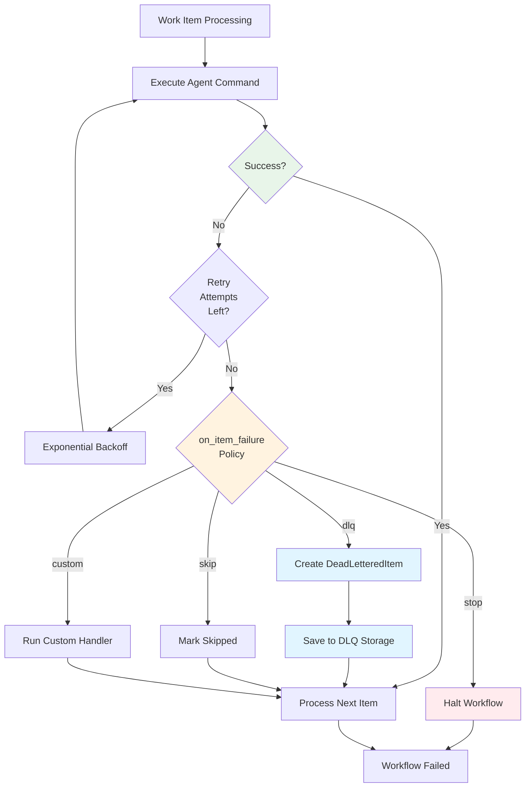

## Dead Letter Queue (DLQ)

The Dead Letter Queue (DLQ) captures persistently failing work items for analysis and retry while allowing MapReduce jobs to continue processing other items. Instead of blocking the entire workflow when individual items fail, the DLQ provides fault tolerance and enables debugging of failure patterns.

### Overview

When a map agent fails to process a work item after exhausting retry attempts, the item is automatically sent to the DLQ. This allows the MapReduce job to complete successfully while preserving all failure information for later investigation and reprocessing.

The DLQ integrates with MapReduce through the `on_item_failure` policy, which defaults to `dlq` for MapReduce workflows. Alternative policies include `retry` (immediate retry), `skip` (ignore failures), `stop` (halt workflow), and `custom` (user-defined handling).



**Figure**: DLQ failure flow showing retry logic and policy-based handling.

### Storage Structure

DLQ data is stored in the global Prodigy directory using this structure:

```
~/.prodigy/dlq/{repo_name}/{job_id}/mapreduce/dlq/{job_id}/
├── items/                  # Individual item files
│   ├── item-123.json      # DeadLetteredItem for item-123
│   ├── item-456.json      # DeadLetteredItem for item-456
│   └── ...
└── index.json             # DLQ index metadata
```

For example:
```
~/.prodigy/dlq/prodigy/mapreduce-1234567890/mapreduce/dlq/mapreduce-1234567890/
├── items/
│   └── item-123.json
└── index.json
```

**Storage Implementation**:
- `GlobalStorage` provides the base path: `~/.prodigy/dlq/{repo_name}/{job_id}` (src/storage/global.rs:47)
- `DLQStorage` adds subdirectories: `mapreduce/dlq/{job_id}` (src/cook/execution/dlq.rs:529)
  - **Note**: The redundant `mapreduce/dlq/{job_id}` subdirectory structure is maintained for backward compatibility with earlier DLQ implementations. This ensures existing DLQ data remains accessible after upgrades.
- Each failed item is stored as a separate JSON file in the `items/` directory (src/cook/execution/dlq.rs:536)
- File naming: `{item_id}.json` (e.g., `item-123.json`)
- `index.json` maintains a list of all item IDs and metadata for fast lookups (src/cook/execution/dlq.rs:608-637)
- Items are loaded into memory on-demand for operations

This global storage architecture enables:
- **Cross-worktree access**: Multiple worktrees working on the same job share DLQ data
- **Persistent state**: DLQ survives worktree cleanup
- **Centralized monitoring**: All failures accessible from a single location
- **Scalability**: Individual item files prevent loading entire DLQ into memory

### DLQ Item Structure

Each failed item in the DLQ is stored as a `DeadLetteredItem` with comprehensive failure information:

```json
{
  "item_id": "item-123",                    // (1)!
  "item_data": { "file": "src/main.rs", "priority": 5 },  // (2)!
  "first_attempt": "2025-01-11T10:25:00Z",  // (3)!
  "last_attempt": "2025-01-11T10:30:00Z",
  "failure_count": 3,                       // (4)!
  "failure_history": [                      // (5)!
    {
      "attempt_number": 1,
      "timestamp": "2025-01-11T10:30:00Z",
      "error_type": { "CommandFailed": { "exit_code": 101 } },
      "error_message": "cargo test failed with exit code 101",
      "stack_trace": "thread 'main' panicked at src/main.rs:42...",
      "agent_id": "agent-1",
      "step_failed": "shell: cargo test",
      "duration_ms": 45000,
      "json_log_location": "/Users/user/.local/state/claude/logs/session-abc123.json"
    }
  ],
  "error_signature": "CommandFailed::cargo test failed with exit",  // (6)!
  "reprocess_eligible": true,               // (7)!
  "manual_review_required": false,
  "worktree_artifacts": {                   // (8)!
    "worktree_path": "/Users/user/.prodigy/worktrees/prodigy/agent-1",
    "branch_name": "agent-1",
    "uncommitted_changes": "src/main.rs modified",
    "error_logs": "error.log contents..."
  }
}
```

1. Unique identifier for the work item
2. Original work item data from input JSON
3. When the item first failed (used for age-based filtering)
4. Number of retry attempts made
5. Complete history of all failure attempts with detailed error information
6. Simplified error pattern for grouping similar failures
7. Whether item can be automatically retried
8. Preserved state from failed agent's execution environment

**Source**: `DeadLetteredItem` struct (src/cook/execution/dlq.rs:32-43)

#### Key Fields

**Source**: `DeadLetteredItem` struct (src/cook/execution/dlq.rs:32-43)

- `item_id`: Unique identifier for the work item
- `item_data`: Original work item data from input JSON
- `first_attempt`: Timestamp of first failure attempt (DateTime<Utc>)
- `last_attempt`: Timestamp of most recent failure attempt (DateTime<Utc>)
- `failure_count`: Number of failed attempts (u32)
- `failure_history`: Array of `FailureDetail` objects capturing each attempt
- `error_signature`: Simplified error pattern for grouping similar failures
- `reprocess_eligible`: Whether item can be retried automatically
- `manual_review_required`: Whether item needs human intervention
- `worktree_artifacts`: Captured state from failed agent's worktree (Optional)

### Failure Detail Fields

Each attempt in `failure_history` is a `FailureDetail` object (src/cook/execution/dlq.rs:46-62):

```json
# Source: src/cook/execution/dlq.rs:46-62 (FailureDetail struct)
{
  "attempt_number": 1,
  "timestamp": "2025-01-11T10:30:00Z",
  "error_type": { "CommandFailed": { "exit_code": 101 } },
  "error_message": "cargo test failed with exit code 101",
  "error_context": [
    "Processing work item 'item-123'",
    "Executing agent command",
    "Running shell: cargo test"
  ],
  "stack_trace": "thread 'main' panicked at src/main.rs:42...",
  "agent_id": "agent-1",
  "step_failed": "claude: /process '${item}'",
  "duration_ms": 45000,
  "json_log_location": "/path/to/claude-session.json"
}
```

**Field Details**:
- `attempt_number`: Sequential attempt counter (u32)
- `timestamp`: When this attempt occurred (DateTime<Utc>)
- `error_type`: Error classification (see Error Types below)
- `error_message`: Human-readable error description
- `error_context`: Optional context trail showing the operation stack for debugging (Vec<String>). Preserves the chain of operations that led to the failure.
- `stack_trace`: Optional detailed stack trace
- `agent_id`: ID of the agent that failed
- `step_failed`: Command string that failed (e.g., "shell: cargo test")
- `duration_ms`: How long the attempt ran before failing (u64)
- `json_log_location`: Path to Claude JSON log for debugging (Optional)

#### Error Types

The `error_type` field uses the `ErrorType` enum (src/cook/execution/dlq.rs:64-78):

=== "Execution Errors"
    **`Timeout`**: Agent execution exceeded timeout limit

    **`CommandFailed { exit_code: i32 }`**: Shell or Claude command returned non-zero exit code

    Example:
    ```json
    { "CommandFailed": { "exit_code": 101 } }
    ```

    **`CommitValidationFailed`**: Commit validation failed - required commit was not created

    Used when a command has `commit_required: true` but the agent did not create a commit. See [Commit Validation](./checkpoint-and-resume.md#commit-validation) for details.

    **`ValidationFailed`**: Post-execution validation command failed

=== "Git Errors"
    **`WorktreeError`**: Git worktree operation failed (creation, cleanup)

    **`MergeConflict`**: Merge back to parent worktree failed

    Common when multiple agents modify the same files.

=== "System Errors"
    **`ResourceExhausted`**: System resources (memory, disk) exhausted

    **`Unknown`**: Unclassified error

    Review `error_message` and `stack_trace` for details.

### Worktree Artifacts

The `WorktreeArtifacts` structure captures the agent's execution environment (src/cook/execution/dlq.rs:74-80):

- `worktree_path`: Path to agent's isolated worktree (PathBuf)
- `branch_name`: Git branch created for agent (String)
- `uncommitted_changes`: Files modified but not committed (Option<String>)
- `error_logs`: Captured error output (Option<String>)

**Note**: Both `uncommitted_changes` and `error_logs` are stored as optional strings, not arrays. If present, they contain descriptive text about the changes/logs rather than file lists.

These artifacts are preserved for debugging and can be accessed after failure.

## DLQ Commands

!!! warning "Planned Feature - Stub Implementation"
    The DLQ CLI commands are currently implemented as stubs that only print status messages. Full functionality is planned for a future release.

    **Current Status**:

    - Command definitions exist in src/cli/args.rs:577-677
    - Stub implementations in src/cli/commands/dlq.rs:1-74
    - Commands will print confirmation messages but do not execute actual operations

    See [DLQ Integration](#integration-with-mapreduce) for current workflow-level DLQ functionality.

Prodigy provides comprehensive CLI commands for managing the DLQ. The following sections describe the planned command interface.

### List Command

View DLQ items across jobs:

```bash
# List all DLQ items
prodigy dlq list

# List items for specific job
prodigy dlq list --job-id mapreduce-1234567890

# List only retry-eligible items
prodigy dlq list --eligible

# Limit results
prodigy dlq list --limit 10
```

### Inspect Command

Examine detailed information for a specific item:

```bash
# Inspect item by ID
prodigy dlq inspect item-123

# Inspect item in specific job
prodigy dlq inspect item-123 --job-id mapreduce-1234567890
```

Output includes:
- Full item data
- Complete failure history with all attempts
- Error messages and stack traces
- JSON log locations for debugging
- Worktree artifacts

### Analyze Command

Analyze failure patterns across items:

```bash
# Analyze all failures
prodigy dlq analyze

# Analyze specific job
prodigy dlq analyze --job-id mapreduce-1234567890

# Export analysis results
prodigy dlq analyze --export analysis.json
```

Analysis output includes:
- `pattern_groups`: Failures grouped by error type and message similarity
- `error_distribution`: Histogram of error types
- `temporal_distribution`: Failures over time

### Retry Command

> **⚠️ STUB**: This command is not yet implemented. Description below shows planned interface.

Reprocess failed items:

```bash
# Source: src/cli/args.rs:640-659
# Retry all failed items for a workflow
prodigy dlq retry <workflow_id>

# Control parallelism (default: 10)
prodigy dlq retry <workflow_id> --parallel 10

# Filter items to retry
prodigy dlq retry <workflow_id> --filter 'item.priority >= 5'

# Limit retry attempts per item (default: 3)
prodigy dlq retry <workflow_id> --max-retries 2

# Force retry even if not eligible
prodigy dlq retry <workflow_id> --force
```

**Command Parameters**:
- `<workflow_id>`: The workflow/job identifier to retry items from (e.g., "mapreduce-1234567890")
- `--parallel`: Number of concurrent retry workers (default: 10, src/cli/args.rs:653)
- `--max-retries`: Maximum retry attempts per item (default: 3, src/cli/args.rs:649)
- `--filter`: Expression to filter which items to retry (default: all eligible items, src/cli/args.rs:645)
- `--force`: Force retry of items marked as not eligible (default: false, src/cli/args.rs:657)

**Supported Flags**: `--parallel`, `--max-retries`, `--filter`, `--force`

#### Retry Behavior

The retry functionality is designed to handle large-scale DLQ reprocessing:

- **Streaming support**: Items are processed incrementally to avoid memory issues with large DLQs
- **Parallel execution**: Uses `--parallel` flag (default: 10) to control concurrent workers
- **State updates**:
  - Successful items are removed from DLQ
  - Failed items remain with updated `failure_history`
  - `failure_count` is incremented
- **Correlation tracking**: Maintains original item IDs and correlation metadata
- **Interruption safe**: Supports stopping and resuming retry operations

**Implementation Note**: The DLQ reprocessing logic uses the `DeadLetterQueue::reprocess` method (src/cook/execution/dlq.rs:202-233) which filters for `reprocess_eligible` items before attempting retry.

### Export Command

Export DLQ items for external analysis:

```bash
# Export to JSON (default)
prodigy dlq export dlq-items.json

# Export to CSV
prodigy dlq export dlq-items.csv --format csv

# Export specific job
prodigy dlq export output.json --job-id mapreduce-1234567890
```

### Stats Command

View DLQ statistics:

```bash
# Overall DLQ statistics
prodigy dlq stats

# Stats for specific workflow
prodigy dlq stats --workflow-id my-workflow
```

Output includes:
- Total items in DLQ
- Items by error type
- Average retry count
- Retry-eligible vs manual review required
- Temporal distribution

### Clear Command

Remove items from DLQ:

```bash
# Clear all items for a workflow (prompts for confirmation)
prodigy dlq clear my-workflow

# Skip confirmation prompt
prodigy dlq clear my-workflow --yes
```

### Purge Command

Clean up old DLQ items:

```bash
# Purge items older than 30 days
prodigy dlq purge --older-than-days 30

# Purge for specific job
prodigy dlq purge --older-than-days 30 --job-id mapreduce-1234567890

# Skip confirmation
prodigy dlq purge --older-than-days 30 --yes
```

## Debugging with DLQ

### Accessing Claude JSON Logs

Each `FailureDetail` includes a `json_log_location` field pointing to the Claude Code JSON log for that execution. This log contains:
- Complete conversation history
- All tool invocations and results
- Error details and stack traces
- Token usage statistics

```bash
# View JSON log from DLQ item
cat $(prodigy dlq inspect item-123 | jq -r '.failure_history[0].json_log_location')

# Pretty-print with jq
cat /path/to/session.json | jq '.'
```

For more details on Claude JSON logs, see [Retry Metrics and Observability](../retry-configuration/retry-metrics-and-observability.md).

### Common Debugging Workflow

!!! example "Step-by-Step Debugging"
    Follow this workflow to diagnose and fix failures systematically:

1. **List failed items**:
   ```bash
   prodigy dlq list --job-id mapreduce-1234567890
   ```

2. **Inspect specific failure**:
   ```bash
   prodigy dlq inspect item-123
   ```

3. **Examine Claude logs**:
   ```bash
   cat /path/to/claude-session.json | jq '.messages[-3:]'
   ```

4. **Analyze failure patterns**:
   ```bash
   prodigy dlq analyze --job-id mapreduce-1234567890
   ```

5. **Fix underlying issue** (code bug, config error, etc.)

6. **Retry failed items**:
   ```bash
   prodigy dlq retry mapreduce-1234567890
   ```

## Integration with MapReduce

The DLQ is tightly integrated with MapReduce workflows through the `on_item_failure` policy:

```yaml
# Source: Workflow configuration (see src/config/mapreduce.rs for MapConfig schema)
name: my-workflow
mode: mapreduce

map:
  input: "items.json"
  json_path: "$.items[*]"

  # Default policy: send failures to DLQ
  on_item_failure: dlq

  agent_template:
    - claude: "/process '${item}'"
```

### Available Policies

- **`dlq`** (default): Failed items sent to DLQ, job continues
- **`retry`**: Immediate retry with exponential backoff
- **`skip`**: Ignore failures, mark as skipped, continue
- **`stop`**: Halt entire workflow on first failure
- **`custom`**: User-defined failure handler

### Failure Flow

```
Work Item Processing
       ↓
   Command Failed
       ↓
  Retry Attempts (if configured)
       ↓
   Still Failing?
       ↓
on_item_failure: dlq
       ↓
Create DeadLetteredItem
       ↓
Save to ~/.prodigy/dlq/{repo}/{job_id}/mapreduce/dlq/{job_id}/items/{item_id}.json
       ↓
Continue Processing Other Items
```

## Best Practices

### When to Retry vs Manual Fix

!!! tip "Choosing the Right Approach"
    Before retrying failed items, analyze the failure patterns with `prodigy dlq analyze` to determine if the issue is transient (safe to retry) or systematic (requires code changes first).

**Automatic Retry** (via `prodigy dlq retry`):
- Transient failures (network timeouts, resource contention)
- Flaky tests or intermittent issues
- Items that may succeed with more resources (`--max-parallel 1`)

**Manual Fix** (code changes, then retry):
- Logic errors in processing code
- Invalid assumptions about item data
- Missing dependencies or configuration
- Systematic failures affecting multiple items

### DLQ Management

1. **Monitor regularly**: Use `prodigy dlq stats` to track failure rates
2. **Analyze patterns**: Run `prodigy dlq analyze` to identify systematic issues
3. **Clean up old items**: Periodically run `prodigy dlq purge` to remove resolved failures
4. **Set review flags**: Mark `manual_review_required: true` for items needing human investigation

### Performance Considerations

!!! warning "Resource Management"
    When retrying large DLQs, start with lower parallelism (e.g., `--max-parallel 5`) to avoid overwhelming system resources. Monitor the first few retries before increasing parallelism.

- **Large DLQs**: Retry command uses streaming to handle thousands of items efficiently
- **Parallelism**: Tune `--max-parallel` based on failure type (CPU-bound vs I/O-bound)
- **Filtering**: Use `--filter` to target specific subsets of failures

## Advanced: DLQ Storage Internals

For advanced debugging or direct file access, understanding the DLQ storage structure can be helpful.

### Index File Structure

The `index.json` file provides metadata about the DLQ (src/cook/execution/dlq.rs:608-637):

```json
# Source: src/cook/execution/dlq.rs:608-637 (index structure)
{
  "job_id": "mapreduce-1234567890",
  "item_count": 3,
  "item_ids": ["item-123", "item-456", "item-789"],
  "updated_at": "2025-01-11T10:30:00Z"
}
```

This index is automatically updated when items are added or removed from the DLQ.

### Direct File Access

To inspect DLQ items directly:

```bash
# List all DLQ items for a job
ls ~/.prodigy/dlq/prodigy/mapreduce-1234567890/mapreduce/dlq/mapreduce-1234567890/items/

# View a specific item
cat ~/.prodigy/dlq/prodigy/mapreduce-1234567890/mapreduce/dlq/mapreduce-1234567890/items/item-123.json | jq

# Count total items
jq '.item_count' ~/.prodigy/dlq/prodigy/mapreduce-1234567890/mapreduce/dlq/mapreduce-1234567890/index.json
```

**Note**: Direct file access is provided for debugging. Always use the Prodigy CLI commands for production operations to ensure data consistency.

## Cross-References

- [Checkpoint and Resume](./checkpoint-and-resume.md): DLQ state preserved in checkpoints
- [Event Tracking](./event-tracking.md): DLQ operations emit trackable events
- [Error Handling](../workflow-basics/error-handling.md): Broader error handling strategies
- [Worktree Architecture](../mapreduce-worktree-architecture.md): Agent isolation and artifact preservation
- [Retry Metrics and Observability](../retry-configuration/retry-metrics-and-observability.md): Monitoring retry behavior and failures
