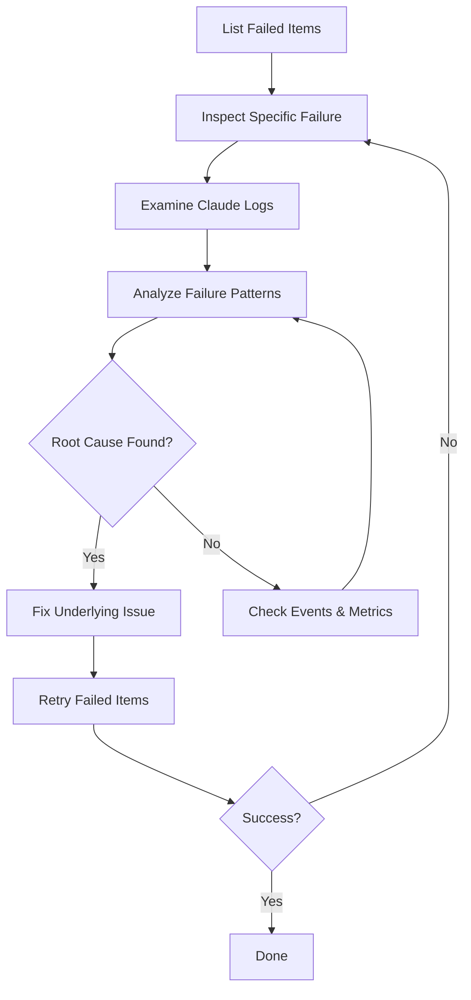
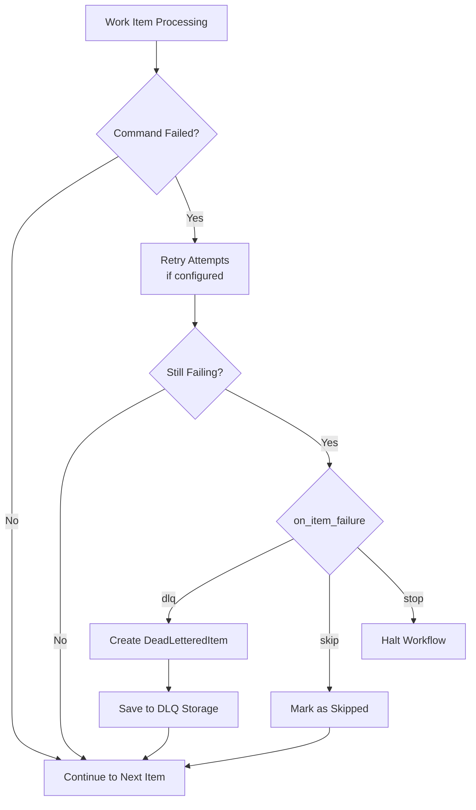

## Debugging with DLQ

### Accessing Claude JSON Logs

Each `FailureDetail` includes a `json_log_location` field pointing to the Claude Code JSON log for that execution. This log contains:
- Complete conversation history
- All tool invocations and results
- Error details and stack traces
- Token usage statistics

=== "With jq Processing"
    ```bash
    # View JSON log from DLQ item
    cat $(prodigy dlq inspect item-123 | jq -r '.failure_history[0].json_log_location')

    # Pretty-print with jq
    cat /path/to/session.json | jq '.'

    # Extract last 3 messages for context
    cat /path/to/session.json | jq '.messages[-3:]'
    ```

=== "Raw Output"
    ```bash
    # View entire log without processing
    cat /path/to/session.json

    # Page through large logs
    less /path/to/session.json
    ```

For more details on Claude JSON logs, see [Retry Metrics and Observability](../../retry-configuration/retry-metrics-and-observability.md).

### Common Debugging Workflow

!!! example "Step-by-Step Debugging"
    Follow this workflow to diagnose and fix failures systematically:



1. **List failed items**:
   ```bash
   prodigy dlq list --job-id mapreduce-1234567890
   ```

2. **Inspect specific failure**:
   ```bash
   prodigy dlq inspect item-123
   ```

3. **Examine Claude logs**:
   ```bash
   cat /path/to/claude-session.json | jq '.messages[-3:]'
   ```

4. **Analyze failure patterns**:
   ```bash
   prodigy dlq analyze --job-id mapreduce-1234567890
   ```

5. **Fix underlying issue** (code bug, config error, etc.)

6. **Retry failed items**:
   ```bash
   prodigy dlq retry mapreduce-1234567890
   ```

### Event-Based Debugging

Use the event system to trace execution flow and identify failure points. Events are stored per job and can be filtered by type, time range, and agent.

!!! tip "Filter Fields"
    The `EventFilter` supports multiple filter criteria for targeted debugging:

    - `job_id` - Filter by job
    - `agent_id` - Filter by agent
    - `event_types` - Filter by event type(s)
    - `time_range` - Filter by time window
    - `correlation_id` - Track related events
    - `limit` - Limit result count

    Source: `src/cook/execution/events/filter.rs:14-21`

#### Event Types for Debugging

<!-- Source: src/cook/execution/events/event_types.rs:11-170 -->

=== "Agent Lifecycle"
    | Event | Description | Key Fields |
    |-------|-------------|------------|
    | `agent_started` | Agent began processing | `agent_id`, `item_id`, `worktree`, `attempt` |
    | `agent_progress` | Progress update | `step`, `progress_pct` |
    | `agent_completed` | Successful completion | `duration`, `commits`, `json_log_location` |
    | `agent_failed` | Agent failure | `error`, `retry_eligible` |
    | `agent_retrying` | Retry attempt | `attempt`, `backoff_ms` |

=== "DLQ Events"
    | Event | Description | Key Fields |
    |-------|-------------|------------|
    | `dlq_item_added` | Item sent to DLQ | `item_id`, `error_signature`, `failure_count` |
    | `dlq_item_removed` | Item removed from DLQ | `item_id` |
    | `dlq_items_reprocessed` | Batch retry completed | `count` |
    | `dlq_items_evicted` | Items expired/evicted | `count` |
    | `dlq_analysis_generated` | Pattern analysis complete | `patterns` |

=== "Checkpoint Events"
    | Event | Description | Key Fields |
    |-------|-------------|------------|
    | `checkpoint_created` | Checkpoint saved | `version`, `agents_completed` |
    | `checkpoint_loaded` | Checkpoint restored | `version` |
    | `checkpoint_failed` | Checkpoint error | `error` |

=== "Claude Events"
    | Event | Description | Key Fields |
    |-------|-------------|------------|
    | `claude_tool_invoked` | Tool call made | `tool_name`, `tool_id`, `parameters` |
    | `claude_token_usage` | Token consumption | `input_tokens`, `output_tokens`, `cache_tokens` |
    | `claude_session_started` | Session initialized | `session_id`, `model`, `tools` |
    | `claude_message` | Message logged | `content`, `message_type`, `json_log_location` |

#### Event Query Examples

```bash
# List all events for a job
prodigy events list --job-id mapreduce-1234567890

# Filter by event type
prodigy events list --job-id mapreduce-1234567890 --type agent_failed

# Filter by agent
prodigy events list --job-id mapreduce-1234567890 --agent-id agent-5

# Filter by time (last 30 minutes)
prodigy events list --job-id mapreduce-1234567890 --since 30

# Combine filters for targeted debugging
prodigy events list --job-id mapreduce-1234567890 \
  --type dlq_item_added \
  --since 60

# Track Claude tool usage for specific agent
prodigy events list --job-id mapreduce-1234567890 \
  --type claude_tool_invoked \
  --agent-id agent-3
```

### Performance Metrics

!!! info "Key Metrics to Monitor"
    Watch these metrics to identify performance issues before they cause failures:

    - **Agent duration**: Time from start to completion
    - **Retry rate**: Percentage of items requiring retries
    - **DLQ rate**: Percentage of items ending in DLQ
    - **Token usage**: Claude token consumption per agent

!!! warning "Performance Red Flags"
    Investigate immediately if you observe:

    - Agent duration > 5 minutes consistently
    - Retry rate > 10% of items
    - DLQ rate > 5% of items
    - Memory pressure events appearing
    - Queue depth not decreasing over time

Calculate success rate from events:

```bash
# Get completion counts
SUCCESSFUL=$(prodigy events list --job-id $JOB_ID --type agent_completed | wc -l) # (1)!
FAILED=$(prodigy events list --job-id $JOB_ID --type agent_failed | wc -l) # (2)!
TOTAL=$((SUCCESSFUL + FAILED))

# Calculate success rate
echo "Success rate: $((SUCCESSFUL * 100 / TOTAL))%" # (3)!
```

1. Count events where agents completed successfully
2. Count events where agents failed after all retries
3. Integer division gives approximate percentage

## Integration with MapReduce

The DLQ is tightly integrated with MapReduce workflows through the `on_item_failure` policy:

```yaml
name: my-workflow
mode: mapreduce

map:
  input: "items.json"    # (1)!
  json_path: "$.items[*]" # (2)!

  on_item_failure: dlq   # (3)!

  agent_template:
    - claude: "/process '${item}'" # (4)!
```

1. JSON file containing work items to process
2. JSONPath expression to extract individual items
3. Send failed items to DLQ instead of stopping workflow
4. Each agent processes one item in an isolated worktree

### Available Policies

- **`dlq`** (default): Failed items sent to DLQ, job continues
- **`retry`**: Immediate retry with exponential backoff
- **`skip`**: Ignore failures, mark as skipped, continue
- **`stop`**: Halt entire workflow on first failure
- **`custom`**: User-defined failure handler

### Failure Flow



DLQ items are saved to:
```
~/.prodigy/dlq/{repo}/{job_id}/mapreduce/dlq/{job_id}/items/{item_id}.json
```
