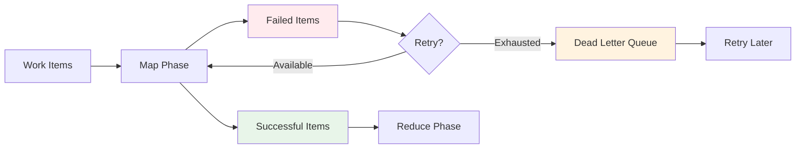

# Dead Letter Queue (DLQ)

The Dead Letter Queue (DLQ) captures persistently failing work items for analysis and retry while allowing MapReduce jobs to continue processing other items. Instead of blocking the entire workflow when individual items fail, the DLQ provides fault tolerance and enables debugging of failure patterns.



**Figure**: DLQ captures failed items after retry exhaustion, allowing the workflow to continue.

## Documentation

- [Overview](overview.md) - Core concepts, storage structure, and item format
- [Commands](commands.md) - CLI commands for managing the DLQ
- [Debugging](debugging.md) - Debugging workflows and MapReduce integration
- [Internals](internals.md) - Best practices and storage internals

## Quick Start

When a map agent fails to process a work item after exhausting retry attempts, the item is automatically sent to the DLQ. This allows the MapReduce job to complete successfully while preserving all failure information for later investigation and reprocessing.

!!! tip "Best Practice"
    Always check the DLQ after MapReduce jobs complete. Even successful jobs may have failed items that need attention.

```bash
# List failed items
prodigy dlq list --job-id mapreduce-1234567890

# Inspect a specific failure
prodigy dlq inspect item-123

# Retry failed items
prodigy dlq retry mapreduce-1234567890
```

## Cross-References

- [Checkpoint and Resume](../checkpoint-and-resume.md): DLQ state preserved in checkpoints
- [Event Tracking](../event-tracking.md): DLQ operations emit trackable events
- [Error Handling](../../workflow-basics/error-handling.md): Broader error handling strategies
- [Worktree Architecture](../../mapreduce-worktree-architecture.md): Agent isolation and artifact preservation
- [Retry Metrics and Observability](../../retry-configuration/retry-metrics-and-observability.md): Monitoring retry behavior and failures
