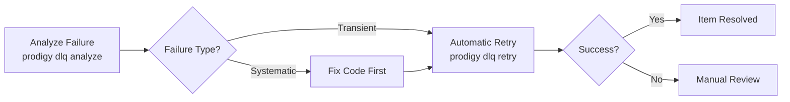

## Best Practices

### When to Retry vs Manual Fix

!!! tip "Choosing the Right Approach"
    Before retrying failed items, analyze the failure patterns with `prodigy dlq analyze` to determine if the issue is transient (safe to retry) or systematic (requires code changes first).



**Automatic Retry** (via `prodigy dlq retry`):

- Transient failures (network timeouts, resource contention)
- Flaky tests or intermittent issues
- Items that may succeed with more resources (`--max-parallel 1`)

**Manual Fix** (code changes, then retry):

- Logic errors in processing code
- Invalid assumptions about item data
- Missing dependencies or configuration
- Systematic failures affecting multiple items

### DLQ Management

1. **Monitor regularly**: Use `prodigy dlq stats` to track failure rates
2. **Analyze patterns**: Run `prodigy dlq analyze` to identify systematic issues
3. **Clean up old items**: Periodically run `prodigy dlq purge` to remove resolved failures
4. **Set review flags**: Mark `manual_review_required: true` for items needing human investigation

### Performance Considerations

!!! warning "Resource Management"
    When retrying large DLQs, start with lower parallelism (e.g., `--max-parallel 5`) to avoid overwhelming system resources. Monitor the first few retries before increasing parallelism.

- **Large DLQs**: Retry command uses streaming to handle thousands of items efficiently
- **Parallelism**: Tune `--max-parallel` based on failure type (CPU-bound vs I/O-bound)
- **Filtering**: Use `--filter` to target specific subsets of failures

## Advanced: DLQ Storage Internals

For advanced debugging or direct file access, understanding the DLQ storage structure can be helpful.

### Index File Structure

The `index.json` file provides metadata about the DLQ (src/cook/execution/dlq.rs:615-644):

```json
// Source: src/cook/execution/dlq.rs:615-644 (update_index function)
{
  "job_id": "mapreduce-1234567890",
  "item_count": 3,
  "item_ids": ["item-123", "item-456", "item-789"],
  "updated_at": "2025-01-11T10:30:00Z"
}
```

This index is automatically updated when items are added or removed from the DLQ.

### Direct File Access

!!! info "Storage Path Structure"
    DLQ items are stored at `~/.prodigy/dlq/{repo}/mapreduce/dlq/{job_id}/items/`. The examples below show paths for a job in the "prodigy" repository.

To inspect DLQ items directly:

```bash
# List all DLQ items for a job
ls ~/.prodigy/dlq/prodigy/mapreduce/dlq/mapreduce-1234567890/items/

# View a specific item
cat ~/.prodigy/dlq/prodigy/mapreduce/dlq/mapreduce-1234567890/items/item-123.json | jq

# Count total items
jq '.item_count' ~/.prodigy/dlq/prodigy/mapreduce/dlq/mapreduce-1234567890/index.json
```

**Note**: Direct file access is provided for debugging. Always use the Prodigy CLI commands for production operations to ensure data consistency.

## Cross-References

- [Checkpoint and Resume](../checkpoint-and-resume.md): DLQ state preserved in checkpoints
- [Event Tracking](../event-tracking.md): DLQ operations emit trackable events
- [Error Handling](../../workflow-basics/error-handling.md): Broader error handling strategies
- [Worktree Storage](../../advanced/storage/worktree-storage.md): Agent isolation and artifact preservation
- [Retry Metrics and Observability](../../retry-configuration/retry-metrics-and-observability.md): Monitoring retry behavior and failures
