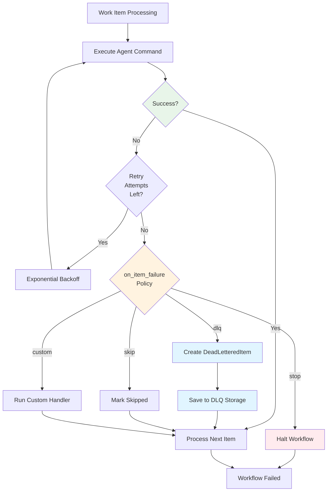

## Dead Letter Queue (DLQ)

The Dead Letter Queue (DLQ) captures persistently failing work items for analysis and retry while allowing MapReduce jobs to continue processing other items. Instead of blocking the entire workflow when individual items fail, the DLQ provides fault tolerance and enables debugging of failure patterns.

### Overview

When a map agent fails to process a work item after exhausting retry attempts, the item is automatically sent to the DLQ. This allows the MapReduce job to complete successfully while preserving all failure information for later investigation and reprocessing.

The DLQ integrates with MapReduce through the `on_item_failure` policy, which defaults to `dlq` for MapReduce workflows. Alternative policies include `retry` (immediate retry), `skip` (ignore failures), `stop` (halt workflow), and `custom` (user-defined handling).



**Figure**: DLQ failure flow showing retry logic and policy-based handling.

### Storage Structure

DLQ data is stored in the global Prodigy directory using this structure:

```
~/.prodigy/dlq/{repo_name}/{job_id}/mapreduce/dlq/{job_id}/
├── items/                  # Individual item files
│   ├── item-123.json      # DeadLetteredItem for item-123
│   ├── item-456.json      # DeadLetteredItem for item-456
│   └── ...
└── index.json             # DLQ index metadata
```

For example:
```
~/.prodigy/dlq/prodigy/mapreduce-1234567890/mapreduce/dlq/mapreduce-1234567890/
├── items/
│   └── item-123.json
└── index.json
```

**Storage Implementation**:
- `GlobalStorage` provides the base path: `~/.prodigy/dlq/{repo_name}/{job_id}` (src/storage/global.rs:47)
- `DLQStorage` adds subdirectories: `mapreduce/dlq/{job_id}` (src/cook/execution/dlq.rs:529)
  - **Note**: The redundant `mapreduce/dlq/{job_id}` subdirectory structure is maintained for backward compatibility with earlier DLQ implementations. This ensures existing DLQ data remains accessible after upgrades.
- Each failed item is stored as a separate JSON file in the `items/` directory (src/cook/execution/dlq.rs:536)
- File naming: `{item_id}.json` (e.g., `item-123.json`)
- `index.json` maintains a list of all item IDs and metadata for fast lookups (src/cook/execution/dlq.rs:608-637)
- Items are loaded into memory on-demand for operations

This global storage architecture enables:
- **Cross-worktree access**: Multiple worktrees working on the same job share DLQ data
- **Persistent state**: DLQ survives worktree cleanup
- **Centralized monitoring**: All failures accessible from a single location
- **Scalability**: Individual item files prevent loading entire DLQ into memory

### DLQ Item Structure

Each failed item in the DLQ is stored as a `DeadLetteredItem` with comprehensive failure information:

```json
{
  "item_id": "item-123",                    // (1)!
  "item_data": { "file": "src/main.rs", "priority": 5 },  // (2)!
  "first_attempt": "2025-01-11T10:25:00Z",  // (3)!
  "last_attempt": "2025-01-11T10:30:00Z",
  "failure_count": 3,                       // (4)!
  "failure_history": [                      // (5)!
    {
      "attempt_number": 1,
      "timestamp": "2025-01-11T10:30:00Z",
      "error_type": { "CommandFailed": { "exit_code": 101 } },
      "error_message": "cargo test failed with exit code 101",
      "stack_trace": "thread 'main' panicked at src/main.rs:42...",
      "agent_id": "agent-1",
      "step_failed": "shell: cargo test",
      "duration_ms": 45000,
      "json_log_location": "/Users/user/.local/state/claude/logs/session-abc123.json"
    }
  ],
  "error_signature": "CommandFailed::cargo test failed with exit",  // (6)!
  "reprocess_eligible": true,               // (7)!
  "manual_review_required": false,
  "worktree_artifacts": {                   // (8)!
    "worktree_path": "/Users/user/.prodigy/worktrees/prodigy/agent-1",
    "branch_name": "agent-1",
    "uncommitted_changes": "src/main.rs modified",
    "error_logs": "error.log contents..."
  }
}
```

1. Unique identifier for the work item
2. Original work item data from input JSON
3. When the item first failed (used for age-based filtering)
4. Number of retry attempts made
5. Complete history of all failure attempts with detailed error information
6. Simplified error pattern for grouping similar failures
7. Whether item can be automatically retried
8. Preserved state from failed agent's execution environment

**Source**: `DeadLetteredItem` struct (src/cook/execution/dlq.rs:32-43)

#### Key Fields

**Source**: `DeadLetteredItem` struct (src/cook/execution/dlq.rs:32-43)

- `item_id`: Unique identifier for the work item
- `item_data`: Original work item data from input JSON
- `first_attempt`: Timestamp of first failure attempt (DateTime<Utc>)
- `last_attempt`: Timestamp of most recent failure attempt (DateTime<Utc>)
- `failure_count`: Number of failed attempts (u32)
- `failure_history`: Array of `FailureDetail` objects capturing each attempt
- `error_signature`: Simplified error pattern for grouping similar failures
- `reprocess_eligible`: Whether item can be retried automatically
- `manual_review_required`: Whether item needs human intervention
- `worktree_artifacts`: Captured state from failed agent's worktree (Optional)

### Failure Detail Fields

Each attempt in `failure_history` is a `FailureDetail` object (src/cook/execution/dlq.rs:46-62):

```json
# Source: src/cook/execution/dlq.rs:46-62 (FailureDetail struct)
{
  "attempt_number": 1,
  "timestamp": "2025-01-11T10:30:00Z",
  "error_type": { "CommandFailed": { "exit_code": 101 } },
  "error_message": "cargo test failed with exit code 101",
  "error_context": [
    "Processing work item item-123",
    "Executing agent commands",
    "Running shell command: cargo test"
  ],
  "stack_trace": "thread 'main' panicked at src/main.rs:42...",
  "agent_id": "agent-1",
  "step_failed": "claude: /process '${item}'",
  "duration_ms": 45000,
  "json_log_location": "/path/to/claude-session.json"
}
```

**Field Details**:
- `attempt_number`: Sequential attempt counter (u32)
- `timestamp`: When this attempt occurred (DateTime<Utc>)
- `error_type`: Error classification (see Error Types below)
- `error_message`: Human-readable error description
- `error_context`: Full error context trail showing operation stack (Optional). This field contains a list of context strings that trace the operation path leading to the failure, making it easier to understand where in the workflow the error occurred.
- `stack_trace`: Optional detailed stack trace
- `agent_id`: ID of the agent that failed
- `step_failed`: Command string that failed (e.g., "shell: cargo test")
- `duration_ms`: How long the attempt ran before failing (u64)
- `json_log_location`: Path to Claude JSON log for debugging (Optional)

#### Error Types

The `error_type` field uses the `ErrorType` enum (src/cook/execution/dlq.rs:65-78):

=== "Execution Errors"
    **`Timeout`**: Agent execution exceeded timeout limit

    **`CommandFailed { exit_code: i32 }`**: Shell or Claude command returned non-zero exit code

    Example:
    ```json
    { "CommandFailed": { "exit_code": 101 } }
    ```

    **`ValidationFailed`**: Post-execution validation command failed

=== "Git Errors"
    **`WorktreeError`**: Git worktree operation failed (creation, cleanup)

    **`MergeConflict`**: Merge back to parent worktree failed

    Common when multiple agents modify the same files.

    **`CommitValidationFailed`**: Required commit was not created

    Occurs when a command has `commit_required: true` but the agent completes without creating any commits (Spec 163). The HEAD SHA is checked before and after command execution to detect new commits.

    !!! tip "Handling CommitValidationFailed"
        Check your agent template to ensure the command creates a commit. Common causes:

        - Agent made changes but forgot to commit
        - Pre-commit hooks rejected the commit
        - No changes were made (nothing to commit)

=== "System Errors"
    **`ResourceExhausted`**: System resources (memory, disk) exhausted

    **`Unknown`**: Unclassified error

    Review `error_message` and `stack_trace` for details.

### Worktree Artifacts

The `WorktreeArtifacts` structure captures the agent's execution environment (src/cook/execution/dlq.rs:81-87):

- `worktree_path`: Path to agent's isolated worktree (PathBuf)
- `branch_name`: Git branch created for agent (String)
- `uncommitted_changes`: Files modified but not committed (Option<String>)
- `error_logs`: Captured error output (Option<String>)

**Note**: Both `uncommitted_changes` and `error_logs` are stored as optional strings, not arrays. If present, they contain descriptive text about the changes/logs rather than file lists.

These artifacts are preserved for debugging and can be accessed after failure.
