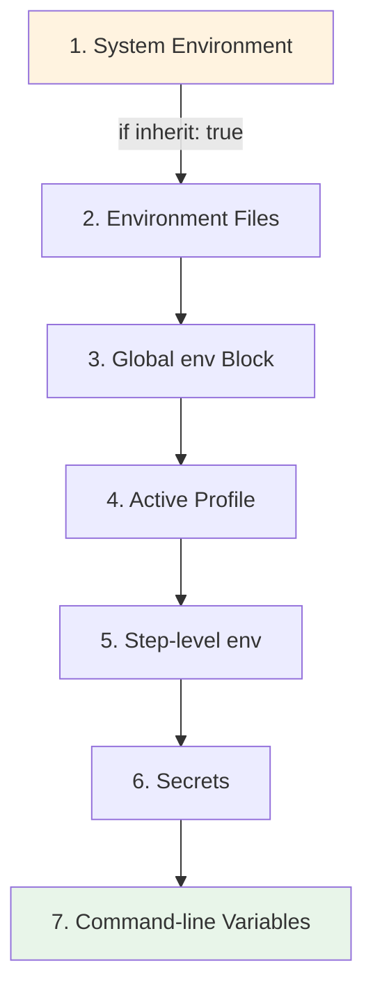

## Environment Variables in Configuration

MapReduce workflows support comprehensive environment variable configuration, enabling parameterized workflows with secrets management, multi-environment deployment, and secure credential handling.

!!! tip "Quick Reference"
    Environment variables can be defined in four locations: `env:` block, `secrets:` block, `env_files:`, and `profiles:`. Later definitions override earlier ones, with command-line variables taking highest precedence.

### Configuration Fields

MapReduce workflows support four types of environment configuration:

**1. Basic Environment Variables (`env`)**

Define static environment variables available throughout the workflow:

```yaml
env:
  MAX_WORKERS: "10"
  AGENT_TIMEOUT: "300"
  PROJECT_NAME: "my-project"
```

**Source**: `src/config/workflow.rs:11-39` - WorkflowConfig struct with `env: HashMap<String, String>` field

**2. Secrets Configuration**

!!! warning "Security Note"
    Secret values are automatically masked in logs, output, events, and checkpoints. Always use environment references (`${env:SECRET_NAME}`) rather than hardcoding secret values in workflow files.

Secrets are defined in a dedicated `secrets:` block (separate from `env:`).

**Source**: `src/config/workflow.rs:24-26` - WorkflowConfig with `secrets: HashMap<String, SecretValue>` field

**Simple Secret Syntax (Recommended for most cases):**

```yaml
secrets:
  # Reference to environment variable
  API_KEY: "${env:SECRET_API_KEY}"

  # Direct secret value (not recommended - use env refs instead)
  DB_PASSWORD: "my-secret-password"
```

**Provider-Based Secret Syntax:**

```yaml
secrets:
  API_TOKEN:
    provider: env
    key: "GITHUB_TOKEN"

  AWS_SECRET:
    provider: aws
    key: "prod/api/credentials"
    version: "v1"  # Optional version
```

**Source**: `src/cook/environment/config.rs:86-96` - SecretValue enum with Simple and Provider variants

**Supported Secret Providers** (defined in `src/cook/environment/config.rs:99-112`):
- `env` - Environment variable reference (fully supported)
- `file` - File-based secrets (fully supported)
- `vault` - HashiCorp Vault integration (planned)
- `aws` - AWS Secrets Manager (planned)
- `custom` - Custom provider support (planned)

**Real-World Examples**:

From `workflows/mapreduce-env-example.yml:22-26`:
```yaml
secrets:
  API_TOKEN:
    provider: env
    key: "GITHUB_TOKEN"
```

From `workflows/environment-example.yml:20-23`:
```yaml
secrets:
  API_KEY: "${env:SECRET_API_KEY}"
```

**3. Environment Files (`env_files`)**

Load environment variables from `.env` files:

```yaml
env_files:
  - ".env"
  - ".env.local"
```

**Source**: `src/config/workflow.rs:11-39` - WorkflowConfig with `env_files: Vec<PathBuf>` field

Files are loaded in order, with later files overriding earlier ones. Standard `.env` format: `KEY=value`

**4. Profiles (`profiles`)**

Environment-specific configurations for different deployment targets:

```yaml
profiles:
  dev:
    API_URL: "http://localhost:3000"
    TIMEOUT: "60"
    MAX_WORKERS: "5"

  prod:
    API_URL: "https://api.prod.com"
    TIMEOUT: "30"
    MAX_WORKERS: "20"
```

**Source**: `src/cook/environment/config.rs:115-124` - EnvProfile struct

Activate a profile with:
```bash
prodigy run workflow.yml --profile prod
```

**Profile Structure**: Each profile contains a HashMap of environment variables and an optional description field for documentation.

### Variable Interpolation

Environment variables can be referenced using two syntaxes:
- `$VAR` - Simple variable reference (shell-style)
- `${VAR}` - Bracketed reference for clarity and complex expressions

**Source**: Verified in `tests/mapreduce_env_execution_test.rs:157-189` - both syntaxes are fully supported

Use `${VAR}` when:
- Variable name is followed by alphanumeric characters
- Embedding in strings or paths
- Preference for explicit syntax

**Interpolation in Environment Values**:

Environment variables can reference other environment variables or system environment variables within their values:

```yaml
env:
  BASE_URL: "https://api.example.com"
  API_ENDPOINT: "${BASE_URL}/v1/data"
  FULL_PATH: "${PROJECT_DIR}/output/${REPORT_FORMAT}"
```

**Source**: `src/cook/environment/config.rs:39-60` - EnvValue supports Static, Dynamic, and Conditional variants

**Real-World Composition Example**:

From `workflows/mapreduce-env-example.yml:78`:
```yaml
env:
  PROJECT_NAME: "my-project"
  OUTPUT_DIR: "output"
  REPORT_FORMAT: "json"

reduce:
  # Composing multiple env vars in a single path
  - shell: "cp summary.$REPORT_FORMAT $OUTPUT_DIR/${PROJECT_NAME}-summary.$REPORT_FORMAT"
```

This demonstrates environment variable composition across different workflow variables to build complex paths dynamically.

**Supported Fields:**
- `max_parallel` - Control parallelism dynamically
- `agent_timeout_secs` - Adjust timeouts per environment
- `setup.timeout` - Configure setup phase timeouts
- `merge.timeout` - Control merge operation timeouts
- Any string field in your workflow (commands, paths, etc.)

**Example from tests** (`tests/mapreduce_env_execution_test.rs:10-52`):
```yaml
env:
  MAX_PARALLEL: "5"
  TIMEOUT_SECONDS: "900"

map:
  max_parallel: ${MAX_PARALLEL}
  agent_timeout_secs: ${TIMEOUT_SECONDS}
```

### Environment Precedence

When the same variable is defined in multiple places, Prodigy applies them in layers. Later layers override earlier ones:



**Precedence order (lowest to highest):**

1. **System environment** - Parent process environment (if `inherit: true`)
2. **Environment files** - Variables loaded from `.env` files (later files override earlier)
3. **Global env block** - Base workflow environment variables
4. **Active profile values** - Variables from the selected profile (`--profile`)
5. **Step-level environment** - Variables defined in individual command `env:` blocks
6. **Secrets** - Resolved and applied after regular variables
7. **Command-line environment variables** - Set when invoking prodigy (highest precedence)

!!! info "Understanding Precedence"
    Variables are applied in sequence during environment setup. Each layer can reference variables from previous layers using `${VAR}` interpolation.

**Source**: `src/cook/environment/manager.rs:88-156` - Environment setup implementation

**Example**:
```bash
# Command-line overrides profile, which overrides base env
MAX_WORKERS=10 prodigy run workflow.yml --profile prod
```

### Complete Example

!!! example "Full Configuration"
    This example demonstrates all four environment configuration types working together: `env`, `secrets`, `env_files`, and `profiles`.

```yaml
name: configurable-mapreduce
mode: mapreduce

# Basic environment variables
env:
  PROJECT_NAME: "data-pipeline"
  VERSION: "1.0.0"
  OUTPUT_DIR: "output"

# Secrets (masked in logs)
secrets:
  API_KEY: "${env:SECRET_API_KEY}"

# Environment files
env_files:
  - ".env"

# Multi-environment profiles
profiles:
  dev:
    MAX_WORKERS: "5"
    API_URL: "http://localhost:3000"
    DEBUG_MODE: "true"

  prod:
    MAX_WORKERS: "20"
    API_URL: "https://api.prod.com"
    DEBUG_MODE: "false"

setup:
  timeout: 300
  commands:
    - shell: "echo Processing $PROJECT_NAME v$VERSION"
    - shell: "mkdir -p $OUTPUT_DIR"
    - shell: "curl -H 'Authorization: Bearer ${API_KEY}' $API_URL/init"

map:
  input: "items.json"
  json_path: "$[*]"
  max_parallel: ${MAX_WORKERS}
  agent_template:
    - claude: "/process ${item} --project $PROJECT_NAME"
    - shell: "curl -H 'Authorization: Bearer ${API_KEY}' $API_URL/items"

reduce:
  - claude: "/summarize ${map.results} --project $PROJECT_NAME"
  - shell: "cp summary.json $OUTPUT_DIR/${PROJECT_NAME}-summary.json"
```

**Source**: Based on `workflows/mapreduce-env-example.yml:1-94` with structure validated against `src/config/mapreduce.rs:15-82`

### Running with Different Configurations

```bash
# Development environment
prodigy run workflow.yml --profile dev

# Production environment
prodigy run workflow.yml --profile prod

# Override specific variables (command-line takes precedence)
MAX_WORKERS=10 prodigy run workflow.yml --profile prod

# Local development with .env file
echo "MAX_WORKERS=3" > .env
prodigy run workflow.yml
```

**Source**: Precedence behavior verified in `src/cook/environment/manager.rs:88-156`

### Step-Level Environment Overrides

Individual commands can override environment variables:

```yaml
map:
  agent_template:
    - shell: "process-item.sh"
      env:
        CUSTOM_VAR: "value"
        PATH: "/custom/bin:${PATH}"
```

**Source**: `src/cook/environment/config.rs:127-144` - StepEnvironment struct with `env`, `working_dir`, `clear_env`, and `temporary` fields

Step-level variables inherit from global `env` and active `profiles`, with step-level values taking precedence.

**Advanced Step Environment Features** (`tests/environment_workflow_test.rs:42-70`):
- `clear_env: true` - Start with clean environment except step-specific vars
- `temporary: true` - Restore environment after step execution
- `working_dir` - Set working directory for the step

**Debug Environment Resolution:**

```bash
# Run with debug output to see environment resolution
prodigy run workflow.yml -vv --profile dev

# Output will show:
# - PASSWORD as ***REDACTED***
# - API_KEY as ***REDACTED***
# - Normal variables displayed in full
```

### Cross-References

For comprehensive environment variable documentation, see:
- [Variables Chapter](../variables/index.md) - Complete guide to environment variables and interpolation
- [Environment Configuration](../environment/index.md) - Detailed environment management patterns
- [MapReduce Environment Variables](../environment/mapreduce-environment-variables.md) - MapReduce-specific environment features
- [Secrets Management](../environment/secrets-management.md) - Security best practices for secrets
- [Environment Profiles](../environment/environment-profiles.md) - Multi-environment deployment patterns
- [Setup Phase](./setup-phase-advanced.md) - Using environment variables in setup commands
- [MapReduce Index](./index.md) - Main MapReduce workflow documentation
