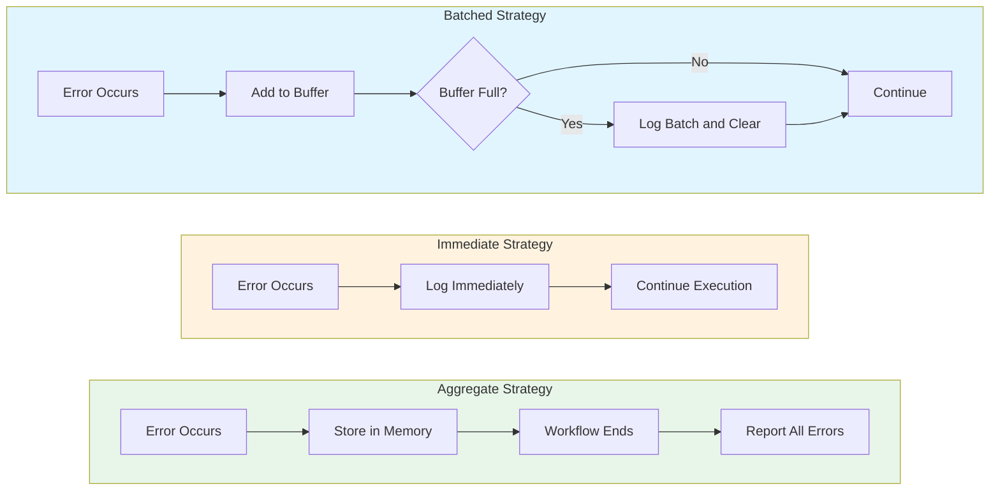

## Error Collection Strategies

The `error_collection` field controls how errors are reported during workflow execution.



**Figure**: Error collection strategies showing when errors are logged and reported.

### Syntax Flexibility

Error collection can be configured in two ways for backward compatibility:

**Top-level convenience syntax** (recommended for simple workflows):
```yaml
name: my-workflow
mode: mapreduce

error_collection: aggregate  # Top-level field

map:
  # ... map configuration
```

**Nested under error_policy block** (recommended when using other error policy features):
```yaml
name: my-workflow
mode: mapreduce

error_policy:
  error_collection: aggregate
  continue_on_failure: true
  max_failures: 10
  # ... other error policy fields

map:
  # ... map configuration
```

Both syntaxes are fully supported. Use the top-level syntax for simplicity, or the nested syntax when configuring multiple error policy fields together.

### Available Strategies

#### Aggregate (default)

```yaml
error_collection: aggregate
```

- Collects all errors in memory and reports at workflow end
- Errors are stored as they occur but not logged
- Full error list displayed when workflow completes

!!! tip "When to use"
    Use for final summary reports or batch processing where individual failures don't need immediate attention.

!!! info "Trade-off"
    Low noise during execution, but you won't see errors until workflow completion.

#### Immediate

```yaml
error_collection: immediate
```

- Logs each error as soon as it happens via `warn!` level logging
- No error collection in memory
- Errors visible in real-time during execution

!!! tip "When to use"
    Use for debugging, development, or real-time monitoring scenarios.

!!! info "Trade-off"
    More verbose output, but provides immediate visibility into failures.

#### Batched

```yaml
error_collection: batched:10
```

- Collects errors in memory until batch size is reached
- When N errors collected, logs the entire batch via `warn!` level logging and automatically clears the buffer

!!! tip "When to use"
    Use for progress updates without spam, or monitoring long-running jobs.

!!! info "Trade-off"
    Balances noise and visibility (e.g., `batched:10` reports every 10 failures).

!!! note "Implementation detail"
    Buffer is cleared using `drain(..)` after each batch is logged.

    ```rust
    // Source: src/cook/workflow/error_policy.rs:594
    for err in errors.drain(..) {
        warn!("  - {}", err);
    }
    ```

### Complete Example

Combining error collection with other error policy features:

```yaml
name: data-processing
mode: mapreduce

error_policy:
  error_collection: batched:5  # (1)!
  on_item_failure: dlq         # (2)!
  continue_on_failure: true    # (3)!
  failure_threshold: 0.3       # (4)!

map:
  input: "items.json"
  json_path: "$.items[*]"
  agent_template:
    - claude: "/process '${item}'"
```

1. Report errors in batches of 5 - balances noise with visibility
2. Send failed items to Dead Letter Queue for later retry
3. Continue processing remaining items even when some fail
4. Stop workflow if more than 30% of items fail

!!! note "Default behavior"
    If `error_collection` is not specified, the default behavior is `aggregate`.

See also: [Error Handling](../workflow-basics/error-handling.md), [Dead Letter Queue](dead-letter-queue-dlq.md)
