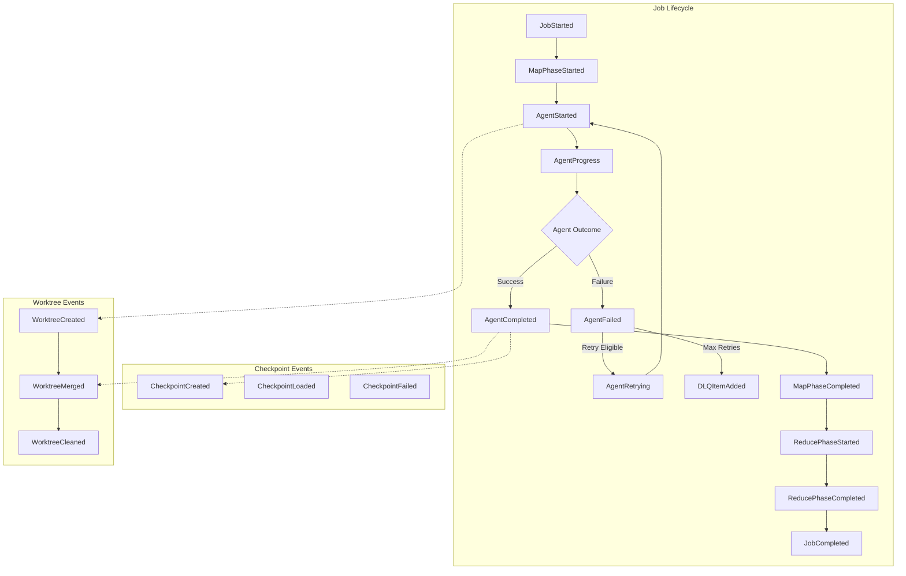
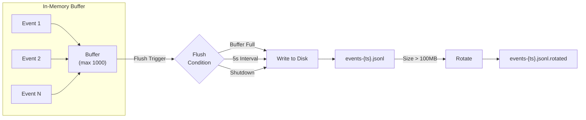

## Event Tracking

All MapReduce execution events are logged to `~/.prodigy/events/{repo_name}/{job_id}/` for debugging and monitoring. Prodigy provides comprehensive event tracking with correlation IDs, metadata enrichment, buffering, and powerful CLI tools for querying and analysis.

### Event Flow Overview



### Event Types

Prodigy tracks 24 event types across different categories:

#### Job Lifecycle Events

| Event | Description | Key Fields |
|-------|-------------|------------|
| `job_started` | Job begins execution | `config`, `total_items`, `timestamp` |
| `job_completed` | Job finishes | `duration`, `success_count`, `failure_count` |
| `job_failed` | Job fails with error | `error`, `partial_results` |
| `job_paused` | Job paused for checkpoint | `checkpoint_version` |
| `job_resumed` | Job resumed from checkpoint | `checkpoint_version`, `pending_items` |

#### Agent Lifecycle Events

| Event | Description | Key Fields |
|-------|-------------|------------|
| `agent_started` | Agent begins processing | `item_id`, `worktree`, `attempt` |
| `agent_progress` | Agent reports progress | `step`, `progress_pct` |
| `agent_completed` | Agent finishes successfully | `duration`, `commits`, `cleanup_status`, `json_log_location` |
| `agent_failed` | Agent fails with error | `error`, `retry_eligible`, `failure_reason`, `json_log_location` |
| `agent_retrying` | Agent retries after failure | `attempt`, `backoff_ms` |

!!! info "Failure Reasons"
    The `failure_reason` field in `agent_failed` events uses the `FailureReason` enum:

    - `Timeout` - Agent execution timed out
    - `CommandFailed { exit_code }` - Command failed with exit code
    - `CommitValidationFailed { command }` - Required commit was not created
    - `MergeConflict` - Merge conflict or merge failure
    - `WorktreeError` - Worktree creation or management error
    - `Unknown` - Unknown or unclassified failure

    **Source**: `src/cook/execution/mapreduce/event.rs:11-25`

#### Phase Events

| Event | Description | Key Fields |
|-------|-------------|------------|
| `map_phase_started` | Map phase begins | `total_items`, `timestamp` |
| `map_phase_completed` | Map phase finishes | `successful`, `failed`, `timestamp` |
| `reduce_phase_started` | Reduce phase begins | `timestamp` |
| `reduce_phase_completed` | Reduce phase finishes | `timestamp` |

#### Checkpoint Events

| Event | Description | Key Fields |
|-------|-------------|------------|
| `checkpoint_created` | Checkpoint saved | `version`, `agents_completed` |
| `checkpoint_loaded` | Checkpoint loaded for resume | `version` |
| `checkpoint_failed` | Checkpoint operation failed | `error` |

#### Worktree Events

| Event | Description | Key Fields |
|-------|-------------|------------|
| `worktree_created` | Git worktree created for agent | `worktree_name`, `branch` |
| `worktree_merged` | Agent changes merged to target branch | `target_branch` |
| `worktree_cleaned` | Worktree removed after completion | `worktree_name` |

#### Performance Monitoring Events

| Event | Description | Key Fields |
|-------|-------------|------------|
| `queue_depth_changed` | Work queue status update | `pending`, `active`, `completed` |
| `memory_pressure` | Resource usage monitoring | `used_mb`, `limit_mb` |

#### Dead Letter Queue Events

| Event | Description | Key Fields |
|-------|-------------|------------|
| `dlq_item_added` | Failed item added to DLQ | `item_id`, `error_signature`, `failure_count` |
| `dlq_item_removed` | Item removed from DLQ (successful retry) | `item_id` |
| `dlq_items_reprocessed` | Batch reprocessing of DLQ items | `count` |
| `dlq_items_evicted` | Old DLQ items evicted per retention policy | `count` |
| `dlq_analysis_generated` | Error pattern analysis completed | `patterns` |

#### Claude Observability Events

| Event | Description | Key Fields |
|-------|-------------|------------|
| `claude_tool_invoked` | Claude tool use | `tool_name`, `tool_id`, `parameters` |
| `claude_token_usage` | Token consumption | `input_tokens`, `output_tokens`, `cache_tokens` |
| `claude_session_started` | Claude session initialized | `session_id`, `model`, `tools` |
| `claude_message` | Claude message | `content`, `message_type`, `json_log_location` |

### Event Record Structure

Each event is wrapped in an `EventRecord` with rich metadata:

```json
{
  "id": "550e8400-e29b-41d4-a716-446655440000", // (1)!
  "timestamp": "2024-01-01T12:00:00Z",
  "correlation_id": "workflow-abc123", // (2)!
  "event": {
    "event_type": "agent_completed", // (3)!
    "job_id": "mapreduce-xyz789",
    "agent_id": "agent-1",
    "item_id": "item-1",
    "duration": { "secs": 45, "nanos": 0 },
    "cleanup_status": "Success",
    "commits": ["a1b2c3d"],
    "json_log_location": "/home/user/.local/state/claude/logs/session-xyz.json" // (4)!
  },
  "metadata": { // (5)!
    "host": "worker-01",
    "pid": 12345,
    "thread": "tokio-runtime-worker"
  }
}
```

1. Unique UUID for deduplication and tracing
2. Links all events from the same workflow execution
3. Tagged enum discriminator - determines event-specific fields
4. Path to full Claude JSON log for debugging
5. Extensible runtime context - add custom fields via `log_with_metadata`

!!! note "Serialization Format"
    The `event_type` field is serialized using serde's tagged enum format (`#[serde(tag = "event_type", rename_all = "snake_case")]`), which means it appears as a sibling field alongside other event-specific fields within the `event` object.

**Fields:**

- `id` - Unique UUID for this event
- `timestamp` - When the event occurred (UTC)
- `correlation_id` - Links related events across agents and phases
- `event` - The actual event data (varies by type)
- `metadata` - Runtime context (host, process ID, thread). This field is extensible and supports custom fields via the `log_with_metadata` method for application-specific tracking needs.

**Source**: EventRecord definition in `src/cook/execution/events/event_logger.rs:17-25`

### Event Storage

**Location:**
`~/.prodigy/events/{repo_name}/{job_id}/events-{timestamp}.jsonl`

**Format:**
Events are stored in JSONL (JSON Lines) format with one event per line.

#### Buffering and Rotation Flow



**Figure**: Event buffering flow showing in-memory collection, flush triggers, and file rotation.

**Buffering:**

- Events are buffered in memory before being written to disk
- **Default buffer size**: 1000 events
- **Default flush interval**: 5 seconds
- Background flush task runs automatically
- Buffer size and flush interval are configurable

**Source**: EventLogger configuration in `src/cook/execution/events/event_logger.rs:44-45`

!!! tip "Performance Consideration"
    Buffering reduces disk I/O during high-throughput MapReduce jobs. Events are guaranteed to flush on graceful shutdown, but an unexpected crash may lose buffered events.

**File Rotation:**

- Log files automatically rotate at 100MB (configurable via `with_rotation()`)
- Rotated files are moved with timestamp suffix: `events-{timestamp}.jsonl.rotated`
- Compression support is implemented but currently moves files without actual compression (marked as TODO in implementation)
- Cross-worktree event aggregation for parallel jobs

**Source**: Rotation implementation in `src/cook/execution/events/event_writer.rs`

### Correlation IDs

Each workflow run has a unique `correlation_id` that links all related events:

```bash
# All events from the same workflow share correlation_id
# Makes it easy to trace execution flow across agents
```

Use correlation IDs to:

- Trace work item through multiple retries
- Link agent execution to parent job
- Track checkpoint saves and resumes
- Debug cross-agent dependencies

### Viewing Events with CLI

!!! warning "Event File Paths"
    The CLI commands use `.prodigy/events/mapreduce_events.jsonl` as the default path for backward compatibility. However, MapReduce workflows using global storage write events to `~/.prodigy/events/{repo_name}/{job_id}/events-{timestamp}.jsonl`. Use the `--file` flag to specify the global storage path when querying events from MapReduce jobs.

**Source**: CLI default paths in `src/cli/events/mod.rs`

#### List Events

```bash
# List all events for a job (local storage)
prodigy events ls --job-id <job_id>

# List events from global storage
prodigy events ls --job-id <job_id> --file ~/.prodigy/events/{repo_name}/{job_id}/events-{timestamp}.jsonl

# Filter by event type
prodigy events ls --job-id <job_id> --event-type agent_completed

# Filter by agent
prodigy events ls --job-id <job_id> --agent-id agent-1

# Recent events only (last N minutes)
prodigy events ls --job-id <job_id> --since 30

# Limit results
prodigy events ls --job-id <job_id> --limit 50
```

#### Event Statistics

```bash
# Show statistics grouped by event type
prodigy events stats

# Group by job ID
prodigy events stats --group-by job_id

# Group by agent ID
prodigy events stats --group-by agent_id
```

#### Search Events

```bash
# Search by pattern (regex supported)
prodigy events search "error|failed"

# Search in specific fields only
prodigy events search "timeout" --fields error,description
```

#### Follow Events Live

```bash
# Stream events in real-time (tail -f style)
prodigy events follow --job-id <job_id>

# Filter while following
prodigy events follow --job-id <job_id> --event-type agent_failed
```

#### Clean Old Events

```bash
# Preview cleanup (dry run)
prodigy events clean --older-than 30d --dry-run

# Keep only recent events
prodigy events clean --max-events 10000

# Size-based retention
prodigy events clean --max-size 100MB

# Archive instead of delete
prodigy events clean --older-than 7d --archive --archive-path /backup/events
```

!!! note "Cleanup Confirmation"
    Cleanup operations require user confirmation unless running in automation mode (`PRODIGY_AUTOMATION=true`) or using `--dry-run` to preview changes.

**Source**: Cleanup confirmation logic in `src/cli/events/mod.rs:591-627`

### Event Filtering with jq

For advanced event analysis, use `jq` to filter and query JSONL event files:

```bash
# Count events by type
cat events.jsonl | jq -s 'group_by(.event.event_type) | map({type: .[0].event.event_type, count: length})'

# Find all failed agents
cat events.jsonl | jq 'select(.event.event_type == "agent_failed")'

# Extract agent durations
cat events.jsonl | jq 'select(.event.event_type == "agent_completed") | {agent: .event.agent_id, duration: .event.duration}'

# Get events within time range
cat events.jsonl | jq 'select(.timestamp >= "2024-01-01T00:00:00Z" and .timestamp <= "2024-01-02T00:00:00Z")'

# Find events by correlation ID
cat events.jsonl | jq 'select(.correlation_id == "workflow-abc123")'
```

### Debugging with Events

**Common debugging scenarios:**

=== "Track Failed Agent"
    ```bash
    # Find all events for failed agent
    prodigy events ls --job-id <job_id> --agent-id <agent_id>

    # Check Claude JSON log from AgentCompleted event
    cat <json_log_location>

    # Get detailed failure reason
    prodigy events ls --job-id <job_id> --event-type agent_failed | jq '.event.failure_reason'
    ```

=== "Analyze Performance"
    ```bash
    # Monitor queue depth changes
    prodigy events ls --event-type queue_depth_changed

    # Check memory pressure events
    prodigy events ls --event-type memory_pressure

    # Calculate average agent duration
    cat events.jsonl | jq -s '[.[] | select(.event.event_type == "agent_completed") | .event.duration.secs] | add / length'
    ```

=== "Debug Checkpoints"
    ```bash
    # Find checkpoint events
    prodigy events ls --event-type checkpoint_created
    prodigy events ls --event-type checkpoint_failed

    # Check checkpoint versions
    cat events.jsonl | jq 'select(.event.event_type == "checkpoint_created") | {version: .event.version, agents: .event.agents_completed}'
    ```

=== "Review DLQ Patterns"
    ```bash
    # See DLQ additions
    prodigy events ls --event-type dlq_item_added

    # Check error pattern analysis
    prodigy events ls --event-type dlq_analysis_generated

    # Group failures by error signature
    cat events.jsonl | jq -s '[.[] | select(.event.event_type == "dlq_item_added")] | group_by(.event.error_signature) | map({signature: .[0].event.error_signature, count: length})'
    ```

=== "Trace Workflow"
    ```bash
    # Filter events by correlation_id to trace entire workflow execution
    prodigy events search "<correlation_id>"

    # Find correlation_id from recent job
    prodigy events ls --job-id <job_id> --limit 1

    # Get full timeline for correlation ID
    cat events.jsonl | jq 'select(.correlation_id == "<id>")' | jq -s 'sort_by(.timestamp)'
    ```

### Troubleshooting

**Events not being written:**

- Check event file permissions in `~/.prodigy/events/{repo_name}/{job_id}/`
- Verify directory exists and is writable
- Check disk space availability
- Review buffer configuration if events are delayed

**Missing events:**

- Events may be buffered (default: 5 second flush interval)
- Check if logger was properly shut down (ensures buffer flush)
- Verify event type filter isn't excluding events

**Duplicate events:**

- Check if multiple loggers are writing to same file
- Verify correlation IDs to identify duplicate sources

### Cross-References

- See [Checkpoint and Resume](checkpoint-and-resume.md) for checkpoint events
- See [Dead Letter Queue (DLQ)](dead-letter-queue-dlq.md) for DLQ event details
- See [Retry Metrics and Observability](../retry-configuration/retry-metrics-and-observability.md) for retry-specific monitoring
- See [Claude Observability](../advanced/observability/claude-observability.md) for Claude-specific events
