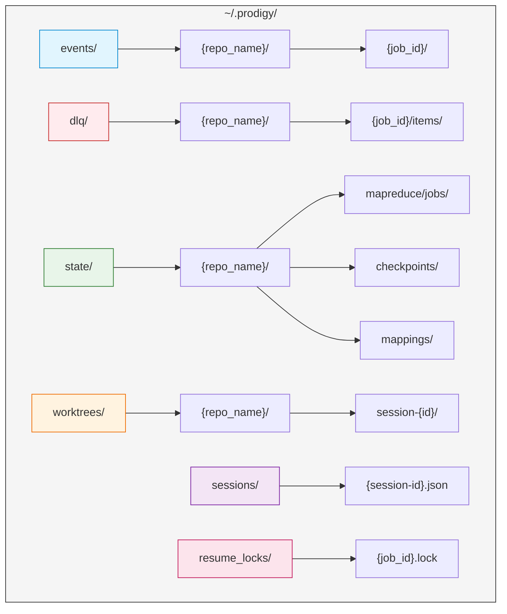
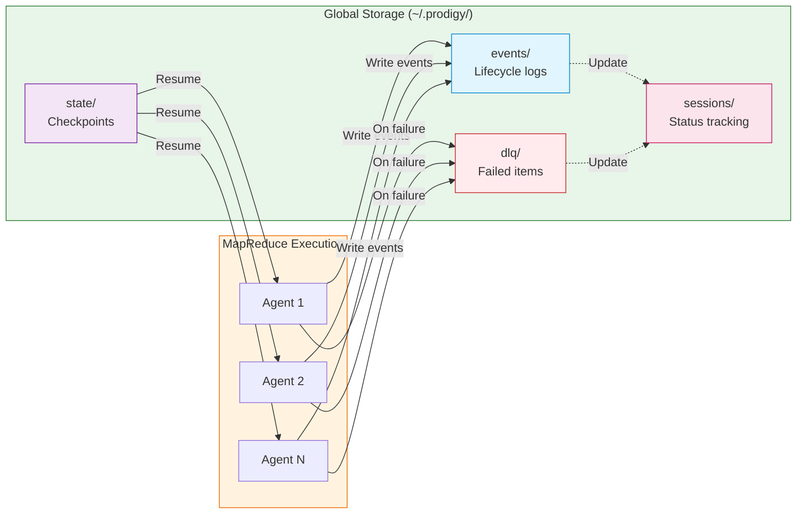

## Global Storage Architecture

MapReduce workflows use a global storage architecture located in `~/.prodigy/` (not `.prodigy/` in your project directory). This architecture replaced the legacy local storage system and is now the default for all Prodigy workflows.

### Benefits

Global storage provides several key advantages for MapReduce workflows:

- **Cross-worktree event aggregation**: When multiple worktrees process the same MapReduce job, all agents write to `~/.prodigy/events/{repo_name}/{job_id}/`, enabling unified monitoring across all parallel agents without manual log aggregation.

- **Persistent state management**: Job checkpoints and state files stored in `~/.prodigy/state/` survive worktree cleanup. You can delete agent worktrees after completion while preserving full job history and resume capability.

- **Centralized monitoring**: All job data is accessible from a single location (`~/.prodigy/`), making it easy to track multiple concurrent jobs, review historical executions, and debug failures across different worktrees and repositories.

- **Efficient storage**: Shared event logs, DLQ data, and checkpoints are deduplicated across worktrees, reducing disk usage when multiple agents process the same job.

### Directory Structure

The global storage directory is organized by repository name to isolate data between different projects:

```
~/.prodigy/
├── events/                    # Event logs for all MapReduce jobs
│   └── {repo_name}/          # Events for specific repository
│       └── {job_id}/         # Events for specific job
│           └── events-{timestamp}.jsonl
├── dlq/                      # Dead Letter Queue for failed work items
│   └── {repo_name}/          # DLQ for specific repository
│       └── {job_id}/         # Failed items for specific job
│           └── items/        # Individual failed item files
├── state/                    # State and checkpoints for jobs
│   └── {repo_name}/          # State for specific repository
│       ├── mapreduce/        # MapReduce job state
│       │   └── jobs/         # Individual job directories
│       │       └── {job_id}/ # Job-specific state and checkpoints
│       ├── checkpoints/      # Legacy checkpoint storage
│       └── mappings/         # Session-to-job ID mappings
├── worktrees/                # Git worktrees for sessions
│   └── {repo_name}/          # Worktrees for specific repository
│       └── session-{id}/     # Session-specific worktree
├── sessions/                 # Unified session tracking
│   └── {session-id}.json    # Session metadata and status
├── resume_locks/             # Concurrent resume protection
│   └── {job_id}.lock        # Lock file for job resume
└── logs/                     # Claude execution logs
    └── {repo_name}/          # Logs for specific repository
        └── {timestamp}/      # Log files by timestamp
```



### Data Flow

The following diagram shows how data flows through the global storage system during MapReduce execution:



This architecture enables:

- **Unified monitoring**: All agents write to the same event log location
- **Failure isolation**: Failed items go to DLQ without affecting other agents
- **Seamless resume**: Checkpoints allow any interrupted agent to resume from where it left off

### Storage Components

#### Events

Event logs capture the complete lifecycle of MapReduce jobs in JSONL format (newline-delimited JSON):

- **Path pattern**: `~/.prodigy/events/{repo_name}/{job_id}/events-{timestamp}.jsonl`
- **Content**: Agent lifecycle events (started, completed, failed), work item processing status, checkpoint saves, Claude messages, and error details
- **Usage**: Real-time monitoring, debugging agent failures, auditing job execution
- **Cross-reference**: See [Event Tracking](./event-tracking.md) for detailed event types and usage

#### DLQ (Dead Letter Queue)

Failed work items are stored with full context for retry and debugging:

- **Path pattern**: `~/.prodigy/dlq/{repo_name}/{job_id}/items/{item-id}.json`
- **Content**: Original work item data, failure reason, retry count, timestamps, error context
- **Usage**: Review failed items, retry with `prodigy dlq retry`, analyze failure patterns
- **Cross-reference**: See [Dead Letter Queue](./dead-letter-queue-dlq.md) for DLQ operations and retry strategies

#### State

Job state and checkpoints enable resume and recovery:

- **Path pattern**: `~/.prodigy/state/{repo_name}/mapreduce/jobs/{job_id}/`
- **Content**: Setup checkpoints, map phase progress, reduce phase state, job metadata
- **Additional storage**: Session-job ID mappings stored in `state/{repo_name}/mappings/` for bidirectional resume lookup (session ID ↔ job ID)
- **Usage**: Resume interrupted jobs, track execution progress, recover from failures
- **Cross-reference**: See [Checkpoint and Resume](./checkpoint-and-resume.md) for checkpoint structure and resume behavior

The state directory includes session-job ID mappings (src/storage/session_job_mapping.rs) that enable resume operations to work with either session IDs or job IDs, providing flexibility in workflow recovery.

#### Worktrees

Isolated git worktrees for parallel execution:

- **Path pattern**: `~/.prodigy/worktrees/{repo_name}/session-{id}/`
- **Content**: Git worktree for session/agent execution, temporary files, execution artifacts
- **Usage**: Isolated execution environment, parallel agent processing, clean separation from main repo
- **Cross-reference**: See [MapReduce Worktree Architecture](../mapreduce-worktree-architecture.md) for worktree isolation details

#### Sessions

Unified session tracking for all workflow executions (src/unified_session/):

- **Path pattern**: `~/.prodigy/sessions/{session-id}.json`
- **Content**: Session status (Initializing, Running, Paused, Completed, Failed, Cancelled), timing data, workflow metadata, checkpoint references, execution progress
- **Session types**: Workflow sessions and MapReduce sessions with phase-specific data
- **Usage**: Track active sessions, resume interrupted workflows, monitor execution time, correlate with job IDs
- **Integration**: Works with session-job mappings for flexible resume operations

??? info "Session Status Values"
    The unified session system tracks six distinct states (src/unified_session/state.rs:91-99):

    | Status | Description |
    |--------|-------------|
    | `Initializing` | Session created, setting up environment |
    | `Running` | Active execution in progress |
    | `Paused` | Execution temporarily suspended |
    | `Completed` | Successful completion |
    | `Failed` | Execution failed with error |
    | `Cancelled` | User cancelled the session |

The unified session system provides a single source of truth for all workflow executions, whether standard workflows or MapReduce jobs. Each session file contains complete metadata about the execution state, progress, and timing information.

#### Resume Locks

Concurrent resume protection to prevent conflicts:

- **Path pattern**: `~/.prodigy/resume_locks/{job_id}.lock`
- **Content**: Process ID, hostname, acquisition timestamp, job/session ID
- **Usage**: Prevent multiple resume processes on same job, automatic stale lock cleanup

### Repository Isolation

Storage is automatically organized by repository name (extracted from your project path) to enable multiple projects to use global storage without conflicts.

The repository name is determined using the `extract_repo_name()` function (src/storage/mod.rs:42-59), which:

1. Canonicalizes the project path to resolve symlinks
2. Extracts the final path component as the repository name
3. Example: `/path/to/my-project` → `my-project`

Key isolation features:

- All storage paths include `{repo_name}` to isolate data between repositories
- You can work on multiple Prodigy projects simultaneously without storage collisions
- Each repository has independent events, DLQ, state, and worktrees
- Repository names are consistent even when accessing via symlinks (due to canonicalization)

### Configuration

#### PRODIGY_HOME Environment Variable

!!! tip "Custom Storage Location"
    The default global storage location (`~/.prodigy/`) can be overridden using the `PRODIGY_HOME` environment variable.

```bash
# Use custom storage location
export PRODIGY_HOME=/mnt/fast-storage/prodigy
prodigy run workflow.yml

# Useful for testing with isolated storage
export PRODIGY_HOME=/tmp/prodigy-test
prodigy run test-workflow.yml
```

This is particularly useful for:

- **Testing**: Isolate test runs from production data
- **Custom deployments**: Use specific storage locations (network mounts, SSDs, etc.)
- **Multi-user systems**: Separate storage per user or team
- **CI/CD**: Use temporary storage that's cleaned up after runs

### Examples

=== "Inspecting Storage"

    Check disk usage of global storage:
    ```bash
    du -sh ~/.prodigy/*
    # Output:
    # 150M    /Users/you/.prodigy/events
    # 25M     /Users/you/.prodigy/dlq
    # 80M     /Users/you/.prodigy/state
    # 200M    /Users/you/.prodigy/worktrees
    ```

    Find all data for a specific job:
    ```bash
    # Find events
    ls ~/.prodigy/events/my-repo/mapreduce-20250111_120000/

    # Check for DLQ items
    ls ~/.prodigy/dlq/my-repo/mapreduce-20250111_120000/items/

    # View checkpoints
    ls ~/.prodigy/state/my-repo/mapreduce/jobs/mapreduce-20250111_120000/
    ```

    List all repositories using global storage:
    ```bash
    ls ~/.prodigy/events/
    # Output:
    # my-project/
    # another-repo/
    # test-project/
    ```

=== "Maintenance"

    Clean up old job data:
    ```bash
    # Remove old event logs (older than 30 days)
    find ~/.prodigy/events -type d -mtime +30 -exec rm -rf {} +

    # Clear processed DLQ items for a workflow
    prodigy dlq clear <workflow_id>

    # Purge old DLQ items (older than N days)
    prodigy dlq purge --older-than-days 30

    # Remove orphaned worktrees after failed cleanup
    prodigy worktree clean-orphaned <job_id>
    ```

=== "Monitoring"

    Monitor storage and sessions:
    ```bash
    # List active sessions and their status
    prodigy sessions list

    # Show details about a specific session
    prodigy sessions show <session_id>

    # View DLQ statistics for a workflow
    prodigy dlq stats --workflow-id <workflow_id>

    # Analyze failure patterns in DLQ
    prodigy dlq analyze --job-id <job_id>

    # Check resume locks (detect stuck jobs)
    ls ~/.prodigy/resume_locks/

    # List all repositories using global storage
    ls ~/.prodigy/events/
    ```

### DLQ Commands Reference

!!! note "Available Commands"
    The following DLQ subcommands are available (src/cli/args.rs:534-631):

| Command | Description |
|---------|-------------|
| `list` | List items in the Dead Letter Queue |
| `inspect` | Inspect a specific DLQ item |
| `analyze` | Analyze failure patterns |
| `export` | Export DLQ items to a file |
| `purge` | Purge old items from the DLQ |
| `retry` | Retry failed items |
| `stats` | Show DLQ statistics |
| `clear` | Clear processed items from DLQ |

!!! warning "Internal API"
    The `health_check()` method exists in the GlobalStorage implementation (src/storage/global.rs:115) but is not currently exposed as a CLI command. It's used internally for programmatic health verification.
