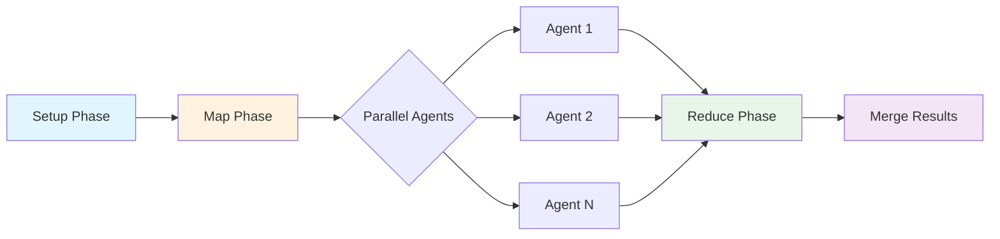
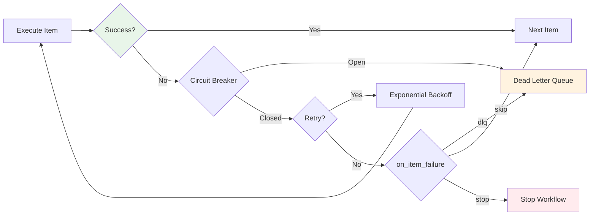

# MapReduce Workflows

MapReduce workflows enable parallel processing of work items across isolated git worktrees. This is Prodigy's most powerful feature for handling large-scale automation tasks.



## Quick Start

!!! tip "Prerequisites"
    Make sure you have [Prodigy installed](../installation.md) with Claude Code CLI available.

Here's a minimal working example:

```yaml title="workflow.yml"
name: my-first-mapreduce
mode: mapreduce

# Generate work items
setup:
  - shell: "echo '[{\"id\": 1, \"name\": \"task-1\"}, {\"id\": 2, \"name\": \"task-2\"}]' > items.json"

# Process items in parallel
map:
  input: "items.json"
  json_path: "$[*]"
  agent_template:
    - shell: "echo Processing ${item.name}"
  max_parallel: 5

# Aggregate results
reduce:
  - shell: "echo Completed ${map.successful}/${map.total} items"
```

Run it:

```bash
prodigy run workflow.yml
```

That's it! Now let's explore the full capabilities.

## Complete Structure

=== "Modern Syntax (Recommended)"

    ```yaml title="workflow.yml"
    name: parallel-processing
    mode: mapreduce

    # Optional setup phase
    setup:
      - shell: "generate-work-items.sh"
      - shell: "debtmap analyze . --output items.json"

    # Map phase: Process items in parallel
    map:
      input: "items.json"  # (1)!
      json_path: "$.items[*]"  # (2)!

      # Commands directly under agent_template
      agent_template:
        - claude: "/process '${item}'"
        - shell: "test ${item.path}"
          on_failure:
            claude: "/fix-issue '${item}'"

      max_parallel: 10  # (3)!

      # Optional: Work item controls
      filter: "item.score >= 5"
      sort_by: "item.priority DESC"
      max_items: 100
      offset: 10
      distinct: "item.id"

      # Optional: Agent timeout
      agent_timeout_secs: 300

    # Reduce phase: Aggregate results
    reduce:
      - claude: "/summarize ${map.results}"
      - shell: "echo 'Processed ${map.successful}/${map.total} items'"

    # Optional: Custom merge workflow
    merge:
      - shell: "git fetch origin"
      - claude: "/merge-worktree ${merge.source_branch}"
      - shell: "cargo test"
    ```

    1. Input source - JSON file or shell command output
    2. JSONPath expression to extract work items
    3. Can also use environment variable: `"$MAX_WORKERS"`

=== "Legacy Syntax (Deprecated)"

    !!! warning "Deprecated Syntax"
        The nested `commands` syntax is still supported but deprecated. Use the modern syntax for new workflows.

    ```yaml title="workflow.yml"
    name: parallel-processing
    mode: mapreduce

    setup:
      - shell: "generate-work-items.sh"

    map:
      input: "items.json"
      json_path: "$.items[*]"

      # DEPRECATED: Commands nested under 'commands' key
      agent_template:
        commands:
          - claude: "/process '${item}'"

      max_parallel: 10

    # DEPRECATED: Commands nested under 'commands' key
    reduce:
      commands:
        - claude: "/summarize ${map.results}"

    # Full merge format with timeout
    merge:
      commands:
        - shell: "git fetch origin"
        - claude: "/merge-worktree ${merge.source_branch}"
      timeout: 600
    ```

## Error Handling Configuration

MapReduce workflows support comprehensive error handling:



```yaml title="Error Policy Configuration"
error_policy:
  on_item_failure: dlq  # dlq, retry, skip, stop, or custom handler
  continue_on_failure: true
  max_failures: 5
  failure_threshold: 0.2  # 20% failure rate limit
  error_collection: aggregate  # aggregate, immediate, or batched:N

  # Circuit breaker for external dependency protection
  circuit_breaker:
    failure_threshold: 5      # Open after N failures
    success_threshold: 2      # Close after N successes
    timeout: "60s"           # Wait before half-open
    half_open_requests: 3    # Test requests in recovery

  # Retry with exponential backoff
  retry_config:
    max_attempts: 3
    backoff:
      exponential:
        initial: "1s"
        multiplier: 2.0
```

!!! note "Convenience Fields"
    For simpler workflows, you can use top-level convenience fields instead of the nested `error_policy`:

    ```yaml
    on_item_failure: dlq
    continue_on_failure: true
    max_failures: 5
    ```

## Map Phase Variables

The following variables are available in the reduce phase:

| Variable | Description |
|----------|-------------|
| `${map.results}` | Full structured JSON of all results |
| `${map.successful}` | Count of successful items (alias for `success_count`) |
| `${map.failed}` | Count of failed items (alias for `failure_count`) |
| `${map.total}` | Total number of items processed |
| `${map.success_count}` | Number of successful items |
| `${map.failure_count}` | Number of failed items |
| `${map.average_duration_secs}` | Average execution time per agent |
| `${map.total_duration_secs}` | Total execution time across all agents |
| `${map.results_array}` | Array of all agent results |

!!! example "Usage Example"
    ```yaml
    reduce:
      - shell: |
          echo "Completed ${map.success_count}/${map.total} items"
          echo "Failed: ${map.failure_count}"
          echo "Average time: ${map.average_duration_secs}s"
          echo "Total time: ${map.total_duration_secs}s"
    ```

## Additional Topics

Explore these related topics for deeper understanding:

**Configuration**

- [Environment Variables in Configuration](environment-variables-in-configuration.md)
- [Backoff Strategies](backoff-strategies.md)
- [Error Collection Strategies](error-collection-strategies.md)
- [Setup Phase (Advanced)](setup-phase-advanced.md)

**Operations**

- [Checkpoint and Resume](checkpoint-and-resume.md)
- [Dead Letter Queue (DLQ)](dead-letter-queue-dlq.md)
- [Event Tracking](event-tracking.md)

**Architecture**

- [Global Storage Architecture](global-storage-architecture.md)
- [Workflow Format Comparison](workflow-format-comparison.md)
