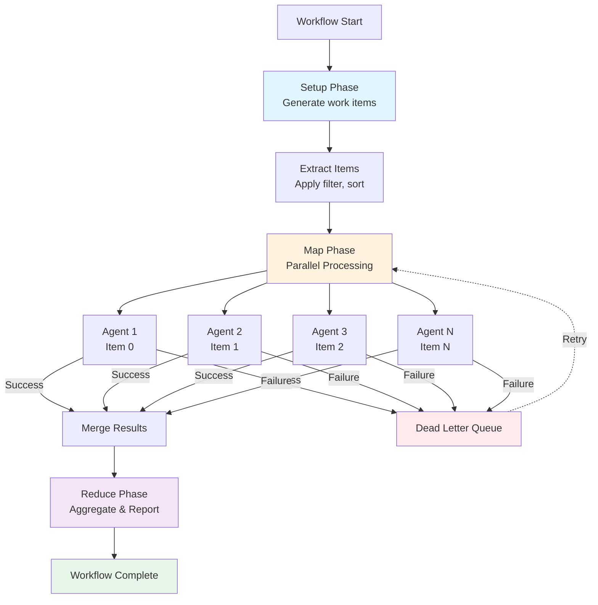
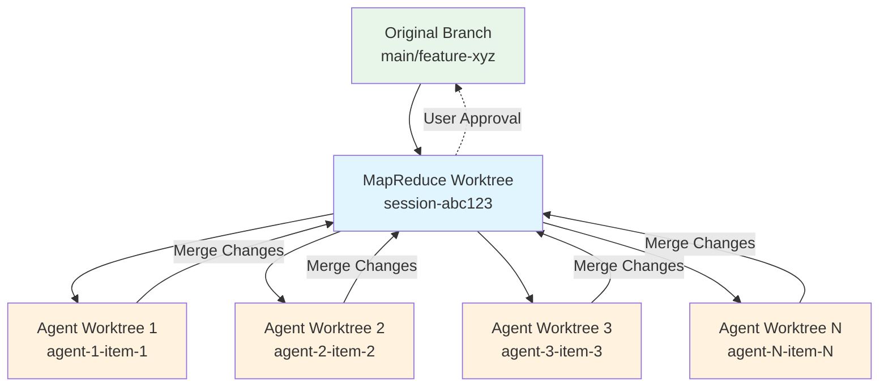

# MapReduce Workflows Overview

MapReduce workflows enable parallel processing of large datasets by distributing work items across isolated agents. This powerful execution mode allows you to process hundreds or thousands of items concurrently, making it ideal for bulk operations, data migrations, and large-scale code transformations.

## What is MapReduce Mode?

MapReduce is an execution mode in Prodigy that follows the classic MapReduce pattern:

1. **Setup Phase** (optional): Prepare work items and initialize the environment
2. **Map Phase**: Process work items in parallel across isolated agents
3. **Reduce Phase**: Aggregate results and perform final operations

Each phase executes in an isolated git worktree, ensuring your main repository remains untouched during execution. Agent results are automatically merged, and the final changes are presented for your approval before merging to your original branch.

## When to Use MapReduce

**Use MapReduce workflows when:**

- Processing **10+ independent items** (e.g., updating copyright headers in 500 files)
- Each item takes **significant time** (e.g., running linting on each module)
- Operations can be **parallelized safely** (no shared state dependencies)
- You need **fault isolation** per item (one failure doesn't block others)

**Use standard workflows for:**

- Sequential operations that depend on previous results
- Single-item processing
- Workflows requiring shared mutable state
- Operations that must execute in a specific order

!!! tip "Performance Sweet Spot"
    MapReduce excels when you have 10-1000 work items that each take 10 seconds to 5 minutes to process. For smaller workloads, the overhead of parallelization may not be worthwhile.

## The Three Phases



**Figure**: MapReduce execution flow showing the three phases, parallel agent processing, and error handling through the Dead Letter Queue.

### Setup Phase

The optional setup phase prepares your environment and generates work items:

```yaml
# Source: workflows/mapreduce-example.yml:5-6
setup:
  - shell: "debtmap analyze . --output debt_items.json"
```

**Key capabilities:**

- Execute commands before parallel processing begins
- Generate JSON files containing work items
- Capture outputs for use in later phases
- Initialize databases, fetch data, or prepare resources

The setup phase runs once in the MapReduce worktree and creates a checkpoint for resume.

### Map Phase

The map phase distributes work items to parallel agents:

```yaml
# Source: workflows/mapreduce-example.yml:9-27
map:
  input: debt_items.json                # (1)!
  json_path: "$.debt_items[*]"          # (2)!

  agent_template:                        # (3)!
    - claude: "/fix-issue ${item.description} --file ${item.location.file}"
    - shell: "cargo test"
      on_failure:                        # (4)!
        claude: "/debug-test ${shell.output}"

  max_parallel: 10                       # (5)!
  filter: "severity == 'high' || severity == 'critical'"  # (6)!
  sort_by: "priority"                    # (7)!

1. JSON file containing work items (generated in setup phase)
2. JSONPath expression to extract items from the JSON structure
3. Template commands executed by each agent for its work item
4. Fallback commands executed if the previous command fails
5. Maximum number of agents running concurrently (controls parallelism)
6. Only process items matching this condition (reduces workload)
7. Process items in this order (e.g., high-priority items first)
```

**Key capabilities:**

- **JSONPath extraction**: Extract work items from JSON files
- **Parallel execution**: Run multiple agents concurrently (controlled by `max_parallel`)
- **Agent isolation**: Each agent runs in its own git worktree
- **Filtering**: Process only items matching criteria
- **Sorting**: Control processing order
- **Error handling**: Failed items route to Dead Letter Queue (DLQ)

Each agent executes the `agent_template` commands with access to `${item}` variables. Agents commit their changes and merge back to the MapReduce worktree automatically.

### Reduce Phase

The reduce phase aggregates results after all map agents complete:

```yaml
# Source: workflows/mapreduce-example.yml:30-39
reduce:
  - claude: "/summarize-fixes ${map.results}"
    capture_output: true

  - shell: "echo 'Fixed ${map.successful}/${map.total} items'"

  - claude: "/generate-report --fixed ${map.successful} --failed ${map.failed}"
```

**Key capabilities:**

- **Result aggregation**: Access to `${map.results}`, `${map.successful}`, `${map.failed}`, `${map.total}`
- **Sequential execution**: Commands run in order
- **Report generation**: Summarize outcomes, generate artifacts
- **Validation**: Verify all items were processed correctly

The reduce phase runs once in the MapReduce worktree with full visibility into map phase results.

## Work Items and Distribution

### What are Work Items?

Work items are individual units of work extracted from JSON files. Each item is processed by exactly one agent in the map phase.

**Example work items:**

```json
[
  {"id": 1, "file": "src/main.rs", "issue": "unused import"},
  {"id": 2, "file": "src/lib.rs", "issue": "missing docs"},
  {"id": 3, "file": "tests/test.rs", "issue": "deprecated API"}
]
```

### Work Distribution Features

**JSONPath Extraction:**

```yaml
map:
  input: "items.json"
  json_path: "$.items[*]"  # Extract array of items
```

**Filtering:**

```yaml
filter: "item.severity >= 5 && item.status == 'open'"
```

**Sorting:**

```yaml
sort_by: "item.priority DESC"  # Process high-priority items first
```

**Pagination:**

```yaml
max_items: 100   # Limit to first 100 items
offset: 50       # Skip first 50 items
```

**Deduplication:**

```yaml
distinct: "item.id"  # Remove duplicate items by ID field
```

## Parallel Execution and Isolation

### How Parallel Execution Works

When the map phase begins, Prodigy:

1. Extracts work items from the input JSON
2. Applies filtering, sorting, and deduplication
3. Creates a pool of agent slots (limited by `max_parallel`)
4. Assigns work items to available agents
5. Each agent runs in an **isolated git worktree**
6. Agents execute independently and commit their changes
7. Completed agents merge back to the MapReduce worktree
8. Failed items are routed to the Dead Letter Queue

### Agent Isolation

Each agent runs in its own git worktree branched from the MapReduce worktree:



**Figure**: Worktree isolation architecture showing how agents branch from the parent MapReduce worktree and merge their changes back independently.

**Benefits of isolation:**

- **No conflicts**: Agents can't interfere with each other
- **Independent failures**: One agent failure doesn't affect others
- **Clean merges**: Each agent's changes merge independently
- **Resource safety**: No shared mutable state

!!! note "Cleanup Failure Handling"
    If worktree cleanup fails after agent completion, the agent's work is still preserved. Failed cleanups are tracked in an orphaned worktree registry and can be retried with:
    ```bash
    prodigy worktree clean-orphaned <job-id>
    ```
    See [Spec 136](https://github.com/yourusername/prodigy/blob/master/specs/136-cleanup-failure-handling.md) for details.

### Controlling Parallelism

```yaml
# Static parallelism
max_parallel: 10

# Dynamic parallelism from environment
max_parallel: "$MAX_WORKERS"
```

!!! warning "Resource Limits"
    Each agent consumes system resources (CPU, memory, disk I/O). Start with conservative `max_parallel` values and increase based on system capacity. A good starting point is 5-10 agents.

## Example: Bulk Code Updates

!!! example "When to Use This Pattern"
    This example demonstrates a common MapReduce use case: applying the same transformation to many files independently. Use this pattern for bulk updates like copyright headers, import statements, formatting changes, or license headers where each file can be processed in isolation.

Here's a complete example updating copyright headers across a codebase:

```yaml
# Source: workflows/mapreduce-example.yml (adapted)
name: update-copyright-headers
mode: mapreduce

setup:
  - shell: |
      # Generate list of source files
      find src -name "*.rs" -type f | jq -R -s -c 'split("\n")[:-1] | map({file: .})' > files.json

map:
  input: files.json
  json_path: "$[*]"
  max_parallel: 20

  agent_template:
    - shell: |
        # Update copyright header
        sed -i '1s/Copyright 2023/Copyright 2024/' ${item.file}
        git add ${item.file}
        git commit -m "Update copyright in ${item.file}"

reduce:
  - shell: |
      echo "Updated copyright headers in ${map.successful}/${map.total} files"

  - shell: |
      if [ ${map.failed} -gt 0 ]; then
        echo "Failed files: ${map.failed}"
        echo "Check DLQ: prodigy dlq show <job-id>"
      fi
```

## Error Handling and Recovery

### Dead Letter Queue (DLQ)

Failed work items are automatically sent to the DLQ with:

- Original work item data
- Failure reason and error message
- Timestamp and retry count
- Claude JSON log location for debugging (via `json_log_location` field)

!!! tip "Debugging with JSON Logs"
    Each DLQ item includes a `json_log_location` field pointing to the Claude execution log. Use this to inspect the complete conversation, tool invocations, and error context:
    ```bash
    # View the log location
    prodigy dlq show <job-id> | jq '.items[].failure_history[].json_log_location'

    # Inspect the log file
    cat ~/.local/state/claude/logs/session-xyz.json | jq
    ```

**Retry failed items:**

```bash
prodigy dlq show <job-id>
prodigy dlq retry <job-id> --max-parallel 5
```

### Checkpoint and Resume

MapReduce workflows create checkpoints after each phase:

- **Setup checkpoint**: Setup phase results and artifacts
- **Map checkpoint**: Work item states and agent results
- **Reduce checkpoint**: Completed reduce steps and variables

**Resume an interrupted workflow:**

```bash
prodigy resume <session-id>
# or
prodigy resume-job <job-id>
```

All completed work is preserved. In-progress items restart from the beginning.

!!! note "Concurrent Resume Protection"
    Resume operations are protected from concurrent execution using automatic lock management. If another process is already resuming the same job, you'll receive an error with details about the lock holder. Stale locks (from crashed processes) are automatically detected and cleaned up. See [Spec 140](https://github.com/yourusername/prodigy/blob/master/specs/140-concurrent-resume-protection.md) for details.

## Learn More

Ready to dive deeper? Explore these topics:

- **[Work Distribution](work-distribution.md)** - JSONPath, filtering, sorting, and deduplication
- **[Checkpoint and Resume](checkpoint-and-resume.md)** - State management and recovery
- **[Dead Letter Queue (DLQ)](dead-letter-queue-dlq.md)** - Error handling and retry strategies
- **[Event Tracking](event-tracking.md)** - Monitoring and debugging with event logs
- **[Environment Variables](environment-variables-in-configuration.md)** - Parameterization and secrets
- **[Global Storage Architecture](global-storage-architecture.md)** - Cross-repository state management

## Next Steps

1. **Try the Quick Start** - Run the minimal example in [MapReduce Workflows](index.md)
2. **Understand Your Use Case** - Identify work items and parallelization opportunities
3. **Start Small** - Begin with `max_parallel: 5` and a subset of items
4. **Monitor and Tune** - Use event tracking and DLQ to optimize performance
5. **Scale Up** - Increase parallelism based on system capacity

!!! tip "Best Practice"
    Always test MapReduce workflows with a small subset of items first (using `max_items: 10`) before running on the full dataset. This helps identify issues early and validates your workflow logic.
