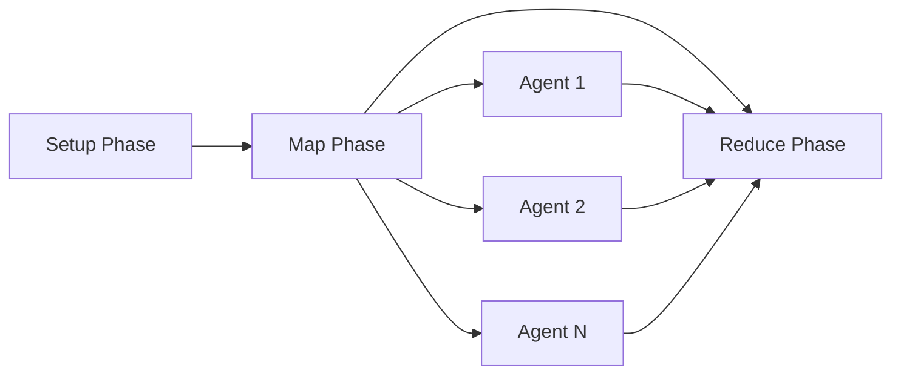
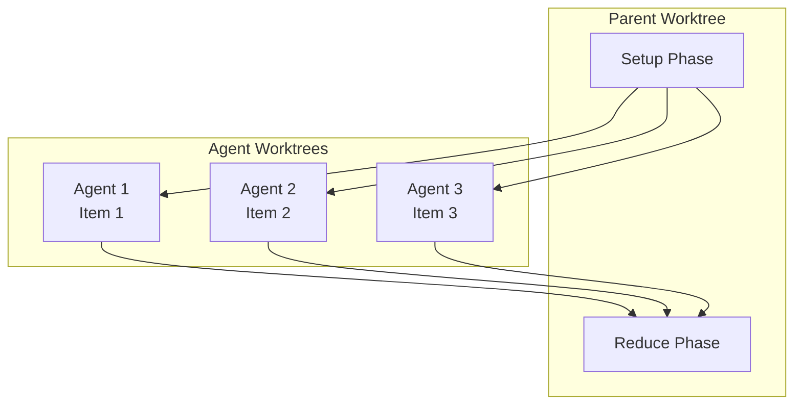

# MapReduce Workflows Overview

MapReduce workflows enable parallel processing of large datasets by distributing work items across isolated agents. Use MapReduce when you need to process many items concurrently, such as bulk code changes, data migrations, or analysis tasks that can be parallelized safely.

## What is MapReduce Mode?

MapReduce is a workflow execution mode in Prodigy that allows you to process large numbers of independent work items in parallel. Each work item is processed by an isolated Claude agent running in its own git worktree, ensuring failures are contained and work proceeds concurrently.

**When to Use MapReduce:**

- Processing 10+ independent items that can be parallelized
- Each item takes significant time to complete
- Operations can be executed safely in isolation
- You need fault isolation per item (one failure doesn't stop others)

**When to Use Standard Workflows:**

- Sequential operations that depend on previous steps
- Single-item processing
- Workflows requiring shared state across steps
- Simple automation tasks

## The Three Phases

MapReduce workflows consist of three phases that execute in sequence:



### 1. Setup Phase (Optional)

<!-- Source: .prodigy/mkdocs-analysis/features.json:16-23 -->

The setup phase prepares the environment and generates work items before parallel processing begins. This phase is optional but useful for:

- Generating the list of work items dynamically
- Setting up shared resources or configuration
- Analyzing the codebase to identify work
- Capturing variables for use in later phases

All setup commands execute in an isolated worktree to keep your main repository clean. Setup results are checkpointed, enabling resume if the workflow is interrupted.

### 2. Map Phase (Parallel Processing)

<!-- Source: .prodigy/mkdocs-analysis/features.json:25-34 -->

The map phase processes work items in parallel across multiple isolated agents. Key characteristics:

- **Parallel Execution**: Multiple agents run concurrently (controlled by `max_parallel`)
- **Isolated Worktrees**: Each agent runs in its own git worktree, preventing interference
- **Independent Failures**: If one agent fails, others continue processing
- **Work Distribution**: Items are extracted from JSON files using JSONPath expressions

The map phase handles work item filtering, sorting, deduplication, and distribution automatically. Results from all agents are aggregated for the reduce phase.

### 3. Reduce Phase (Aggregation)

<!-- Source: .prodigy/mkdocs-analysis/features.json:36-43 -->

The reduce phase aggregates results from all map agents and performs final operations. This phase:

- Has access to aggregated map results via `${map.results}`
- Can reference success/failure counts with `${map.successful}` and `${map.failed}`
- Executes sequentially in the parent worktree
- Is checkpointed step-by-step for resume capability

Use the reduce phase to summarize changes, generate reports, run final validation, or merge results.

## Basic Example

<!-- Source: workflows/mapreduce-example.yml -->

Here's a minimal MapReduce workflow showing all three phases:

```yaml title="workflows/simple-mapreduce.yml"
name: simple-mapreduce-example
mode: mapreduce

# Setup: Generate work items
setup:
  - shell: "echo '[{\"id\":1,\"file\":\"src/a.rs\"},{\"id\":2,\"file\":\"src/b.rs\"}]' > items.json"

# Map: Process each item in parallel
map:
  input: items.json
  json_path: "$[*]"
  max_parallel: 5

  agent_template:
    - claude: "/process-file ${item.file}"
    - shell: "cargo test --test ${item.id}"

# Reduce: Aggregate results
reduce:
  - claude: "/summarize-results ${map.results}"
  - shell: "echo 'Processed ${map.successful}/${map.total} items'"
```

## Work Items

<!-- Source: .prodigy/mkdocs-analysis/features.json:46-56 -->

Work items are individual units of work distributed to parallel agents. They are:

- **Extracted from JSON files** using JSONPath expressions (e.g., `$.items[*]`)
- **Filtered** using boolean expressions (e.g., `item.priority >= 5`)
- **Sorted** by field values (e.g., `sort_by: "priority DESC"`)
- **Deduplicated** by field to prevent duplicate processing
- **Paginated** with offset and limit for large datasets

Each work item becomes available as `${item}` in the agent template, with fields accessible via dot notation (e.g., `${item.file}`, `${item.priority}`).

For detailed work item management, see [Work Distribution](work-distribution.md).

## Parallel Execution with Isolated Agents

<!-- Source: .prodigy/mkdocs-analysis/features.json:57-66 -->

Each map agent runs in complete isolation:



**Isolation Guarantees:**

- Each agent has its own git worktree branched from the parent
- Agents cannot interfere with each other's work
- Failed agents don't affect other running agents
- Main repository remains untouched during execution

**Concurrency Control:**

The `max_parallel` setting controls how many agents run simultaneously:

```yaml
map:
  max_parallel: 10  # Run up to 10 agents concurrently
```

You can also reference environment variables:

```yaml
env:
  WORKER_COUNT: 5

map:
  max_parallel: $WORKER_COUNT
```

For architecture details, see [MapReduce Worktree Architecture](../mapreduce-worktree-architecture.md).

## State Management and Resume

<!-- Source: .prodigy/mkdocs-analysis/features.json:67-77 -->

MapReduce workflows support comprehensive checkpoint and resume capabilities:

- **Setup Phase**: Checkpointed after completion
- **Map Phase**: Progress tracked after processing configurable number of items
- **Reduce Phase**: Checkpointed after each step

If a workflow is interrupted, resume it with:

```bash
# Resume using session ID
prodigy resume session-mapreduce-1234567890

# Resume using job ID
prodigy resume-job mapreduce-1234567890
```

In-progress work items are moved back to pending on resume, ensuring no duplicate work. For full resume documentation, see [MapReduce Resume Guide](../mapreduce-resume-guide.md).

## Error Handling with Dead Letter Queue

<!-- Source: .prodigy/mkdocs-analysis/features.json:78-87 -->

Failed work items are automatically routed to the Dead Letter Queue (DLQ) for later retry:

```bash
# View failed items
prodigy dlq show <job_id>

# Retry all failed items
prodigy dlq retry <job_id>

# Retry with custom parallelism
prodigy dlq retry <job_id> --max-parallel 5
```

The DLQ preserves:

- Original work item data
- Failure reason and error details
- Retry count and history
- Correlation IDs for tracking

!!! tip "Failure Isolation"
    Failed agents don't stop other agents from processing. The workflow continues, and failed items can be retried later with different parameters or after fixing the underlying issue.

## Real-World Use Cases

**Bulk Code Transformations:**
```yaml
# Update copyright headers in 500 files
map:
  input: files.json
  agent_template:
    - claude: "/update-copyright ${item.file}"
    - shell: "git add ${item.file}"
```

**Parallel Testing:**
```yaml
# Run linting on entire codebase in parallel
map:
  input: modules.json
  agent_template:
    - shell: "cargo clippy --package ${item.module}"
    - claude: "/fix-lint-issues ${item.module}"
```

**Data Migration:**
```yaml
# Migrate 1000+ database records
map:
  input: records.json
  filter: "item.status == 'pending'"
  agent_template:
    - claude: "/migrate-record ${item.id}"
    - shell: "verify-migration.sh ${item.id}"
```

## Learn More

Explore detailed topics in the MapReduce documentation:

- **[Work Distribution](work-distribution.md)** - Work item management, filtering, and sorting
- **[Checkpoint and Resume](../mapreduce-resume-guide.md)** - State management and recovery
- **[Worktree Architecture](../mapreduce-worktree-architecture.md)** - Isolation and parallelism details
- **Environment Variables** - Parameterizing workflows with secrets and profiles

!!! info "Deep Dive"
    For architectural details and design rationale, see the [Prodigy Whitepaper](https://github.com/Effortless-Mgmt/prodigy) section on MapReduce workflows.
