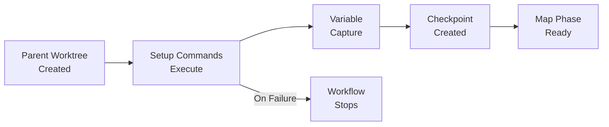

## Setup Phase (Advanced)

The setup phase runs once before the map phase begins, executing in the parent worktree. It's used to initialize the environment, generate work items, download data, or prepare configuration.

### Execution Context



The setup phase:

- **Runs once** before map phase begins
- **Executes in parent worktree**, providing isolation from main repository (not the main repository itself)
- **Creates checkpoint** after successful completion, stored at `~/.prodigy/state/{repo_name}/mapreduce/jobs/{job_id}/setup-checkpoint.json`
- **Preserves setup outputs, environment state, and captured variables** for resume capability
- **Outputs available** to map and reduce phases via captured variables

This isolation ensures the main repository remains untouched while setup operations prepare the environment for parallel processing. All setup operations execute in the parent worktree, providing safety for initialization tasks.

!!! info "Resume Support"
    Setup phase checkpoints enable workflow resume after interruption. See [Checkpoint and Resume](checkpoint-and-resume.md) for details on recovery behavior.

### Common Use Cases

The setup phase is typically used for:

- **Generate work items** - Create JSON arrays of items to process in parallel
- **Initialize environment** - Install dependencies, configure tools, set up databases
- **Download data** - Fetch datasets, clone repositories, pull artifacts
- **Prepare configuration** - Generate configs, resolve templates, validate settings

### Configuration Formats

The setup phase supports two formats: simple array OR full configuration object.

```yaml
# Simple array format
setup:
  - shell: "prepare-data.sh"
  - shell: "analyze-codebase.sh"

# Full configuration format with timeout and capture
setup:
  commands:
    - shell: "prepare-data.sh"
    - shell: "analyze-codebase.sh"

  # Timeout for entire setup phase
  # Accepts numeric seconds (300) or string with env var ("${SETUP_TIMEOUT}")
  timeout: 300  # or timeout: "${SETUP_TIMEOUT}"

  # Capture outputs from setup commands
  capture_outputs:
    # Simple format (shorthand - captures stdout with defaults)
    # Use for basic stdout capture without JSON extraction
    file_count: 0  # Capture stdout from command at index 0

    # Detailed CaptureConfig format
    # Use for JSON extraction, size limits, or custom sources
    analysis_result:
      command_index: 1
      source: stdout           # stdout, stderr, both, combined (see below)
      json_path: "$.result"    # Extract JSON field
      pattern: "^Result: (.+)$" # Optional: Extract using regex capture group
      max_size: 1048576        # Max bytes (1MB)
      default: "{}"            # Fallback if extraction fails
      multiline: preserve      # preserve, join, first_line, last_line, array (see below)
```

**Setup Phase Fields:**

- `commands` - Array of commands to execute (or use simple array format at top level)
- `timeout` - Timeout for entire setup phase in seconds (numeric or environment variable)
- `capture_outputs` - Map of variable names to command outputs (Simple or Detailed format)

**CaptureConfig Fields (Detailed Format):**

- `command_index` - Which command's output to capture (0-based index)
- `source` - Which output stream to capture (see Capture Source Options below)
- `pattern` - Optional regex pattern with capture group to extract specific text
- `json_path` - Optional JSON path to extract field from JSON output (e.g., "$.result.value")
- `max_size` - Maximum bytes to capture (default: 1MB)
- `default` - Fallback value if capture/extraction fails
- `multiline` - How to handle multi-line output (see Multiline Options below)

### Capture Source Options

The `source` field controls which command output streams to capture:

```rust
// Source: src/cook/execution/variable_capture.rs:98-103
pub enum CaptureSource {
    Stdout,
    Stderr,
    Both,
    Combined,
}
```

| Option | Description |
|--------|-------------|
| `stdout` | Capture standard output only (default) |
| `stderr` | Capture standard error only |
| `both` | Capture both streams with labels: `"stdout:\n{}\nstderr:\n{}"` |
| `combined` | Capture both streams concatenated without labels (interleaved order) |

!!! tip "Choosing Between `both` and `combined`"
    Use **`both`** when you need to distinguish stdout from stderr in your processing logic - the labels make parsing straightforward.

    Use **`combined`** when you need to preserve the chronological order of all output, which is useful for debugging command execution.

**Use Cases:**

- `stdout` - For normal command output (logs, data, results)
- `stderr` - For error messages or diagnostic output
- `both` - When you need to see both streams separately with clear labels
- `combined` - When you need chronological order of all output (e.g., debugging)

**Example** (src/cook/execution/variable_capture_test.rs:203-232):

```yaml
error_log:
  command_index: 0
  source: stderr    # Capture error messages
  default: "No errors"
```

### Multiline Options

The `multiline` field controls how multi-line output is processed:

```rust
// Source: src/cook/execution/variable_capture.rs:117-129
pub enum MultilineHandling {
    Preserve,   // Keep all lines with newlines (default)
    Join,       // Join lines with spaces
    FirstLine,  // Take only first line
    LastLine,   // Take only last line
    Array,      // Return as JSON array of lines
}
```

| Option | Behavior | Use Case |
|--------|----------|----------|
| `preserve` (default) | Keep all lines with newlines | Full output needed |
| `join` | Join lines with spaces | Create single-line summary |
| `first_line` | Take only first line | Extract header or title |
| `last_line` | Take only last line | Get final result or status |
| `array` | Return as JSON array of lines | Process each line separately |

**Examples** (src/cook/execution/variable_capture_test.rs:89-170):

=== "First Line"
    ```yaml
    # Extract first line (e.g., version number)
    version:
      command_index: 0
      source: stdout
      multiline: first_line
    ```

=== "Last Line"
    ```yaml
    # Extract last line (e.g., final status)
    status:
      command_index: 1
      source: stdout
      multiline: last_line
    ```

=== "Join"
    ```yaml
    # Join all lines (e.g., single-line summary)
    summary:
      command_index: 2
      source: stdout
      multiline: join
    ```

=== "Array"
    ```yaml
    # Array format (e.g., list of files)
    files:
      command_index: 3
      source: stdout
      multiline: array
    ```

### Pattern Extraction

Use the `pattern` field to extract specific text using regex capture groups:

```rust
// Source: src/cook/execution/variable_capture.rs:29
pattern: Option<String>,
```

**Example** (src/cook/execution/variable_capture_test.rs:27-56):

```yaml
capture_outputs:
  VERSION:
    command_index: 0
    source: stdout
    pattern: "version (\\d+\\.\\d+\\.\\d+)"  # Extract semantic version
    default: "0.0.0"
```

The pattern uses regex capture groups. The first capture group `(...)` is extracted as the variable value.

!!! warning "Regex Escaping"
    Remember to escape backslashes in YAML strings. Use `\\d` for digit patterns, not `\d`.

### Best Practices

**Idempotent Operations:**

- Design setup commands to be safe to run multiple times
- Use conditional checks before creating resources
- Clean up stale artifacts before generating new ones

**Timeout Sizing:**

- Set generous timeouts for network operations (downloads, API calls)
- Use environment variables (`${SETUP_TIMEOUT}`) for flexibility across environments
- Consider total time for all setup commands, not individual commands

!!! tip "Environment Variables"
    For configurable timeouts, see [Environment Variables in Configuration](environment-variables-in-configuration.md).

**Output Capture Patterns:**

- Use simple format (`command_index: number`) for basic text capture
- Use detailed `CaptureConfig` when extracting JSON fields or limiting size
- Always provide `default` value for robust error handling

**Setup Command Failures:**

- If a setup command fails, the entire workflow stops (src/cook/execution/mapreduce/phases/setup.rs:39-43)
- Design setup commands to fail fast with clear error messages
- Use `default` values in `capture_outputs` to handle optional data gracefully
- Test setup commands independently before workflow execution

!!! note "Troubleshooting Setup Failures"
    For common setup phase issues and debugging strategies, see [Troubleshooting](troubleshooting.md).
