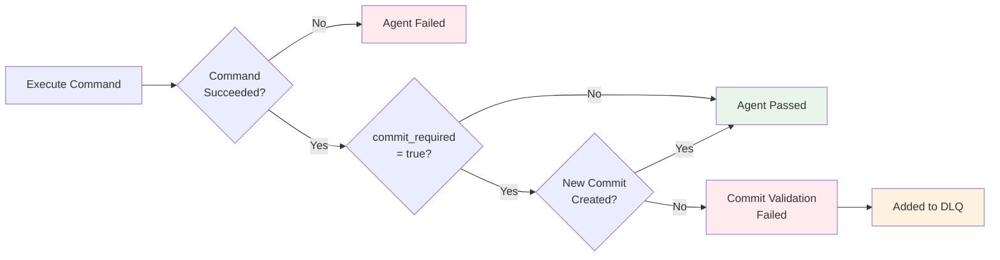
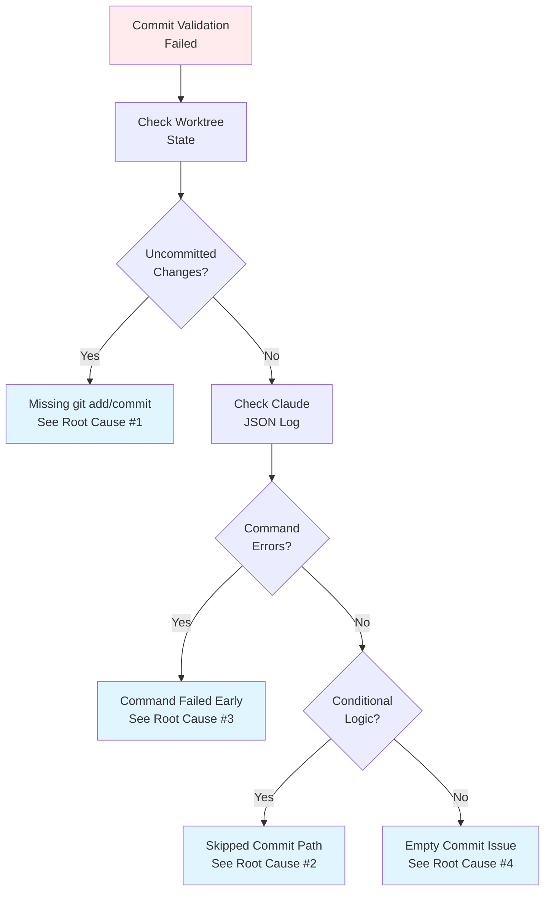

# MapReduce Troubleshooting Guide

## Commit Validation Failures

### Overview

Prodigy enforces commit validation for MapReduce agent commands marked with `commit_required: true`. This prevents silent data loss from agents that complete without creating the expected commits.



**Figure**: Commit validation flow showing how agents are validated when `commit_required: true`.

### Common Symptoms

**Agent Failure Message:**
```
Agent execution failed: Commit required but no commit was created

Worktree: /path/to/worktree/agent-1
Expected behavior: Command should create at least one git commit
Command: shell: echo "test" > file.txt
```

**DLQ Entry:**
```json
{
  "error_type": "CommitValidationFailed",
  "manual_review_required": true,
  "failure_history": [{
    "error_message": "Commit validation failed",
    "json_log_location": "/path/to/claude/logs/session-xyz.json"
  }]
}
```

### Root Causes

!!! warning "Failed Agents Are Added to DLQ"
    When commit validation fails, the agent is marked as failed and added to the Dead Letter Queue (DLQ). The worktree is preserved for debugging. Use `prodigy dlq list` to see failed items.

#### 1. Missing `git add` or `git commit` Commands

**Problem:** Agent creates/modifies files but doesn't commit them.

**Example:**
```yaml
agent_template:
  - shell: |
      echo "content" > file.txt
      # Missing: git add file.txt
      # Missing: git commit -m "message"
    commit_required: true
```

**Solution:**
```yaml
agent_template:
  - shell: |
      echo "content" > file.txt
      git add file.txt
      git commit -m "Add file.txt"
    commit_required: true
```

#### 2. Conditional Logic That Skips Commits

**Problem:** Agent has conditional logic that sometimes skips commit creation.

**Example:**
```yaml
agent_template:
  - shell: |
      if [ "${item.type}" = "process" ]; then
        echo "content" > file.txt
        git add file.txt
        git commit -m "Process ${item.id}"
      else
        echo "Skipping item ${item.id}"
        # No commit created for non-process items
      fi
    commit_required: true
```

**Solution:** Either:

1. Remove `commit_required` flag for conditional commits:
```yaml
agent_template:
  - shell: |
      if [ "${item.type}" = "process" ]; then
        echo "content" > file.txt
        git add file.txt
        git commit -m "Process ${item.id}"
      fi
    # No commit_required flag
```

2. Filter items before map phase to ensure all agents create commits:
```yaml
map:
  filter: "item.type == 'process'"  # Only process items that need commits
  agent_template:
    - shell: |
        echo "content" > file.txt
        git add file.txt
        git commit -m "Process ${item.id}"
      commit_required: true
```

#### 3. Command Fails Before Reaching Commit

**Problem:** Command fails early, never reaching the commit statement.

**Example:**
```yaml
agent_template:
  - shell: |
      some-command-that-fails
      git add file.txt
      git commit -m "message"  # Never reached
    commit_required: true
```

**Solution:** Use `on_failure` handlers or fix the failing command:
```yaml
agent_template:
  - shell: |
      some-command || exit 1
    on_failure:
      shell: |
        echo "Command failed, creating fallback commit"
        echo "error" > error.log
        git add error.log
        git commit -m "Failed to process ${item.id}"
  - shell: |
      git add file.txt
      git commit -m "Process complete"
    commit_required: true
```

#### 4. Empty Commits (Nothing to Commit)

**Problem:** Agent tries to commit but has no changes staged.

**Example:**
```yaml
agent_template:
  - shell: |
      # This might not modify anything
      echo "test" > file.txt
      rm file.txt  # Undo the change
      git add .
      git commit -m "message"  # Fails: nothing to commit
    commit_required: true
```

**Solution:** Use `--allow-empty` or ensure changes exist:
```yaml
agent_template:
  - shell: |
      echo "test ${item.id}" > "file-${item.id}.txt"
      git add .
      if git diff --cached --quiet; then
        # No changes, create empty commit
        git commit --allow-empty -m "No changes for ${item.id}"
      else
        git commit -m "Process ${item.id}"
      fi
    commit_required: true
```

### Debugging Steps



**Figure**: Decision tree for diagnosing commit validation failures.

#### 1. Check Agent Worktree State

```bash
# Navigate to the agent's worktree (from error message)
cd /path/to/worktree/agent-1

# Check git status
git status

# Check commit history
git log --oneline

# Check for uncommitted changes
git diff
```

#### 2. Review Claude JSON Log

The error message includes the path to the Claude JSON log file. This contains the complete execution trace:

```bash
# View the log
cat /path/to/claude/logs/session-xyz.json | jq

# Extract command execution details
cat /path/to/claude/logs/session-xyz.json | jq '.messages[] | select(.content[]?.type == "tool_use")'
```

#### 3. Check DLQ for Pattern Analysis

```bash
# List DLQ items for the job
prodigy dlq list --job-id <job-id>

# Inspect a specific DLQ item for details
prodigy dlq inspect <item-id> --job-id <job-id>

# Analyze failure patterns
prodigy dlq analyze --job-id <job-id>
```

#### 4. Test Agent Command Manually

```bash
# Create a test worktree
mkdir test-agent
cd test-agent
git init

# Set up test item data (simulate workflow variables)
ITEM_ID=1
ITEM_TYPE=process

# Run the agent command manually
echo "content" > file.txt
git add file.txt
git commit -m "Test commit for item ${ITEM_ID}"

# Check if commit was created
git log --oneline
```

### Prevention Best Practices

!!! tip "Use `commit_required` Sparingly"
    Only mark commands as `commit_required` when you genuinely expect a commit.
    For optional commits, use `on_failure` handlers instead.

!!! tip "Test Workflows with Dry-Run Mode"
    ```bash
    prodigy run workflow.yml --dry-run
    ```

!!! tip "Use Filters to Ensure Commit Eligibility"
    ```yaml
    map:
      filter: "item.needs_commit == true"
      agent_template:
        - shell: |
            process-and-commit.sh
          commit_required: true
    ```

!!! tip "Add Explicit Validation"
    ```yaml
    agent_template:
      - shell: |
          process-item.sh
          git add .
          git commit -m "Process ${item.id}"
      - shell: |
          # Verify commit was created
          if ! git log -1 --oneline | grep -q "Process"; then
            echo "ERROR: Commit validation failed"
            exit 1
          fi
        commit_required: true
    ```

### Related Documentation

- [Command-Level Options](../workflow-basics/command-level-options.md) - Details on `commit_required` flag
- [MapReduce Event Tracking](./event-tracking.md) - Understanding event streams
- [Dead Letter Queue](./dead-letter-queue-dlq.md) - Managing failed items
