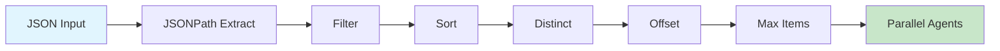

# Examples

Complete examples demonstrating work distribution patterns, map phase integration, and troubleshooting tips.

!!! abstract "Related Pages"
    - [Input Sources](input-sources.md) - Loading work items from JSON files
    - [Filtering & Sorting](filtering-sorting.md) - Selecting and ordering items
    - [Pagination](pagination.md) - Controlling item batches with offset and max_items

## Complete Examples

### High-Priority Debt Items

Process technical debt items with high scores, sorted by priority:

```yaml
# Source: workflows/mapreduce-example.yml
name: parallel-debt-elimination
mode: mapreduce

setup:
  - shell: "debtmap analyze . --output debt_items.json"  # (1)!

map:
  input: debt_items.json  # (2)!
  json_path: "$.debt_items[*]"  # (3)!
  filter: "severity == 'high' || severity == 'critical'"  # (4)!
  sort_by: "priority DESC"  # (5)!
  max_parallel: 10  # (6)!

  agent_template:
    - claude: "/fix-issue ${item.description}"

1. Generate work items in setup phase - ensures reproducible input
2. Use JSON file output from setup phase
3. Extract debt items from the array
4. Process only high and critical severity items
5. Process highest priority items first
6. Run up to 10 agents concurrently
```

### Top Scoring Items with Deduplication

Process the top 3 unique high-scoring items:

```yaml
# Source: src/cook/execution/data_pipeline/mod.rs:294-355
map:
  input: analysis.json
  json_path: "$.items[*]"  # (1)!
  filter: "unified_score.final_score >= 5"  # (2)!
  sort_by: "unified_score.final_score DESC"  # (3)!
  distinct: "location.file"  # (4)!
  max_items: 3  # (5)!

1. Extract all items from analysis results
2. Only process items with score >= 5
3. Sort by score, highest first
4. Keep only one item per file (deduplication)
5. Process only the top 3 unique items
```

### Documentation Areas by Priority

Process high-priority documentation areas first:

```yaml
# Source: workflows/documentation-drift-mapreduce.yml
setup:
  - shell: |
      cat > .prodigy/doc-areas.json << 'EOF'
      {
        "areas": [
          {"name": "README", "priority": 1},
          {"name": "API", "priority": 2},
          {"name": "Examples", "priority": 3}
        ]
      }
      EOF

map:
  input: .prodigy/doc-areas.json
  json_path: "$.areas[*]"
  sort_by: "priority ASC"  # Process priority 1 first
  max_parallel: 4
```

### Batched Processing with Filters

Process work items in batches with filtering:

```yaml
map:
  input: large-dataset.json
  json_path: "$.tasks[*]"
  filter: "status == 'pending' && assigned_to == null"
  sort_by: "created_at ASC"
  offset: 0       # Start from beginning
  max_items: 50   # Process 50 at a time
  max_parallel: 10
```

## Integration with Map Phase

All work distribution fields are configured within the `map` phase configuration block:

```yaml
# Source: src/config/mapreduce.rs:49
map:
  # Input source
  input: <path-to-json-file>  # (1)!

  # Work distribution pipeline
  json_path: <jsonpath-expression>  # (2)!
  filter: <filter-expression>  # (3)!
  sort_by: <sort-specification>  # (4)!
  distinct: <field-name>  # (5)!
  offset: <number>  # (6)!
  max_items: <number>  # (7)!

  # Parallelization
  max_parallel: <number>  # (8)!

  # Agent template
  agent_template:
    - claude: "/process-item ${item}"

1. Path to JSON file containing work items
2. JSONPath expression to extract items (e.g., `$.items[*]`)
3. Filter expression to select items (e.g., `score >= 5`)
4. Sort specification (e.g., `priority DESC`)
5. Field name for deduplication (e.g., `id`)
6. Number of items to skip from the start
7. Maximum number of items to process
8. Number of concurrent agents to run
```

These fields work together to control how work items are selected and distributed to parallel agents.

## Data Pipeline Flow

The work distribution pipeline processes items through sequential stages:



Each stage transforms the item set:

| Stage | Operation | Example |
|-------|-----------|---------|
| **Extract** | Select items from JSON | `$.items[*]` → 100 items |
| **Filter** | Keep matching items | `score >= 5` → 45 items |
| **Sort** | Order items | `priority DESC` → sorted |
| **Distinct** | Deduplicate by field | `file` → 30 unique |
| **Offset** | Skip N items | `offset: 10` → 20 items |
| **Max Items** | Limit count | `max_items: 5` → 5 items |

## Troubleshooting

### Common Issues

**JSONPath returns no items:**
- Verify the input JSON structure matches your path
- Test JSONPath expressions using online tools
- Check for typos in field names

**Filter excludes all items:**
- Test filter expressions on sample data
- Check for correct field names and types
- Verify nested field paths are accurate

**Sorting doesn't work as expected:**
- Ensure sort field exists in all items
- Use `NULLS LAST` to handle missing values
- Check field types (strings sort alphabetically, numbers numerically)

**Deduplication removes too many items:**
- Verify the distinct field has the granularity you expect
- Remember that null values are treated as identical
- Check if nested field paths are correct

### Debugging Tips

!!! example "Preview filtered items"
    ```bash
    jq '.items[] | select(.score >= 5)' data.json > filtered-preview.json
    ```

!!! example "Count items at each stage"
    ```bash
    echo "Total items: $(jq '.items | length' data.json)"
    echo "After filter: $(jq '[.items[] | select(.score >= 5)] | length' data.json)"
    ```

!!! tip "Validate JSONPath"
    Note: jq uses its own query language, not JSONPath syntax. Use `.items[]` for array iteration:
    ```bash
    # Count items in array
    jq '.items | length' data.json

    # Preview first 3 items
    jq '.items[:3]' data.json
    ```
