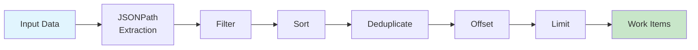

# Pagination

Control the number of items processed using offset and limit, and understand how the processing pipeline orders operations.

## Limit (max_items)

Limit the total number of work items:

```yaml
# Source: src/cook/execution/data_pipeline/mod.rs:298-300
map:
  json_path: "$.items[*]"
  filter: "unified_score.final_score >= 5"
  sort_by: "unified_score.final_score DESC"
  max_items: 3  # Process only top 3 items
```

## Offset

Skip the first N items:

```yaml
# Source: src/config/mapreduce.rs:251-257
map:
  json_path: "$.items[*]"
  offset: 10      # Skip first 10 items
  max_items: 20   # Then take next 20
```

## Use Cases

!!! tip "Testing Workflows First"
    Always test MapReduce workflows with a small subset before running on the full dataset:
    ```yaml
    map:
      max_items: 5  # Process only 5 items during development
    ```

**Batched processing:**
```yaml
# Batch 1: items 0-99
map:
  offset: 0
  max_items: 100

# Batch 2: items 100-199
map:
  offset: 100
  max_items: 100
```

**Top-N processing:**
```yaml
# Process only the 10 highest priority items
map:
  sort_by: "priority DESC"
  max_items: 10
```

## Processing Pipeline Order

Understanding the order of operations is important for building effective work distribution strategies:



1. **JSONPath Extraction** - Extract items from input source
2. **Filtering** - Apply filter expression to select items
3. **Sorting** - Order items by sort fields
4. **Deduplication** - Remove duplicates based on distinct field
5. **Offset** - Skip first N items
6. **Limit (max_items)** - Take only first N remaining items

!!! info "Related Topics"
    - [Filtering and Sorting](filtering-sorting.md) - Configure filter expressions and sort order
    - [Input Sources](input-sources.md) - Define where work items come from

!!! note "Optimization Tip"
    Place expensive filtering early in the pipeline to reduce the number of items for subsequent operations. Sort only after filtering to minimize sort cost.

```yaml
# Source: src/cook/execution/data_pipeline/mod.rs:127-201
map:
  input: data.json
  json_path: "$.items[*]"           # (1)!
  filter: "score >= 50"             # (2)!
  sort_by: "score DESC"             # (3)!
  distinct: "category"              # (4)!
  offset: 5                         # (5)!
  max_items: 10                     # (6)!

1. Extract all items from `$.items[*]` array
2. Keep only items where `score >= 50`
3. Sort remaining items by score (highest first)
4. Remove duplicates by category (keeps first of each)
5. Skip the first 5 items
6. Take the next 10 items for processing
```

This pipeline demonstrates the complete data transformation flow from extraction to final work item distribution.
