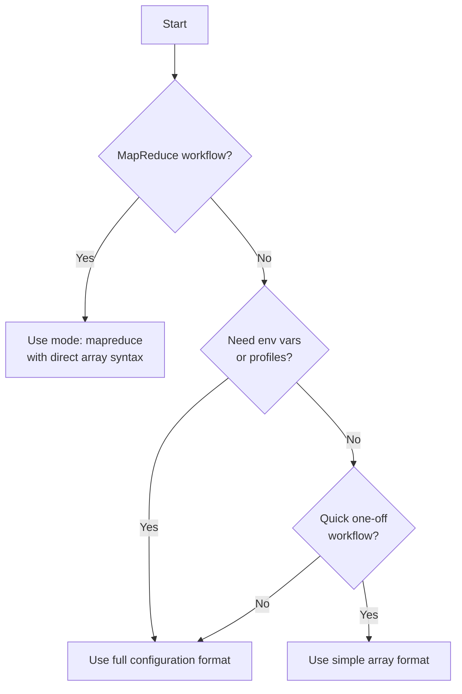

## Workflow Format Comparison

Prodigy supports multiple workflow format styles to balance simplicity for quick tasks with power for production workflows. This section explains the differences and helps you choose the right format.

### Standard Workflow Formats

Standard workflows (non-MapReduce) can be written in two formats:

#### Simple Array Format

For quick workflows, use a simple array of commands:

```yaml title="Simple array format"
# Minimal syntax for quick automation
- claude: "/prodigy-coverage"
  commit_required: true

- shell: "just test"
  on_failure:
    claude: "/prodigy-debug-test-failure"
```

!!! tip "When to use simple array format"
    - Creating quick automation scripts
    - No environment variables or profiles needed
    - Workflow is self-contained and straightforward

#### Full Configuration Format

For production workflows, use the full configuration format with metadata:

```yaml title="Full configuration format"
# Source: workflows/mapreduce-env-example.yml
name: mapreduce-env-example
mode: mapreduce

env:
  PROJECT_NAME: "example-project"
  OUTPUT_DIR: "output"
  DEBUG_MODE: "false"

  # Inline secret format (masked in logs)
  API_TOKEN:
    secret: true
    value: "${GITHUB_TOKEN}"

profiles:
  development:
    DEBUG_MODE: "true"
  production:
    DEBUG_MODE: "false"

# Commands go here
setup:
  - shell: "echo Starting $PROJECT_NAME"
```

!!! tip "When to use full configuration format"
    - Deploying to multiple environments (dev, staging, prod)
    - Need environment variables or secrets
    - Workflow requires parameterization
    - Building reusable workflow templates

#### Secret Configuration Options

Prodigy supports two approaches for managing secrets:

=== "Inline Secrets (in env block)"

    Mark variables as secrets inline within the `env:` block:

    ```yaml title="Inline secret format"
    # Source: workflows/mapreduce-env-example.yml:22-25
    env:
      API_TOKEN:
        secret: true
        value: "${GITHUB_TOKEN}"
    ```

=== "Dedicated secrets block"

    Use a separate `secrets:` top-level block for advanced secret management:

    ```yaml title="Dedicated secrets block"
    # Source: src/cook/environment/config.rs:86-95
    secrets:
      # Simple format - direct environment variable reference
      SIMPLE_SECRET: "ENV_VAR_NAME"

      # Provider format - explicit provider configuration
      API_TOKEN:
        provider: env
        key: "GITHUB_TOKEN"

      # File-based secret provider
      FILE_SECRET:
        provider: file
        key: "/path/to/secret/file"
    ```

**Available Secret Providers** (defined in `src/cook/environment/config.rs:101-109`):

| Provider | Description | Use Case |
|----------|-------------|----------|
| `env` | Environment variables | Most common, CI/CD pipelines |
| `file` | File-based secrets | Local development, mounted secrets |
| `vault` | HashiCorp Vault | Enterprise secret management |
| `aws` | AWS Secrets Manager | AWS-native deployments |

!!! info "Secret masking"
    Both formats automatically mask secret values in logs and error output. The inline format is simpler for environment variables, while the provider format supports advanced secret management systems.

For detailed Vault and AWS provider configuration, see [Secrets Management](../environment/secrets-management.md) and [Environment Variables in Configuration](./environment-variables-in-configuration.md).

### MapReduce Syntax Evolution {: #mapreduce-syntax }

MapReduce workflows have evolved to use simpler, more concise syntax.

#### Preferred Syntax (Current)

Commands are listed directly under `agent_template` and `reduce`:

```yaml title="Current MapReduce syntax (preferred)"
name: parallel-debt-elimination
mode: mapreduce

setup:
  - shell: "debtmap analyze . --output debt_items.json"

map:
  input: debt_items.json
  json_path: "$.debt_items[*]"

  # Direct array syntax - preferred
  agent_template:
    - claude: "/fix-issue ${item.description}"
    - shell: "cargo test"
      on_failure:
        claude: "/debug-test"

  max_parallel: 10

# Direct array syntax for reduce - preferred
reduce:
  - claude: "/summarize-fixes ${map.results}"
  - shell: "echo Processed ${map.total} items"
```

!!! success "Benefits of direct array syntax"
    - Less nesting, easier to read
    - Cleaner YAML structure
    - Follows YAML array conventions
    - Consistent with standard workflow format
    - Forward compatibility - the nested format may be removed in future versions

#### Legacy Syntax (Deprecated) {: #legacy-syntax }

The old format nested commands under a `commands` field:

```yaml title="Legacy syntax (deprecated)"
# Old syntax - deprecated but still supported
map:
  input: "work-items.json"
  json_path: "$.items[*]"

  # Nested under 'commands' - deprecated
  agent_template:
    commands:
      - shell: echo "Processing item ${item.id}"
      - shell: echo "Completed ${item.task}"

  max_parallel: 3

# Nested under 'commands' - deprecated
reduce:
  commands:
    - shell: echo "Processed ${map.total} items"
```

!!! warning "Deprecation notice"
    - This format is still supported for backward compatibility
    - New workflows should use the direct array syntax
    - Future versions may remove support for nested `commands`
    - Prodigy emits a warning when using the old format:
      > "Using deprecated nested 'commands' syntax in agent_template. Consider using the simplified array format directly under 'agent_template'."

    **Source**: Deprecation warnings in `src/config/mapreduce.rs:310, 347`

### Migration Guide {: #migration-guide }

To migrate from [legacy syntax](#legacy-syntax) to the preferred format:

=== "Before (Legacy)"

    ```yaml title="Legacy nested commands"
    agent_template:
      commands:
        - claude: "/process ${item}"
        - shell: "test ${item.path}"

    reduce:
      commands:
        - claude: "/summarize ${map.results}"
    ```

=== "After (Current)"

    ```yaml title="Direct array syntax"
    agent_template:
      - claude: "/process ${item}"
      - shell: "test ${item.path}"

    reduce:
      - claude: "/summarize ${map.results}"
    ```

**Migration Steps:**

1. Remove the `commands:` line from `agent_template`
2. Remove the `commands:` line from `reduce`
3. Unindent the command list by one level
4. Test the workflow to ensure it works correctly

!!! note "Important migration considerations"
    - The workflow format is all-or-nothing — you cannot mix old and new formats within the same workflow
    - Both `agent_template` and `reduce` must use the same format (both direct array or both nested)
    - After migration, run `prodigy run workflow.yml --dry-run` to validate syntax before executing
    - If the workflow fails after migration, check for indentation errors — YAML is whitespace-sensitive

### Format Decision Tree

Choose your format based on these questions:



| Question | Yes | No |
|----------|-----|-----|
| Is this a MapReduce workflow? | Use `mode: mapreduce` with direct array syntax | Continue ↓ |
| Do you need environment variables or profiles? | Use full configuration format | Continue ↓ |
| Is this a quick one-off workflow? | Use simple array format | Use full configuration format |

### Cross-References

- [Setup Phase Advanced](./setup-phase-advanced.md) - Detailed setup phase configuration and patterns
- [MapReduce Overview](./index.md) - MapReduce workflow fundamentals and phase documentation
- [Full Workflow Structure](../workflow-basics/full-workflow-structure.md) - Complete workflow configuration reference
- [Environment Variables in Configuration](./environment-variables-in-configuration.md) - Using variables and secrets in workflows

