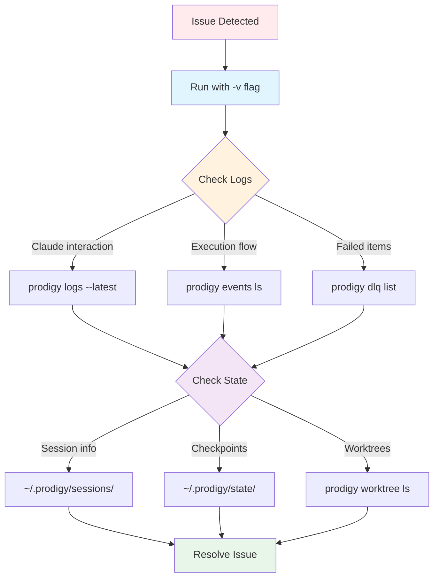
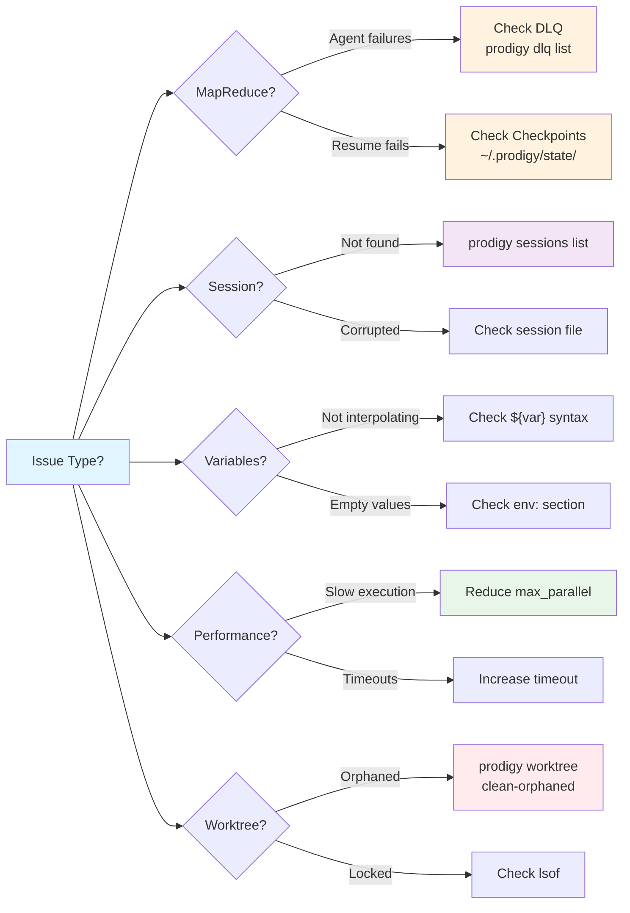

# Troubleshooting Reference

Quick reference guide for diagnosing and resolving Prodigy issues. For detailed troubleshooting guidance, see the [Troubleshooting](../troubleshooting/index.md) chapter.

## Quick Diagnostics

### When Something Goes Wrong



**Figure**: Diagnostic workflow for troubleshooting Prodigy issues.

!!! tip "Quick Diagnostics Checklist"
    Follow this sequence when troubleshooting:

    1. **Check verbosity**: Run with `-v` flag to see detailed output
    2. **Inspect logs**: Use `prodigy logs --latest --summary` for Claude interactions
    3. **Review events**: Use `prodigy events ls --job-id <job_id>` for execution timeline
    4. **Check DLQ**: Use `prodigy dlq list --job-id <job_id>` for failed items (MapReduce only)
    5. **Verify state**: Check `~/.prodigy/state/` for checkpoints and session state

### Common Error Patterns

| Symptom | Likely Cause | Quick Fix |
|---------|--------------|-----------|
| Variables show as `${var}` | Wrong syntax or undefined | Check spelling, use `${var}` syntax |
| "Session not found" | Wrong ID or expired | Use `prodigy sessions list` to find correct ID |
| "Command not found: claude" | Claude not in PATH | Install Claude Code or add to PATH |
| "No items to process" | Wrong JSONPath or missing file | Verify input file exists, test JSONPath |
| Cleanup fails | Locked files or permissions | Use `prodigy worktree clean-orphaned <job_id>`, check DLQ with `prodigy dlq list --job-id <job_id>` |
| Resume starts over | No checkpoint or wrong ID | Check `~/.prodigy/state/` for checkpoint files |
| High map phase failures | Resource contention | Reduce `max_parallel`, increase timeout |

## Issue Categories



**Figure**: Issue category decision tree for quick diagnosis.

### MapReduce Issues

**Agents failing silently:**
- Check: `prodigy dlq list --job-id <job_id>`
- Inspect: `prodigy dlq inspect <item_id>` for details including `json_log_location`
- See: [Dead Letter Queue (DLQ)](../mapreduce/dead-letter-queue-dlq.md)

**Checkpoint resume not working:**
- Check: `~/.prodigy/state/{repo}/mapreduce/jobs/{job_id}/`
- Verify: Session/job ID with `prodigy sessions list`
- See: [Checkpoint and Resume](../mapreduce/checkpoint-and-resume.md)

**Concurrent resume blocked:**
- Check: `~/.prodigy/resume_locks/{job_id}.lock`
- Verify: Process still running with PID from error message
- Clean: Remove lock file if process is dead
- See: CLAUDE.md "Concurrent Resume Protection (Spec 140)"

**Cleanup failures:**
- Use: `prodigy worktree clean-orphaned <job_id>`
- Check: Locked files with `lsof | grep worktree-path`
- See: CLAUDE.md "Cleanup Failure Handling (Spec 136)"

### Session and Resume Issues

**Resume fails with "session not found":**
- List sessions: `prodigy sessions list`
- Try job ID: `prodigy resume-job <job_id>` or `prodigy resume <job_id>`
- Check state: `~/.prodigy/sessions/{session-id}.json`

**Session state corrupted:**
- Check: Session file in `~/.prodigy/sessions/`
- Verify: Checkpoint files in `~/.prodigy/state/`
- Last resort: Start new workflow run

### Variable and Interpolation Issues

**Variables not interpolating:**
- Check syntax: `${var}` not `$var` for complex expressions
- Verify scope: Variable defined at workflow/step level
- Check spelling: Variable names are case-sensitive
- See: [Environment Variables](../environment/index.md)

**Environment variables empty:**
- Verify: Variable defined in `env` section
- Check profile: Use `--profile <name>` if using profiles
- Test: `echo "$VAR"` in shell command to verify

### Performance Issues

!!! warning "Resource Contention"
    High `max_parallel` values can exhaust system resources. Start with 5-10 agents and monitor performance before increasing.

**Slow MapReduce execution:**
- Reduce: `max_parallel` to avoid resource exhaustion
- Increase: `agent_timeout_secs` if agents timeout
- Split: Use `max_items` and `offset` for chunking
- Check: System resource usage with `top` or `htop`

**High resource usage:**
- Lower parallelism in map phase
- Reduce context size in Claude commands
- Check for memory leaks in custom commands
- Monitor: `prodigy events stats` for bottlenecks

!!! tip "Performance Tuning"
    For optimal MapReduce performance:

    - **10-1000 work items**: Sweet spot for parallelism benefits
    - **10 sec - 5 min per item**: Ideal task duration
    - **Start small**: Test with `max_items: 10` before full run

**Timeout errors:**
- Increase: `timeout` field in command configuration
- Split: Large operations into smaller steps
- Check: For hung processes with `ps aux | grep prodigy`

### Worktree Problems

!!! warning "Cleanup Failures"
    If cleanup fails during MapReduce execution, the agent is still marked as successful and results are preserved. Use `prodigy worktree clean-orphaned <job_id>` to clean up later.

**Orphaned worktrees:**
- List: `prodigy worktree ls`
- Clean: `prodigy worktree clean-orphaned <job_id>`
- Manual: `rm -rf ~/.prodigy/worktrees/{path}` (last resort)

**Merge conflicts:**
- Use: Custom merge workflow with conflict resolution
- Review: Git status in worktree before merge
- See: CLAUDE.md "Custom Merge Workflows"

**Worktree locked:**
- Check: Running processes with `lsof ~/.prodigy/worktrees/{path}`
- Kill: Process if safe, or wait for completion
- Clean: Use `prodigy worktree clean -f` if necessary

## Debugging Techniques

### Verbosity Levels

```bash
# Default: Clean output
prodigy run workflow.yml              # (1)!

# Verbose: Show Claude streaming output
prodigy run workflow.yml -v           # (2)!

# Very verbose: Add debug logs
prodigy run workflow.yml -vv          # (3)!

# Trace: Maximum detail
prodigy run workflow.yml -vvv         # (4)!
```

1. Minimal output for production workflows - shows only progress and results
2. Adds Claude JSON streaming output for debugging interactions
3. Adds debug-level logs from Prodigy internals
4. Maximum verbosity including trace-level execution details

### Log Inspection

!!! example "Claude JSON Logs"
    Every Claude command creates a streaming JSONL log with full conversation history:

    ```bash
    # View latest log with summary
    prodigy logs --latest --summary

    # Follow log in real-time
    prodigy logs --latest --tail

    # View specific log file
    cat ~/.claude/projects/{worktree-path}/{uuid}.jsonl | jq -c '.'
    ```

    Log location is displayed after each Claude command execution.

!!! example "Event Logs"
    Track workflow execution and identify bottlenecks:

    ```bash
    # List events for job
    prodigy events ls --job-id <job_id>

    # Follow events in real-time
    prodigy events follow --job-id <job_id>

    # Show statistics
    prodigy events stats
    ```

**Source**: src/cli/commands/events.rs:22-98

### State Inspection

=== "Session State"
    ```bash
    # List all sessions
    prodigy sessions list

    # View session details
    cat ~/.prodigy/sessions/{session-id}.json | jq '.'
    ```

=== "Checkpoint State"
    ```bash
    # List checkpoints for job
    ls ~/.prodigy/state/{repo}/mapreduce/jobs/{job_id}/

    # View checkpoint contents
    cat ~/.prodigy/state/{repo}/mapreduce/jobs/{job_id}/map-checkpoint-*.json | jq '.'
    ```

=== "DLQ Contents"
    ```bash
    # List failed items for a job
    prodigy dlq list --job-id <job_id>

    # Inspect specific item details
    prodigy dlq inspect <item_id> --job-id <job_id>

    # View DLQ file directly
    cat ~/.prodigy/dlq/{repo}/{job_id}.json | jq '.'
    ```

### Git Context

**Worktree inspection:**
```bash
# Navigate to worktree
cd ~/.prodigy/worktrees/{repo}/{session}/

# View git log
git log --oneline -10

# Check status
git status

# View diff
git diff HEAD~1
```

## Error Messages

For detailed explanations of specific error messages, see:

- [Common Error Messages](../troubleshooting/common-error-messages.md)

Common error patterns:

- **"session not found"**: Session ID incorrect or expired
- **"command not found: claude"**: Claude Code not installed or not in PATH
- **"no items to process"**: Input file missing or JSONPath incorrect
- **"cleanup failed"**: Locked files or permission issues
- **"resume already in progress"**: Concurrent resume protection active
- **"checkpoint not found"**: Checkpoint files missing or wrong ID

## Best Practices for Debugging

!!! tip "Debugging Workflow"
    Follow this systematic approach to diagnose issues quickly:

    1. **Start with verbosity**: Always use `-v` flag when debugging
    2. **Check logs first**: Claude JSON logs contain full interaction details
    3. **Review events**: Event timeline shows execution flow and bottlenecks
    4. **Inspect DLQ early**: Failed items in DLQ indicate systematic issues
    5. **Verify state**: Check checkpoint and session files for corruption
    6. **Test incrementally**: Use `--dry-run` to preview execution
    7. **Monitor resources**: Watch CPU, memory, disk during execution
    8. **Use specialized tools**: `prodigy events`, `prodigy logs`, `prodigy dlq`

For comprehensive debugging strategies, see the [Troubleshooting Guide](../troubleshooting/index.md).

## Related Topics

- [Troubleshooting Guide](../troubleshooting/index.md) - Detailed troubleshooting for all issues
- [FAQ](../troubleshooting/faq.md) - Frequently asked questions
- [MapReduce Checkpoint and Resume](../mapreduce/checkpoint-and-resume.md) - Resume functionality details
- [Environment Variables](../environment/index.md) - Variable configuration
- [Observability Configuration](../advanced/observability.md) - Logging and monitoring
