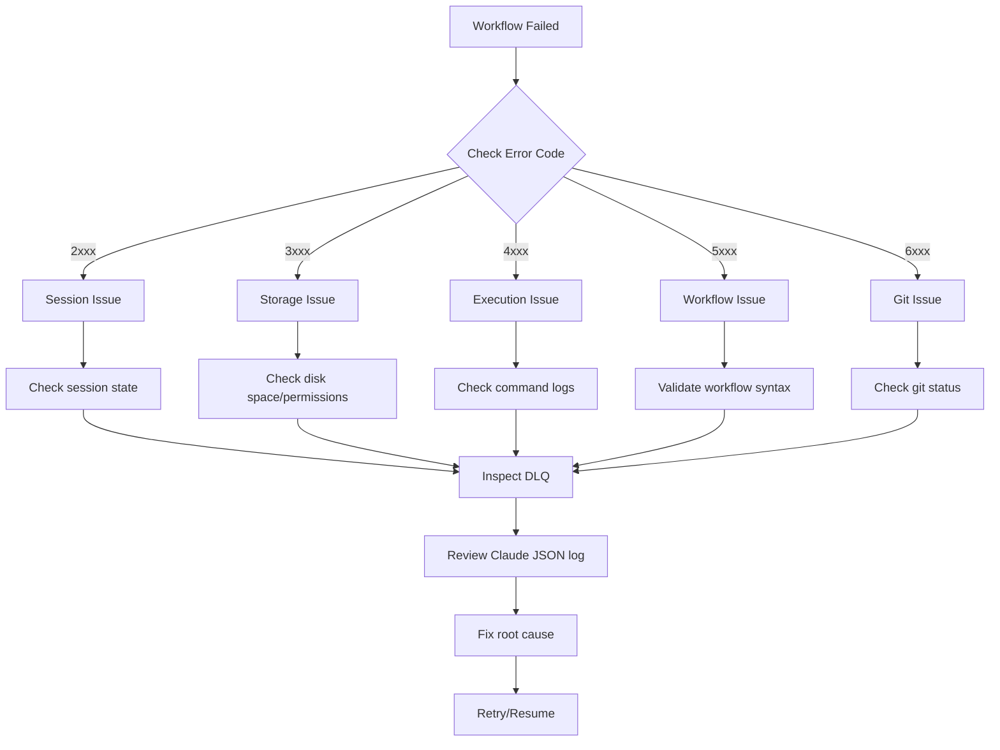

# Troubleshooting

This guide helps you diagnose and resolve common issues with Prodigy workflows.

## Error Code Reference

Prodigy uses structured error codes organized by category. Understanding these codes helps quickly identify the root cause of failures.

### Error Code Categories

<!-- Source: src/error/codes.rs:1-125 -->

| Range | Category | Description |
|-------|----------|-------------|
| 1000-1999 | Configuration | YAML/JSON parsing, validation, missing fields |
| 2000-2999 | Session | Session management, locking, state transitions |
| 3000-3999 | Storage | File I/O, disk space, serialization errors |
| 4000-4999 | Execution | Command execution, timeouts, subprocess failures |
| 5000-5999 | Workflow | Workflow validation, variable interpolation, checkpoints |
| 6000-6999 | Git | Repository operations, merge conflicts, worktree management |
| 7000-7999 | Validation | Input validation, type checking, constraint violations |
| 9000-9999 | Other | Unexpected errors, internal errors, not implemented features |

## Common Issues

### MapReduce Agent Failures

**Symptoms:**
- Agent execution fails during map phase
- Items appear in Dead Letter Queue (DLQ)
- Error logged in event stream

**Diagnosis:**

1. Check DLQ for failed items:

```bash
# View all failed items for a job
prodigy dlq show <job_id>

# Get detailed failure information
prodigy dlq show <job_id> | jq '.items[].failure_history'
```

2. Inspect the Claude JSON log referenced in the DLQ entry:

```bash
# Extract log path from DLQ item
LOG_PATH=$(prodigy dlq show <job_id> | jq -r '.items[0].failure_history[0].json_log_location')

# View the full Claude interaction
cat "$LOG_PATH" | jq
```

3. Check event logs for the specific agent:

```bash
# View events for the job
prodigy events show <job_id>

# Filter for agent failures
prodigy events show <job_id> | jq 'select(.event_type == "AgentFailed")'
```

**Resolution:**

Fix the underlying issue (usually in your workflow commands), then retry failed items:

```bash
# Retry all failed items
prodigy dlq retry <job_id>

# Retry with specific parallelism
prodigy dlq retry <job_id> --max-parallel 5

# Preview what would be retried
prodigy dlq retry <job_id> --dry-run
```

### Resume Failures

**Symptoms:**
- `prodigy resume <session_id>` fails with error
- Session appears in `prodigy sessions list` but cannot resume
- Error codes: 2001 (Session not found), 2004 (Session locked), 5009 (Resume error)

**Common Causes and Solutions:**

#### Session Not Found (Error 2001)

```bash
# Verify session exists
prodigy sessions list

# Check if session completed or was cleaned up
prodigy sessions list --all

# For MapReduce jobs, try using job ID instead
prodigy resume-job <job_id>
```

#### Session Locked (Error 2004)

Another resume process is already running for this session.

```bash
# Check lock file
ls ~/.prodigy/resume_locks/

# Verify if the holding process is still running
# (PID and hostname shown in error message)

# If process is dead, remove stale lock
rm ~/.prodigy/resume_locks/<session_id>.lock
```

!!! warning "Concurrent Resume Protection"
    Prodigy prevents multiple resume processes from running simultaneously to avoid data corruption. If you see a lock error, wait for the other process to complete or verify it's not a stale lock from a crashed process.

#### Corrupted Checkpoint (Error 5008)

```bash
# List available checkpoints
prodigy checkpoints list <session_id>

# Try resuming from an earlier checkpoint
# (Not yet implemented - requires manual state restoration)
```

### Worktree Cleanup Failures

**Symptoms:**
- Worktree cleanup fails after successful agent execution
- Orphaned worktrees remain in `~/.prodigy/worktrees/`
- Warnings in logs about cleanup failures

**Common Causes:**
- **Permission Denied**: Directory locked or insufficient permissions
- **Disk Full**: Not enough space for cleanup operations
- **Directory Busy**: Files open in editor or used by process
- **Git Locks**: Repository locked by concurrent git operation

**Resolution:**

<!-- Source: src/cli/commands/worktree/orphaned_cleanup.rs -->

1. List orphaned worktrees:

```bash
prodigy worktree clean-orphaned <job_id>
```

2. Preview cleanup (dry run):

```bash
prodigy worktree clean-orphaned <job_id> --dry-run
```

3. Force cleanup without confirmation:

```bash
prodigy worktree clean-orphaned <job_id> --force
```

4. Manual cleanup if needed:

```bash
# Check for processes using the worktree
lsof | grep <worktree-path>

# Check disk space
df -h

# Check directory permissions
ls -ld <worktree-path>

# Remove git worktree reference
cd <main-repo>
git worktree remove <worktree-path> --force
```

### Variable Interpolation Errors

**Symptoms:**
- Workflow fails with error code 5011 (Variable not found) or 5012 (Interpolation error)
- Commands receive incorrect or empty values
- Error message shows variable syntax issues

**Common Issues:**

#### Incorrect Syntax

```yaml
# WRONG - Single braces don't work
command: "process {item.name}"

# WRONG - Dollar sign without braces for complex expressions
command: "process $item.name"

# CORRECT - Use ${var} syntax
command: "process ${item.name}"

# CORRECT - Simple variable names can use $VAR
command: "process $PROJECT_NAME"
```

#### Variable Not in Scope

```yaml
# WRONG - Trying to use map results in setup phase
setup:
  - shell: "echo ${map.results}"  # map hasn't run yet!

# CORRECT - Use map results only in reduce phase
reduce:
  - shell: "echo ${map.results}"
```

#### Missing Environment Variables

```yaml
# Add env block at workflow root
env:
  PROJECT_DIR: "/path/to/project"

setup:
  - shell: "cd $PROJECT_DIR"  # Now available
```

**Debugging Variable Interpolation:**

Enable verbose logging to see interpolated values:

```bash
prodigy run workflow.yml -v
```

### Merge Conflicts

**Symptoms:**
- Error code 6003 (Git merge conflict)
- Merge fails when consolidating agent results
- Conflicting changes in same files

**Resolution:**

1. Enter the worktree:

```bash
cd ~/.prodigy/worktrees/<repo-name>/session-<id>/
```

2. Check conflict status:

```bash
git status
git diff
```

3. Resolve conflicts manually:

```bash
# Edit conflicted files
vim <conflicted-file>

# Mark as resolved
git add <conflicted-file>
git commit -m "Resolve merge conflict"
```

4. Resume workflow:

```bash
prodigy resume <session_id>
```

### Storage Issues

**Error Code 3001 (I/O Error)**

- Check file permissions: `ls -l ~/.prodigy/`
- Verify directory is writable: `touch ~/.prodigy/test && rm ~/.prodigy/test`
- Check for filesystem issues: `df -h`

**Error Code 3003 (Disk Full)**

```bash
# Check available space
df -h ~/.prodigy/

# Clean up old sessions
prodigy sessions clean --older-than 7d

# Remove completed worktrees
prodigy worktree clean --completed
```

**Error Code 3007 (Lock Failed)**

- Another process is accessing the same resource
- Wait for concurrent operation to complete
- Check for stale lock files: `ls ~/.prodigy/resume_locks/`

**Error Code 3011 (Serialization Error)**

- Checkpoint or state file is corrupted
- May occur after system crash or disk full condition
- Try removing the corrupted file and resuming from earlier checkpoint

### Workflow Validation Errors

**Error Code 5002 (Invalid Syntax)**

```bash
# Validate workflow before running
prodigy validate workflow.yml
```

Common YAML syntax errors:

```yaml
# WRONG - Missing colon
map:
  input "items.json"

# CORRECT
map:
  input: "items.json"

# WRONG - Inconsistent indentation
map:
  agent_template:
    - claude: "/process"
     - shell: "test"  # Wrong indent

# CORRECT
map:
  agent_template:
    - claude: "/process"
    - shell: "test"
```

**Error Code 5004 (Validation Failed)**

Workflow structure is invalid:

```yaml
# WRONG - Missing required field
name: my-workflow
mode: mapreduce
# Missing: map, reduce, or setup

# CORRECT
name: my-workflow
mode: mapreduce
map:
  input: "items.json"
  agent_template:
    - claude: "/process ${item}"
```

### Git Issues

**Error Code 6001 (Not a Repository)**

```bash
# Initialize git repository
git init

# Or run Prodigy from repository root
cd <repo-root>
prodigy run workflow.yml
```

**Error Code 6006 (Uncommitted Changes)**

```bash
# Commit changes before starting workflow
git add .
git commit -m "Prepare for workflow"

# Or stash changes
git stash
prodigy run workflow.yml
```

**Error Code 6008 (Worktree Exists)**

```bash
# Clean up existing worktree
prodigy worktree clean <worktree-name>

# Or use different session ID
prodigy run workflow.yml  # Creates new session automatically
```

**Error Code 6009 (Worktree Not Found)**

Session worktree was manually deleted or corrupted:

```bash
# List sessions
prodigy sessions list

# Clean up session state
prodigy sessions clean <session_id>
```

## Debugging Techniques

### Using Verbose Logging

Control output verbosity to see more details:

```bash
# Default: Clean output, no Claude streaming
prodigy run workflow.yml

# Verbose: Show Claude streaming JSON output
prodigy run workflow.yml -v

# Very verbose: Add debug logs
prodigy run workflow.yml -vv

# Maximum verbosity: Include trace logs
prodigy run workflow.yml -vvv

# Force Claude streaming regardless of verbosity
PRODIGY_CLAUDE_CONSOLE_OUTPUT=true prodigy run workflow.yml
```

### Inspecting Event Logs

<!-- Source: src/mapreduce/events/mod.rs -->

Event logs provide a complete audit trail of workflow execution:

```bash
# View all events for a job
prodigy events show <job_id>

# Filter by event type
prodigy events show <job_id> | jq 'select(.event_type == "AgentStarted")'

# Find failed agents
prodigy events show <job_id> | jq 'select(.event_type == "AgentFailed")'

# Extract error messages
prodigy events show <job_id> | jq -r '.error_message // empty'
```

### Analyzing Claude JSON Logs

Every Claude command creates a JSONL log file with the complete interaction:

```bash
# View most recent Claude log
prodigy logs --latest

# View log with summary
prodigy logs --latest --summary

# Follow (tail) the latest log
prodigy logs --latest --tail

# Find log path from DLQ item
LOG_PATH=$(prodigy dlq show <job_id> | jq -r '.items[0].failure_history[0].json_log_location')

# Analyze the log
cat "$LOG_PATH" | jq

# View all assistant responses
cat "$LOG_PATH" | jq -c 'select(.type == "assistant")'

# Extract tool uses
cat "$LOG_PATH" | jq -c 'select(.type == "assistant") | .content[]? | select(.type == "tool_use")'

# Check token usage
cat "$LOG_PATH" | jq -c 'select(.usage)'
```

### Reviewing Checkpoint Files

<!-- Source: src/checkpoint/mod.rs -->

Checkpoints preserve workflow state for resume:

```bash
# List checkpoints for a session
prodigy checkpoints list <session_id>

# View checkpoint contents
cat ~/.prodigy/state/<repo-name>/checkpoints/<checkpoint-file> | jq

# Check for corrupted checkpoints
jq . < ~/.prodigy/state/<repo-name>/checkpoints/<checkpoint-file>
```

### Dead Letter Queue Analysis

<!-- Source: src/mapreduce/dlq/mod.rs -->

DLQ contains detailed failure information:

```bash
# View failed items
prodigy dlq show <job_id>

# Extract failure reasons
prodigy dlq show <job_id> | jq -r '.items[].failure_history[].error_message'

# Find items with specific error
prodigy dlq show <job_id> | jq '.items[] | select(.failure_history[].error_message | contains("timeout"))'

# Count failure types
prodigy dlq show <job_id> | jq -r '.items[].failure_history[].error_message' | sort | uniq -c
```

### Workflow Debugging Workflow

When a workflow fails, follow this systematic approach:



1. **Identify the error code** from the error message
2. **Check relevant logs** based on error category
3. **Inspect DLQ** if MapReduce agent failed
4. **Review Claude JSON log** for detailed interaction
5. **Fix root cause** in workflow or environment
6. **Retry or resume** the workflow

## Timeout Issues

### Command Execution Timeout (Error 4002)

Default timeout is 2 minutes. Increase for long-running commands:

```yaml
commands:
  - shell: "cargo build --release"
    timeout: 600  # 10 minutes
```

### Workflow Timeout (Error 5005)

Set timeout at workflow level:

```yaml
name: my-workflow
timeout: 3600  # 1 hour

commands:
  - shell: "long-running-process"
```

### MapReduce Agent Timeout

Configure per-agent timeout:

```yaml
map:
  agent_template:
    - claude: "/process ${item}"
      timeout: 300  # 5 minutes per agent
```

## Performance Issues

### Too Many Parallel Agents

Reduce parallelism to avoid resource contention:

```yaml
map:
  max_parallel: 5  # Default: 10
```

### Large Work Queues

Filter or limit items to process:

```yaml
map:
  input: "items.json"
  filter: "item.priority >= 5"  # Only high priority
  max_items: 50  # Limit total items
```

### Slow Checkpointing

Checkpoint overhead increases with large state:

- Reduce checkpoint frequency (implementation-specific)
- Use smaller work items
- Minimize state stored in variables

## Getting Help

If you've tried the troubleshooting steps above and still have issues:

1. **Check the documentation**: Review the [User Guide](../user-guide/index.md) and [Reference](index.md) sections
2. **Search GitHub issues**: Look for similar problems at [github.com/yourusername/prodigy/issues](https://github.com)
3. **Enable debug logging**: Run with `-vvv` to capture detailed logs
4. **Gather diagnostic information**:
   - Error code and full error message
   - Workflow YAML file
   - Relevant Claude JSON log paths
   - DLQ contents (if applicable)
   - Event log excerpt
5. **Report the issue**: Create a GitHub issue with the diagnostic information

## Related Topics

- [Error Handling](error-handling.md) - Understanding error propagation and handling
- [Sessions](sessions.md) - Session lifecycle and management
- [Dead Letter Queue](dlq.md) - Working with failed items
- [Observability](observability.md) - Monitoring and debugging tools
- [Worktrees](worktrees.md) - Git worktree management
- [Checkpoints and Resume](checkpoint-resume.md) - Checkpoint-based recovery
