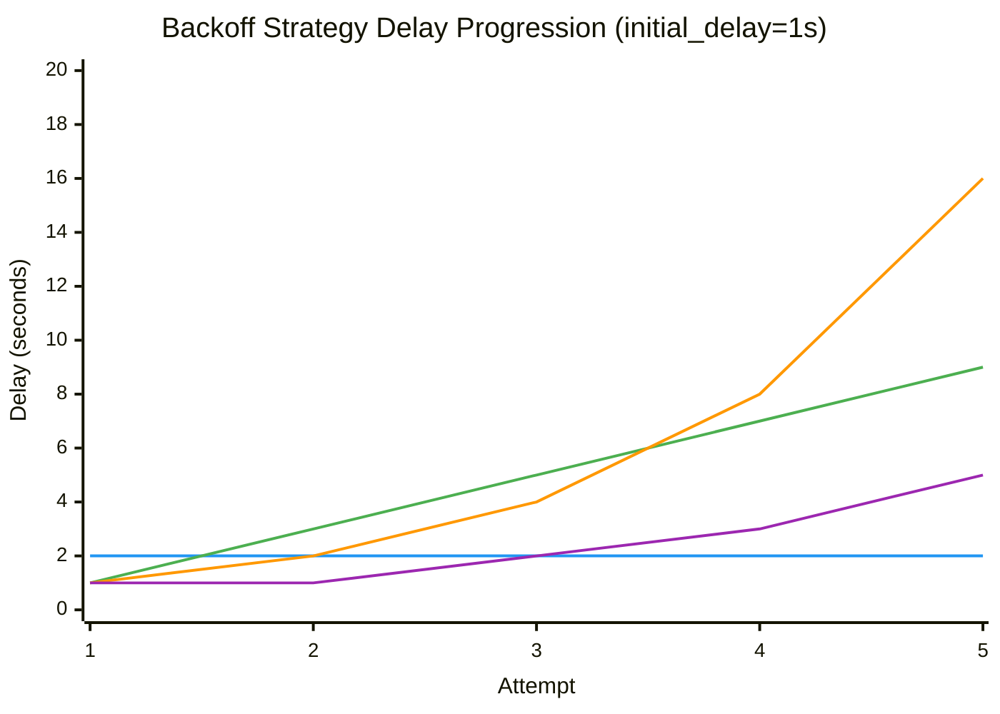

## Backoff Strategy Comparison

This comparison assumes `initial_delay = 1s` for all strategies. Actual delays depend on your retry configuration. All strategies are capped by `max_delay` (default 30s) as enforced in `src/cook/retry_v2.rs:304`.

**Source**: Delay calculations from `src/cook/retry_v2.rs:284-305` (calculate_delay method)

### Strategy Comparison Table

| Strategy | Attempt 1 | Attempt 2 | Attempt 3 | Attempt 4 | Attempt 5 | Best For |
|----------|-----------|-----------|-----------|-----------|-----------|----------|
| **Fixed (2s)** | 2s | 2s | 2s | 2s | 2s | Predictable timing, simple errors without exponential backpressure |
| **Linear (+2s)** | 1s | 3s | 5s | 7s | 9s | Moderate load reduction, gradual backoff without aggressive delays |
| **Exponential (base 2.0)** | 1s | 2s | 4s | 8s | 16s | **Recommended default** - Aggressive backoff for most failures, best for temporary outages |
| **Fibonacci** | 1s | 1s | 2s | 3s | 5s | Gentler than exponential, good for rate limits or distributed systems |
| **Custom** | user-defined | user-defined | user-defined | user-defined | user-defined | Specific delay patterns, custom business logic |

!!! note "Default Strategy"
    Exponential is the default backoff strategy (see `src/cook/retry_v2.rs:92-97`)

### Delay Progression Visualization



### Strategy Formulas

Each strategy calculates delay using a different formula:

**Fixed** (src/cook/retry_v2.rs:286):
```
delay = initial_delay
```
Always returns the same delay, regardless of attempt number.

**Linear** (src/cook/retry_v2.rs:287-289):
```
delay = initial_delay + increment * (attempt - 1)
```
Example: With `initial_delay = 1s` and `increment = 2s`:
- Attempt 1: 1s + 2s × (1-1) = 1s
- Attempt 2: 1s + 2s × (2-1) = 3s
- Attempt 3: 1s + 2s × (3-1) = 5s

**Exponential** (src/cook/retry_v2.rs:290-292):
```
delay = initial_delay * base^(attempt - 1)
```
Example: With `initial_delay = 1s` and `base = 2.0`:
- Attempt 1: 1s × 2^(1-1) = 1s × 1 = 1s
- Attempt 2: 1s × 2^(2-1) = 1s × 2 = 2s
- Attempt 3: 1s × 2^(3-1) = 1s × 4 = 4s

The `base` parameter is configurable (default: 2.0). Common values:
- `base = 2.0`: Aggressive backoff (doubles each retry)
- `base = 1.5`: Gentler exponential growth
- `base = 3.0`: Very aggressive backoff

**Fibonacci** (src/cook/retry_v2.rs:294-297):
```
delay = initial_delay * fibonacci(attempt)
```
Example: With `initial_delay = 1s`:
- Attempt 1: 1s × fibonacci(1) = 1s × 1 = 1s
- Attempt 2: 1s × fibonacci(2) = 1s × 1 = 1s
- Attempt 3: 1s × fibonacci(3) = 1s × 2 = 2s
- Attempt 4: 1s × fibonacci(4) = 1s × 3 = 3s
- Attempt 5: 1s × fibonacci(5) = 1s × 5 = 5s

Fibonacci sequence: 0, 1, 1, 2, 3, 5, 8, 13, 21, 34...

**Custom** (src/cook/retry_v2.rs:298-301):
```
delay = delays[attempt - 1] or max_delay if out of bounds
```
Allows you to specify exact delays for each attempt. If retry exceeds the array length, `max_delay` is used.

### Max Delay Cap

**All strategies are capped by `max_delay`** (src/cook/retry_v2.rs:304):
```rust
// Source: src/cook/retry_v2.rs:304
base_delay.min(self.config.max_delay)
```

This prevents unbounded delays in exponential/fibonacci strategies. Default `max_delay = 30s` (src/cook/retry_v2.rs:30).

Example with `max_delay = 30s` and Exponential (base 2.0):
- Attempt 6: Would be 32s → capped to 30s
- Attempt 7+: All capped to 30s

### Jitter Support

**All strategies support optional jitter** to prevent thundering herd problems (src/cook/retry_v2.rs:308-317).

When `jitter = true` (default `jitter_factor = 0.3`), delays are randomized:
```
jitter_range = delay * jitter_factor
actual_delay = delay + random(-jitter_range/2, +jitter_range/2)
```

Example with 1s delay and 30% jitter (factor 0.3):
- jitter_range = 1s × 0.3 = 0.3s
- actual_delay = random(0.85s, 1.15s)

See [Jitter for Distributed Systems](jitter-for-distributed-systems.md) for when to use jitter.

### YAML Configuration Examples

=== "Fixed Delay"

    ```yaml title="Fixed backoff configuration"
    # Source: Always waits the same duration between retries
    retry_config:
      backoff: fixed
      initial_delay: "2s"  # (1)!
    ```

    1. Always wait 2s between retries, regardless of attempt number

=== "Linear Backoff"

    ```yaml title="Linear backoff configuration"
    # Source: Delay increases by increment each attempt
    retry_config:
      backoff:
        type: linear
        increment: "2s"  # (1)!
      initial_delay: "1s"  # (2)!
    ```

    1. Add 2s to delay after each attempt
    2. Produces sequence: 1s, 3s, 5s, 7s, 9s...

=== "Exponential Backoff"

    ```yaml title="Exponential backoff configuration (default)"
    # Source: Delay multiplies by base each attempt
    retry_config:
      backoff:
        type: exponential
        base: 2.0  # (1)!
      initial_delay: "1s"  # (2)!
      max_delay: "30s"  # (3)!
    ```

    1. Optional: default is 2.0
    2. Produces sequence: 1s, 2s, 4s, 8s, 16s...
    3. Cap at 30s to prevent excessive delays

=== "Fibonacci Backoff"

    ```yaml title="Fibonacci backoff configuration"
    # Source: Delay follows Fibonacci sequence
    retry_config:
      backoff: fibonacci
      initial_delay: "1s"  # (1)!
    ```

    1. Produces sequence: 1s, 1s, 2s, 3s, 5s, 8s...

=== "Custom Delays"

    ```yaml title="Custom backoff configuration"
    # Source: User-defined delay for each attempt
    retry_config:
      backoff:
        type: custom
        delays: ["1s", "2s", "5s", "10s", "30s"]  # (1)!
      max_delay: "60s"  # (2)!
    ```

    1. Explicit delay for each attempt (1-5)
    2. Fallback if attempts exceed array length

=== "With Jitter"

    ```yaml title="Any strategy with jitter enabled"
    # Source: Randomizes delays to prevent thundering herd
    retry_config:
      backoff: exponential
      initial_delay: "1s"
      jitter: true  # (1)!
      jitter_factor: 0.3  # (2)!
    ```

    1. Enable randomization of delays
    2. 30% jitter means delays vary ±15% from calculated value

### Choosing the Right Strategy

| Use Case | Recommended Strategy | Reasoning |
|----------|---------------------|-----------|
| **Temporary service outage** | Exponential (base 2.0) | Quickly backs off to avoid overwhelming recovering service |
| **Rate limiting (429 errors)** | Fibonacci or Linear | Gentler backoff respects rate limits without excessive delays |
| **Network flakiness** | Exponential + Jitter | Aggressive backoff with jitter prevents thundering herd |
| **Predictable timing needs** | Fixed | Consistent delay for deterministic behavior |
| **Gradual load shedding** | Linear | Steady increase allows system to recover gradually |
| **Custom business logic** | Custom | Full control over delay pattern (e.g., comply with API retry-after headers) |
| **Distributed systems** | Fibonacci + Jitter | Balances quick retries with avoiding cascade failures |

!!! tip "Default Recommendation"
    Exponential with `base = 2.0` is the default for good reason - it works well for most transient failures while avoiding excessive load on failing systems.

### Performance Comparison

Time to reach `max_delay = 30s` with `initial_delay = 1s`:

| Strategy | Attempts to Max | Total Time (5 attempts) |
|----------|----------------|------------------------|
| Fixed (2s) | Never (always 2s) | 10s |
| Linear (+2s) | 15 attempts | 25s (1+3+5+7+9) |
| Exponential (base 2.0) | 5 attempts | 31s (1+2+4+8+16) |
| Fibonacci | 9 attempts | 12s (1+1+2+3+5) |

!!! info "Key Insight"
    Exponential reaches max delay fastest, making it most aggressive. Fibonacci is gentler, making it better for gradual recovery scenarios.
