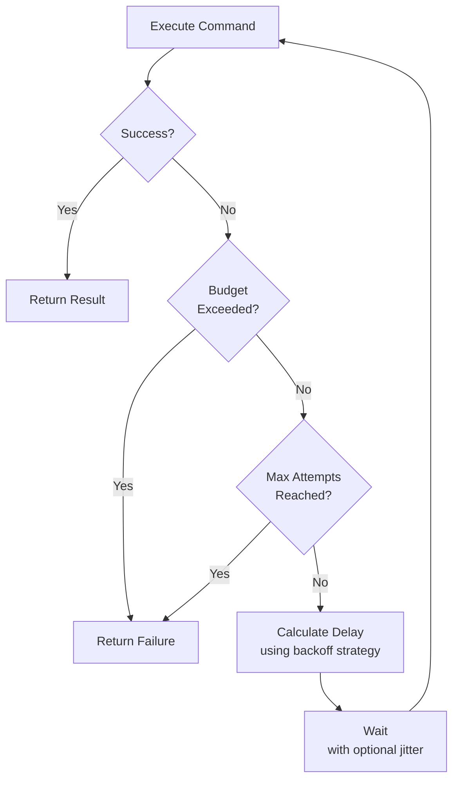

## Basic Retry Configuration

The enhanced retry system (`retry_v2`) provides command-level retry capabilities with sophisticated backoff strategies and error handling. This subsection covers the basic retry configuration options.

!!! note "Enhanced Retry System"
    This documents the enhanced retry system (`retry_v2::RetryConfig`). For workflow-level retry configuration, see [Workflow-Level vs Command-Level Retry](./workflow-level-vs-command-level-retry.md).

### Where Retry Config is Used

Retry configuration can be applied at the command level in your workflow YAML files. The `retry_config` field is available on individual commands to control how that specific command is retried on failure.

**Source**: `src/cook/retry_v2.rs:14-52` (RetryConfig struct definition)

### Basic Configuration Example

The simplest retry configuration uses just the attempts field:

```yaml
commands:
  - shell: "curl https://api.example.com/data"
    retry_config:
      attempts: 3  # (1)!
```

1. Only `attempts` is required - all other fields use sensible defaults

This configuration will:

- Retry the command up to 3 times on failure
- Use exponential backoff with base 2.0 (default)
- Start with 1 second initial delay (default)
- Cap delays at 30 seconds maximum (default)
- Retry on all error types (default when `retry_on` is empty)

### Complete Basic Configuration

For more control, you can specify all basic retry parameters:

```yaml
commands:
  - shell: "make test"
    retry_config:
      attempts: 5              # (1)!
      initial_delay: "2s"      # (2)!
      max_delay: "60s"         # (3)!
      backoff: exponential     # (4)!
```

1. Maximum retry attempts (default: 3)
2. Initial delay between retries (default: 1s)
3. Maximum delay cap (default: 30s)
4. Backoff strategy - `exponential`, `linear`, `fibonacci`, or `fixed` (default: exponential)

**Field Reference** (from `src/cook/retry_v2.rs:54-68`):

- `attempts: u32` - Maximum number of retry attempts (default: 3)
- `initial_delay: Duration` - Starting delay between retries (default: 1 second)
- `max_delay: Duration` - Maximum delay ceiling (default: 30 seconds)
- `backoff: BackoffStrategy` - Strategy for calculating delays (default: Exponential { base: 2.0 })

### Default Behavior

When `retry_config` is omitted entirely, commands run **without retry**. When `retry_config` is present but fields are omitted, defaults from `RetryConfig::default()` apply:

```rust
// Source: src/cook/retry_v2.rs:54-68
RetryConfig {
    attempts: 3,
    backoff: BackoffStrategy::Exponential { base: 2.0 },
    initial_delay: Duration::from_secs(1),
    max_delay: Duration::from_secs(30),
    jitter: false,
    jitter_factor: 0.3,
    retry_on: Vec::new(),  // Empty = retry all errors
    retry_budget: None,
    on_failure: FailureAction::Stop,
}
```

### Relationship to Command Execution

When a command with `retry_config` fails, the `RetryExecutor` orchestrates the retry logic:



**Execution Steps:**

1. **Execute Command**: Run the shell/Claude command
2. **Check Result**: If successful, return immediately
3. **Check Retry Budget**: If set, ensure budget not exceeded
4. **Check Attempts**: Verify max attempts not reached
5. **Calculate Delay**: Use backoff strategy to determine next delay
6. **Wait**: Sleep for calculated delay (with optional jitter)
7. **Retry**: Execute command again

**Source**: `src/cook/retry_v2.rs:191-262` (RetryExecutor::execute_with_retry)

### Integration with RetryConfig Struct

All YAML retry configuration maps directly to the `RetryConfig` struct fields:

| YAML Field | Rust Field | Type | Default |
|------------|------------|------|---------|
| `attempts` | `attempts` | `u32` | 3 |
| `initial_delay` | `initial_delay` | `Duration` | 1s |
| `max_delay` | `max_delay` | `Duration` | 30s |
| `backoff` | `backoff` | `BackoffStrategy` | Exponential |
| `jitter` | `jitter` | `bool` | false |
| `jitter_factor` | `jitter_factor` | `f64` | 0.3 |
| `retry_on` | `retry_on` | `Vec<ErrorMatcher>` | [] (all) |
| `retry_budget` | `retry_budget` | `Option<Duration>` | None |
| `on_failure` | `on_failure` | `FailureAction` | Stop |

**Source**: `src/cook/retry_v2.rs:14-52`

### Minimal vs Full Configuration

=== "Minimal"

    Use defaults for most fields - only specify what you need:

    ```yaml
    retry_config:
      attempts: 5
    ```

    This uses exponential backoff with 1s initial delay, 30s max delay, no jitter, and retries on all errors.

=== "Full"

    Explicit control over all parameters:

    ```yaml
    retry_config:
      attempts: 10
      backoff: fibonacci
      initial_delay: "500ms"
      max_delay: "2m"
      jitter: true
      jitter_factor: 0.5
      retry_budget: "10m"
      retry_on:
        - network
        - timeout
      on_failure: continue
    ```

    This configures:

    - Up to 10 retry attempts
    - Fibonacci backoff strategy
    - Starting at 500ms delay, capped at 2 minutes
    - Random jitter of ±50% added to delays
    - 10-minute total retry budget
    - Only retry network and timeout errors
    - Continue workflow even if retries exhausted
