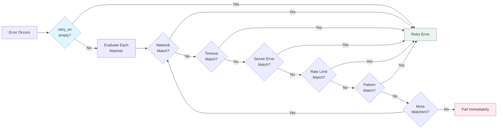

## Conditional Retry with Error Matchers

By default, Prodigy retries all errors when `retry_on` is empty. Use the `retry_on` field to retry only specific error types, allowing fine-grained control over which failures should trigger retries.

**Source**: `src/cook/retry_v2.rs:100-114` (ErrorMatcher enum definition)

!!! warning "Case Sensitivity Differences"
    **Built-in matchers** and **Pattern matcher** handle case differently:

    - **Built-in matchers** (Network, Timeout, ServerError, RateLimit): **Case-insensitive** - error messages are normalized to lowercase before matching
    - **Pattern matcher**: **Case-sensitive by default** - matches against original error message case

    Use regex flag `(?i)` for case-insensitive pattern matching:
    ```yaml
    pattern: '(?i)database locked'  # Matches "Database Locked", "DATABASE LOCKED", etc.
    ```

### Available Error Matchers

The `ErrorMatcher` enum provides five built-in matchers for common error categories:

#### 1. Network Errors

Matches network connectivity issues:

```yaml
retry_config:
  attempts: 5
  retry_on:
    - network
```

**Matches** (case-insensitive):
- "network"
- "connection"
- "refused"
- "unreachable"

**Source**: `src/cook/retry_v2.rs:121-126`

**Use Case**: Retrying HTTP requests, database connections, or API calls that fail due to network issues.

#### 2. Timeout Errors

Matches timeout-related failures:

```yaml
retry_config:
  attempts: 3
  retry_on:
    - timeout
```

**Matches** (case-insensitive):
- "timeout"
- "timed out"

**Source**: `src/cook/retry_v2.rs:127-129`

**Use Case**: Retrying slow external services or operations with strict time limits.

#### 3. Server Errors

Matches HTTP 5xx server errors:

```yaml
retry_config:
  attempts: 4
  retry_on:
    - server_error
```

**Matches** (case-insensitive):
- "500"
- "502"
- "503"
- "504"
- "server error"

**Source**: `src/cook/retry_v2.rs:130-136`

**Use Case**: Retrying API requests during transient server failures or deployments.

#### 4. Rate Limit Errors

Matches rate limiting responses:

```yaml
retry_config:
  attempts: 10
  initial_delay: "60s"
  retry_on:
    - rate_limit
```

**Matches** (case-insensitive):
- "rate limit"
- "429"
- "too many requests"

**Source**: `src/cook/retry_v2.rs:137-141`

**Use Case**: Retrying API calls with exponential backoff when hitting rate limits.

#### 5. Custom Pattern Matching

Match specific error messages using regex patterns:

```yaml
retry_config:
  attempts: 3
  retry_on:
    - pattern: "(?i)database locked"    # Case-insensitive: matches any case
    - pattern: "SQLITE_BUSY"            # Case-sensitive: exact match only
    - pattern: "(?i)temporary failure"  # Case-insensitive
```

!!! tip "Pattern Syntax"
    - Regex patterns matched against original error message (case-sensitive by default)
    - Use `(?i)` flag at start of pattern for case-insensitive matching
    - Invalid regex patterns return false (no match)

**Source**: `src/cook/retry_v2.rs:142-148` (Pattern variant implementation)

**Use Case**: Matching application-specific error messages or database-specific errors.

!!! example "Case Sensitivity Examples"
    | Pattern | Matches | Does Not Match |
    |---------|---------|----------------|
    | `"SQLITE_BUSY"` | `SQLITE_BUSY` | `sqlite_busy`, `Sqlite_Busy` |
    | `"(?i)SQLITE_BUSY"` | `SQLITE_BUSY`, `sqlite_busy`, `Sqlite_Busy` | — |
    | `"(?i)database.*locked"` | `Database is Locked`, `DATABASE LOCKED` | — |

### Error Matching Flow

When an error occurs, Prodigy evaluates it against configured matchers:



**Figure**: Error matching flow showing OR logic - first matcher that matches triggers retry.

### Combining Multiple Matchers

You can specify multiple error matchers to retry on any of them:

```yaml
retry_config:
  attempts: 5
  backoff: exponential
  initial_delay: "2s"
  retry_on:
    - network
    - timeout
    - server_error
```

This configuration retries if the error matches **any** of:

- Network errors
- Timeout errors
- Server errors (5xx)

!!! info "OR Logic"
    Matchers are evaluated with OR logic - if **any** matcher matches, the error is retryable.

!!! tip "Choosing the Right Strategy"
    - **Start broad**: Use built-in matchers (`network`, `timeout`) for common transient errors
    - **Add specifics**: Use `pattern` for application-specific errors (database locks, auth failures)
    - **Fail fast**: Only retry errors that are truly transient - retrying permanent failures wastes time

### Empty retry_on (Retry All Errors)

When `retry_on` is empty or omitted, **all errors trigger retry**:

```yaml
retry_config:
  attempts: 3
  # retry_on is empty - retries all errors
```

**Source**: `src/cook/retry_v2.rs:42-43` (retry_on field with default `Vec::new()`)

!!! note
    This is equivalent to having no error filtering - every failure triggers the retry logic.

### Selective Retry Example

Only retry transient network and timeout issues, but fail immediately on other errors:

```yaml
commands:
  - shell: "curl -f https://api.example.com/data"
    retry_config:
      attempts: 5
      backoff: exponential
      initial_delay: "1s"
      max_delay: "30s"
      retry_on:
        - network
        - timeout
```

**Behavior**:

| Error | Result | Reason |
|-------|--------|--------|
| "connection refused" | :material-refresh: Retry | Matches `network` |
| "timeout" | :material-refresh: Retry | Matches `timeout` |
| "404 Not Found" | :material-close: Fail immediately | No matcher |
| "401 Unauthorized" | :material-close: Fail immediately | No matcher |

### Regex Pattern Syntax and Case Sensitivity

Understanding case sensitivity is critical when using Pattern matchers:

| Matcher Type | Case Sensitivity | Normalization |
|-------------|------------------|---------------|
| Network | Case-insensitive | Error converted to lowercase |
| Timeout | Case-insensitive | Error converted to lowercase |
| ServerError | Case-insensitive | Error converted to lowercase |
| RateLimit | Case-insensitive | Error converted to lowercase |
| Pattern | **Case-sensitive by default** | No normalization (original case) |

**Making Pattern Matching Case-Insensitive**:

Use the `(?i)` flag at the start of your regex pattern:

```yaml
retry_on:
  # Case-insensitive patterns (recommended)
  - pattern: "(?i)connection refused"  # Matches any case variation
  - pattern: "(?i)database.*locked"    # Case-insensitive with wildcards

  # Case-sensitive patterns (use with caution)
  - pattern: "SQLITE_BUSY"             # Only matches exact case
  - pattern: "ERROR: Authentication"   # Must match exact case
```

!!! warning "Invalid Regex Handling"
    If a pattern contains invalid regex syntax, it returns `false` (no match) and the error will **not** be retried:

    ```yaml
    retry_on:
      - pattern: "[invalid(regex"  # Invalid syntax → returns false → no retry
    ```

    **Source**: `src/cook/retry_v2.rs:142-148`

### Advanced Pattern Matching

Use regex patterns for precise error matching:

```yaml
retry_config:
  attempts: 3
  retry_on:
    # Case-insensitive patterns (recommended for flexible matching)
    - pattern: "(?i)SQLite.*database is locked"
    - pattern: "(?i)deadlock detected"

    # Case-sensitive pattern (exact match required)
    - pattern: "SQLITE_BUSY"
```

**Pattern Matching Logic** (src/cook/retry_v2.rs:116-150):
1. Each matcher's `matches()` method is called with the error message
2. Built-in matchers normalize error to lowercase before checking
3. Pattern matcher applies regex to **original case** of error message
4. Invalid regex patterns return false (no match, no retry)
5. If any matcher returns true, error is retryable

### Implementation Details

The matching logic is implemented in `ErrorMatcher::matches()`:

```rust title="src/cook/retry_v2.rs:116-150" linenums="116"
// Simplified implementation
impl ErrorMatcher {
    pub fn matches(&self, error_msg: &str) -> bool {
        let error_lower = error_msg.to_lowercase();
        match self {
            Self::Network => {
                // Case-insensitive matching via lowercase normalization
                error_lower.contains("network")
                    || error_lower.contains("connection")
                    || error_lower.contains("refused")
                    || error_lower.contains("unreachable")
            }
            Self::Timeout => {
                error_lower.contains("timeout") || error_lower.contains("timed out")
            }
            Self::ServerError => {
                error_lower.contains("500")
                    || error_lower.contains("502")
                    || error_lower.contains("503")
                    || error_lower.contains("504")
                    || error_lower.contains("server error")
            }
            Self::RateLimit => {
                error_lower.contains("rate limit")
                    || error_lower.contains("429")
                    || error_lower.contains("too many requests")
            }
            Self::Pattern(pattern) => {
                // Case-sensitive by default - matches against original error_msg
                // Use (?i) flag in pattern for case-insensitive matching
                if let Ok(re) = regex::Regex::new(pattern) {
                    re.is_match(error_msg)  // Uses original case, not error_lower
                } else {
                    false  // Invalid regex = no match
                }
            }
        }
    }
}
```

### Testing Error Matchers

The retry_v2 module includes tests for built-in matchers:

```rust title="src/cook/retry_v2.rs (test module)"
#[test]
fn test_error_matcher_network() {
    let matcher = ErrorMatcher::Network;
    assert!(matcher.matches("Connection refused"));
    assert!(matcher.matches("Network unreachable"));
    assert!(matcher.matches("connection timeout"));  // Case-insensitive
    assert!(!matcher.matches("Syntax error"));
}

#[test]
fn test_error_matcher_timeout() {
    let matcher = ErrorMatcher::Timeout;
    assert!(matcher.matches("Operation timeout"));
    assert!(matcher.matches("Request timed out"));
    assert!(!matcher.matches("Network error"));
}

#[test]
fn test_error_matcher_rate_limit() {
    let matcher = ErrorMatcher::RateLimit;
    assert!(matcher.matches("Rate limit exceeded"));
    assert!(matcher.matches("Error 429"));
    assert!(matcher.matches("Too many requests"));
    assert!(!matcher.matches("Server error"));
}
```

!!! note "Test Coverage"
    Pattern matcher tests are not yet implemented in the test suite. The above tests cover Network, Timeout, and RateLimit matchers only.
