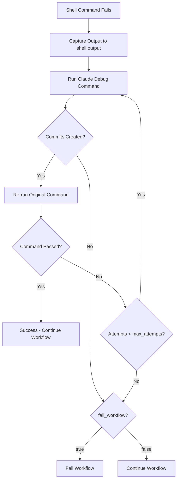

## Failure Actions

!!! warning "Important"
    This subsection documents the `on_failure` mechanism for **workflow shell commands**, which uses `TestDebugConfig` for automatic debugging and retry. This is distinct from the theoretical `retry_config.on_failure` field shown in the parent chapter overview, which is defined in code but not yet integrated into command execution.

Configure automatic debugging and retry behavior when shell commands fail using the `on_failure` field. This mechanism allows Claude to automatically diagnose and fix test failures, build errors, and other command failures.

## What is TestDebugConfig?

The `on_failure` field in workflow commands accepts a `TestDebugConfig` object that specifies:

- A Claude command to run when the shell command fails
- How many times to retry the debug-fix cycle
- Whether to fail the entire workflow if debugging doesn't fix the issue
- Whether the debug command should create git commits

This enables **self-healing workflows** where Claude automatically attempts to fix failures before escalating them.

```rust title="TestDebugConfig struct"
// Source: src/config/command.rs:166-183
/// Configuration for test debugging on failure
pub struct TestDebugConfig {
    /// Claude command to run on test failure
    pub claude: String,

    /// Maximum number of retry attempts (default: 3)
    pub max_attempts: u32,

    /// Whether to fail the workflow if max attempts reached (default: false)
    pub fail_workflow: bool,

    /// Whether the debug command should create commits (default: true)
    pub commit_required: bool,
}
```

## Basic Syntax

The simplest form specifies just the Claude command to run on failure:

```yaml
- shell: "cargo test"
  on_failure:
    claude: "/prodigy-debug-test-failure --output ${shell.output}"
```

**Execution Flow**:

1. Run `cargo test`
2. If it fails → Capture output in `${shell.output}`
3. Run `/prodigy-debug-test-failure --output ${shell.output}`
4. Claude analyzes failure and attempts fix
5. If Claude creates commits → Re-run `cargo test`
6. Repeat up to `max_attempts` times (default: 3)

## Configuration Options

### Full Configuration

All `on_failure` options:

```yaml
- shell: "cargo test --doc"
  on_failure:
    claude: "/prodigy-debug-test-failure --output ${shell.output}"
    max_attempts: 3           # Maximum debug-fix-retest cycles (default: 3)
    fail_workflow: false      # Continue workflow even if can't fix (default: false)
    commit_required: true     # Debug command should create commits (default: true)
```

### max_attempts

Controls how many debug-fix-retest cycles to attempt:

```yaml
- shell: "just fmt-check && just lint"
  on_failure:
    claude: "/prodigy-lint ${shell.output}"
    max_attempts: 5           # Try up to 5 times to fix linting issues
```

**Default**: 3 attempts (defined in `src/config/command.rs:173`)

=== "Quick Fix (1 attempt)"
    Best for simple issues that should be fixed on first try. Don't waste time on hard problems.

=== "Standard (3 attempts)"
    Default setting. Reasonable for most test failures that may need iterative fixes.

=== "Persistent (5+ attempts)"
    For complex issues that might need multiple iterations to fully resolve.

### fail_workflow

Controls whether to stop the entire workflow if debugging can't fix the issue:

=== "Critical Command"
    ```yaml
    # CRITICAL: Must succeed - fail workflow if can't fix
    - shell: "cargo test"
      on_failure:
        claude: "/prodigy-debug-test-failure --output ${shell.output}"
        max_attempts: 3
        fail_workflow: true       # Stop workflow if tests still fail
    ```

=== "Non-Critical Command"
    ```yaml
    # NON-CRITICAL: Best effort - continue even if can't fix
    - shell: "cargo test --doc"
      on_failure:
        claude: "/prodigy-fix-doc-tests --output ${shell.output}"
        max_attempts: 2
        fail_workflow: false      # Continue workflow even if doc tests fail
    ```

**Default**: `false` - workflow continues even if debugging doesn't fix the issue (defined in `src/config/command.rs:177`)

### commit_required

Controls whether the debug command must create git commits:

```yaml
- shell: "cargo clippy -- -D warnings"
  on_failure:
    claude: "/prodigy-lint ${shell.output}"
    commit_required: true     # Must commit fixes (default)
```

**Default**: `true` - debug command must create commits (defined in `src/config/command.rs:181`)

!!! note "When to set to false"
    Rarely needed - only if the debug command doesn't modify code (e.g., just logs diagnostic info).

## Real-World Examples

### Example 1: Test Debugging with Multiple Attempts

```yaml title="workflows/implement.yml"
# Source: workflows/implement.yml:19-23
- shell: "just test"
  on_failure:
    claude: "/prodigy-debug-test-failure --spec $ARG --output ${shell.output}"
    max_attempts: 5
    fail_workflow: false      # Continue even if tests can't be fixed
```

**Behavior**:

- Run tests using `just test`
- On failure, Claude analyzes output and fixes issues
- Try up to 5 debug-fix-test cycles
- If still failing after 5 attempts, continue workflow anyway
- Each fix creates a commit

### Example 2: Critical vs Non-Critical Commands

```yaml title="workflows/coverage-with-test-debug.yml"
# Source: workflows/coverage-with-test-debug.yml:13-23

# Library tests - continue workflow even if unfixed
- shell: "cargo test"
  on_failure:
    claude: "/prodigy-debug-test-failure --spec ${coverage.spec} --output ${shell.output}"
    max_attempts: 3
    fail_workflow: false      # Continue even if can't fix

# Doc tests - also non-critical
- shell: "cargo test --doc"
  on_failure:
    claude: "/prodigy-fix-doc-tests --output ${shell.output}"
    max_attempts: 2
    fail_workflow: false      # Continue if can't fix
```

!!! tip "Distinguishing Critical Commands"
    Use `fail_workflow: true` for commands that must succeed (e.g., core functionality tests). Use `fail_workflow: false` for best-effort commands (e.g., doc tests, optional checks).

### Example 3: Chaining with on_success

From `workflows/implement-with-tests.yml`:

```yaml title="workflows/implement-with-tests.yml"
# Source: workflows/implement-with-tests.yml:27-39
- shell: "cargo test"
  on_failure:
    # If tests fail, debug and fix them
    claude: "/prodigy-debug-test-failures '${test_output}'"
    commit_required: true
    on_success:
      # After fixing, verify tests now pass
      - shell: "cargo test"
        on_failure:
          # If STILL failing, try deeper analysis
          claude: "/prodigy-fix-test-failures '${shell.output}' --deep-analysis"
          commit_required: true
```

**Nested Retry Logic**:

1. Run tests
2. If fail → Debug and fix
3. If fix succeeded (commit created) → Re-run tests
4. If tests STILL fail → Try deeper analysis
5. Verify second fix works

### Example 4: Linting After Implementation

```yaml title="workflows/implement.yml"
# Source: workflows/implement.yml:26-30
- shell: "just fmt-check && just lint"
  on_failure:
    claude: "/prodigy-lint ${shell.output}"
    max_attempts: 5
    fail_workflow: false      # Non-blocking - formatting issues shouldn't stop workflow
```

**Use Case**: After implementing features, ensure code is properly formatted and linted, but don't block if there are style issues.

## How It Works: Execution Flow

### Retry Loop

When a shell command with `on_failure` fails:



1. **Initial Failure**: Shell command exits with non-zero code
2. **Capture Output**: Stderr/stdout saved to `${shell.output}`
3. **First Debug Attempt**:
      - Run Claude command with failure output
      - Claude analyzes error and makes fixes
      - If `commit_required=true`, check for git commits
4. **Retry Original Command**:
      - If commits were created → Re-run original shell command
      - If no commits → Debug didn't fix anything, stop retrying
5. **Repeat**: Continue debug-fix-retry cycle up to `max_attempts`
6. **Final Result**:
      - If any attempt succeeded → Command passes
      - If all attempts failed and `fail_workflow=true` → Workflow stops
      - If all attempts failed and `fail_workflow=false` → Workflow continues

### Commit Requirement Logic

The `commit_required` field interacts with the retry loop:

| Setting | Behavior | Rationale |
|---------|----------|-----------|
| `commit_required=true` (default) | Only retry if Claude created commits | If Claude didn't commit, it didn't find a fix. Prevents infinite loops. |
| `commit_required=false` | Retry even if no commits | Rare. For debug commands that don't modify code (logging, diagnostics). |

## Limitations and Gotchas

### 1. Only Works for Shell Commands

!!! warning "Shell Commands Only"
    The `on_failure` field is only available for `shell:` commands, NOT for `claude:` commands.

```yaml
# ✓ WORKS - shell command with on_failure
- shell: "cargo test"
  on_failure:
    claude: "/debug-test"

# ✗ DOES NOT WORK - claude command doesn't support on_failure
- claude: "/implement-feature"
  on_failure:              # This field is ignored!
    claude: "/fix-issue"
```

### 2. Not the Same as retry_config

!!! danger "Different Mechanisms"
    The `on_failure: TestDebugConfig` documented here is NOT the same as the theoretical `retry_config.on_failure: FailureAction` mentioned in the parent chapter.

```yaml
# ✓ ACTUAL SYNTAX (what this subsection documents)
- shell: "cargo test"
  on_failure:
    claude: "/debug"
    max_attempts: 3

# ✗ DOES NOT WORK (theoretical syntax, not implemented)
- shell: "cargo test"
  retry_config:
    on_failure: stop        # This field exists in code but is NOT wired into execution
```

The `retry_config` field is **not defined in WorkflowStepCommand** (see `src/config/command.rs:320-400`). The `retry_v2::FailureAction` enum exists in `src/cook/retry_v2.rs:157-165` but is not integrated into command execution.

### 3. TestDebugConfig is Not Retry Configuration

Despite the name and retry-like behavior, `TestDebugConfig` is a **debugging mechanism**, not a retry mechanism:

| Mechanism | Purpose | Use Case |
|-----------|---------|----------|
| **Retry** | Re-run the same command without changes | Transient failures (network, timeouts) |
| **Debug** | Run a DIFFERENT command (Claude) to diagnose and fix, THEN re-run | Code issues that need fixing |

The `TestDebugConfig` mechanism assumes failures are due to code issues that need fixing, not transient errors.

### 4. Max Attempts Includes Initial Failure

If `max_attempts: 3`, the execution pattern is:

1. Initial run (fails)
2. Debug attempt #1 → Retry
3. Debug attempt #2 → Retry
4. Debug attempt #3 → Retry

So the original command runs up to **4 times total** (1 initial + 3 debug-retry cycles).

## Comparison with Other Retry Mechanisms

Prodigy has multiple mechanisms that might be confused:

| Mechanism | Purpose | Scope | When to Use |
|-----------|---------|-------|-------------|
| `on_failure: TestDebugConfig` | Auto-debug and fix code issues | Shell commands | Test failures, build errors that need code fixes |
| `retry_config` (theoretical) | Retry with backoff for transient errors | Commands (not implemented) | Network errors, timeouts (when implemented) |
| Workflow-level retry | Retry entire work items | MapReduce jobs | Bulk operation failures, DLQ retry |
| `on_success` chaining | Sequential command execution | Any command | Multi-step validation, verification after fixes |

**This subsection documents only**: `on_failure: TestDebugConfig`

For workflow-level retry, see [Workflow-Level vs Command-Level Retry](./workflow-level-vs-command-level-retry.md).

## Migration from Deprecated test: Syntax

The `test:` command type is deprecated. Migrate to `shell:` with `on_failure:`:

=== "Old (Deprecated)"
    ```yaml
    - test:
        command: "cargo test"
        on_failure:
          claude: "/debug"
    ```

=== "New (Current)"
    ```yaml
    - shell: "cargo test"
      on_failure:
        claude: "/debug"
    ```

**Source**: Deprecation warning in `src/config/command.rs:446-455`
