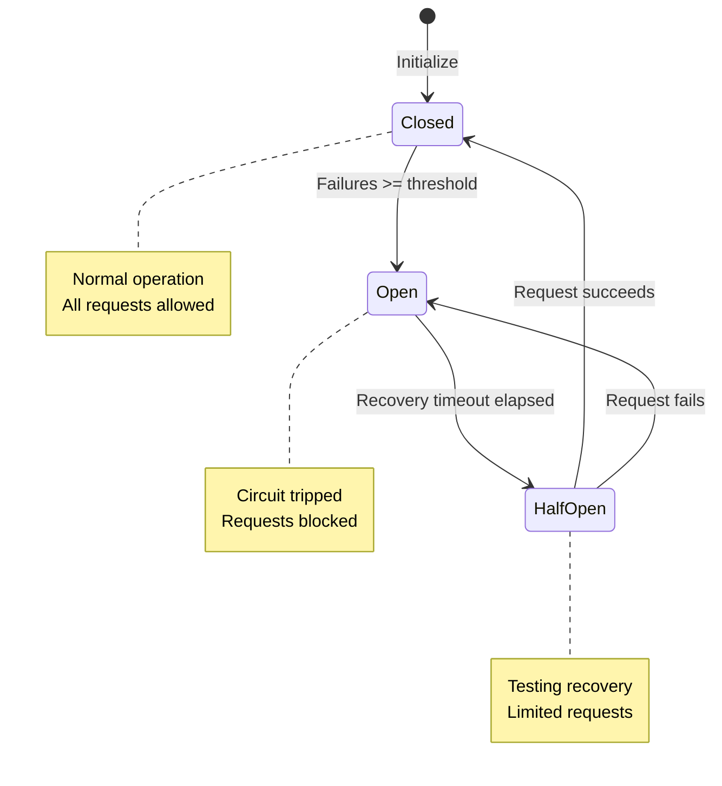
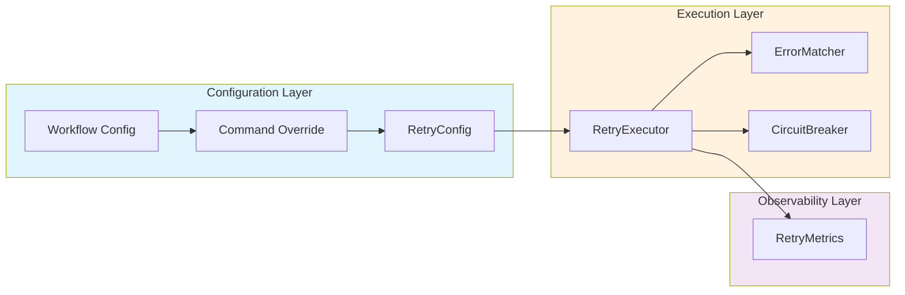

## Implementation References

This section provides pointers to the source code implementing the retry system. These references are useful for developers who want to understand implementation details, extend the retry functionality, or troubleshoot issues.

!!! tip "Developer Quick Reference"
    For most retry customization needs, start with `src/cook/retry_v2.rs`. For workflow-level settings, see `src/cook/workflow/error_policy.rs`. Command-level overrides are in `src/config/command.rs`.

### Core Retry System

#### Enhanced Retry Configuration (`src/cook/retry_v2.rs:14-461`)

The primary implementation of Prodigy's retry system with comprehensive features:

- **RetryConfig struct** (lines 14-52): Main configuration type with fields for:
  - Maximum retry attempts
  - Backoff strategies (Fixed, Linear, Exponential, Fibonacci, Custom)
  - Initial and maximum delays
  - Jitter support for preventing thundering herd
  - Error matching for conditional retries
  - Retry budget (maximum total time)
  - Failure actions

- **BackoffStrategy enum** (lines 70-90): Implements multiple delay calculation strategies:
  - `Fixed`: Constant delay between retries
  - `Linear`: Incrementing delay (initial + n * increment)
  - `Exponential`: Doubling delay (initial * base^n)
  - `Fibonacci`: Fibonacci sequence delays
  - `Custom`: User-defined delay sequence

- **Retry execution logic**: Core retry loop with backoff calculation, jitter application, and timeout enforcement

**Example usage** (from src/cook/retry_v2.rs):
```rust
let config = RetryConfig {
    attempts: 5,
    backoff: BackoffStrategy::Exponential { base: 2.0 },
    initial_delay: Duration::from_millis(100),
    max_delay: Duration::from_secs(60),
    jitter: true,
    jitter_factor: 0.1,
    retry_on: vec![ErrorMatcher::Network, ErrorMatcher::Timeout],
    retry_budget: Some(Duration::from_secs(300)),
    on_failure: FailureAction::Stop,
};
```

#### Workflow Error Policy (`src/cook/workflow/error_policy.rs:91-129`)

Simpler retry configuration used at the workflow level:

- **RetryConfig struct** (lines 91-99): Workflow-scoped retry settings with:
  - `max_attempts`: Maximum number of retry attempts (default: 3)
  - `backoff`: Backoff strategy for delay calculation

- **BackoffStrategy enum** (lines 105-120): Workflow backoff strategies with duration parameters:
  - `Fixed { delay }`: Fixed delay between retries
  - `Linear { initial, increment }`: Linear backoff with configurable increment
  - `Exponential { initial, multiplier }`: Exponential backoff with configurable base
  - `Fibonacci { initial }`: Fibonacci sequence starting from initial delay

- **WorkflowErrorPolicy struct** (lines 131-161): Workflow-level error handling with:
  - `on_item_failure`: Action to take when items fail
  - `continue_on_failure`: Whether to continue processing after failures

**Example usage** (from workflow YAML):
```yaml
retry_config:
  max_attempts: 5
  backoff:
    exponential:
      initial: 1s
      multiplier: 2.0
```

#### Retry Executor (`src/cook/retry_v2.rs:167-172`)

The main entry point for executing operations with retry logic:

- **RetryExecutor struct** (lines 167-172): Orchestrates retry execution with:
  - `config`: RetryConfig with all retry settings
  - `metrics`: Arc-wrapped RetryMetrics for observability
  - `circuit_breaker`: Optional circuit breaker for failure protection

The RetryExecutor provides the primary interface for wrapping operations with retry behavior, automatically applying backoff strategies, jitter, and circuit breaker logic.

**Example usage** (from src/cook/retry_v2.rs):
```rust
// Source: src/cook/retry_v2.rs:167-180
let executor = RetryExecutor::new(config);

// Optionally add circuit breaker protection
let executor = executor.with_circuit_breaker(5, Duration::from_secs(30));

// Execute with retry logic
let result = executor.execute(|| async {
    // Your operation here
    perform_network_call().await
}).await?;
```

#### Command Metadata (`src/config/command.rs:132-154`)

Command-level retry override configuration:

- **CommandMetadata struct** (lines 133-149): Per-command settings including:
  - `retries: Option<u32>`: Override global retry attempts for specific commands
  - `timeout: Option<u64>`: Command-specific timeout in seconds
  - `continue_on_error: Option<bool>`: Whether workflow continues if command fails
  - `env`: Environment variables for the command
  - `commit_required`: Whether command must create git commits

This allows fine-grained control over retry behavior at the command level, overriding workflow-level settings when needed.

**Example usage** (from workflow YAML):
```yaml
commands:
  - shell: "flaky-network-operation.sh"
    retries: 10
    timeout: 300
    continue_on_error: false
```

### Error Handling Components

#### Error Matchers (`src/cook/retry_v2.rs:100-151`)

Conditional retry based on error patterns:

- **ErrorMatcher enum** (lines 101-114): Pre-defined error categories:
  - `Network`: Connection, refused, unreachable errors
  - `Timeout`: Timeout and "timed out" errors
  - `ServerError`: HTTP 5xx status codes (500, 502, 503, 504)
  - `RateLimit`: HTTP 429 and "rate limit" errors
  - `Pattern(String)`: Custom regex pattern matching

- **Matching logic** (lines 116-151): Case-insensitive error message matching with regex support

This enables intelligent retry behavior that only retries on transient errors (network issues, timeouts, rate limits) while failing fast on permanent errors (validation failures, authentication errors).

**Example usage** (from src/cook/retry_v2.rs):
```rust
retry_on: vec![
    ErrorMatcher::Network,
    ErrorMatcher::Timeout,
    ErrorMatcher::ServerError,
    ErrorMatcher::Pattern("temporary.*unavailable".to_string()),
]
```

### Resilience Features

#### Circuit Breaker (`src/cook/retry_v2.rs:325-397`)

Protection against cascading failures:

- **CircuitBreaker struct** (lines 325-331): Stateful circuit breaker with:
  - `failure_threshold`: Number of consecutive failures before opening
  - `recovery_timeout`: Time to wait before attempting recovery
  - `state`: Current circuit state (Closed, Open, HalfOpen)
  - `consecutive_failures`: Counter for failure tracking

- **State machine** (lines 333-338): Three-state circuit breaker:
  - `Closed`: Normal operation, requests allowed
  - `Open { until }`: Failing, requests blocked until timeout
  - `HalfOpen`: Testing recovery, limited requests allowed



**Figure**: Circuit breaker state machine showing transitions between Closed, Open, and HalfOpen states.

- **State transitions**:
  - `is_open()` (lines 351-367): Check state and transition from Open to HalfOpen after timeout
  - `record_success()` (lines 369-379): Reset failures, close circuit if in HalfOpen
  - `record_failure()` (lines 381-397): Increment failures, open circuit if threshold exceeded

**Example usage**:
```rust
let breaker = CircuitBreaker::new(5, Duration::from_secs(30));

// Check before operation
if breaker.is_open().await {
    return Err(anyhow!("Circuit breaker open"));
}

// Record result
match operation().await {
    Ok(result) => {
        breaker.record_success().await;
        Ok(result)
    }
    Err(e) => {
        breaker.record_failure().await;
        Err(e)
    }
}
```

### Observability

#### Retry Metrics (`src/cook/retry_v2.rs:399-422`)

Tracking retry behavior for monitoring:

- **RetryMetrics struct** (lines 399-406): Statistics collection including:
  - `total_attempts`: Total retry attempts made
  - `successful_attempts`: Number of successful retries
  - `failed_attempts`: Number of failed retries
  - `retries`: Vec of `(attempt, Duration)` pairs tracking retry delays

These metrics enable monitoring of retry effectiveness, identifying problematic operations, and tuning retry configurations for optimal performance.

**Example usage**:
```rust
let metrics = RetryMetrics::default();
// Metrics are updated during retry execution
println!("Success rate: {}/{}",
    metrics.successful_attempts,
    metrics.total_attempts);
```

## Organization by Component

The retry system is organized into logical components:



**Figure**: Retry system architecture showing configuration flow through execution to observability.

**Core Retry System**:
- Main retry configuration and execution (src/cook/retry_v2.rs)
- RetryExecutor entry point (src/cook/retry_v2.rs:167-172)
- Workflow-level configuration (src/cook/workflow/error_policy.rs)
- Command-level overrides (src/config/command.rs)

**Error Handling**:
- Conditional retry with error matchers (src/cook/retry_v2.rs:100-151)
- Error pattern matching and classification

**Resilience**:
- Circuit breaker implementation (src/cook/retry_v2.rs:325-397)
- State management and failure protection

**Observability**:
- Retry metrics and monitoring (src/cook/retry_v2.rs:399-422)
- Performance tracking and debugging

## Next Steps

- For practical examples, see the [Complete Examples](complete-examples.md) subsection
- For configuration details, see the [Basic Retry Configuration](basic-retry-configuration.md) subsection
- For backoff strategies, see the [Backoff Strategies](backoff-strategies.md) subsection
- For troubleshooting, see the [Troubleshooting](troubleshooting.md) subsection
