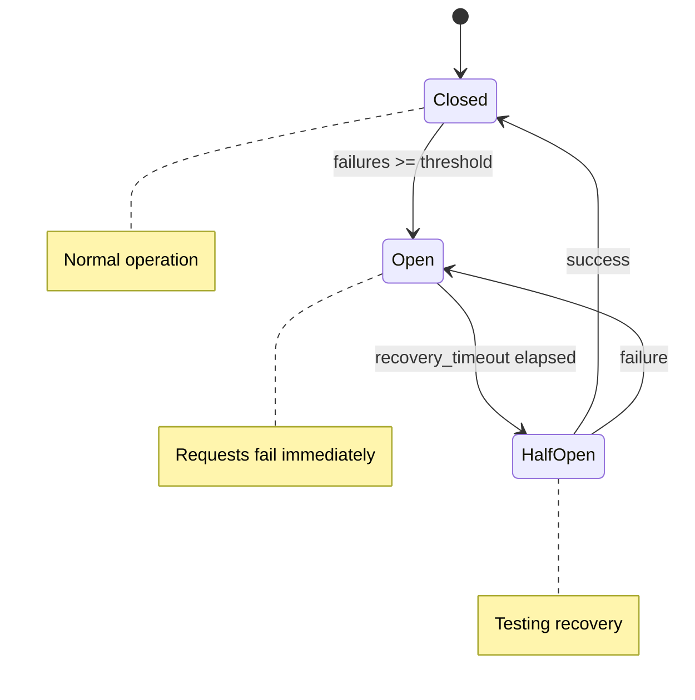

# Retry Configuration

Prodigy provides sophisticated retry mechanisms with multiple backoff strategies to handle transient failures gracefully. The retry system supports both command-level and workflow-level configurations with fine-grained control over retry behavior.

!!! tip "Quick Reference"
    - **Default attempts**: 3 with exponential backoff
    - **Always use jitter** for distributed systems to prevent thundering herd
    - **Set retry budgets** for time-sensitive operations
    - **Use circuit breakers** for external API calls

## Overview

Prodigy has two retry systems that work together:

1. **Enhanced Retry System** - Rich, configurable retry with multiple backoff strategies, jitter, circuit breakers, and conditional retry (from `src/cook/retry_v2.rs`)
2. **Workflow-Level Retry** - Simpler retry configuration for workflow-level error policies (from `src/cook/workflow/error_policy.rs`)

This chapter focuses on the enhanced retry system which provides comprehensive retry capabilities. Circuit breakers prevent cascading failures by temporarily stopping retries when a threshold of consecutive failures is reached.

### When to Use Each Retry System

=== "Enhanced Retry (retry_v2)"

    Use for fine-grained command-level control:

    - Individual command execution failures (API calls, shell commands, file operations)
    - Operations needing fine-grained control over backoff strategies
    - Situations requiring conditional retry based on error types
    - Commands where jitter is needed to prevent thundering herd
    - External API calls with rate limiting
    - Operations benefiting from circuit breakers

=== "Workflow-Level Retry (error_policy)"

    Use for bulk and workflow-wide policies:

    - MapReduce work item failures
    - Workflow-wide error handling policies
    - Bulk operations requiring Dead Letter Queue (DLQ) integration
    - Scenarios needing failure thresholds and batch error collection
    - When you want to retry entire work items rather than individual commands

For a detailed comparison with examples, see [Workflow-Level vs Command-Level Retry](workflow-level-vs-command-level-retry.md).

## RetryConfig Structure

This table documents the enhanced retry system (`retry_v2::RetryConfig`). For workflow-level retry configuration, see the [Workflow-Level vs Command-Level Retry](workflow-level-vs-command-level-retry.md) subsection.

The `RetryConfig` struct controls retry behavior with the following fields:

| Field | Type | Default | Description |
|-------|------|---------|-------------|
| `attempts` | `u32` | `3` | Maximum number of retry attempts |
| `backoff` | `BackoffStrategy` | `Exponential (base: 2.0)` | Strategy for calculating delays between retries |
| `initial_delay` | `Duration` | `1s` | Initial delay before first retry |
| `max_delay` | `Duration` | `30s` | Maximum delay between any two retries |
| `jitter` | `bool` | `false` | Whether to add randomness to delays |
| `jitter_factor` | `f64` | `0.3` | Amount of jitter (0.0 to 1.0) |
| `retry_on` | `Vec<ErrorMatcher>` | `[]` | Retry only on specific error types (empty = retry all) |
| `retry_budget` | `Option<Duration>` | `None` | Maximum total time for all retry attempts |
| `on_failure` | `FailureAction` | `Stop` | Action to take after all retries exhausted |

**Source**: RetryConfig struct defined in `src/cook/retry_v2.rs:14-52`

### YAML Configuration Syntax

The RetryConfig fields map to YAML workflow syntax as follows:

```yaml
commands:
  - shell: "your-command-here"
    retry_config:
      attempts: 5                    # RetryConfig.attempts (u32)
      backoff:
        type: exponential            # BackoffStrategy::Exponential
        base: 2.0                    # exponential base multiplier
      initial_delay: "1s"            # RetryConfig.initial_delay (humantime format)
      max_delay: "30s"               # RetryConfig.max_delay (humantime format)
      jitter: true                   # RetryConfig.jitter (bool)
      jitter_factor: 0.3             # RetryConfig.jitter_factor (0.0-1.0)
      retry_on:                      # RetryConfig.retry_on (Vec<ErrorMatcher>)
        - network                    # Connection, refused, unreachable errors
        - timeout                    # Timeout or timed out errors
        - server_error               # HTTP 5xx errors (500, 502, 503, 504)
        - rate_limit                 # HTTP 429 or "too many requests"
        - pattern: "custom.*regex"   # Custom regex pattern matching
      retry_budget: "5m"             # RetryConfig.retry_budget (Optional<Duration>)
      on_failure: stop               # RetryConfig.on_failure (FailureAction)
```

**Alternative Backoff Strategies**:

=== "Fixed"

    Constant delay between retries:

    ```yaml
    backoff: fixed
    initial_delay: "5s"  # Always waits 5 seconds
    ```

=== "Linear"

    Delay increases linearly:

    ```yaml
    backoff:
      type: linear
      increment: "2s"  # 2s, 4s, 6s, 8s...
    ```

=== "Exponential"

    Delay doubles each attempt (default):

    ```yaml
    backoff:
      type: exponential
      base: 2.0  # 1s, 2s, 4s, 8s...
    ```

=== "Fibonacci"

    Delay follows Fibonacci sequence:

    ```yaml
    backoff: fibonacci  # 1s, 1s, 2s, 3s, 5s...
    ```

=== "Custom"

    Specify exact delay sequence:

    ```yaml
    backoff:
      type: custom
      delays: ["1s", "2s", "5s", "10s"]
    ```

!!! note "YAML Field Naming"
    Field names use snake_case in YAML and map to the exact struct fields in `src/cook/retry_v2.rs:14-52`. Duration values use humantime format (e.g., "1s", "30s", "5m").

For complete working examples, see [Complete Examples](complete-examples.md).

### Circuit Breakers

Circuit breakers are configured separately via `RetryExecutor`, **not as part of RetryConfig**. Circuit breakers provide fail-fast behavior when downstream systems are consistently failing, preventing resource exhaustion from repeated failed retries.



**Configuration** (programmatic):
```rust
// Source: src/cook/retry_v2.rs:184-188
let executor = RetryExecutor::new(retry_config)
    .with_circuit_breaker(
        5,                          // failure_threshold: open after 5 consecutive failures
        Duration::from_secs(30)     // recovery_timeout: attempt recovery after 30 seconds
    );
```

!!! warning "Circuit Breaker Scope"
    Circuit breakers are per-executor instances. If you create multiple executors, each has its own circuit breaker state.

**Circuit States**:

| State | Behavior | Transition |
|-------|----------|------------|
| **Closed** | Normal operation, retries attempted | Opens after `failure_threshold` consecutive failures |
| **Open** | Requests fail immediately without retry | Transitions to HalfOpen after `recovery_timeout` |
| **HalfOpen** | Testing recovery with limited requests | Returns to Closed on success, reopens on failure |

**Source**: `src/cook/retry_v2.rs:325-397` (CircuitBreaker implementation)

## Additional Topics

See also:
- [Basic Retry Configuration](basic-retry-configuration.md)
- [Backoff Strategies](backoff-strategies.md)
- [Backoff Strategy Comparison](backoff-strategy-comparison.md)
- [Jitter for Distributed Systems](jitter-for-distributed-systems.md)
- [Conditional Retry with Error Matchers](conditional-retry-with-error-matchers.md)
- [Retry Budget](retry-budget.md)
- [Failure Actions](failure-actions.md)
- [Complete Examples](complete-examples.md)
- [Workflow-Level vs Command-Level Retry](workflow-level-vs-command-level-retry.md)
- [Retry Metrics and Observability](retry-metrics-and-observability.md)
- [Troubleshooting](troubleshooting.md)
- [Implementation References](implementation-references.md)


## Related Topics

This section provides links to related documentation that complements retry configuration. Understanding these topics will help you build more resilient workflows.

### Within This Chapter

The following subsections provide detailed information about specific aspects of retry configuration:

- [Basic Retry Configuration](./basic-retry-configuration.md) - Start here to understand fundamental retry configuration syntax and options
- [Backoff Strategies](./backoff-strategies.md) - Control the timing between retry attempts using exponential, linear, Fibonacci, or constant delays
- [Backoff Strategy Comparison](./backoff-strategy-comparison.md) - Compare different backoff strategies with examples and use cases
- [Failure Actions](./failure-actions.md) - Define custom actions to execute when commands fail or exhaust retries
- [Conditional Retry with Error Matchers](./conditional-retry-with-error-matchers.md) - Use error patterns to selectively retry only specific failures
- [Jitter for Distributed Systems](./jitter-for-distributed-systems.md) - Add randomization to retry delays to prevent thundering herd problems
- [Retry Budget](./retry-budget.md) - Limit total retry attempts across your workflow to prevent infinite retry loops
- [Retry Metrics and Observability](./retry-metrics-and-observability.md) - Monitor retry behavior through events and logging
- [Workflow-Level vs Command-Level Retry](./workflow-level-vs-command-level-retry.md) - Understand the differences between retry scopes and when to use each
- [Complete Examples](./complete-examples.md) - Real-world retry configuration examples demonstrating various strategies
- [Troubleshooting](./troubleshooting.md) - Debug common retry configuration issues
- [Implementation References](./implementation-references.md) - Links to source code implementing retry logic

### Related Chapters

These chapters cover topics that interact with or complement retry configuration:

- [Error Handling](../workflow-basics/error-handling.md) - Overall error handling strategy and how Prodigy propagates errors through workflows. Retry configuration is one component of a comprehensive error handling approach.
- [Workflow Configuration](../configuration/workflow-configuration.md) - Workflow-level settings including global retry defaults that apply to all commands unless overridden at the command level.
- [MapReduce](../mapreduce/index.md) - Retry behavior in MapReduce workflows, where individual map agents can retry independently. MapReduce adds complexity to retry semantics due to parallel execution.
- [Dead Letter Queue (DLQ)](../mapreduce/dead-letter-queue-dlq.md) - Handling failed work items in MapReduce workflows. When map agents exhaust all retries, items move to the DLQ for manual inspection and retry.
- [Environment Variables](../environment/index.md) - Use environment variables in retry configuration to parameterize retry behavior across different deployment environments (dev, staging, production).

