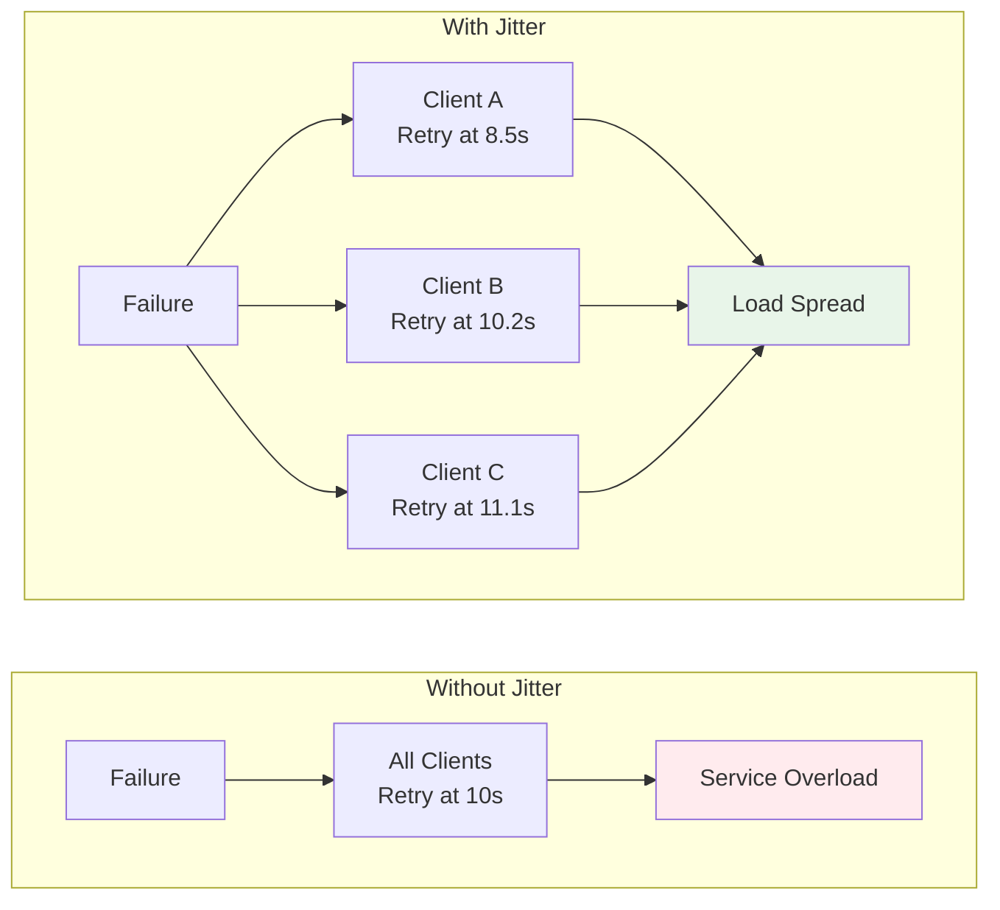
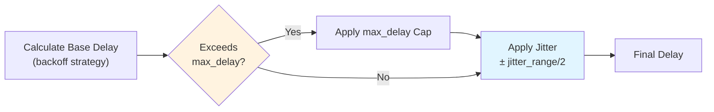

## Jitter for Distributed Systems

Jitter adds randomness to retry delays to prevent the "thundering herd" problem where many clients retry at the same time. By introducing controlled randomness, jitter helps distribute retry attempts over time rather than having all clients retry simultaneously after a failure.



**Figure**: Jitter distributes retry attempts over time, preventing synchronized retry storms.

### Configuration

```yaml
retry:
  attempts: 5
  backoff:
    exponential:
      base: 2.0
  initial_delay: 10s
  jitter: true           # Enable jitter (default: false)
  jitter_factor: 0.3     # Jitter factor (default: 0.3 when jitter is enabled)
```

**Configuration options:**

- `jitter`: Boolean flag to enable/disable jitter (default: `false`)
- `jitter_factor`: Controls the randomness range as a fraction of the base delay (default: `0.3`)

!!! tip "Recommended jitter_factor"
    A `jitter_factor` of **0.3** (the default) provides a good balance between spreading retries over time and maintaining predictable delay behavior. Start with this value and adjust based on your system's contention patterns.

**Source**: Configuration structure defined in `src/cook/retry_v2.rs:455-457` (default_jitter_factor)

### How Jitter Works

The jitter calculation follows this formula:

```
jitter_range = base_delay * jitter_factor
jitter = random(-jitter_range / 2, +jitter_range / 2)
final_delay = base_delay + jitter
```

**Source**: Implementation in `src/cook/retry_v2.rs:308-317` (apply_jitter method)

The implementation uses Rust's `random_range` function to generate a uniformly distributed random value within the inclusive range. The jitter can be:
- **Negative**: Reduces the delay below the base value
- **Positive**: Increases the delay above the base value

This bidirectional randomness ensures retry attempts are spread across time.

### Example Calculations

**With default `jitter_factor: 0.3`:**

For a 10 second base delay:
1. `jitter_range = 10s * 0.3 = 3s`
2. `jitter = random(-1.5s, +1.5s)`
3. `final_delay = 10s + jitter` → **Range: 8.5s to 11.5s**

**With `jitter_factor: 0.5`:**

For a 10 second base delay:
1. `jitter_range = 10s * 0.5 = 5s`
2. `jitter = random(-2.5s, +2.5s)`
3. `final_delay = 10s + jitter` → **Range: 7.5s to 12.5s**

For a 20 second base delay:
1. `jitter_range = 20s * 0.5 = 10s`
2. `jitter = random(-5s, +5s)`
3. `final_delay = 20s + jitter` → **Range: 15s to 25s**

**Source**: Test validation in `src/cook/retry_v2.rs:645-658`

### Interaction with Max Delay

Jitter is applied **after** backoff calculation and max_delay capping. The execution order is:



1. Calculate base delay using backoff strategy
2. Apply `max_delay` cap if configured
3. Apply jitter to the capped delay

!!! warning "Jittered delays can exceed max_delay"
    Since jitter is applied **after** the `max_delay` cap, the final delay can temporarily exceed the configured maximum by up to half the jitter range. For example, with `max_delay: 30s` and `jitter_factor: 0.3`, the actual delay could reach ~34.5s. If you need strict delay caps, use a lower `jitter_factor`.

**Source**: Execution order in `src/cook/retry_v2.rs:234-235` (calculate_delay followed by apply_jitter)

### When to Use Jitter

**Recommended use cases:**
- **Multiple clients accessing the same service**: Prevents all clients from retrying simultaneously after a service outage
- **Distributed systems with many workers**: Spreads retry load across worker nodes
- **Rate-limited APIs**: Reduces the chance of hitting rate limits from synchronized retries
- **Preventing synchronized retry storms**: Breaks up "thundering herd" patterns that can overwhelm recovering services

**Adjusting jitter_factor:**
- **Low values (0.1 - 0.2)**: Tight clustering with minor randomization, suitable for stable systems
- **Medium values (0.3 - 0.5)**: Balanced spread, recommended for most distributed systems (default: 0.3)
- **High values (0.6 - 1.0)**: Wide distribution, useful for highly contended resources or aggressive load spreading

### Performance Impact

Jitter adds minimal computational overhead (a single random number generation per retry). The randomization happens in-memory and does not require external resources.

### Complete Example with Multiple Backoff Strategies

**Exponential backoff with jitter:**
```yaml
retry:
  attempts: 5
  backoff:
    exponential:
      base: 2.0
  initial_delay: 1s
  max_delay: 30s
  jitter: true
  jitter_factor: 0.3
```
Delay sequence (without jitter): 1s, 2s, 4s, 8s, 16s
Delay sequence (with jitter): ~0.85s-1.15s, ~1.7s-2.3s, ~3.4s-4.6s, ~6.8s-9.2s, ~13.6s-18.4s

**Linear backoff with jitter:**
```yaml
retry:
  attempts: 5
  backoff:
    linear:
      increment: 2s
  initial_delay: 5s
  jitter: true
  jitter_factor: 0.4
```
Delay sequence (without jitter): 5s, 7s, 9s, 11s, 13s
Delay sequence (with jitter): ~4s-6s, ~5.6s-8.4s, ~7.2s-10.8s, ~8.8s-13.2s, ~10.4s-15.6s

### See Also

- [Backoff Strategies](backoff-strategies.md) - Complete documentation on exponential, linear, and fixed backoff strategies that jitter applies to
- [Retry Budget](retry-budget.md) - How retry budgets interact with jittered retries to prevent resource exhaustion
- [Workflow-Level vs Command-Level Retry](workflow-level-vs-command-level-retry.md) - Where jitter configuration applies in your workflow hierarchy
