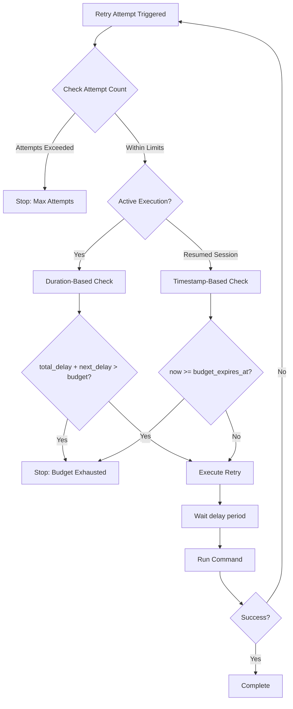
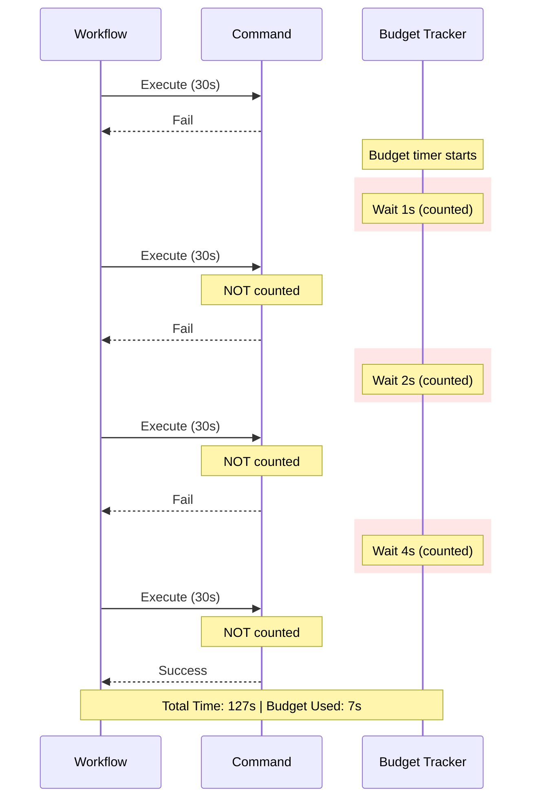

## Retry Budget

A retry budget provides a time-based upper bound on retry operations, preventing workflows from hanging indefinitely even when attempt counts are high. The retry budget limits the cumulative **delay time** (not total execution time) spent on retries.

**Source**: `src/cook/retry_v2.rs:47` (retry_budget field in RetryConfig struct)

### Configuration

The `retry_budget` field accepts human-readable duration formats using the `humantime_serde` parser:

```yaml
retry_config:
  attempts: 10
  retry_budget: "5m"        # 5 minutes
  backoff:
    exponential:
      base: 2.0
  initial_delay: "1s"
```

**Supported Duration Formats**:
- Seconds: `"30s"`, `"300s"`
- Minutes: `"5m"`, `"10m"`
- Hours: `"1h"`, `"2h"`
- Combined: `"1h30m"`, `"2m30s"`

**Source**: Duration field with `humantime_serde` annotation at `src/cook/retry_v2.rs:47`

### How It Works

Prodigy uses **two complementary mechanisms** to enforce retry budgets:



#### 1. Duration-Based Enforcement (Active Execution)

During active command execution, the `RetryExecutor` tracks cumulative delay time and checks the budget before each retry:

```rust
// Source: src/cook/retry_v2.rs:238-244
if let Some(budget) = self.config.retry_budget {
    if total_delay + jittered_delay > budget {
        warn!("Retry budget exhausted for {}", context);
        return Err(anyhow!("Retry budget exhausted"));
    }
}
```

**Behavior**:
- Tracks `total_delay`: cumulative duration spent waiting between retries
- Before each retry, checks: `total_delay + next_delay > budget`
- If the next retry would exceed the budget, stops immediately
- Returns error: `"Retry budget exhausted"`

**Source**: `src/cook/retry_v2.rs:238-244`

#### 2. Timestamp-Based Enforcement (Stateful Tracking)

For checkpoint/resume scenarios, the `RetryStateManager` uses expiration timestamps:

```rust
// From src/cook/retry_state.rs:299-301
retry_budget_expires_at: config
    .retry_budget
    .map(|budget| Utc::now() + ChronoDuration::from_std(budget).unwrap())
```

**Behavior**:
- Calculates expiration: `retry_budget_expires_at = now + budget_duration`
- Set at **first failure** (not at command start)
- Before each retry attempt, checks: `Utc::now() >= retry_budget_expires_at`
- Prevents retries even after workflow interruption and resume

**Source**: `src/cook/retry_state.rs:299-301, 342-346`

### Interaction with Attempts and Backoff

**Critical behavior**: Retries stop when **EITHER** the attempts limit **OR** the retry budget is exceeded, whichever comes first.

**Example 1: Budget Limits Before Attempts**
```yaml
retry_config:
  attempts: 100           # High attempt limit
  retry_budget: "2m"      # Budget will be hit first
  backoff:
    exponential:
      base: 2.0
  initial_delay: "1s"
```

With exponential backoff (1s, 2s, 4s, 8s, 16s, 32s, 64s...), delays sum to ~2 minutes after 7-8 attempts. The budget stops retries at **~8 attempts** even though 100 are allowed.

**Example 2: Attempts Limit Before Budget**
```yaml
retry_config:
  attempts: 3             # Attempts will be hit first
  retry_budget: "10m"     # Budget won't be reached
  backoff: fixed
  initial_delay: "5s"
```

Total delay: 5s + 5s + 5s = 15 seconds, well under the 10-minute budget. Stops after **3 attempts**.

**Source**: Dual checking logic in `src/cook/retry_v2.rs:238-244` and `src/cook/retry_state.rs:337-347`

### What Time is Counted?

**Included in Budget**:
- ✅ Backoff delay time (waiting between retries)
- ✅ Jitter-adjusted delays (if jitter is enabled)

**NOT Included in Budget**:
- ❌ Command execution time
- ❌ Time for successful operations
- ❌ Time before first failure

**Example Timeline**:



If `retry_budget: "5s"`, the workflow would fail at the third retry (1+2+4 = 7s > 5s budget).

---

### Related Topics

- [Backoff Strategies](backoff-strategies.md) - Configure delay patterns between retries
- [Jitter for Distributed Systems](jitter-for-distributed-systems.md) - Add randomization to prevent thundering herd
- [Basic Retry Configuration](basic-retry-configuration.md) - Core retry settings overview
- [Troubleshooting](troubleshooting.md) - Debug retry-related issues
