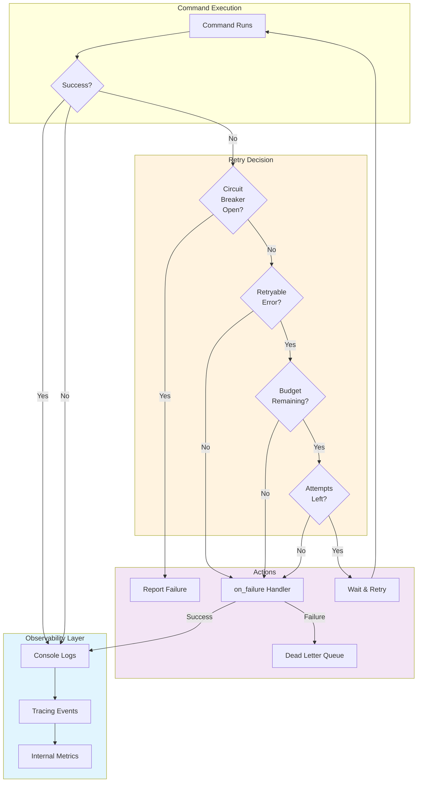
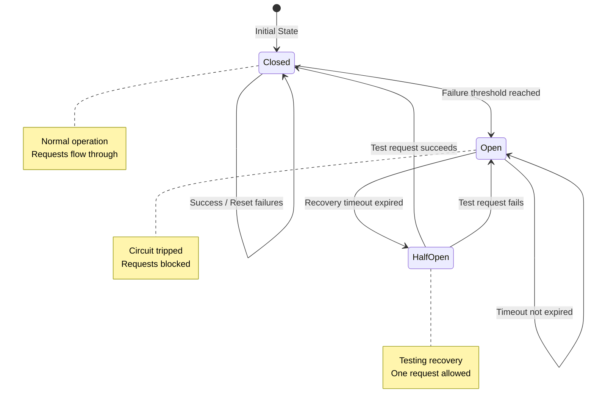
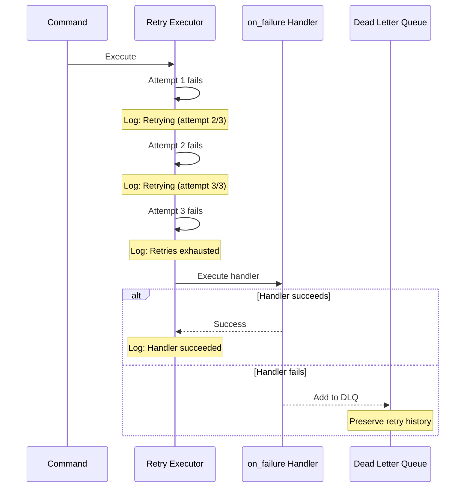

## Retry Metrics and Observability

Prodigy provides comprehensive observability into retry behavior through **logging and event tracking**, rather than programmatic metrics access. This enables debugging retry issues and monitoring workflow resilience without requiring code changes.

## How Retry Observability Works

Retry operations are observable through three primary mechanisms:

1. **Console Logs** - Visible during workflow execution
2. **Tracing Infrastructure** - Controlled by verbosity flags
3. **Event Tracking** - Recorded for MapReduce workflows

The following diagram illustrates how retry observability integrates with Prodigy's execution pipeline:



### Internal Metrics Structure

While retry metrics are tracked internally via the `RetryMetrics` structure, this data is **not exposed** as a queryable API for workflow users. Instead, metrics are surfaced through logging at key decision points.

```rust
// Source: src/cook/retry_v2.rs:400-422
pub struct RetryMetrics {
    pub total_attempts: u32,
    pub successful_attempts: u32,
    pub failed_attempts: u32,
    pub retries: Vec<(u32, Duration)>,
}
```

The internal structure tracks:

- `total_attempts` - Total number of attempts made
- `successful_attempts` - Number of successful operations
- `failed_attempts` - Number of failed operations
- `retries` - History of retry attempts with delays

## Observing Retry Behavior in Workflows

### Console Output During Retries

When a command fails and triggers a retry, you'll see log messages showing:

```
Retrying <operation> (attempt 2/5) after 200ms
Retrying <operation> (attempt 3/5) after 400ms
```

!!! info "Source Reference"
    These messages come from the retry executor's logging at `src/cook/retry_v2.rs:247-250`.

### Verbosity Flags for Detailed Logs

Use Prodigy's verbosity flags to see more retry details:

```bash
# Default - shows retry attempts
prodigy run workflow.yml

# Verbose - shows retry decision-making
prodigy run workflow.yml -v

# Very verbose - shows all retry internals
prodigy run workflow.yml -vv
```

With `-v` or higher verbosity, you'll see:

- Retry attempt counts and delays
- Circuit breaker state transitions
- Retry budget consumption
- Error pattern matching results

### Retry Budget Exhaustion

When retry budget is exhausted, a warning is logged:

```
Retry budget exhausted for <operation>
```

!!! warning "Budget Limit Reached"
    This indicates the total retry delay exceeded the configured `retry_budget`, preventing further attempts even if `max_attempts` hasn't been reached.

    **Source**: `src/cook/retry_v2.rs:238-243`

## Circuit Breaker Observability

The circuit breaker follows a state machine pattern that protects downstream services from cascading failures:



Circuit breaker state changes are logged automatically:

### Circuit Breaker Opens

```
Circuit breaker opened after 5 consecutive failures
```

!!! danger "Circuit Open"
    When the failure threshold is exceeded, the circuit breaker opens and blocks further retry attempts until the recovery timeout expires.

    **Source**: `src/cook/retry_v2.rs:391-394`

### Circuit Breaker Transitions

```
Circuit breaker transitioning to half-open
Circuit breaker closed after successful operation
```

These debug-level messages show circuit breaker recovery:

| State | Description | Source |
|-------|-------------|--------|
| **Half-Open** | Testing if failures have cleared (one attempt allowed) | `src/cook/retry_v2.rs:359` |
| **Closed** | Normal operation resumed after successful attempt | `src/cook/retry_v2.rs:377` |

## Workflow-Level Observability

### On-Failure Handler Execution

When retries are configured via `on_failure` handlers, you'll see:

```yaml
- shell: "flaky-command"
  on_failure:
    claude: "/fix-issue"
    max_attempts: 5
```

**Workflow output** shows:

1. Initial command failure
2. Retry attempt messages with delays
3. Handler command execution
4. Final success or failure after exhausting attempts

### Example Log Progression

```
❌ Command failed: exit code 1
Retrying (attempt 2/5) after 100ms
❌ Command failed: exit code 1
Retrying (attempt 3/5) after 200ms
✅ Command succeeded
```

## MapReduce Event Tracking

MapReduce workflows provide additional observability through the event tracking system. Retry attempts are recorded as events:

```bash
# View events for a MapReduce job
prodigy events show <job_id>
```

Events include:

- Retry attempt counts per work item
- Individual agent retry behavior
- Correlation between retries and DLQ items

See [Event Tracking](../mapreduce/event-tracking.md) for comprehensive event details.

## Troubleshooting with Retry Logs

### Identifying Retry Configuration Issues

!!! question "Problem: Commands retry unnecessarily on non-transient errors"
    **Check logs for**:
    ```
    Retrying (attempt 2/5) after 100ms
    Retrying (attempt 3/5) after 200ms
    ...
    ```

**Solution**: Configure `retry_on` error matchers to only retry specific errors:

```yaml
retry_config:
  max_attempts: 5
  retry_on:
    - pattern: "connection refused"
    - pattern: "timeout"
```

See [Conditional Retry with Error Matchers](conditional-retry-with-error-matchers.md).

### Debugging Circuit Breaker Behavior

!!! question "Problem: Circuit breaker opening too aggressively"
    **Check logs for**:
    ```
    Circuit breaker opened after 3 consecutive failures
    ```

**Solution**: Adjust `failure_threshold` and `recovery_timeout`:

```yaml
circuit_breaker:
  failure_threshold: 5      # Increase tolerance
  recovery_timeout_ms: 30000  # Longer recovery window
```

### Analyzing Retry Budget Exhaustion

!!! question "Problem: Retries stop before `max_attempts` reached"
    **Check logs for**:
    ```
    Retry budget exhausted for <operation>
    ```

**Solution**: Increase `retry_budget` or reduce `max_delay_ms`:

```yaml
retry_config:
  retry_budget_ms: 120000  # Allow up to 2 minutes of retries
  max_delay_ms: 10000       # Cap individual delays at 10s
```

See [Retry Budget](retry-budget.md).

## Integration with Error Handling

Retry observability integrates with Prodigy's error handling pipeline:



The three-level defense:

1. **Retry** - First line of defense for transient failures
2. **On-Failure Handlers** - Second line when retries exhausted
3. **Dead Letter Queue** - Final capture for MapReduce failures

**Example workflow progression**:
```
Command fails → Retry with backoff → Still failing → Execute on_failure handler →
Handler succeeds → Continue OR Handler fails → DLQ (MapReduce only)
```

Logs show the complete progression:
```
❌ shell: flaky-script failed
Retrying (attempt 2/3) after 100ms
❌ shell: flaky-script failed
Retrying (attempt 3/3) after 200ms
❌ shell: flaky-script failed
Executing on_failure handler: claude /debug-failure
✅ on_failure handler succeeded
```

### MapReduce DLQ Relationship

For MapReduce workflows, retry exhaustion leads to DLQ:

```
Retrying work item 'item-123' (attempt 3/3)
❌ Failed after 3 attempts
→ Item moved to Dead Letter Queue
```

View DLQ items with retry history:

```bash
prodigy dlq show <job_id>
```

Each DLQ item preserves:

- Number of retry attempts made
- Final error message
- Retry delays used
- Circuit breaker state at failure

See [Dead Letter Queue (DLQ)](../mapreduce/dead-letter-queue-dlq.md).

## Monitoring Retry Patterns

### Identifying Flaky Operations

Watch for patterns in logs indicating flaky behavior:

```bash
# Count retry attempts across workflow execution
prodigy run workflow.yml -v 2>&1 | grep "Retrying" | wc -l

# Find operations that retry most frequently
prodigy run workflow.yml -v 2>&1 | grep "Retrying" | \
  grep -oE 'Retrying [^ ]+' | sort | uniq -c | sort -rn
```

### Measuring Retry Effectiveness

Track retry success vs. failure rates:

```bash
# Find successful retries
grep "Retrying" workflow.log | grep -A 5 "succeeded"

# Find exhausted retries
grep "Retry budget exhausted" workflow.log
grep "Failed after .* attempts" workflow.log
```

## Related Topics

- [Basic Retry Configuration](basic-retry-configuration.md) - Configure retry behavior
- [Backoff Strategies](backoff-strategies.md) - Choose appropriate backoff patterns
- [Event Tracking](../mapreduce/event-tracking.md) - MapReduce observability
- [Troubleshooting](troubleshooting.md) - Debug common retry issues
