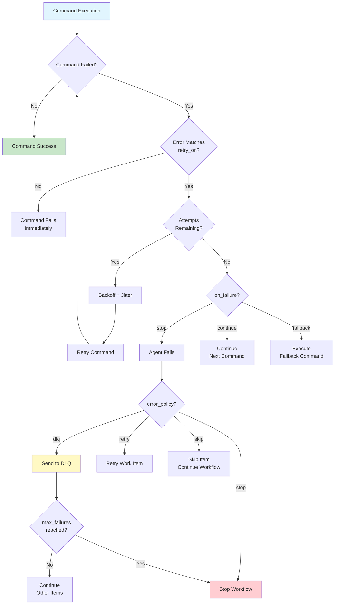
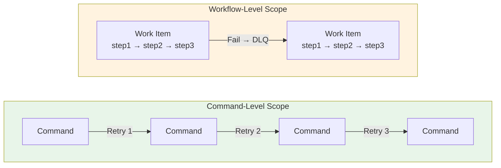
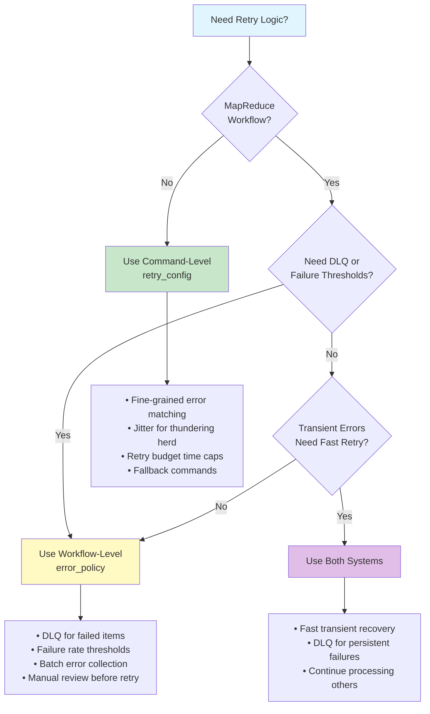

## Workflow-Level vs Command-Level Retry

Prodigy has two distinct retry systems that serve different purposes. Understanding when to use each is critical for effective error handling.

!!! tip "Quick Reference"
    **Command-level retry** (`retry_config`): Fast recovery from transient errors within a single command.
    **Workflow-level retry** (`error_policy`): Work item failure handling with DLQ integration for MapReduce workflows.

### Overview

| Feature | Command-Level (retry_v2) | Workflow-Level (error_policy) |
|---------|--------------------------|--------------------------------|
| **Scope** | Individual command execution | Work item failure in MapReduce |
| **Location** | `retry_config` on commands | `error_policy` + `retry_config` in workflow |
| **Implementation** | `src/cook/retry_v2.rs` | `src/cook/workflow/error_policy.rs` |
| **Use Case** | Retry transient command failures | Retry failed MapReduce work items |
| **Features** | Backoff, jitter, error matchers, circuit breakers | DLQ integration, failure thresholds, batch collection |

### Command-Level Retry (retry_v2)

The **enhanced retry system** (`retry_v2`) provides sophisticated retry capabilities for individual command execution.

!!! info "Source Code"
    Implementation: `src/cook/retry_v2.rs`

#### Key Features

1. **Multiple Backoff Strategies**:
   - Exponential (default)
   - Linear
   - Fibonacci
   - Fixed
   - Custom

2. **Error Matchers**:
   - Selective retry based on error type
   - Built-in matchers: Network, Timeout, ServerError, RateLimit
   - Custom regex patterns

3. **Jitter Support**:
   - Prevents thundering herd in distributed systems
   - Configurable jitter factor (default: 0.3)

4. **Retry Budget**:
   - Time-based caps on total retry time
   - Prevents infinite retry loops

5. **Failure Actions**:
   - Stop (default) - halt workflow
   - Continue - proceed despite failure
   - Fallback - execute alternative command

6. **Circuit Breakers**:
   - Fail-fast when downstream is down
   - Automatic recovery testing (HalfOpen state)

#### Configuration

```yaml title="Command-level retry configuration"
commands:
  - shell: "curl https://api.example.com/data"
    retry_config:
      attempts: 5              # (1)!
      backoff: exponential     # (2)!
      initial_delay: "1s"      # (3)!
      max_delay: "30s"         # (4)!
      jitter: true             # (5)!
      jitter_factor: 0.3
      retry_on:                # (6)!
        - network
        - timeout
      retry_budget: "5m"       # (7)!
      on_failure: stop         # (8)!
```

1. Maximum number of retry attempts before giving up
2. Backoff strategy: `exponential`, `linear`, `fibonacci`, `fixed`, or `custom`
3. Initial delay between retries
4. Maximum delay cap (prevents delays from growing too large)
5. Enable jitter to prevent thundering herd in distributed systems
6. Only retry on these error types; other errors fail immediately
7. Total time budget for all retries combined
8. Action on final failure: `stop`, `continue`, or `fallback`

**RetryConfig Fields** (src/cook/retry_v2.rs:14-52):
- `attempts: u32` - Maximum retry attempts
- `backoff: BackoffStrategy` - Delay calculation strategy
- `initial_delay: Duration` - Starting delay
- `max_delay: Duration` - Delay cap
- `jitter: bool` - Enable jitter
- `jitter_factor: f64` - Jitter randomization (0.0-1.0)
- `retry_on: Vec<ErrorMatcher>` - Selective retry matchers
- `retry_budget: Option<Duration>` - Total retry time limit
- `on_failure: FailureAction` - Final failure handling

#### When to Use Command-Level Retry

Use `retry_config` on individual commands for:
- **External API calls** with transient failures
- **Network operations** that might timeout
- **Database operations** with lock conflicts
- **Resource initialization** that needs retry
- Any **single command** that benefits from retry

**Example**:
```yaml
commands:
  - shell: "make build"
    retry_config:
      attempts: 3
      retry_on:
        - network  # Only retry network errors during dependency fetch
```

### Workflow-Level Retry (error_policy)

The **workflow-level retry system** handles failures in MapReduce work items, integrating with the Dead Letter Queue (DLQ).

!!! info "Source Code"
    Implementation: `src/cook/workflow/error_policy.rs`

!!! note "Related Documentation"
    For detailed DLQ operations and debugging, see [Dead Letter Queue (DLQ)](../mapreduce/dlq/index.md).

#### Key Features

1. **Work Item Failure Handling**:
   - DLQ (Dead Letter Queue) - Save failed items for retry
   - Retry - Immediate retry with backoff
   - Skip - Skip failed item, continue
   - Stop - Stop entire workflow
   - Custom - Custom failure handler

2. **Failure Thresholds**:
   - `max_failures` - Stop after N failures
   - `failure_threshold` - Stop at failure rate (0.0-1.0)

3. **Error Collection Strategies**:
   - Aggregate - Collect all errors before reporting
   - Immediate - Report errors as they occur
   - Batched - Report in batches of N errors

4. **Circuit Breaker Integration**:
   - Workflow-level circuit breaker
   - Failure/success thresholds
   - Half-open request limits

5. **DLQ Retry**:
   - Failed items stored in DLQ
   - Retry with `prodigy dlq retry <job_id>`
   - Preserves correlation IDs

#### Configuration

```yaml title="Workflow-level error policy configuration"
name: mapreduce-workflow
mode: mapreduce

error_policy:
  on_item_failure: dlq          # (1)!
  continue_on_failure: true     # (2)!
  max_failures: 10              # (3)!
  failure_threshold: 0.25       # (4)!
  error_collection: aggregate   # (5)!
  circuit_breaker:              # (6)!
    failure_threshold: 5        # Open after 5 failures
    success_threshold: 3        # Close after 3 successes
    timeout: "30s"              # Recovery timeout
    half_open_requests: 3       # Test requests in half-open
  retry_config:                 # (7)!
    max_attempts: 3
    backoff: exponential

map:
  input: "items.json"
  json_path: "$.items[*]"
  agent_template:
    - shell: "process ${item.id}"
```

1. Failed items are sent to the Dead Letter Queue for later retry
2. Continue processing other work items even when some fail
3. Stop the entire workflow after 10 failures
4. Alternative to `max_failures`: stop at 25% failure rate
5. Error collection strategy: `aggregate`, `immediate`, or `batched`
6. Circuit breaker prevents cascading failures
7. Simplified retry config for workflow-level retries

**WorkflowErrorPolicy Fields** (src/cook/workflow/error_policy.rs:131-179):
- `on_item_failure: ItemFailureAction` - What to do when item fails
- `continue_on_failure: bool` - Continue processing other items
- `max_failures: Option<usize>` - Maximum failures before stopping
- `failure_threshold: Option<f64>` - Failure rate threshold (0.0-1.0)
- `error_collection: ErrorCollectionStrategy` - Error reporting strategy
- `circuit_breaker: Option<CircuitBreakerConfig>` - Circuit breaker config
- `retry_config: Option<RetryConfig>` - Simplified retry config

**Workflow-Level RetryConfig** (src/cook/workflow/error_policy.rs:90-129):
- `max_attempts: u32` - Maximum retry attempts
- `backoff: BackoffStrategy` - Simpler backoff variants

#### When to Use Workflow-Level Retry

Use `error_policy` in MapReduce workflows for:
- **Work item failure handling** - DLQ, thresholds, collection
- **MapReduce workflows** - Parallel work item processing
- **Failure rate monitoring** - Stop at threshold percentage
- **Batch error handling** - Collect and report errors in batches

**Example**:
```yaml
error_policy:
  on_item_failure: dlq        # Failed items go to DLQ
  continue_on_failure: true   # Process other items
  max_failures: 5             # But stop if more than 5 fail
```

### Using Both Systems Together

You can combine both retry systems for comprehensive error handling.

#### Retry Flow Diagram



The diagram shows how command-level retry (`retry_config`) and workflow-level retry (`error_policy`) work together:

```yaml
name: robust-mapreduce
mode: mapreduce

# Workflow-level error policy
error_policy:
  on_item_failure: dlq        # Failed items to DLQ
  continue_on_failure: true   # Keep processing
  max_failures: 10            # Stop after 10 failures
  circuit_breaker:
    failure_threshold: 5
    timeout: "30s"

map:
  input: "items.json"
  json_path: "$.items[*]"
  max_parallel: 10

  agent_template:
    # Command-level retry for transient failures
    - shell: "process ${item.id}"
      retry_config:
        attempts: 3              # Try 3 times per agent
        backoff: exponential
        initial_delay: "1s"
        max_delay: "30s"
        jitter: true             # Prevent thundering herd
        retry_on:
          - network
          - timeout
        on_failure: stop         # Let workflow error_policy handle final failure
```

**How they work together**:

1. **Agent attempts to process work item**
2. **Command fails** → `retry_config` retries with exponential backoff (up to 3 attempts)
3. **All command retries fail** → `on_failure: stop` ends agent execution
4. **Agent reports failure to workflow** → `error_policy` sends item to DLQ
5. **Workflow continues processing other items** → `continue_on_failure: true`
6. **After map phase** → Retry DLQ items with `prodigy dlq retry <job_id>`

**Benefits**:
- **Fast recovery** from transient errors (command-level retry)
- **Isolation** of persistent failures (DLQ)
- **Continued processing** of other items (workflow-level policy)
- **Manual review** of failed items before retry

### Key Differences

!!! warning "Important Distinction"
    **Command-level retry** happens within a single agent execution with backoff delays.
    **Workflow-level retry** creates a new agent execution (via DLQ) with a fresh environment.

#### Scope of Retry



**Command-Level**: Single command execution
```yaml
commands:
  - shell: "api-call.sh"
    retry_config:
      attempts: 5
```
→ Retries the `api-call.sh` command 5 times

**Workflow-Level**: Entire work item (may contain multiple commands)
```yaml
map:
  agent_template:
    - shell: "step1.sh ${item.id}"
    - shell: "step2.sh ${item.id}"
    - shell: "step3.sh ${item.id}"
```
→ If agent fails, entire work item (all 3 steps) sent to DLQ for retry

#### Retry Granularity

**Command-Level**: Immediate retry after command failure
- Retry happens in same agent execution
- Backoff delays between retries
- Same environment/context

**Workflow-Level**: Work item retry after agent failure
- Retry happens in new agent execution (via DLQ)
- Fresh environment/context
- Manual triggering with `prodigy dlq retry`

#### Feature Comparison

| Feature | Command-Level | Workflow-Level |
|---------|---------------|----------------|
| Backoff strategies | 5 strategies | 4 strategies |
| Jitter support | ✅ Yes | ❌ No |
| Error matchers | ✅ Yes | ❌ No |
| Retry budget | ✅ Yes | ❌ No |
| Failure actions | ✅ Yes (Stop/Continue/Fallback) | ❌ No (uses error_policy) |
| Circuit breakers | ✅ Yes (per RetryExecutor) | ✅ Yes (per workflow) |
| DLQ integration | ❌ No | ✅ Yes |
| Failure thresholds | ❌ No | ✅ Yes |
| Error collection | ❌ No | ✅ Yes (Aggregate/Immediate/Batched) |

### Decision Tree



**Use command-level retry** when:
- You need fine-grained control over which errors to retry
- You want jitter to prevent thundering herd
- You need retry budget to cap total time
- You want fallback commands on failure
- You're configuring a single command, not a work item

**Use workflow-level retry** when:
- You're running a MapReduce workflow
- You want DLQ integration for failed work items
- You need failure rate thresholds (stop at 25% failure)
- You want batch error collection
- You want to retry entire work items later

**Use both** when:
- You want fast recovery from transient errors (command-level)
- AND you want to isolate persistent failures (DLQ)
- AND you want to continue processing other items

### Examples

#### Example 1: Command-Level Only (Standard Workflow)

```yaml
name: standard-workflow
mode: standard

commands:
  - shell: "fetch-data.sh"
    retry_config:
      attempts: 5
      backoff: exponential
      retry_on:
        - network
        - timeout

  - shell: "process-data.sh"
    retry_config:
      attempts: 3
      on_failure: continue  # Non-critical, can fail

  - shell: "upload-results.sh"
    retry_config:
      attempts: 5
      backoff: exponential
      retry_on:
        - network
        - server_error
      on_failure:
        fallback:
          command: "save-to-local.sh"
```

#### Example 2: Workflow-Level Only (Simple MapReduce)

```yaml
name: simple-mapreduce
mode: mapreduce

error_policy:
  on_item_failure: dlq
  continue_on_failure: true
  max_failures: 10

map:
  input: "items.json"
  json_path: "$.items[*]"
  agent_template:
    - shell: "process ${item.id}"
    # No retry_config - relies on DLQ for failed items
```

#### Example 3: Both Systems (Robust MapReduce)

```yaml
name: robust-mapreduce
mode: mapreduce

error_policy:
  on_item_failure: dlq
  continue_on_failure: true
  max_failures: 10
  circuit_breaker:
    failure_threshold: 5
    timeout: "30s"

map:
  input: "items.json"
  json_path: "$.items[*]"
  max_parallel: 10

  agent_template:
    - shell: "process ${item.id}"
      retry_config:
        attempts: 3           # Try 3 times quickly
        backoff: exponential
        jitter: true          # Prevent simultaneous retries
        retry_on:
          - network
          - timeout
        on_failure: stop      # Let DLQ handle final failure

reduce:
  - shell: "aggregate ${map.results}"
```

**Retry flow**:

1. Command fails with network error
2. Command retries (attempt 2, 3) with exponential backoff
3. All command retries fail → Agent fails
4. Work item sent to DLQ
5. Other work items continue processing
6. After workflow completes → `prodigy dlq retry <job_id>` to retry failed items

---

### Related Documentation

- [Dead Letter Queue (DLQ)](../mapreduce/dlq/index.md) - Detailed DLQ operations and debugging
- [Error Collection Strategies](../mapreduce/error-collection-strategies.md) - Configure how errors are collected and reported
- [Retry Metrics and Observability](retry-metrics-and-observability.md) - Monitor retry behavior
- [Complete Examples](complete-examples.md) - Full workflow examples with retry configuration
